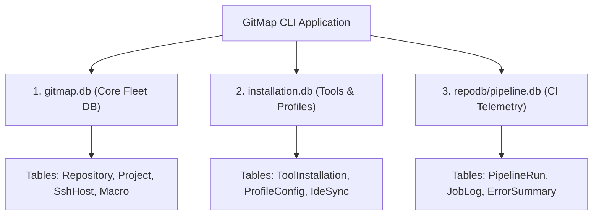

# 06 — Database Engine, Three-Tier Split-DB & Concurrency Architecture

- **Domain:** SQLite Split-DB, Reentrant Locking & Schema Conventions
- **Authoritative Specification:** [06-database-and-split-db](../../02-spec/21-app/06-database-and-split-db/01-architecture-spec.md)
- **Status:** Active & Ratified

---

## 1. Three-Tier SQLite Split-DB Architecture

GitMap segregates persistent state across three dedicated SQLite databases to eliminate locking conflicts, enable modular backups, and isolate operational scopes:



1. **`gitmap.db` (Core Fleet DB):** Stores discovered repositories, projects, registered SSH hosts, clusters, and saved macros. Located in the application data directory.
2. **`installation.db` (Installation & Tools DB):** Tracks installed local CLI tools, version stamps, developer workstation profiles, and desktop IDE configurations.
3. **`repodb/pipeline.db` (Repository Pipeline DB):** Scoped inside each individual repository's `.gitmap/repodb/` directory. Stores pipeline execution logs, failure traces, historical stage timings, and test runs.

---

## 2. Schema Conventions & Tesla ID Standard

All GitMap SQLite databases strictly enforce unified naming conventions:

- **Singular PascalCase Table Names:** Tables are named using singular PascalCase (`Repository`, `Project`, `SshHost`, `PipelineRun`, `JobLog`). Plural or snake_case table names are forbidden.
- **Tesla Primary Key Standard:** Every table primary key must be an integer column named `{TableName}Id` (`RepositoryId`, `SshHostId`, `PipelineRunId`). Bare `id` or `ID` is prohibited.
- **Foreign Key Convention:** Foreign keys reference parent table primary keys exactly (`RepositoryId` in `Project` table).
- **Positive Booleans in Schema:** Flag columns use integer booleans with positive prefixes (`IsActive`, `IsArchived`, `IsHealthy`). Negative columns (`IsDisabled`, `IsDead`) are forbidden.

---

## 3. Concurrency, Locking & WAL Mode

SQLite is an in-process database that requires rigorous concurrency controls to prevent `database is locked` errors:

- **Single-Writer Constraint:** Every SQLite database connection pool is configured with `SetMaxOpenConns(1)`:
  ```go
  db.SetMaxOpenConns(1)
  db.SetMaxIdleConns(1)
  ```
- **Write-Ahead Logging (WAL):** During initial connection setup, PRAGMA WAL mode is enabled:
  ```sql
  PRAGMA journal_mode = WAL;
  PRAGMA busy_timeout = 5000;
  PRAGMA synchronous = NORMAL;
  ```
  WAL mode allows concurrent readers while a write transaction is executing.
- **Reentrant Transaction Locking (`TxLockManager`):** Protects nested service transactions from deadlocking when a function within an open transaction calls a helper that also requests a transaction.

---

## 4. Safe Row Scanner Generator & Zero Swallowed Errors

- **Safe Row Scanners:** Database row scanning is generated via typed helper structs that match column ordinals, preventing type mismatches and column shifting bugs.
- **Zero Swallowed SQL Errors:** `rows.Scan()` and `rows.Err()` return values are never ignored using blank identifiers (`_`). All SQL errors wrap with `*appfault.AppError` and the caller location before being propagated.
