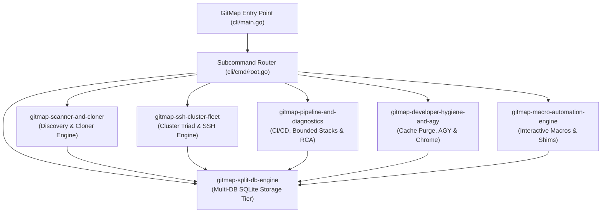

# 30 — GitMap Subsystem Skills Set Architecture

- **Slug:** gitmap-subsystem-skills-set-architecture
- **Date:** 2026-09-22
- **Version:** v6.296.0
- **Category:** learned
- **Status:** permanent

---

## 1. Executive Summary

To enable autonomous AI coding agents to make future changes easily across the entire GitMap codebase without risking architectural drift or violating CODE RED rules, an authoritative, modular skills set was authored directly in `.agents/skills/`.

GitMap spans over 6,500 files (3,339 Go files, 2,818 Markdown files, 220 TypeScript files, 204 Python files). Rather than expecting agents to crawl the entire repository on every prompt, these specialized skills define domain-specific boundaries, essential commands, code locations, and non-negotiable invariants for each core subsystem.

---

## 2. GitMap Specialized Skills Set Inventory

| Skill Name | Directory | Target Subsystems | Primary Focus |
|---|---|---|---|
| `gitmap-scanner-and-cloner` | `.agents/skills/gitmap-scanner-and-cloner/` | `cli/scanner/`, `cli/cmdscan/`, `cli/cloner/`, `cli/formatter/` | Recursive BFS/DFS traversal, `.git` repository identification, structured output formatting (`gitmap.csv`, `gitmap.json`, `folder-structure.md`), and high-speed parallel re-cloning. |
| `gitmap-ssh-cluster-fleet` | `.agents/skills/gitmap-ssh-cluster-fleet/` | `cli/cmdssh/`, `cli/cluster/`, `cli/termpad/`, `cli/termtable/` | Multi-node remote SSH command delegation, cluster orchestration, machine join, port 22 TCP liveness scanning, and table rendering. |
| `gitmap-split-db-engine` | `.agents/skills/gitmap-split-db-engine/` | `cli/db/`, `cli/cmddb/`, `cli/repodb/`, `cli/pipelinedb/` | SQLite Split-DB architecture (`gitmap.db`, `installation.db`, `repodb/pipeline.db`), singular PascalCase tables, `{TableName}Id` integer PKs, and WAL mode. |
| `gitmap-pipeline-and-diagnostics` | `.agents/skills/gitmap-pipeline-and-diagnostics/` | `cli/cmdpipeline/`, `03-ai-scripts/06-cicd-local-runner.py` | Bounded stack trace extraction (`extractBoundedStackLines`, 5 before + 20 after), CI/CD runner execution, Actions zero-storage purge, and 4-part RCA documentation. |
| `gitmap-developer-hygiene-and-agy` | `.agents/skills/gitmap-developer-hygiene-and-agy/` | `cli/cmdagy/`, `cli/cmdos/`, `cli/cmdchromeprofile/`, `cli/osclean/` | Google Antigravity (AGY) tools, 10-target developer cache cleaner, process termination safety, empty conversation pruning, and Chrome profile synchronization. |
| `gitmap-macro-automation-engine` | `.agents/skills/gitmap-macro-automation-engine/` | `cli/cmdmacro/`, `cli/macro/` | Multi-step interactive macro builder, step recording, cross-platform shell command shims (`open`), and detached process safety. |

---

## 3. Subsystem Interconnection Map

---

## 4. Operational Invariants for AI Pair Programming

1. **Progressive Disclosure:** Agents must read the dedicated subsystem skill before making modifications to that subsystem rather than crawling raw Go source trees.
2. **Hermetic Mocking:** Unit tests must use mock injectors (`DefaultOSActionExecutor`, `defaultFileRemover`) to prevent real OS modifications or network calls.
3. **No Uncommanded Test/Build Runs:** Never trigger full test suites (`06-cicd-local-runner.py`) or full builds during routine turns unless explicitly ordered by the repository owner.
4. **Immediate Remote Synchronization:** All skill files, memory updates, and code changes must be committed atomically and pushed immediately to remote git.
