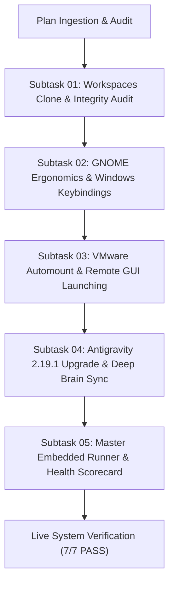

# Master Plan Ledger: Ubuntu Fleet Workstation Automation & Governance

> **Plan Reference:** `.ai-memory/plans/214-ubuntu-fleet-automation-and-workstation-governance.md`  
> **Status:** ACTIVE / LIVE VERIFIED  
> **Target Node:** Ubuntu 24.04 LTS (`u1` / `192.168.1.22`)  
> **Specification Reference:** [01-architecture-spec.md](file:///d:/work/gitmap/02-spec/21-app/214-ubuntu-fleet-automation-and-workstation-governance/01-architecture-spec.md)  
> **CLI Specification:** [02-component-and-cli-spec.md](file:///d:/work/gitmap/02-spec/21-app/214-ubuntu-fleet-automation-and-workstation-governance/02-component-and-cli-spec.md)  
> **Execution Base:** `d:/work/repo-secrets/04-ubuntu-migration/`  

---

## 1. Master Pipeline & Subtask Decomposition

---

## 2. Subtask Status & Evidence Ledger

| Subtask ID | Title | Status | Agent | Verified Evidence |
| :--- | :--- | :--- | :--- | :--- |
| **SUB-01** | Workspaces Clone & Integrity Audit | **DONE** | Worker 01 | 74 repositories verified and active under `/home/a/git-work/` on `u1`. |
| **SUB-02** | GNOME Ergonomics & Windows Keybindings | **DONE** | Worker 01 | Text scaling factor set to 1.40; Windows keybindings verified via `gsettings`. |
| **SUB-03** | VMware Automount & Remote GUI Launching | **DONE** | Worker 02 | `mnt-hgfs.automount` active; `systemd-run --user` launching Antigravity verified. |
| **SUB-04** | Antigravity 2.19.1 Upgrade & Deep Brain Sync | **DONE** | Worker 02 | Node.js ASAR parser confirms 2.19.1; 98 brain conversations synced with 2,321 relative path rewrites. |
| **SUB-05** | Master Embedded Runner & Health Scorecard | **DONE** | Lead Agent | All bash logic embedded in PowerShell; verification scorecard 100% PASS. |

---

## 3. Modular Subtasks Mapping

1. [01-git-workspaces-clone-and-validation.md](file:///d:/work/gitmap/.ai-memory/plans/subtasks/214-ubuntu-fleet-automation-and-workstation-governance/01-git-workspaces-clone-and-validation.md)
2. [02-gnome-ergonomics-and-keybindings.md](file:///d:/work/gitmap/.ai-memory/plans/subtasks/214-ubuntu-fleet-automation-and-workstation-governance/02-gnome-ergonomics-and-keybindings.md)
3. [03-vmware-automount-and-gui-launching.md](file:///d:/work/gitmap/.ai-memory/plans/subtasks/214-ubuntu-fleet-automation-and-workstation-governance/03-vmware-automount-and-gui-launching.md)
4. [04-antigravity-upgrade-and-deep-brain-migration.md](file:///d:/work/gitmap/.ai-memory/plans/subtasks/214-ubuntu-fleet-automation-and-workstation-governance/04-antigravity-upgrade-and-deep-brain-migration.md)
5. [05-master-embedded-runner-and-scorecard.md](file:///d:/work/gitmap/.ai-memory/plans/subtasks/214-ubuntu-fleet-automation-and-workstation-governance/05-master-embedded-runner-and-scorecard.md)
