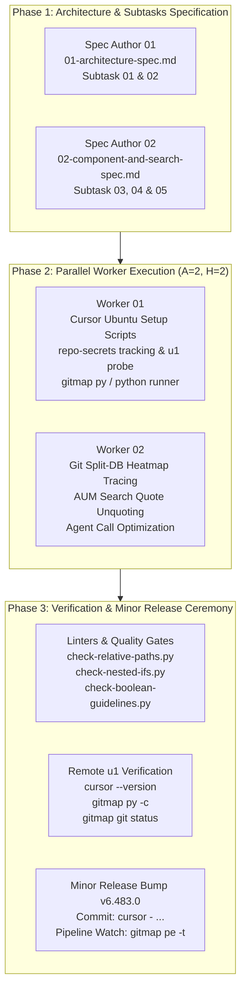

# Master Plan: 223-ubuntu-cursor-gitmap-python-git-tracing-and-aum-search

> **Plan ID:** 223-ubuntu-cursor-gitmap-python-git-tracing-and-aum-search  
> **Status:** Active Execution  
> **Created:** 2026-10-05  
> **Target Release:** v6.483.0  
> **Protocol:** execute-parent-task-with-n-steps-v6 (A = 2, H = 2)

---

## 1. User Request (Verbatim)

```text
have you improved and added cursor to the ubuntu system using gitmap or python or shell script for now and keep track in the repo-secrets folder

try to test and make sure by testing properly that these works, find issues if there is any fix it and make a minor bump and check gitmap pe -t until ci cd is green
python codes needs to run from gitmap please ensure that

make sure we have these git commands from gitmap because it can also keep a trace to split db for heat map understanding?? Clear???

make sure the agent calls are optimized using gitmap https://prnt.sc/Rk0BXJBXgkeD
https://prnt.sc/C0T16jJtXhE_
https://prnt.sc/2k7l4_Q0VFyM

Make sure we have the se AUM searches verified properly in other or current repo against other search tools to see if we have any mistakes and can be improved anything??

# Actionable Items Must Follow Non-Negotiable

1. Write spec under 02-spec/21-app/<slug>/ and enqueue plan task in .ai-memory/plans/<slug>.md (subtasks in .ai-memory/plans/subtasks/<slug>/) first
2. Search codebase exclusively via GitMap (gitmap aum search, gitmap find, gitmap cat, gitmap ps, gitmap py, gitmap llm train); TOTAL BAN on rg, ripgrep, grep, git grep, Select-String
3. Strictly use relative Git paths (02-spec/..., .ai-memory/..., cmd/...); only add the relative paths, never add the absolute path during your work, and ensure this is respected on the release page and in release notes as well
4. Improve and add cursor to the Ubuntu system using GitMap, Python, or shell script and keep track in the repo-secrets folder.
5. Test thoroughly to ensure functionality, find and fix any issues, make a minor version bump, and check `gitmap pe -t` until CI/CD is green.
6. Ensure Python code runs from GitMap.
7. Ensure Git commands from GitMap can trace to split db for heat map understanding.
8. Optimize agent calls using GitMap.
```

---

## 2. Architecture & Pipeline Structure



---

## 3. Subtask Decomposition (Disjoint Waves)

### Wave 1: Spec Authoring
- **Subtask 01:** `01-cursor-ubuntu-fleet-setup-and-repo-secrets.md` (Owner: Spec Author 01)
- **Subtask 02:** `02-gitmap-py-runner-and-ai-telemetry.md` (Owner: Spec Author 01)
- **Subtask 03:** `03-git-split-db-heatmap-command-tracing.md` (Owner: Spec Author 02)
- **Subtask 04:** `04-aum-search-quote-unquoting-and-agent-optimization.md` (Owner: Spec Author 02)
- **Subtask 05:** `05-remote-u1-testing-and-release-ceremony.md` (Owner: Spec Author 02)

### Wave 2: Implementation & Wiring
- **Worker 01:**
  - Create `repo-secrets/05-scripts/setup-cursor-ubuntu.py` and `setup-cursor-ubuntu.sh`.
  - Update `cli/cmdcursor/cursor_install.go` to support `--node u1` using the autonomous setup script.
  - Implement `cli/cmdpy/py_cmd.go` and register `py`, `python` in `cli/cmd/rootutility.go` and `cli/cmd/rootcore.go`.
- **Worker 02:**
  - Enhance `runGitPassthrough` in `cli/cmd/rootgit.go` and internal Git commands in `cli/cmd/commit_push.go` to record duration, timestamp, and exit code in `store.CommandHistorySplitDB` for developer heatmap tracking.
  - Add pattern cleaning and quote unquoting in `cli/cmdautomation/search.go` and `cli/cmdautomation/automation_cmd.go`.
  - Add comprehensive unit tests in `cli/cmdautomation/search_quote_test.go` and `cli/cmdpy/py_cmd_test.go`.

### Wave 3: Remote Node Deployment, Verification & Release
- Execute `repo-secrets/05-scripts/setup-cursor-ubuntu.sh` on node `u1` via `gitmap ssh exec u1`.
- Verify `cursor --version` executes cleanly on `u1` and write `repo-secrets/04-ubuntu-migration/cursor-fleet-status.json`.
- Verify `gitmap py -c "print('hello world')"` and `gitmap py` with scripts.
- Run quality linters: `check-relative-paths.py`, `check-nested-ifs.py`, `check-boolean-guidelines.py`.
- Bump version to `v6.483.0` via `03-ai-scripts/37-bump-version.py -t minor`.
- Commit and push via `gitmap cpr "cursor - ubuntu fleet cursor setup, gitmap py runner, git heatmap tracing, aum search unquote, release v6.483.0"`.
- Monitor remote CI/CD with `gitmap pe -t` until green.
