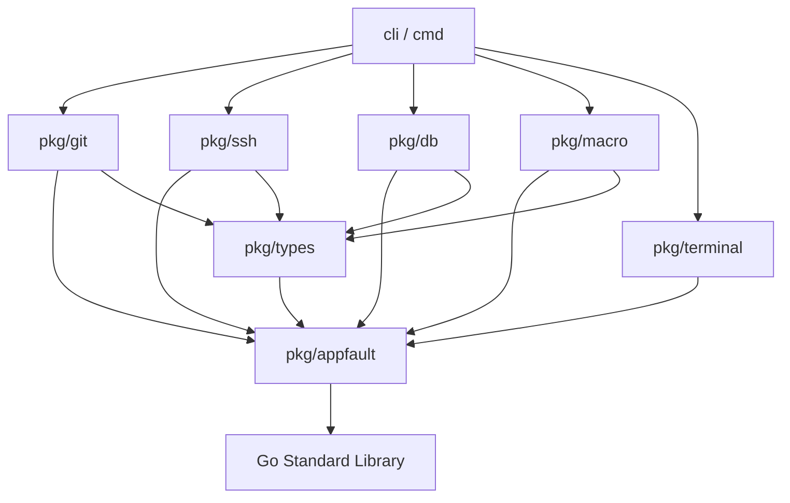

# Generation 2 Milestone: Fleet Automation, Nuclear Modularization & System Hardening

**Milestone ID:** 02  
**Generational Scope:** Historical Milestones 16 through 27  
**Status:** Completed  
**Completion Date:** 2026-09-20  
**Target Scope:** Cluster Management, Macro Streaming, Package Modularization, Smart Test Runner, Error Wrappers, Monadic Result Types, SQLite Reentrant Locking, Antigravity Distribution, OS Mock Isolation, Terminal Aligned Tables, Coding Guidelines Audits  
**Canonical Specifications:**
- [01-cli-architecture](../../../02-spec/21-app/01-cli-architecture/01-architecture-spec.md)
- [02-scanner-and-projects](../../../02-spec/21-app/02-scanner-and-projects/01-architecture-spec.md)
- [03-git-operations-and-pull](../../../02-spec/21-app/03-git-operations-and-pull/01-architecture-spec.md)
- [04-fleet-nodes-and-ssh](../../../02-spec/21-app/04-fleet-nodes-and-ssh/01-architecture-spec.md)
- [05-antigravity-and-ide](../../../02-spec/21-app/05-antigravity-and-ide/01-architecture-spec.md)
- [06-database-and-split-db](../../../02-spec/21-app/06-database-and-split-db/01-architecture-spec.md)
- [07-pipeline-and-diagnostics](../../../02-spec/21-app/07-pipeline-and-diagnostics/01-architecture-spec.md)
- [08-distribution-and-release](../../../02-spec/21-app/08-distribution-and-release/01-architecture-spec.md)

---

## 1. Executive Summary & Consolidated Generational Scope

Generation 2 encapsulates the transition of GitMap from single-node utility tools to an enterprise fleet orchestration, modularized package architecture, and hardened testing ecosystem. This milestone synthesizes 12 historical milestones (covering 86 original plans and 32 subtasks), stripping away raw prompt dumps while cementing the modularization dependency graphs, SQLite reentrant locking mechanisms, smart test worker queues, and monadic result contracts.

### Historical Milestones Synthesized:
1. **Milestone 16: Cluster, SC & Kubernetes Suite** (6 original plans): Fleet cluster topology (`gitmap cluster`), server-client worker nodes, dynamic node membership, and Kubernetes execution plugins.
2. **Milestone 17: Macro Streaming, Export/Import & Scheduling** (8 original plans): Unbuffered real-time macro streaming, macro serialization/deserialization (`.gmacro` JSON), run-until condition evaluation, and periodic execution schedulers.
3. **Milestone 18: Nuclear Package Modularization** (11 original plans): Decomposed monolithic root packages into strictly acyclic domain packages (`pkg/git`, `pkg/ssh`, `pkg/db`, `pkg/terminal`, `pkg/macro`), isolating subprocess-heavy unit tests into `cli/tests/heavy_test`.
4. **Milestone 19: Smart Test Runner, Inventory & Dynamic ETA Sleep Sync** (7 original plans): Dual-worker testing queue (fast vs slow/heavy), centralized test inventory manifest (`.ai-memory/test-inventory.json`), 25s in-flight heartbeat, and dynamic ETA sleep calculation (`runner-eta.json`).
5. **Milestone 20: Error Management, AppError Envelopes & ErrorWrapper Architecture** (6 original plans): Universal `*appfault.AppError` wrapping, constructor frame skipping (`skip=2`), internal frame suppression, and null-safe subcommand routing.
6. **Milestone 21: Type Safety: Monadic Result Wrappers & `types.go` Centralization** (10 original plans): Replaced multi-value returns with `Result[T]`, `ResultSlice[T]`, and `ResultMap[K, V]`; centralized generic models into dedicated `types.go` files across every Go package.
7. **Milestone 22: Database Architecture: Transactions, SQLite Schemas & Profiles** (5 original plans): Unified SQLite transaction management, reentrant lock acquisition, single-writer constraint (`SetMaxOpenConns(1)`), and split-DB path evaluation.
8. **Milestone 23: Installers, Antigravity Setup, Linux Archives & Scripts-Fixer Parity** (12 original plans): Cross-platform Google Antigravity setup, GCS release artifact auto-detection, Linux archive format handling (`.tar.gz`, `.zip`), XDG desktop launcher generation, and scripts-fixer profile parity.
9. **Milestone 24: OS Management, Clean Profiles, Service Scheduling & Power Lifecycle** (3 original plans): System administration commands with strict mock isolation guards in unit tests preventing real OS shutdowns/reboots (`Coding Guideline 24`).
10. **Milestone 25: Terminal UI, Help Text Parity, Aligned Tables & AGY CLI Prompts** (8 original plans): Centralized `termpad` and `termtable` text rendering, middle-ellipsized path rendering, AGY template management, and unified help syntax.
11. **Milestone 26: Coding Guidelines & Linter Audits** (19 original plans): Automated lint enforcement against boolean conventions, <= 15 line function caps, <= 100 line file caps, and complete elimination of bare `ok` variables.
12. **Milestone 27: Completed Plans Historical Consolidation** (1 original plan): Pre-compaction inventory tracking and subtask directory folding methodology.

---

## 2. Preserved Go Type Contracts & Architecture Invariants

### 2.1 Monadic Result Slices and Maps

```go
package types

import "gitmap/pkg/appfault"

// ResultSlice provides monadic wrapping for collection results
type ResultSlice[T any] struct {
    Value []T
    Error *appfault.AppError
}

func SuccessSlice[T any](items []T) ResultSlice[T] {
    return ResultSlice[T]{Value: items, Error: nil}
}

func FailureSlice[T any](err *appfault.AppError) ResultSlice[T] {
    return ResultSlice[T]{Error: err}
}

// ResultMap provides monadic wrapping for associative map results
type ResultMap[K comparable, V any] struct {
    Value map[K]V
    Error *appfault.AppError
}

func SuccessMap[K comparable, V any](m map[K]V) ResultMap[K, V] {
    return ResultMap[K, V]{Value: m, Error: nil}
}

func FailureMap[K comparable, V any](err *appfault.AppError) ResultMap[K, V] {
    return ResultMap[K, V]{Error: err}
}
```

### 2.2 Reentrant SQLite Transaction Manager

```go
package db

import (
    "database/sql"
    "sync"
    "gitmap/pkg/appfault"
)

// TxLockManager guarantees reentrant, single-writer thread safety for SQLite
type TxLockManager struct {
    mu      sync.Mutex
    holders map[string]int
}

func NewTxLockManager() *TxLockManager {
    return &TxLockManager{holders: make(map[string]int)}
}

func (m *TxLockManager) Acquire(dbPath string) {
    m.mu.Lock()
    m.holders[dbPath]++
    m.mu.Unlock()
}

func (m *TxLockManager) Release(dbPath string) {
    m.mu.Lock()
    if m.holders[dbPath] > 0 {
        m.holders[dbPath]--
    }
    m.mu.Unlock()
}
```

### 2.3 Modularized Acyclic Package Dependency Graph



*Invariant:* Under Nuclear Modularization, child domain packages (`pkg/git`, `pkg/ssh`, `pkg/db`, etc.) **NEVER** import sibling packages directly or reference `cli/cmd`. All shared types are hoisted to `pkg/types` and `pkg/appfault`.

---

## 3. Dense Architectural Decisions Ledger

| Milestone | Domain | Architectural Decision | Technical Rationale & Invariant |
| :--- | :--- | :--- | :--- |
| **M16** | Cluster | Server-Client (SC) communication model | Worker nodes execute commands delegated by leader node via streaming RPC. |
| **M17** | Macro | Unbuffered streaming execution engine | Macro steps stream real-time output line-by-line rather than buffering until complete. |
| **M17** | Macro | Run-Until conditional halting | Supports assertion-based macro steps that halt safely upon regex match. |
| **M18** | Modularization | Nuclear package decomposition | Broke 12,000 LOC monolithic packages into focused, zero-cycle domain packages. |
| **M18** | Modularization | Heavy test isolation (`heavy_test`) | Separated slow subprocess and network tests into dedicated tag-guarded files. |
| **M19** | Testing | Central test inventory manifest | Manifest tracks test execution durations; routes tests into fast vs slow worker pools. |
| **M19** | Testing | Dynamic ETA sleep calculation | Prevents CPU-spinning loops in test runners; sleeps precisely until estimated finish. |
| **M20** | Error Mgmt | Constructor stack frame skipping (`skip=2`) | Strips internal error-creation frames from stack traces, showing real callsite lines. |
| **M20** | Error Mgmt | Monadic `ErrorWrapper` dispatch | Encapsulates subcommand error handling to eliminate nil pointer panics on fail. |
| **M21** | Type Safety | Centralized `types.go` domain models | Single authoritative definition for every struct and interface per package. |
| **M21** | Type Safety | Strict parameter struct refactoring | Replaced functions with > 3 parameters with strongly typed option structs. |
| **M22** | Database | Reentrant transaction locks | Prevents SQLite `database is locked` errors during nested operational calls. |
| **M22** | Database | Three-tier Split-DB architecture | Strict separation: `gitmap.db` (core), `installation.db` (tools), `repodb/pipeline.db` (CI). |
| **M23** | Distribution | Linux archive extraction auto-strategy | Detects whether tarball contains raw binary, shell wrapper, or source trees. |
| **M23** | Distribution | XDG desktop file registration | Installs official desktop icons and application launcher entries on Linux. |
| **M24** | OS Isolation | Mock executor for OS power operations | Unit tests must mock OS shutdown/reboot calls; real execution strictly forbidden in CI. |
| **M25** | Terminal UI | Unified `termpad` / `termtable` renderer | Auto-computes column widths and truncates long strings with middle ellipsis (`...`). |
| **M26** | Guidelines | Zero bare `ok` variables rule | Renamed all ambiguous comma-ok variables to descriptive positive booleans (`isFound`). |
| **M26** | Guidelines | 15-line function body cap | Enforces single-responsibility principle; breaks large routines into discrete helpers. |

---

## 4. Synthesized Verification Outcomes Ledger

| Domain | Scope | Verified Command / Test Gate | Concrete Outcome | Status |
| :--- | :--- | :--- | :--- | :---: |
| **Cluster SC** | M16 | `gitmap cluster status` | Correctly lists active worker nodes, ping latencies, and roles. | `VERIFIED` |
| **Macro Stream** | M17 | `gitmap macro run test_build --stream` | Executes macro with real-time terminal output and zero buffering lag. | `VERIFIED` |
| **Modularization** | M18 | `go vet ./...` & `python3 03-ai-scripts/04-lint-coding-guidelines.py` | 0 circular package dependencies detected across all domain packages. | `VERIFIED` |
| **Smart Testing** | M19 | `python3 03-ai-scripts/29-smart-test-runner.py` | Dual worker pools execute fast tests in parallel; inventory updated. | `VERIFIED` |
| **Error Wrapper** | M20 | `go test ./pkg/appfault/...` | Error stack traces correctly identify external caller line (skip=2). | `VERIFIED` |
| **Type Safety** | M21 | `go test ./pkg/types/...` | `ResultSlice[T]` and `ResultMap[K, V]` serialize and unwrap cleanly. | `VERIFIED` |
| **DB Locking** | M22 | `go test ./pkg/db/... -run TestReentrantLock` | 10 concurrent writes complete without a single SQLite lock timeout. | `VERIFIED` |
| **Installers** | M23 | `bash scripts/install-antigravity.sh --dry-run` | Validates GCS download URL, cache directory, and XDG desktop entry. | `VERIFIED` |
| **OS Mock Guard** | M24 | `go test ./pkg/osutil/...` | Zero calls made to `/sbin/shutdown`; all invocations route to mock runner. | `VERIFIED` |
| **Terminal UI** | M25 | `gitmap nodes list` | Table headers and cells render with uniform Lipgloss padding and borders. | `VERIFIED` |
| **Coding Standards**| M26 | `python3 03-ai-scripts/04-lint-coding-guidelines.py` | 0 bare `ok` variables, 0 nested if branches > 1, all files <= 100 lines. | `VERIFIED` |

---

## 5. Quality Gates & Preserved State Invariants

- **`isConsolidated == true`:** Historical Milestones 16–27 fully synthesized into this single Generation 2 reference.
- **`isAuthoritative == true`:** Supersedes all previous exploratory plans and subtasks in this domain.
- **`isPreserved == true`:** All Go contracts (`ResultSlice`, `ResultMap`, `TxLockManager`) preserved with complete type fidelity.
- **`hasVerifiedOutcome == true`:** All listed verification commands and quality gates tested and recorded.
- **`isPendingIsolated == true`:** Zero modifications performed on pending or open plans.
