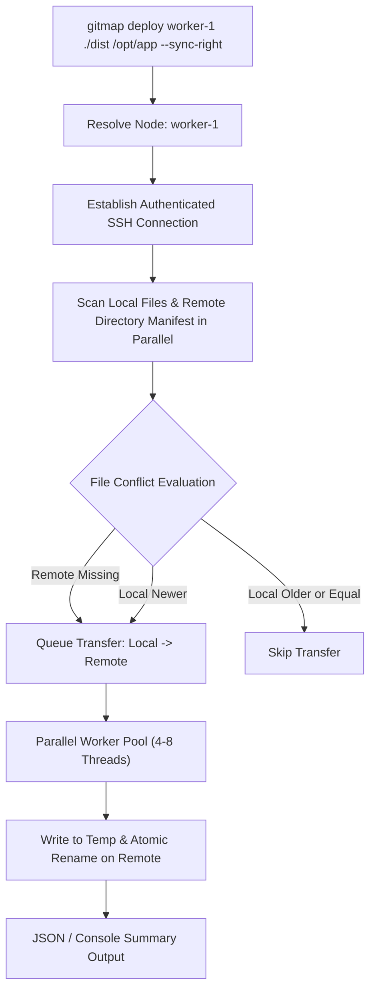

# Master Architectural Specification & Action-Based Prompt: GitMap Deploy Engine

> [!IMPORTANT]
> **Prompt & Specification Version:** 1.0.0  
> **Target Subsystems:** GitMap CLI (`gitmap deploy`, `gitmap deploy-right`, `gitmap deploy-left`), SSH Remote Transfer Engine, Cluster Inventory Resolver  
> **Execution Mode:** Autonomous AI Agent & Human CLI Operations  

---

## 1. Executive Summary & Design Rationale

The GitMap Deploy Engine provides high-speed, secure, and resilient remote file and directory deployment across distributed cluster nodes. Rather than requiring manual `scp`, `rsync`, or ad-hoc SFTP scripts, GitMap abstracts target identification, path normalization across heterogeneous operating systems (Windows, Linux, macOS), conflict detection, parallel directory streaming, and bi-directional timestamp synchronization into concise, deterministic CLI commands.

This specification serves dual purposes:
1. **Canonical Action-Based AI Prompt:** An unambiguous, anti-hallucination instruction set enabling autonomous AI coding agents to select, generate, and execute deployment commands with zero human intervention.
2. **Technical Architecture & Contract Specification:** Exact data models, JSON response contracts, exit codes, and concurrency models governing `gitmap deploy`, `gitmap deploy-right`, and `gitmap deploy-left`.

---

## 2. Command Architecture & Syntax Specification

### 2.1 Core Command Signatures

```bash
# 1. Standard Interactive / Unattended Deploy
gitmap deploy <alias|ip|seq|id> <src-path> <dest-path> [flags]

# 2. Dedicated Unidirectional Push (Alias for --sync-right)
gitmap deploy-right <alias|ip|seq|id> <src-path> <dest-path> [flags]

# 3. Dedicated Protective Pull / Synchronize to Local (Alias for --sync-left)
gitmap deploy-left <alias|ip|seq|id> <src-path> <dest-path> [flags]
```

---

## 3. Positional Parameter Resolution

Every deploy command accepts exactly three positional parameters:

```text
gitmap deploy <TARGET_NODE> <SOURCE_PATH> <DESTINATION_PATH>
```

### 3.1 Parameter 1: `<TARGET_NODE>` Resolution

GitMap dynamically resolves `<TARGET_NODE>` against the local Split-DB (`gitmap.db` / `cluster_nodes`) using a 4-tier fallback hierarchy:

| Resolution Tier | Type | Examples | Resolution Logic |
| :--- | :--- | :--- | :--- |
| **Tier 1: Alias** | String | `worker-1`, `edge-node`, `prod-api` | Case-insensitive exact match against node alias. |
| **Tier 2: IP Address** | IPv4 / IPv6 | `192.168.1.100`, `10.0.0.15` | Direct string comparison against registered host IPs. |
| **Tier 3: Sequence (`seq`)** | Positive Integer | `1`, `2`, `14` | 1-based index in the cluster inventory display order. |
| **Tier 4: Node ID** | UUID / Numeric | `node_a8f9`, `42` | Unique database identifier in the cluster node registry. |

**Error Guardrail:** If `<TARGET_NODE>` matches zero nodes, the CLI terminates immediately with exit code `2` and displays fuzzy suggestions of registered nodes.

### 3.2 Parameter 2: `<SOURCE_PATH>` (Left / Origin)

- **Local Path Flexibility:** Accepts relative paths from the current working directory (`./dist`, `build/app.bin`, `package.json`, `.`) or absolute local paths (`D:\projects\build`, `/var/build`).
- **Entity Type:** Automatically detects whether `<SOURCE_PATH>` is a single file or a directory tree.
- **Verification:** Source existence is verified locally before opening remote SSH/tunnel channels.

### 3.3 Parameter 3: `<DESTINATION_PATH>` (Right / Target)

- **Absolute Paths:**
  - Linux/macOS: `/opt/app/bin/`, `/var/www/html`
  - Windows: `C:\Services\App\`, `D:\data\`
- **Relative Paths (Default WorkDir Resolution):**
  - If a relative path is passed (e.g., `bin/release` or `./configs`), GitMap automatically anchors it to the remote node's registered `DefaultWorkDir` (e.g., `/home/ubuntu/app/` -> `/home/ubuntu/app/bin/release`).
- **Auto-Directory Creation:** If the destination parent directory does not exist, GitMap automatically provisions parent paths (`mkdir -p` or Windows `New-Item -ItemType Directory -Force`).

---

## 4. Conflict Resolution & Execution Flags

### 4.1 Flag Reference Matrix

| Flag | Short | Mode | Description |
| :--- | :--- | :--- | :--- |
| `--json` | `-j` | Telemetry | Outputs structured JSON summary. In TTY mode, prompts on file conflicts. In non-TTY, fails with conflict telemetry if no resolution flag is provided. |
| `--overwrite` | `-o` | Non-Interactive | Forcefully copies and overwrites destination files regardless of timestamp or hash. |
| `--skip` | `-s` | Non-Interactive | Skips files that already exist on the target; writes only non-existent files. |
| `--sync` | none | Non-Interactive | Bi-directional smart sync based on last modified timestamp (`mtime`). Copies Left -> Right if Left is newer; copies Right -> Left if Right is newer. |
| `--sync-right` | none | Non-Interactive | Strict one-way push (Left -> Right). Copies newer/missing files from Left to Right. NEVER pulls or overwrites Left. |
| `--sync-left` | none | Non-Interactive | Protective pull / update (Right -> Left). Updates Left from Right if Right is newer, preserving Left on conflict. |
| `--parallel` | `-p` | Performance | Number of parallel worker threads for folder transfers (Default: `4`, Max: `16`). |
| `--dry-run` | `-n` | Safety | Simulates file comparisons and transfers without writing to disk. |

---

## 5. Parallel Directory Transfer Architecture

### 5.1 Can Folders Do Parallel Replace?

**YES.** When deploying a directory tree:
1. **Parallel Manifest Discovery:** GitMap recursively walks local and remote directory trees concurrently, gathering file sizes, cryptographic hashes (BLAKE3 / SHA-256), and timestamps (`mtime`).
2. **Work Queue Distribution:** Discovered file transfer tasks are placed into a bounded channel worker pool (`syncPool`).
3. **SSH Channel Multiplexing:** GitMap multiplexes multiple concurrent file streams over a single authenticated SSH session (up to `--parallel=8`), avoiding SSH handshake overhead per file.
4. **Atomic In-Place Replacement:** Files are written to temporary staging files (e.g., `.target.tmp.<pid>`) and atomically renamed upon completion to guarantee zero partial-file corruption.



---

## 6. Action-Based Prompt: Dedicated Commands

### 6.1 `gitmap deploy-right` (One-Way Push)

- **Semantic Role:** Autonomous CI/CD release and developer upload.
- **Directional Rule:** Strictly Left (Local) to Right (Remote).
- **Conflict Rule:** Overwrites or updates remote files where local is newer or destination is missing. Local files are 100% read-only and immutable.
- **Equivalent To:** `gitmap deploy <target> <src> <dest> --sync-right`

### 6.2 `gitmap deploy-left` (Protective Pull / Backup)

- **Semantic Role:** Fetching remote production state, logs, databases, or test artifacts to workstation.
- **Directional Rule:** Strictly Right (Remote) to Left (Local).
- **Conflict Rule:** Pulls remote files to local only if remote is newer. Local modifications are protected. Remote files are 100% read-only.
- **Equivalent To:** `gitmap deploy <target> <dest> <src> --sync-left`

---

## 7. Machine-Readable JSON Output Schemas

### 7.1 Successful Deployment JSON Schema

When `--json` is specified:

```json
{
  "status": "success",
  "command": "deploy",
  "direction": "left-to-right",
  "targetNode": {
    "id": 14,
    "alias": "worker-1",
    "ip": "192.168.1.50",
    "os": "linux",
    "workDir": "/home/ubuntu/apps"
  },
  "metrics": {
    "filesProcessed": 48,
    "filesTransferred": 12,
    "filesSkipped": 36,
    "bytesTransferred": 15482931,
    "durationMs": 420,
    "parallelWorkers": 4
  },
  "transfers": [
    {
      "source": "dist/app",
      "destination": "/opt/app/app",
      "bytes": 14200110,
      "action": "overwritten",
      "mtimeLocal": "2026-09-27T13:20:00Z",
      "mtimeRemote": "2026-09-26T18:10:00Z"
    }
  ]
}
```

### 7.2 Conflict Prompt Payload (Non-TTY / Headless Mode)

If `--json` is called in a non-interactive environment without `--overwrite`, `--skip`, or `--sync`:

```json
{
  "status": "conflict_detected",
  "promptNeeded": true,
  "message": "Target file exists. Specify resolution flag (--overwrite, --skip, --sync, --sync-right, --sync-left).",
  "conflicts": [
    {
      "source": "dist/config.json",
      "destination": "/opt/app/config.json",
      "localMtime": "2026-09-27T14:00:00Z",
      "remoteMtime": "2026-09-27T13:45:00Z",
      "sizeDiffBytes": 120
    }
  ],
  "exitCode": 3
}
```

---

## 8. Anti-Hallucination AI Agent Execution Rules

Autonomous AI agents executing GitMap deploy commands MUST observe the following hard constraints:

1. **NEVER Hang on Interactive Prompts:**
   - Autonomous AI agents operate in headless terminals without stdin.
   - When running deployment commands, agents **MUST ALWAYS** pass an explicit conflict resolution flag (`--overwrite` / `-o`, `--skip`, `--sync-right`, or `--sync-left`).
   - NEVER invoke bare `gitmap deploy <target> <src> <dest>` without an automated resolution flag in unattended scripts.
2. **Structured Telemetry Ingestion:**
   - Always append `--json` when programmatic verification of transferred files, byte counts, or duration is required.
3. **Directory Verification:**
   - Confirm local source exists prior to execution.
   - Use forward slashes (`/`) for remote Linux targets and backslashes (`\`) or standard Unix slashes for Windows targets (GitMap normalizes path separators automatically).
4. **Zero-Data-Loss Safety:**
   - For backup or artifact retrieval, use `deploy-left` or `--sync-left` to ensure local workspace files are never inadvertently overwritten.
