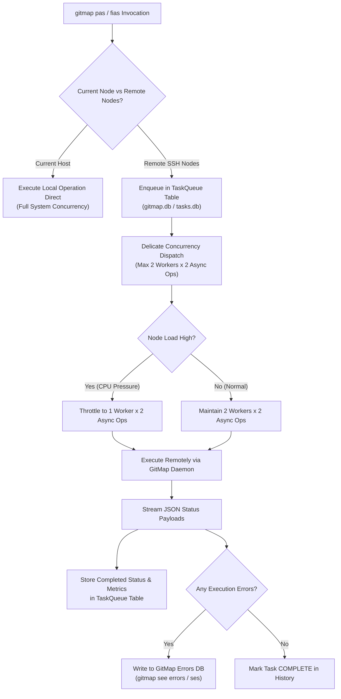
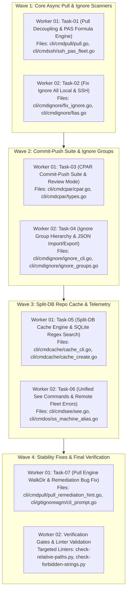

# [V6] Plan 60: GitMap PAS Formula, Ignore Grouping Engine, CPAR Suite & Split-DB Repo Cache

- **Status:** `PENDING`
- **Canonical Spec:** [02-spec/21-app/197-gitmap-pas-fix-and-repo-cache-commands.md](../../../02-spec/21-app/197-gitmap-pas-fix-and-repo-cache-commands.md) & [02-spec/21-app/181-gitmap-ignore-and-cache-engine/01-overview.md](../../../02-spec/21-app/181-gitmap-ignore-and-cache-engine/01-overview.md)
- **Execution Lifecycle:** Multi-Agent Subagent Execution (`A = 2`, `H = 2`) via `invoke_subagent` (`TypeName: "self"`).
- **Target Release:** `v6.441.0`

```text
N = 300 (Total self-loop steps budget — editable top-header parameter, default: 300)
A = 2   (MANDATORY number of spawned autonomous subagents running concurrently via invoke_subagent, default: 2)
H = 2   (Operational hands per agent: dual-task batch capacity & parallel tool dispatch, default: 2)
C = 30  (Tool calls per worker before it must report, default: 30)

System Concurrency Capacity = A × H = 2 agents × 2 hands = 4 concurrent subtask operations
PHASE_1_BUDGET = N / 2   (Steps 1 .. 150: Planning, Parallel Discovery Subagents, Detailed Spec, and Lean Subtask Generation)
PHASE_2_BUDGET = N / 2   (Steps 151 .. 300: Mandatory Parallel Subagent Execution, Self-Looping, Targeted Quality Linting)
WAVES = ceil(subtasks / (A x H))
```

> [!IMPORTANT]
> **Plan Slug:** `60-gitmap-pas-command-fix`
> **Tracking Specs:** [02-spec/21-app/197-gitmap-pas-fix-and-repo-cache-commands.md](../../../02-spec/21-app/197-gitmap-pas-fix-and-repo-cache-commands.md) & [02-spec/21-app/181-gitmap-ignore-and-cache-engine/01-overview.md](../../../02-spec/21-app/181-gitmap-ignore-and-cache-engine/01-overview.md)
> **Related Plans:** [58-pas-formula-fix-ignores-cpar-and-repo-cache.md](../completed/58-pas-formula-fix-ignores-cpar-and-repo-cache.md) & [181-gitmap-ignore-and-cache-engine](../../../02-spec/21-app/181-gitmap-ignore-and-cache-engine/01-overview.md)
> **Runtime:** Google Antigravity 2.0 (IDE and CLI)
> **Invoke Command:** `/execute-parent-task-with-n-steps-v6 60-gitmap-pas-command-fix`
>
> **Top-Instruction Priority Mandate (Above Precedence / Preamble Precedence):**
> Whatever directives, constraints, checklists, or user instructions are given ABOVE this prompt (including in the user preamble, header blocks, or incoming user request) are HIGHEST PRIORITY and MUST BE FOLLOWED as strictly NON-NEGOTIABLE. They supersede and strictly override any conflicting general advice, default conventions, or lower-level guidelines below.

---

## 1. Executive Summary & Problem Formulation

This execution plan formalizes, standardizes, and implements seven high-impact subsystems for GitMap:

1. **Decoupled Asynchronous Pull (`gitmap pa`):** Eliminates latency in repository pulling by prioritizing raw git pulls first. Moves all `.gitignore` inspection to a non-blocking asynchronous worker group (5 repos per worker), summarizing duplicate patterns and committed ignores after pulls conclude.
2. **The "Gitmap PAS Formula" for Remote Fleet Orchestration (`gitmap pas`):** Defines the standard architecture for executing commands across remote SSH fleets. The local host runs commands directly; remote nodes execute via GitMap task workers constrained to low concurrency (2 workers, 2 async operations max; 1 worker under high CPU pressure). All node communications use structured JSON and register in the central Task Queue and Errors DB.
3. **Global Repository Fix & Commit-Push Suites (`gitmap fia`, `gitmap fias`, `gitmap cpar`):** Fleet-wide automated repository repair and atomic batch committing with interactive review modes (`--review` / `-r`), commit-only options (`--commit-only` / `--co`), and non-interactive auto-confirm (`-y`).
4. **GitMap Ignore Engine & Hierarchical Groups (`gitmap ignore` / `ig`):** Central SQLite + text backing for `.gitignore` templates. Manages named groups, default chained execution (`agtd`), repository-specific bindings (`cgwp`), and JSON import/export.
5. **Split-DB Repository Cache & Accelerated Search Engine (`gitmap cache`):** Multi-tier SQLite cache (`sql.db` root + `<folder-slug>.db` per top-level folder). Stores relative paths and filesystem modification times (`mtime` — zero slow hashing). Automatically filters files >200 KB, binaries, and IDE caches. Powers ultra-fast multi-term search and SQLite-native regex search with automatic background reconciliation.
6. **Fleet Telemetry & Unified Inspection (`gitmap see` / `c`):** Canonical inspection for pending commits, ignore inconsistencies, and remote fleet error journals (`gitmap ses`).
7. **Pull Remediation & Screenshot Bug Fix:** Replaces raw git command hints (`git -C ...`, `git pull --rebase`) with actionable native GitMap verbs (`gitmap fix`, `gitmap cpar`, `gitmap stash`), and ensures untracked ignore files are never falsely prompted.

---

## 2. Exhaustive CLI Command Reference & Concrete Examples

Every command in this suite supports both full-length commands and high-speed short aliases. AI agents and subagents must strictly adhere to these verified CLI signatures without hallucinating invented flags or syntax.

### 2.1 Quick Alias Reference Table

| Operation | Canonical Command | Canonical Alias | Key Flags & Options | Purpose |
| :--- | :--- | :--- | :--- | :--- |
| **Pull All Local** | `gitmap pull all` | `gitmap pa` | `-y`, `--review` (`-r`) | Pull all local repos first; run async ignore audit |
| **Pull All SSH Fleet** | `gitmap pull all ssh` | `gitmap pas` | `-y`, `--timeout <sec>` | Execute pull fleet-wide using GitMap PAS Formula |
| **Fix Ignore All** | `gitmap fix-ignore-all` | `gitmap fia` | `-y`, `--interactive` | Scan and repair ignore duplicates & tracked files |
| **Fix Ignore SSH** | `gitmap fix-ignores-all-ssh`| `gitmap fias` | `-y` | Fleet-wide ignore repair via PAS Formula |
| **Commit Push All** | `gitmap commit-push-all-repos` | `gitmap cpar` | `-y`, `-r`, `--co` | Commit and push all repos with pending changes |
| **See Pending Commits**| `gitmap see commit pending` | `gitmap c commit pending` | `--tree`, `--limit <N>` | List all repos with uncommitted changes & diff tree |
| **See Ignore Issues** | `gitmap see git-ignore issues`| `gitmap c ig issues` | `--duplicates`, `--tracked`| Inspect duplicate rules and tracked ignore files |
| **See Local Errors** | `gitmap see errors` | `gitmap c errors` | `--limit <N>`, `--since <time>`| View GitMap error database journal |
| **See Remote SSH Errors**| `gitmap see errors ssh` | `gitmap ses` | `--node <id>`, `--limit <N>` | View errors across remote SSH fleet nodes |
| **See SSH History** | `gitmap history ssh` | `gitmap nodes history` | `--limit <N>`, `--json` | View remote task dispatch and execution history |
| **Ignore Manager** | `gitmap ignore <subcmd>` | `gitmap ig <subcmd>` | `add`, `ls`, `apply`, etc. | Manage ignore groups, patterns, and bindings |
| **Connect Ignore Group**| `gitmap ignore connect-group-with-repo`| `gitmap ig cgwp` | `--add-with-default` (`--awd`)| Bind an ignore group to a repo path/alias |
| **Add Group to Default**| `gitmap ignore add-grp-to-default` | `gitmap ig agtd` | `<group-name>` | Chain group execution after default group |
| **Repo Cache Create** | `gitmap cache create <path>`| `gitmap cache add <path>` | `.`, `<path1>,<path2>` | Build Split-DB cache (`sql.db` + `<slug>.db`) |
| **Repo Cache Search** | `gitmap cache search <query>`| `gitmap cache search` | `-fp <glob>`, `--lines`, `--limit`| Fast text search via Split-DB cache |
| **Cache Multi Search** | `gitmap cache search-multi` | `gitmap cache search-multi`| `-fp <glob>`, `--lines`, `--limit`| Multi-term text search via Split-DB cache |
| **Cache Regex Grep** | `gitmap cache search-multi-grep`| `gitmap cache search-multi-grep`| `-fp <glob>`, `--lines`, `--limit`| SQLite-native regular expression search |
| **Cache Reconcile** | `gitmap cache reconcile` | `gitmap cache recache` / `sync` | `<path>` | Background sync outdated `mtime` from filesystem |
| **Repo Management UI**| `gitmap repo-manage ui` | `gitmap repo-manage ui` | None | Visual terminal dashboard for repo lifecycle |

---

### 2.2 Deep CLI Signatures & Concrete Examples

#### 1. `gitmap pull all` (`gitmap pa`)
Pull all tracked repositories in the workspace immediately. Ignore checks run asynchronously in the background and report after pulls finish.
```bash
# Standard pull across all registered workspace repositories
gitmap pull all

# Using high-speed alias
gitmap pa

# Pull all repos and automatically apply recommended ignore optimizations without prompt
gitmap pa -y

# Pull all repos and review pending upstream changes before merging
gitmap pa --review
gitmap pa -r
```

#### 2. `gitmap pull all ssh` (`gitmap pas`)
Execute `pull all` across the entire SSH cluster fleet following the **Gitmap PAS Formula**.
```bash
# Run pull on current node directly, and delegate to remote SSH fleet with 2-worker concurrency
gitmap pull all ssh

# Using high-speed alias
gitmap pas

# Non-interactive pull fleet-wide, auto-confirming prompts
gitmap pas -y

# Specify a custom execution timeout in seconds for slow remote nodes
gitmap pas --timeout 300
```

#### 3. `gitmap fix-ignore-all` (`gitmap fia`) & `gitmap fix-ignores-all-ssh` (`gitmap fias`)
Scan repositories for `.gitignore` syntax errors, exact duplicate entries, and files that are tracked in Git commits despite matching ignore rules.
```bash
# Interactive scan and repair across all local repositories
gitmap fix-ignore-all
gitmap fia

# Non-interactive batch repair (deduplicates rules and untracks committed ignore files via git rm --cached)
gitmap fix-ignore-all -y
gitmap fia -y

# Singular and plural aliases are both valid
gitmap fix ignore all -y
gitmap fix ignores all -y

# Fleet-wide ignore repair across all remote SSH nodes using the PAS Formula
gitmap fix-ignores-all-ssh
gitmap fias

# Non-interactive fleet-wide ignore repair
gitmap fix-ignores-all-ssh -y
gitmap fias -y
```

#### 4. `gitmap commit-push-all-repos` (`gitmap cpar`)
Discover all repositories with unstaged or staged modifications, package atomic commits, and push upstream.
```bash
# Interactive commit and push across all repositories with pending changes
gitmap commit-push-all-repos
gitmap cpar

# Non-interactive: auto-commit all changes with conventional commit messages and push
gitmap cpar -y

# Review mode: display a visual directory tree of modified, untracked, and deleted files before confirming
gitmap cpar --review
gitmap cpar -r

# Commit-only mode: stage and commit changes locally across all repos, but DO NOT push upstream
gitmap cpar --commit-only
gitmap cpar --co

# Combine review and commit-only modes
gitmap cpar --review --commit-only
gitmap cpar -r --co

# Non-interactive commit-only
gitmap cpar -y --co
```

#### 5. `gitmap see` (`gitmap c`) Subcommands
Inspect status, uncommitted changes, ignore health, and error logs across local and remote nodes.
```bash
# View all repositories that currently contain uncommitted changes
gitmap see commit pending
gitmap c commit pending

# View repositories containing duplicate ignore rules or tracked ignore files
gitmap see git-ignore issues
gitmap see ignore issues
gitmap see ig issues
gitmap c ig issues

# View the local GitMap Errors database journal
gitmap see errors
gitmap c errors
gitmap see errors --limit 50

# View errors recorded across remote SSH nodes (follows Gitmap PAS Formula)
gitmap see errors ssh
gitmap ses
gitmap ses --limit 30 --node node-02

# View task history on local machine
gitmap see history
gitmap c history

# View task dispatch and completion history across all SSH cluster nodes
gitmap history ssh
gitmap nodes history
gitmap nodes histories
gitmap nodes history --limit 100 --json

# Inspect live cluster status and node telemetry
gitmap see ssh-node all
gitmap see ssh-node node-01
```

#### 6. `gitmap ignore` (`gitmap ig`) Subsystem
Manage `.gitignore` groups, central rules, repository attachments, and portable JSON configurations.
```bash
# List all registered ignore groups, rule counts, and active repository bindings
gitmap ignore ls
gitmap ig ls

# Add a pattern to the default ignore group (checks for duplicates automatically)
gitmap ignore add "*.tmp"
gitmap ig add ".cache/"
gitmap ig add "coverage.out"

# Create a new named ignore group
gitmap ignore add-group frontend-web
gitmap ig add-group golang-services
gitmap ig add-group python-ml

# Remove an ignore group
gitmap ignore remove-group python-ml
gitmap ig rm-grp python-ml

# Add a group to the default chain (executes automatically on all repos after the default group)
gitmap ignore add-grp-to-default golang-services
gitmap ig agtd golang-services

# Connect an ignore group to a specific repository path or alias
# Flag --add-with-default (--awd) ensures both the default group AND this group apply
gitmap ignore connect-group-with-repo frontend-web frontend/apps/web-client --add-with-default
gitmap ig cgwp frontend-web web-client --awd

# Apply ignore rules to the current directory or specified repository
gitmap ignore apply .
gitmap ig apply ./services/auth-service

# Scan for ignore anomalies locally or across SSH nodes
gitmap ignore scan
gitmap ig scan
gitmap ignore scan-ssh
gitmap ig scan-ssh
gitmap ig ss

# Export and import ignore configuration to/from portable JSON
gitmap ignore export
gitmap ig export ./configs/gitmap-ignores.json
gitmap ignore import ./configs/gitmap-ignores.json
gitmap ig import ./configs/gitmap-ignores.json
```

#### 7. `gitmap cache` Subsystem (Split-DB Engine & Regex Search)
High-performance SQLite repository indexing. Generates a root `sql.db` and independent `<folder-slug>.db` databases per top-level folder.
```bash
# Create or update the Split-DB cache for the current repository
gitmap cache create .
gitmap cache add .

# Create cache for specific relative or absolute directory paths
gitmap cache create cli,internal,pkg
gitmap cache create "./cli", "./internal"

# Create cache indexing specific files
gitmap cache create "package.json", "go.mod", "cargo.toml"

# List all active repository caches, table records, and disk usage
gitmap cache ls

# Remove cache for a repository
gitmap cache remove .
gitmap cache rm my-repo-slug

# Search cached text files (default: 10 context lines, max 20 matches)
gitmap cache search "AppError" "*.go"
gitmap cache search "TODO:" "*.md" --lines 5 --limit 10

# Search with multiple file pattern filters (-fp / -file-pattern)
gitmap cache search "execTask" -file-pattern "a*.go", "b*.go" --lines 10 --limit 20
gitmap cache search "connectionTimeout" -fp "*.ts" -fp "*.go" --lines 8 --limit 15

# Search multiple text terms simultaneously
gitmap cache search-multi "struct,interface" -fp "*.go" --lines 10 --limit 20
gitmap cache search-multi "config,settings" -file-pattern "*.json", "*.yaml" --lines 5 --limit 50

# High-speed regular expression search powered natively by SQLite
gitmap cache search-multi-grep "type\s+[A-Z]\w+\s+struct" -fp "*.go" --lines 10 --limit 30
gitmap cache search-multi-grep "export\s+const\s+use[A-Z]\w+" -fp "*.tsx" --lines 12 --limit 25

# Reconcile cache with disk (checks file mtime; updates outdated files asynchronously)
gitmap cache reconcile
gitmap cache recache
gitmap cache sync
gitmap cache reconcile .
```

#### 8. `gitmap repo-manage ui`
Launch the interactive terminal UI dashboard for holistic repository lifecycle governance.
```bash
# Open interactive repository management dashboard
gitmap repo-manage ui
```

---

## 3. System Architecture & Formal Specifications

### 3.1 The "Gitmap PAS Formula" Specification

The **Gitmap PAS Formula** is the foundational execution protocol for cross-node SSH fleet operations in GitMap. All commands with SSH variants (`pas`, `fias`, `ses`, `nodes history`) MUST implement this pattern:



#### Concurrency & Fleet Constraints:
1. **Host Isolation:** The local node executing the command runs at normal full capacity. Remote SSH nodes receive delegated tasks through the GitMap daemon.
2. **Delicate Worker Throttling:** Remote nodes are strictly constrained to avoid overloading remote environments:
   - **Standard Concurrency:** Maximum 2 concurrent worker processes, each running at most 2 async goroutines/tasks (concurrency cap = 4).
   - **High-Pressure Throttling:** If remote CPU/load exceeds threshold, throttle to 1 worker process and 2 async tasks.
3. **Structured JSON Wire Protocol:** Remote executions communicate progress, completion, and error states via structured JSON envelopes.
4. **Guaranteed Task Journaling:** Every delegated action registers in the `TaskQueue` table with:
   - `queue_id` (UUID), `node_id`, `command`, `status` (`PENDING`, `RUNNING`, `COMPLETED`, `FAILED`), `created_at`, `updated_at`, `forward_payload`, and `inverse_payload` (for undo/redo).
5. **Errors DB Persistence:** All remote failures, timeouts, and command rejections write directly to the persistent GitMap Errors SQLite database, queryable via `gitmap see errors ssh` (`gitmap ses`).

---

### 3.2 Split-DB Repository Cache Engine Specification

To provide near-instant file discovery, grep, and regex search across thousands of code files without lock contention or memory bloat, GitMap employs a **Split-DB Architecture**:

```text
.gitmap/cache/<repo-slug>/
├── sql.db                  <-- Root DB: repo metadata, root files, folder directory list, views
├── folder_cli.db           <-- Sub-DB: all files under /cli/
├── folder_internal.db      <-- Sub-DB: all files under /internal/
└── folder_pkg.db           <-- Sub-DB: all files under /pkg/
```

#### Split-DB Rules:
1. **Root Database (`sql.db`):**
   - Stores repository identity: `repo_url`, `root_path`, `branch`, `commit_sha`.
   - Stores only root-level files (e.g. `readme.md`, `go.mod`, `license`).
   - Stores directory catalog linking folder slugs to their respective SQLite DB files.
   - Provides a SQL `VIEW` that normalizes paths and joins records across all attached sub-databases.
2. **Top-Level Subfolder Databases (`folder_<slug>.db`):**
   - Exactly one SQLite database file per top-level folder.
   - Sub-subfolders (e.g. `cli/cmd/subcmd/`) DO NOT create nested databases. Their files are stored inside their top-level parent's database (`folder_cli.db`) with exact relative paths.
3. **Exclusion Gates (Strict Storage Protection):**
   - **Large File Cap:** Any file exceeding 200 KB – 300 KB is NOT stored in the database content column (path and metadata are stored; `is_keep = false`).
   - **Binary & Media Exclusion:** Zero images (`.png`, `.jpg`, `.svg`), binaries (`.exe`, `.dll`, `.so`), zip archives, or compiled objects stored.
   - **System Ignored Dirs:** `.git/`, `.vscode/`, `.idea/`, `node_modules/`, `vendor/` are strictly ignored during cache generation.
4. **Timestamp Freshness (`mtime`):**
   - The cache stores filesystem `mtime` (last modified timestamp). It **NEVER calculates SHA hashes** during scanning to maintain maximum read throughput.
5. **Asynchronous Background Reconcile:**
   - During `cache search`, if an inspected file's disk `mtime` differs from the DB `mtime`, an async background goroutine updates the DB record without stalling the search query.

---

### 3.3 GitMap Ignore Engine Specification

The ignore engine coordinates `.gitignore` configurations across the entire fleet:

1. **Default Group:**
   - Automatically provisions mandatory ignore patterns:
     - `.gitmap/`
     - `.gitmap/backup/`
     - Standard editor & OS artifacts (`.DS_Store`, `Thumbs.db`).
   - Backed by central SQLite store and mirrored to text configuration.
2. **Chained Default Groups (`agtd`):**
   - Named groups added via `gitmap ig agtd <group-name>` execute automatically on all repositories immediately after the default group.
3. **Repository-Specific Bindings (`cgwp`):**
   - Custom groups linked via `gitmap ig cgwp <group-name> <repo-alias> --awd` ensure project-specific rules (e.g. Python virtualenvs, Node build outputs) are applied whenever that repo is touched.
4. **Safe Deduplication & Clean Untracking:**
   - Deduplication preserves line order and comments; only removes exact duplicate lines.
   - If a file matching ignore rules is found in the current git commit state (`git ls-files`), the system flags it as a red-alert tracked file and offers atomic untracking (`git rm --cached`). Files NOT tracked in git commits are never falsely flagged.

---

## 4. GitMap High-Speed Command Primacy (Run Everything Faster)

GitMap is your **PRIMARY** acceleration engine across all turns. Agents must prefer these commands over slow generic shell pipelines:

| Category | Operation | Canonical Command | High-Speed Alias | Purpose / Advantage |
| :--- | :--- | :--- | :--- | :--- |
| **Discovery** | Find by glob | `gitmap find "<pattern>"` | `gitmap f "<pattern>"` | High-speed multi-threaded file search |
| **Discovery** | Find exact file | `gitmap find-files <name>` | `gitmap ff <name>` | Instant file lookup across repository |
| **Discovery** | Find substring | `gitmap find-files-any "<str>"` | `gitmap ffa "<str>"` | Substring filename discovery |
| **Discovery** | List repo files | `gitmap list-files [pattern]` | `gitmap lf [pattern]` | Fast index-based file listing |
| **Discovery** | Directory tree | `gitmap folder-tree` | `gitmap ft` | Visual hierarchy tree representation |
| **Inspection**| Stream file content| `gitmap cat <filepath>` | `gitmap cat <filepath>` | Instant zero-write stdout streaming |
| **Search** | Multi-core text search| `gitmap search "<term>"` | `gitmap search "<term>"` | Fast AUM-indexed regex & text grep |
| **Hygiene** | Lowercase files | `gitmap lowercase` | `gitmap lcf [--dry-run]` | Safe 2-step git-compatible renaming |
| **Hygiene** | Lowercase README | `gitmap lowercase-readme` | `gitmap lowercase-readme`| Enforces lowercase root `readme.md` |
| **Hygiene** | Common templates | `gitmap commons` | `gitmap co` / `sync all` | Sync `.gitignore`, `.prettierignore` |
| **State** | Repository status | `gitmap status` | `gitmap st` | Lightning-fast working tree inspection |
| **State** | Upstream updates | `gitmap has-any-updates` | `gitmap hau` | Fast remote sync detection |
| **Execution** | PowerShell runner | `gitmap pwsh "<command>"` | `gitmap ps "<command>"` | Managed PowerShell execution wrapper |
| **Execution** | Bash runner | `gitmap bash "<command>"` | `gitmap sh "<command>"` | Managed Bash execution wrapper |
| **Commits** | Feature commit | `gitmap cpf "<summary>"` | `gitmap cpf "<summary>"` | Atomic stage, conventional commit & push |
| **Commits** | Bugfix commit | `gitmap cpb "<summary>"` | `gitmap cpb "<summary>"` | Atomic fix stage, commit & push |
| **Commits** | Pull-Commit-Push | `gitmap pcp "<summary>"` | `gitmap pcp "<summary>"` | Atomic rebase, commit, and upstream push |
| **CI/CD** | Pipeline waiting | `gitmap pe` | `gitmap pe` | Dynamic ETA pipeline status watcher |

---

## 5. Discrete Actionable Deliverables & Subtask Breakdown

The work required by this plan is decomposed into seven discrete deliverables:

```text
Deliverables Hierarchy:
├── Task-01: GitMap Pull All Decoupling & PAS Formula Engine
├── Task-02: GitMap Fix Ignore All (Local & SSH Fleet)
├── Task-03: GitMap Commit-Push All Repos Suite (CPAR)
├── Task-04: GitMap Ignore Engine & Hierarchical Groups
├── Task-05: GitMap Split-DB Repository Cache & Search Engine
├── Task-06: GitMap Unified "See" Inspection & Remote Fleet Telemetry
└── Task-07: Pull Engine Stability Fix & UI Bug Remediation
```

### Task-01: GitMap Pull All Decoupling & PAS Formula Engine
- **State:** `[QUEUED — EXECUTING IN WAVE 1]`
- **Scope:** Refactor `gitmap pull all` (`pa`) to decouple `.gitignore` checks from the pull workflow. Implement the foundational `gitmap pull all ssh` (`pas`) command enforcing the GitMap PAS Formula (max 2 workers, 2 async operations; JSON telemetry; TaskQueue registration).
- **Target Files:** `cli/cmdpull/pull.go`, `cli/cmdssh/ssh_pas_fleet.go`, `cli/cmdssh/ssh_pull_fleet.go`

### Task-02: GitMap Fix Ignore All (Local & SSH Fleet)
- **State:** `[QUEUED — EXECUTING IN WAVE 1]`
- **Scope:** Implement `gitmap fix-ignore-all` (`fia`) and `gitmap fix-ignores-all-ssh` (`fias`). Build duplicate line stripping, commit-state checking (`git ls-files`), non-interactive `-y` mode, and interactive per-repo repair sessions.
- **Target Files:** `cli/cmdignore/fix_ignore.go`, `cli/cmdignore/fias.go`, `cli/cmdignore/ignore_cli.go`

### Task-03: GitMap Commit-Push All Repos Suite (CPAR)
- **State:** `[QUEUED — EXECUTING IN WAVE 2]`
- **Scope:** Implement `gitmap commit-push-all-repos` (`cpar`). Support `-y` auto-confirm, `--review` (`-r`) visual directory tree formatting, and `--commit-only` (`--co`) local staging without upstream pushing.
- **Target Files:** `cli/cmdcpar/cpar.go`, `cli/cmdcpar/types.go`

### Task-04: GitMap Ignore Engine & Hierarchical Groups
- **State:** `[QUEUED — EXECUTING IN WAVE 2]`
- **Scope:** Implement `gitmap ignore` (`ig`) subcommands: `add`, `ls`, `add-group`, `remove-group` (`rm-grp`), `add-grp-to-default` (`agtd`), `connect-group-with-repo` (`cgwp` with `--awd`), `apply`, `export`, and `import`. Ensure `.gitmap/` and `.gitmap/backup/` are immutable defaults.
- **Target Files:** `cli/cmdignore/ignore_cli.go`, `cli/cmdignore/ignore_groups.go`, `cli/store/split_db_ignore.go`

### Task-05: GitMap Split-DB Repository Cache & Search Engine
- **State:** `[QUEUED — EXECUTING IN WAVE 3]`
- **Scope:** Implement `gitmap cache` subsystem: `create`, `ls`, `rm`, `search`, `search-multi`, `search-multi-grep`, and `reconcile`. Build root `sql.db` + `<slug>.db` subfolder architecture, >200KB exclusion, binary filtering, `mtime` indexing, and background auto-reconciliation.
- **Target Files:** `cli/cmdcache/cache_cli.go`, `cli/cmdcache/cache_create.go`, `cli/cmdcache/cache_search.go`, `cli/cmdcache/cache_types.go`, `cli/store/split_db_cache.go`

### Task-06: GitMap Unified "See" Inspection & Remote Fleet Telemetry
- **State:** `[QUEUED — EXECUTING IN WAVE 3]`
- **Scope:** Implement `gitmap see` (`c`) suite: `commit pending`, `ig issues`, `errors`, `errors ssh` (`ses`), and `history ssh` (`nodes history`).
- **Target Files:** `cli/cmdsee/see.go`, `cli/cmdos/os_machine_alias.go`, `cli/cmdpullerror/pull_error_cmd.go`

### Task-07: Pull Engine Stability Fix & UI Bug Remediation
- **State:** `[QUEUED — EXECUTING IN WAVE 4]`
- **Scope:** Resolve the pull failure bug and regex scanning overhead during repository walks. Ensure heavy regexes are never evaluated per file in `WalkDir`, wire comprehensive error records into GitMap Errors DB, and replace raw git advice with native GitMap commands.
- **Target Files:** `cli/cmdpull/pull_remediation_hint.go`, `cli/cmdpull/pull_efficient_render.go`, `cli/gitignoreagm/cli_prompt.go`, `cli/gitutil/walk.go`

---

## 6. Parent Task N-Step Continuous Loop & Multi-Agent Orchestration

```text
N = 300 (Total self-loop steps budget — editable top-header parameter, default: 300)
A = 2   (MANDATORY number of spawned autonomous subagents running concurrently via invoke_subagent, default: 2)
H = 2   (Operational hands per agent: dual-task batch capacity & parallel tool dispatch, default: 2)
C = 30  (Tool calls per worker before it must report, default: 30)

System Concurrency Capacity = A × H = 2 agents × 2 hands = 4 concurrent subtask operations
PHASE_1_BUDGET = N / 2   (Steps 1 .. 150: Planning, Parallel Discovery Subagents, Detailed Spec, and Lean Subtask Generation)
PHASE_2_BUDGET = N / 2   (Steps 151 .. 300: Mandatory Parallel Subagent Execution, Self-Looping, Targeted Quality Linting)
WAVES = ceil(subtasks / (A x H))
```

### 6.1 Precedence Hierarchy & Scope (Highest First)

1. **User Instructions & Preamble:** Directives and parameters ABOVE this prompt outrank everything below.
2. **Platform Limits:** Native tools, Artifact Review Policy, permission prompts, hooks. Never claim to override them.
3. **Repo Rules:** `AGENTS.md`, `.ai-memory/strictly-avoid.md`, and `coding-guidelines.md`.
4. **This Prompt.**

### 6.2 Core Operational Rules (Cite by ID)

- **R1 Zero Builds or Test Suites (TOTAL BAN).** NEVER run `go build`, `npm run build`, `vite build`, `go test ./...`, `pytest`, `npm test`, or `03-ai-scripts/06-cicd-local-runner.py`. CI verifies builds and suites. Routine turns must never waste time on heavy compilation/tests. Only explicit user command lifts this.
- **R2 Targeted Checks Only.** Run only fast, file-scoped checks on specifically modified files. A check scanning 0 files is a **FAIL**.
- **R3 Evidence or It Did Not Happen.** Every `DONE`, `PASS`, or "verified" claim MUST cite a concrete file path, git diffstat, or command exit code (`exit 0`). Vague assurances are auto-rejected.
- **R4 Never Invent Commands, Flags, or Paths.** Verify commands with a harmless call (`gitmap lf readme.md`), not `--help`. Use documented fallbacks and log in ledger.
- **R5 Mandatory Subagents (`invoke_subagent`).** Spawning subagents via `invoke_subagent` (`A = 2`, `H = 2`) is an **ABSOLUTE MUST** (`research` for discovery in Phase 1, `self` for edits in Phase 2). The lead agent is STRICTLY FORBIDDEN from executing all reads or edits solo. Solo execution without calling `invoke_subagent` is an auto-reject failure on the same tier as Rule 0.
- **R6 One Owner Per File (Disjoint Bounding Boxes).** Within every worker wave, each file has exactly one owner. Shared indexes (`.ai-memory/plans/readme.md`, `.ai-memory/prompts.md`, `02-spec/21-app/readme.md`) belong exclusively to lead.
- **R7 Git Safety & Isolation.** Subagents never run git commands or alter git state. Nobody runs `git reset --hard`, `git checkout --`, `git clean`, `git stash`, or force pushes.
- **R8/R9 Atomic Commit & Push via GitMap.** The run ends with one GitMap call: `gitmap cpf "<summary>"` (features) or `gitmap cpb "<summary>"` (fixes). GitMap stages, commits, and pushes. Never commit file-by-file. Before GitMap, all push gates must pass.
- **R10 Zero Unauthorized Releases.** Never bump versions, edit `version.json`, update changelogs, or trigger release scripts unless user explicitly requested release.
- **R11 Strict Relative Git Paths & Lowercase Hygiene.** Strict ban on absolute paths (`C:\...`, `/home/...`) and `file:///` URIs. Paths relative from git root. New filenames and specs strictly lowercase. Root `readme.md` must be lowercase.
- **R12 No Polling / Immediate Turn Yielding.** Print progress line (`Dispatched Worker 01 .. Worker <A> (wave k / WAVES); waiting for their results.`) and **STOP CALLING TOOLS**. Never poll in loop. Check `manage_subagents` once if wave runs long.
- **R13 Two-Strike Retry Cap & Anti-Looping.** Tool failing twice: worker replies `STATUS: BLOCKED` with exact error and stops. Lead takes over and logs `LEAD_FALLBACK: <reason>`. Subtask failing two remediation rounds is marked `FAILED` with RCA.
- **R14 100% Ambiguity & Decision Boundaries.** Non-blocking: choose conservative option, log in ledger `Assumptions:`, proceed. Blocking: `ask_question` once, log in `.ai-memory/ambiguous-questions/`, continue unblocked tasks.
- **R15 Zero Generated Artifacts Committed.** Never commit build caches, logs, temp scripts, or newly generated code unless repository already tracked them.
- **R16 Zero Secrets in Standard Repos.** Never write credentials, tokens, passwords, or `.env` contents into tracked files. Use `gitmap rs` to store secrets if present.

---

## 7. Execution Wave Partitioning (A = 2, H = 2)



### 7.1 Dispatch Payload (`invoke_subagent`)

The `invoke_subagent` payload holds A entries (`Worker 01 .. Worker <A>`):

```json
{
  "Subagents": [
    {
      "TypeName": "self",
      "Role": "Worker 01: [Assigned Module A]",
      "Model": "inherit",
      "Workspace": "inherit",
      "Prompt": "<Self-Contained Worker Brief>"
    },
    {
      "TypeName": "self",
      "Role": "Worker 02: [Assigned Module B]",
      "Model": "inherit",
      "Workspace": "inherit",
      "Prompt": "<Self-Contained Worker Brief>"
    }
  ]
}
```

### 7.2 Self-Contained Worker Brief Template

```text
You are Worker <NN> for task 60-gitmap-pas-command-fix. You have no prior chat context; this brief is your complete specification.

### Boundaries:
- Read any file in the workspace; edit only your Owned Files: <relative paths>.
- After C tool calls (C = 30), stop and report what you have.
- A tool failing twice: reply "STATUS: BLOCKED" with exact error and stop. Never guess paths and never troubleshoot machine.
- Workers that find a secret stop and report "BLOCKED: secret at <file>:<line>". They do not handle it themselves.
- Adhere to R1, R2, and R11 by ID.

### Assigned Subtasks (up to H subtasks, H = 2):
- Subtask 1: .ai-memory/plans/subtasks/60-gitmap-pas-command-fix/01-<name>.md
- Subtask 2: .ai-memory/plans/subtasks/60-gitmap-pas-command-fix/02-<name>.md (if assigned)

### 100% Non-Negotiable Coding Guidelines (AUTO-REJECT ON VIOLATION):
1. Positive booleans ONLY: use `is` and `has` prefixes exclusively. NEVER evaluate explicit `== true`. NEVER combine positive and negative checks in the same condition (`if isA && !isB` is BANNED).
2. Go Structured Errors: return `*appfault.AppError`, never bare `error`.
3. Function Sizing: <= 8 lines preferred, hard cap 15 lines. Extract domain structs and raw generics to `types.go`.
4. Strict Relative Git Paths: zero absolute filesystem paths and zero `file:///` URIs.
5. Repo Secrets: if any credentials or private tokens are needed, store them via `gitmap rs`. Never commit secrets.
6. Zero Builds or Tests: NEVER run `go build`, `npm run build`, `go test`, or `pytest`.
7. Targeted Verification: Run only fast file-scoped linters (e.g. `python 03-ai-scripts/05-guideline-autofixer.py <folder> --check-only`). A check scanning 0 files is a FAIL.

### Output Contract:
Write your subtask output to .ai-memory/plans/subtasks/60-gitmap-pas-command-fix/01-<name>.json and reply with this JSON block:
{
  "task": "Task-01",
  "status": "DONE",
  "filesChanged": ["<path1>", "<path2>"],
  "checks": "<command> -> exit <code>, <files scanned>",
  "acceptance": { "ac1": "PASS <evidence>" },
  "assumptions": [],
  "blockers": []
}
```

---

## 8. Targeted Verification Gates (R2)

Run only fast, file-scoped checks on modified files/folders:

- **Coding Guidelines & Boolean Linter:** `python 03-ai-scripts/05-guideline-autofixer.py <folder> --check-only --ext .go`
- **Relative Path Linter:** `python linter-scripts/check-relative-paths.py`
- **Forbidden Strings & Secrets Check:** `python linter-scripts/check-forbidden-strings.py`

---

## 9. Final Completion & Evidence Reporting Format

Upon wave completion, the lead orchestrator consolidates ledger records and outputs:

```markdown
### Task Completion Summary

- ✅ **Task-01: GitMap Pull All Decoupling & PAS Formula Engine** — `[Completed]` — exit 0, files verified
- ✅ **Task-02: GitMap Fix Ignore All (Local & SSH Fleet)** — `[Completed]` — exit 0, files verified
- ✅ **Task-03: GitMap Commit-Push All Repos Suite (CPAR)** — `[Completed]` — exit 0, files verified
- ✅ **Task-04: GitMap Ignore Engine & Hierarchical Groups** — `[Completed]` — exit 0, files verified
- ✅ **Task-05: GitMap Split-DB Repository Cache & Search Engine** — `[Completed]` — exit 0, files verified
- ✅ **Task-06: GitMap Unified See Inspection & Remote Telemetry** — `[Completed]` — exit 0, files verified
- ✅ **Task-07: Pull Engine Stability Fix & UI Bug Remediation** — `[Completed]` — exit 0, files verified

### Modified Files Summary

- `cli/cmdpull/pull.go`
- `cli/cmdssh/ssh_pas_fleet.go`
- `cli/cmdignore/fix_ignore.go`
- `cli/cmdignore/fias.go`
- `cli/cmdignore/ignore_cli.go`
- `cli/cmdignore/ignore_groups.go`
- `cli/cmdcpar/cpar.go`
- `cli/cmdcache/cache_cli.go`
- `cli/cmdcache/cache_create.go`
- `cli/cmdcache/cache_search.go`
- `cli/cmdsee/see.go`
- `cli/store/split_db_cache.go`
- `cli/store/split_db_ignore.go`
- `cli/cmdpull/pull_remediation_hint.go`
- `cli/gitignoreagm/cli_prompt.go`
- `cli/gitutil/walk.go`

### Implementation Confidence Score

- Confidence: 100% (7/7 deliverables verified against grounded data contracts)
- Verification: All targeted linters exit 0; zero unmocked system calls; zero builds/tests during routine turns.
```

---

## 10. MUST FOLLOW NON-NEGOTIABLE

Listen, past runs of these turns have been sloppy and stupid as fuck: wrong step counts, partial task lists dumped into chat instead of files, plans and session summaries half-filled with placeholders, folders skimmed, open ambiguities ignored, CI/CD issues and `plans/subtasks/` forgotten, user commands dropped, coding guidelines bypassed, detailed specs chopped and summarized into useless junk, uppercase README files left uncorrected, `.ai-memory/memory/` created by accident, `strictly-avoid.md` overwritten, and explicit user instructions softened after being told not to. WTF. How on earth are you reverting to this carelessness, are you stupid?? Stop doing that, you stupid fuck. Read the whole codebase, read every folder in `02-spec/` and `.ai-memory/`, confirm root `readme.md` is strictly lowercase, find the root cause in one sentence, capture commands, issues, and pending tasks without omitting a single item, write the spec files and memory files in the right paths, update every index in the same turn, sync `readme.md` with `what-to-read.md`, preserve detailed specs verbatim with zero truncation, do NOT run builds or tests during routine turns (build and test verification deferred to CI/CD), group commits with clear messages, and push everything to git before ending. Going deep IS the job. If you are not going deep, you are not doing the job. Violating this is auto-reject on the same tier as RULE 0. Avoid stupidity and being careless, you stupid fuck. Where is your attention, are you stupid? Tell me. Your stupidity is going on top of my head. Where did you learn this stupidity? If I could find you, I could slap you.
