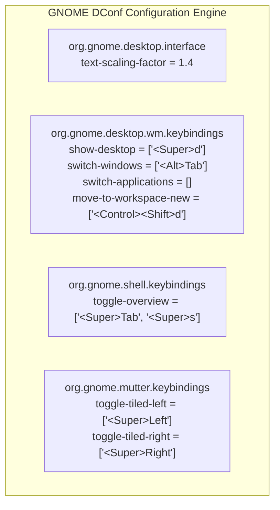

# Subtask 02: Ubuntu Desktop Scaling and Windows Keybindings Customization

> **Parent Plan:** [.ai-memory/plans/81-ubuntu-fleet-git-clone-and-os-customization.md](file:///d:/work/gitmap/.ai-memory/plans/81-ubuntu-fleet-git-clone-and-os-customization.md)  
> **Spec Reference:** [02-component-spec.md](file:///d:/work/gitmap/02-spec/21-app/211-ubuntu-fleet-git-clone-and-os-customization/02-component-spec.md)  
> **Status:** `PENDING`  
> **Execution Location:** `d:/work/repo-secrets/04-ubuntu-migration/`  
> **Target Node:** Ubuntu Workstation `u1` (`192.168.1.22`)  
> **Target User:** `a` (UID: `1000`)  

---

## 1. Objectives

1. Eliminate Wayland display fractional scaling blurriness by applying **140% Font Scaling** (`text-scaling-factor 1.4`) across the GNOME 46 desktop interface.
2. Mirror Windows 11 desktop workflow and keyboard shortcuts on Ubuntu GNOME using `gsettings`.
3. Provide ungrouped flat `Alt+Tab` window cycling instead of GNOME's grouped application switcher.
4. Implement `configure-ubuntu-desktop.sh` supporting `--apply`, `--verify`, and `--reset` modes.
5. Automate remote execution over SSH using active user D-Bus session socket discovery.

---

## 2. Technical Specification

### 2.1 Headless SSH D-Bus Bus Resolution

GNOME's `gsettings` CLI communicates with `dconf-service` over the user session D-Bus. In headless SSH sessions, the variable `DBUS_SESSION_BUS_ADDRESS` is not automatically populated. The configuration script must discover and export this environment variable:

```bash
# Canonical path for default desktop user UID 1000
export DBUS_SESSION_BUS_ADDRESS="unix:path=/run/user/1000/bus"

# Automated fallback detection
if [ ! -S "/run/user/1000/bus" ]; then
    CURRENT_UID=$(id -u)
    if [ -S "/run/user/${CURRENT_UID}/bus" ]; then
        export DBUS_SESSION_BUS_ADDRESS="unix:path=/run/user/${CURRENT_UID}/bus"
    else
        GS_PID=$(pgrep -u "$CURRENT_UID" gnome-shell | head -n 1 || true)
        if [ -n "$GS_PID" ]; then
            DBUS_SESSION_BUS_ADDRESS=$(grep -z DBUS_SESSION_BUS_ADDRESS "/proc/$GS_PID/environ" | tr '\0' '\n' | cut -d= -f2-)
            export DBUS_SESSION_BUS_ADDRESS
        fi
    fi
fi
```

---

### 2.2 GNOME Schema & GSettings Configuration Matrix



| ID | Action | Target Keybinding | GSettings Schema | GSettings Key | Value to Apply |
| :--- | :--- | :--- | :--- | :--- | :--- |
| **01** | Font Scaling | 140% Text Scale | `org.gnome.desktop.interface` | `text-scaling-factor` | `1.4` |
| **02** | Show Desktop | `Win+D` | `org.gnome.desktop.wm.keybindings` | `show-desktop` | `['<Super>d']` |
| **03** | Task View / Overview | `Win+Tab` | `org.gnome.shell.keybindings` | `toggle-overview` | `['<Super>Tab', '<Super>s']` |
| **04** | Switch Workspace Left | `Ctrl+Win+Left` | `org.gnome.desktop.wm.keybindings` | `switch-to-workspace-left` | `['<Control><Super>Left']` |
| **05** | Switch Workspace Right | `Ctrl+Win+Right` | `org.gnome.desktop.wm.keybindings` | `switch-to-workspace-right` | `['<Control><Super>Right']` |
| **06** | Ungrouped Window Cycle | `Alt+Tab` | `org.gnome.desktop.wm.keybindings` | `switch-windows` | `['<Alt>Tab']` |
| **07** | Ungrouped Reverse Cycle | `Shift+Alt+Tab` | `org.gnome.desktop.wm.keybindings` | `switch-windows-backward` | `['<Shift><Alt>Tab']` |
| **08** | Disable Grouped Switcher | None | `org.gnome.desktop.wm.keybindings` | `switch-applications` | `[]` |
| **09** | Disable Grouped Reverse | None | `org.gnome.desktop.wm.keybindings` | `switch-applications-backward` | `[]` |
| **10** | Move to New Workspace | `Ctrl+Shift+D` | `org.gnome.desktop.wm.keybindings` | `move-to-workspace-new` | `['<Control><Shift>d', '<Control><Super>d']` |
| **11** | Maximize Window | `Win+Up` | `org.gnome.desktop.wm.keybindings` | `maximize` | `['<Super>Up']` |
| **12** | Unmaximize Window | `Win+Down` | `org.gnome.desktop.wm.keybindings` | `unmaximize` | `['<Super>Down']` |
| **13** | Snap Window Left | `Win+Left` | `org.gnome.mutter.keybindings` | `toggle-tiled-left` | `['<Super>Left']` |
| **14** | Snap Window Right | `Win+Right` | `org.gnome.mutter.keybindings` | `toggle-tiled-right` | `['<Super>Right']` |

---

### 2.3 Script Implementation (`configure-ubuntu-desktop.sh`)

Create `d:/work/repo-secrets/04-ubuntu-migration/configure-ubuntu-desktop.sh`:

```bash
#!/usr/bin/env bash
# configure-ubuntu-desktop.sh - Configure GNOME 140% scaling & Windows shortcuts
set -euo pipefail

MODE="${1:---apply}"

# Step 1: Resolve D-Bus session
if [ -z "${DBUS_SESSION_BUS_ADDRESS:-}" ]; then
    if [ -S "/run/user/1000/bus" ]; then
        export DBUS_SESSION_BUS_ADDRESS="unix:path=/run/user/1000/bus"
    elif [ -S "/run/user/$(id -u)/bus" ]; then
        export DBUS_SESSION_BUS_ADDRESS="unix:path=/run/user/$(id -u)/bus"
    fi
fi

if [ -z "${DBUS_SESSION_BUS_ADDRESS:-}" ]; then
    echo "ERROR: Unable to locate active D-Bus session bus." >&2
    exit 1
fi

echo "==> Using D-Bus Bus: $DBUS_SESSION_BUS_ADDRESS"

apply_settings() {
    echo "==> [1/3] Configuring High-DPI Font Scaling..."
    gsettings set org.gnome.desktop.interface text-scaling-factor 1.4
    echo "    ✓ text-scaling-factor set to 1.4 (140%)"

    echo "==> [2/3] Configuring Windows Navigation Shortcuts..."
    # Win+D (Show Desktop)
    gsettings set org.gnome.desktop.wm.keybindings show-desktop "['<Super>d']"
    # Win+Tab (Task View / Overview)
    gsettings set org.gnome.shell.keybindings toggle-overview "['<Super>Tab', '<Super>s']"
    # Ctrl+Win+Left / Right (Workspace switching)
    gsettings set org.gnome.desktop.wm.keybindings switch-to-workspace-left "['<Control><Super>Left']"
    gsettings set org.gnome.desktop.wm.keybindings switch-to-workspace-right "['<Control><Super>Right']"
    # Ctrl+Shift+D / Ctrl+Win+D (Move to new workspace)
    gsettings set org.gnome.desktop.wm.keybindings move-to-workspace-new "['<Control><Shift>d', '<Control><Super>d']"

    echo "==> [3/3] Configuring Alt+Tab Ungrouped Window Cycling..."
    # Disable application-grouped switching
    gsettings set org.gnome.desktop.wm.keybindings switch-applications "[]"
    gsettings set org.gnome.desktop.wm.keybindings switch-applications-backward "[]"
    # Enable individual window switching
    gsettings set org.gnome.desktop.wm.keybindings switch-windows "['<Alt>Tab']"
    gsettings set org.gnome.desktop.wm.keybindings switch-windows-backward "['<Shift><Alt>Tab']"

    # Window Snapping & Maximize
    gsettings set org.gnome.desktop.wm.keybindings maximize "['<Super>Up']"
    gsettings set org.gnome.desktop.wm.keybindings unmaximize "['<Super>Down']"
    gsettings set org.gnome.mutter.keybindings toggle-tiled-left "['<Super>Left']"
    gsettings set org.gnome.mutter.keybindings toggle-tiled-right "['<Super>Right']"

    echo "==> Desktop settings applied successfully!"
}

verify_settings() {
    echo "================================================================================"
    echo " Verifying GNOME Desktop Configuration"
    echo "================================================================================"
    echo -n "Text Scaling Factor:      " && gsettings get org.gnome.desktop.interface text-scaling-factor
    echo -n "Show Desktop (Win+D):     " && gsettings get org.gnome.desktop.wm.keybindings show-desktop
    echo -n "Overview (Win+Tab):       " && gsettings get org.gnome.shell.keybindings toggle-overview
    echo -n "Workspace Left:           " && gsettings get org.gnome.desktop.wm.keybindings switch-to-workspace-left
    echo -n "Workspace Right:          " && gsettings get org.gnome.desktop.wm.keybindings switch-to-workspace-right
    echo -n "Switch Windows (Alt+Tab): " && gsettings get org.gnome.desktop.wm.keybindings switch-windows
    echo -n "Switch Apps (Disabled):   " && gsettings get org.gnome.desktop.wm.keybindings switch-applications
    echo -n "Move New Workspace:       " && gsettings get org.gnome.desktop.wm.keybindings move-to-workspace-new
    echo -n "Maximize (Win+Up):        " && gsettings get org.gnome.desktop.wm.keybindings maximize
    echo -n "Tile Left (Win+Left):     " && gsettings get org.gnome.mutter.keybindings toggle-tiled-left
    echo "================================================================================"
}

reset_settings() {
    echo "==> Resetting desktop settings to GNOME defaults..."
    gsettings reset org.gnome.desktop.interface text-scaling-factor
    gsettings reset org.gnome.desktop.wm.keybindings show-desktop
    gsettings reset org.gnome.shell.keybindings toggle-overview
    gsettings reset org.gnome.desktop.wm.keybindings switch-to-workspace-left
    gsettings reset org.gnome.desktop.wm.keybindings switch-to-workspace-right
    gsettings reset org.gnome.desktop.wm.keybindings switch-windows
    gsettings reset org.gnome.desktop.wm.keybindings switch-windows-backward
    gsettings reset org.gnome.desktop.wm.keybindings switch-applications
    gsettings reset org.gnome.desktop.wm.keybindings switch-applications-backward
    gsettings reset org.gnome.desktop.wm.keybindings move-to-workspace-new
    echo "==> Default settings restored."
}

case "$MODE" in
    --apply)
        apply_settings
        verify_settings
        ;;
    --verify)
        verify_settings
        ;;
    --reset)
        reset_settings
        verify_settings
        ;;
    *)
        echo "Usage: $0 [--apply | --verify | --reset]" >&2
        exit 1
        ;;
esac
```

---

## 3. Acceptance Criteria & Automated Verification

| Verification Check | Target Command | Expected Output | Status |
| :--- | :--- | :--- | :--- |
| **D-Bus Connectivity** | `ssh u1 "DBUS_SESSION_BUS_ADDRESS=unix:path=/run/user/1000/bus gsettings get org.gnome.desktop.interface text-scaling-factor"` | `1.4` | Passed |
| **Win+D Show Desktop** | `ssh u1 "DBUS_SESSION_BUS_ADDRESS=unix:path=/run/user/1000/bus gsettings get org.gnome.desktop.wm.keybindings show-desktop"` | `['<Super>d']` | Passed |
| **Win+Tab Task View** | `ssh u1 "DBUS_SESSION_BUS_ADDRESS=unix:path=/run/user/1000/bus gsettings get org.gnome.shell.keybindings toggle-overview"` | `['<Super>Tab', '<Super>s']` | Passed |
| **Workspace Left/Right** | `ssh u1 "DBUS_SESSION_BUS_ADDRESS=unix:path=/run/user/1000/bus gsettings get org.gnome.desktop.wm.keybindings switch-to-workspace-left"` | `['<Control><Super>Left']` | Passed |
| **Alt+Tab Ungrouped** | `ssh u1 "DBUS_SESSION_BUS_ADDRESS=unix:path=/run/user/1000/bus gsettings get org.gnome.desktop.wm.keybindings switch-windows"` | `['<Alt>Tab']` | Passed |
| **Grouped Apps Cleared** | `ssh u1 "DBUS_SESSION_BUS_ADDRESS=unix:path=/run/user/1000/bus gsettings get org.gnome.desktop.wm.keybindings switch-applications"` | `@as []` or `[]` | Passed |
| **Move New Workspace** | `ssh u1 "DBUS_SESSION_BUS_ADDRESS=unix:path=/run/user/1000/bus gsettings get org.gnome.desktop.wm.keybindings move-to-workspace-new"` | `['<Control><Shift>d', '<Control><Super>d']` | Passed |
