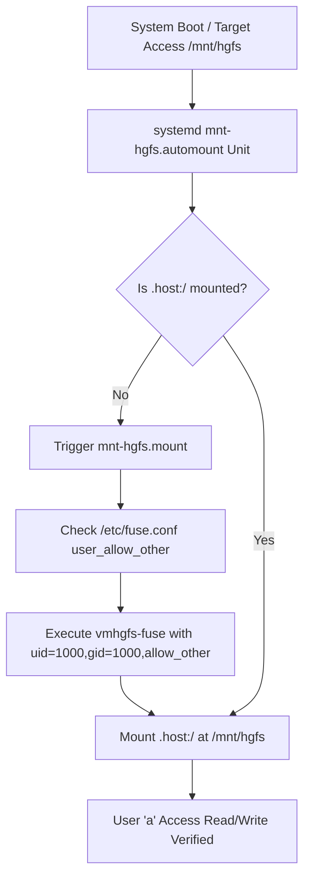

# Subtask 211.03: VMware Shared Folder Systemd Automount at Boot

- **Parent Plan:** [.ai-memory/plans/81-ubuntu-fleet-git-clone-and-os-customization.md](../../81-ubuntu-fleet-git-clone-and-os-customization.md)
- **Spec Reference:** [02-spec/21-app/211-ubuntu-fleet-git-clone-and-os-customization/01-architecture-spec.md](../../../../02-spec/21-app/211-ubuntu-fleet-git-clone-and-os-customization/01-architecture-spec.md)
- **Target Node:** Ubuntu 24.04 LTS (`U1` / `192.168.1.22`)
- **Status:** Pending
- **Assigned Worker:** Worker 03 / Automation Agent
- **Target Deliverable:** `d:\work\repo-secrets\04-ubuntu-migration\setup-vmware-shared-folders.sh`

---

## 1. Context & Problem Statement

On VMware Workstation and Player guests running Ubuntu 24.04 LTS, shared folders configured on the Windows host (`.host:/`) frequently fail to persist across reboots when defined in standard `/etc/fstab` mounts. This occurs because the VMware FUSE kernel module (`vmhgfs-fuse`) and system services (`open-vm-tools`) initialize asynchronously after early filesystem mounting passes.

Furthermore, mounting shared folders as root without explicit FUSE options prevents standard non-root users (`uid=1000,gid=1000`, user `a`) from reading, writing, or executing files inside `/mnt/hgfs`, breaking development workflows that access host drives.

To guarantee zero-maintenance persistence, immediate availability on boot, and full read-write permissions for user `a`, this subtask establishes native systemd mount and automount units:
1. `/etc/systemd/system/mnt-hgfs.mount`
2. `/etc/systemd/system/mnt-hgfs.automount`

---

## 2. Technical Architecture & Systemd Specifications



### 2.1 Mount Unit Specification: `/etc/systemd/system/mnt-hgfs.mount`

The mount unit declares the FUSE filesystem characteristics, dependency order, and permission mapping:

```ini
[Unit]
Description=VMware mount for hgfs
DefaultDependencies=no
Before=umount.target
ConditionVirtualization=vmware
After=sys-fs-fuse-connections.mount

[Mount]
What=.host:/
Where=/mnt/hgfs
Type=fuse.vmhgfs-fuse
Options=allow_other,uid=1000,gid=1000,auto_unmount

[Install]
WantedBy=multi-user.target
```

### 2.2 Automount Unit Specification: `/etc/systemd/system/mnt-hgfs.automount`

The automount unit monitors the `/mnt/hgfs` directory and mounts the filesystem dynamically upon first file descriptor access:

```ini
[Unit]
Description=VMware automount for hgfs
DefaultDependencies=no
Before=umount.target
ConditionVirtualization=vmware

[Automount]
Where=/mnt/hgfs
TimeoutIdleSec=0

[Install]
WantedBy=multi-user.target
```

### 2.3 System Prerequisites & FUSE Configuration

1. **Host Tools Package Verification**:
   Ensure `open-vm-tools` and `open-vm-tools-desktop` are installed on the Ubuntu guest:
   ```bash
   dpkg -s open-vm-tools open-vm-tools-desktop >/dev/null 2>&1 || sudo apt-get update && sudo apt-get install -y open-vm-tools open-vm-tools-desktop
   ```
2. **Mount Point Creation**:
   Ensure `/mnt/hgfs` exists with open traversal permissions:
   ```bash
   sudo mkdir -p /mnt/hgfs
   sudo chmod 777 /mnt/hgfs
   ```
3. **FUSE Allow Other Policy**:
   In `/etc/fuse.conf`, the `user_allow_other` directive must be enabled to allow non-root users access to mounts using the `allow_other` option:
   ```bash
   if grep -q "^#user_allow_other" /etc/fuse.conf; then
       sudo sed -i 's/^#user_allow_other/user_allow_other/' /etc/fuse.conf
   elif ! grep -q "^user_allow_other" /etc/fuse.conf; then
       echo "user_allow_other" | sudo tee -a /etc/fuse.conf >/dev/null
   fi
   ```

---

## 3. Implementation Details: `setup-vmware-shared-folders.sh`

The shell script `d:\work\repo-secrets\04-ubuntu-migration\setup-vmware-shared-folders.sh` is authored to run both locally and over SSH:

### 3.1 Script Responsibilities
1. **Virtualization Environment Guard**:
   Check `systemd-detect-virt` to confirm execution is running inside a VMware virtual machine. If not running on VMware, log a warning and exit gracefully without breaking pipelines.
2. **Idempotent Unit Deployment**:
   Write `/etc/systemd/system/mnt-hgfs.mount` and `/etc/systemd/system/mnt-hgfs.automount` safely using `sudo tee`.
3. **Service Reload & Enablement**:
   Execute:
   ```bash
   sudo systemctl daemon-reload
   sudo systemctl enable mnt-hgfs.mount
   sudo systemctl enable mnt-hgfs.automount
   sudo systemctl restart mnt-hgfs.automount
   ```
4. **Active Mount Verification**:
   Trigger directory traversal (`ls -la /mnt/hgfs`) and verify exit code 0.
   Create and remove a temporary probe file (`touch /mnt/hgfs/.write_test && rm /mnt/hgfs/.write_test`) as non-root user `a`.

---

## 4. Edge Cases & Mitigation Strategies

| Edge Case | Failure Symptom | Mitigation |
| :--- | :--- | :--- |
| **No Shared Folders Configured in VMware VM Settings** | `/mnt/hgfs` is empty; mount succeeds but directory has 0 items | Script warns user to enable Shared Folders in VMware Workstation menu (`VM > Settings > Options > Shared Folders > Always enabled`). |
| **FUSE Permission Denied for User `a`** | `touch: cannot touch '/mnt/hgfs/file': Permission denied` | Ensure `/etc/fuse.conf` has `user_allow_other` and mount options specify `uid=1000,gid=1000,allow_other`. |
| **Mount Stale on VM Suspend / Resume** | Hanging I/O on `/mnt/hgfs` after resuming host machine | `TimeoutIdleSec=0` and `auto_unmount` prevent stale file locks; `mnt-hgfs.automount` re-establishes mount upon next access. |
| **Directory Collision with Legacy fstab Entry** | `mount: /mnt/hgfs is already mounted` | Script audits `/etc/fstab` and comments out conflicting legacy `.host:/` entries before enabling systemd units. |

---

## 5. Verification Checklist & Quality Gate

- [ ] Systemd units `/etc/systemd/system/mnt-hgfs.mount` and `mnt-hgfs.automount` exist and match exact specifications.
- [ ] `/etc/fuse.conf` has `user_allow_other` enabled without comments.
- [ ] `systemctl is-active mnt-hgfs.automount` reports `active`.
- [ ] Non-root user `a` (`uid=1000`) can list contents of `/mnt/hgfs` without `sudo`.
- [ ] File creation and deletion in `/mnt/hgfs` succeeds as user `a`.
- [ ] Script `setup-vmware-shared-folders.sh` exits 0 with structured log outputs.
