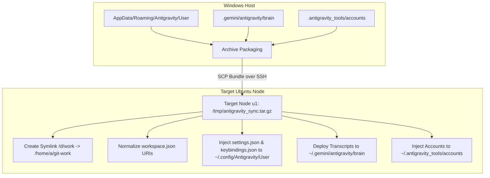

# Subtask 211.04: Cross-OS Antigravity Settings, Keybindings & Conversation Sync

- **Parent Plan:** [.ai-memory/plans/81-ubuntu-fleet-git-clone-and-os-customization.md](../../81-ubuntu-fleet-git-clone-and-os-customization.md)
- **Spec Reference:** [02-spec/21-app/211-ubuntu-fleet-git-clone-and-os-customization/01-architecture-spec.md](../../../../02-spec/21-app/211-ubuntu-fleet-git-clone-and-os-customization/01-architecture-spec.md)
- **Target Node:** Ubuntu 24.04 LTS (`U1` / `192.168.1.22`)
- **Status:** Pending
- **Assigned Worker:** Worker 04 / Environment Sync Agent
- **Target Deliverables:** `d:\work\repo-secrets\04-ubuntu-migration\sync-antigravity-settings.sh`, `d:\work\repo-secrets\04-ubuntu-migration\sync-antigravity-settings.ps1`

---

## 1. Context & Problem Statement

When transitioning development workflows from Windows 11 to remote Ubuntu 24.04 (`U1`), developer muscle memory, workspace layouts, and active AI pairing history must remain continuous. 

On Windows, the Antigravity IDE and agent ecosystem store configuration across:
1. User IDE preferences: `%APPDATA%\Antigravity\User\settings.json` and `keybindings.json`
2. Workspace state indices: `%APPDATA%\Antigravity\User\workspaceStorage/*/workspace.json`
3. Brain conversation transcripts & artifacts: `~/.gemini/antigravity/brain/`
4. Account tokens & dual licenses: `C:\Users\Administrator\.antigravity_tools\accounts\` and `licenses\`

Directly copying these files to Ubuntu introduces two critical breaking failures:
1. **URI Path Incompatibility**: Windows paths are formatted as `file:///d:/work/<repo>` or `D:\work\<repo>`. On Ubuntu, all repositories reside in `/home/a/git-work/<repo>`. Unadjusted `workspace.json` files cause Antigravity to fail opening recent workspaces or crash state deserialization.
2. **Absolute Path Hardcoding in Agent Transcripts**: Historical transcripts and tool arguments frequently contain hardcoded `/d/work/...` references. If `/d/work` does not exist on Linux, retrospective inspections fail.

---

## 2. Technical Architecture & Data Normalization



### 2.1 System Root Symlink Architecture

To guarantee total backward and cross-platform compatibility for scripts, tool calls, and transcript links referencing `/d/work`, a system-level symlink is created on Ubuntu:

```bash
# Ensure /d directory exists
sudo mkdir -p /d
# Point /d/work directly to the canonical Linux work directory
sudo ln -sfn /home/a/git-work /d/work
# Ensure permissions allow user 'a' unrestricted access
sudo chown -h a:a /d/work
```

With this symlink in place:
- Path `/d/work/gitmap` resolves directly to `/home/a/git-work/gitmap`.
- Shell commands and scripts referencing `/d/work` execute transparently without path rewriting.

### 2.2 Workspace Storage Normalization Specification

Every `workspace.json` file inside `~/.config/Antigravity/User/workspaceStorage/` contains a JSON payload specifying the folder URI:

**Windows Input Format:**
```json
{
  "folder": "file:///d:/work/gitmap"
}
```

**Target Linux Output Format:**
```json
{
  "folder": "file:///home/a/git-work/gitmap"
}
```

#### Normalization Rule
The normalization engine iterates over all `workspace.json` files and performs case-insensitive regex substitution:
- Regex Pattern: `(?i)file:///d:/work/`
- Replacement: `file:///home/a/git-work/`
- Also normalizes Windows backslash variants if present: `file:///d%3A/work/` -> `file:///home/a/git-work/`

### 2.3 IDE Settings & Keybindings Migration

Linux Antigravity expects user settings under:
- `~/.config/Antigravity/User/settings.json`
- `~/.config/Antigravity/User/keybindings.json`

#### Required Adjustments in `settings.json`:
1. **Terminal Profile Default**: Set default integrated terminal to Linux bash or pwsh:
   ```json
   "terminal.integrated.defaultProfile.linux": "bash"
   ```
2. **Path Separators**: Normalize any configured tools or formatter paths from Windows executables (`.exe`) to Linux binary paths in `/home/a/.local/bin` or `/usr/local/bin`.

---

## 3. Implementation Details: Runner Scripts

### 3.1 Windows Packager & Dispatcher: `sync-antigravity-settings.ps1`
Location: `d:\work\repo-secrets\04-ubuntu-migration\sync-antigravity-settings.ps1`

Responsibilities:
1. Locate source directories:
   - `$env:APPDATA\Antigravity\User`
   - `$HOME\.gemini\antigravity\brain`
   - `C:\Users\Administrator\.antigravity_tools\accounts`
2. Assemble staging payload archive `antigravity-sync-bundle.tar.gz`.
3. Transfer archive to `u1:/tmp/antigravity-sync-bundle.tar.gz` via `scp`.
4. Transfer `sync-antigravity-settings.sh` to `u1:/tmp/sync-antigravity-settings.sh`.
5. Execute `ssh u1 "bash /tmp/sync-antigravity-settings.sh"` and capture status.

### 3.2 Linux Deployer & Normalizer: `sync-antigravity-settings.sh`
Location: `d:\work\repo-secrets\04-ubuntu-migration\sync-antigravity-settings.sh`

Responsibilities:
1. Extract `/tmp/antigravity-sync-bundle.tar.gz` into staging directory.
2. Establish `/d/work` symlink via `sudo ln -sfn /home/a/git-work /d/work`.
3. Deploy `settings.json` and `keybindings.json` to `~/.config/Antigravity/User/`.
4. Deploy `workspaceStorage` directory and execute Python/jq normalization on all `workspace.json` files.
5. Deploy `brain` conversation transcripts to `~/.gemini/antigravity/brain/`.
6. Enforce strict permissions (`chmod 600` for token profiles and accounts).

---

## 4. Edge Cases & Mitigation Strategies

| Edge Case | Failure Symptom | Mitigation |
| :--- | :--- | :--- |
| **Existing Target `workspaceStorage` Overwrite** | Loss of Ubuntu-specific workspace states | Merge workspace storage folders rather than deleting the entire directory. Match workspace folder hashes. |
| **Missing Root `/d` Directory Permissions** | `ln: failed to create symbolic link '/d/work': Permission denied` | Use `sudo mkdir -p /d && sudo ln -sfn /home/a/git-work /d/work && sudo chown -h a:a /d/work`. |
| **Malformed JSON in `workspace.json`** | Antigravity crashes on startup | Validate each normalized file with `jq . workspace.json > /dev/null` before replacing the target file. |
| **Font Family Missing on Ubuntu** | Terminal or editor fonts fallback to generic monospace | Install recommended developer fonts (`fonts-firacode`, `fonts-jetbrains-mono`) during provisioning. |

---

## 5. Verification Checklist & Quality Gate

- [ ] `/d/work` exists on Ubuntu as a symlink pointing to `/home/a/git-work`.
- [ ] `ls /d/work` lists all cloned work repositories.
- [ ] `~/.config/Antigravity/User/settings.json` exists and is valid JSON.
- [ ] Every `workspace.json` under `~/.config/Antigravity/User/workspaceStorage/` contains `file:///home/a/git-work/...` and 0 occurrences of `file:///d:/work/`.
- [ ] Conversation transcripts in `~/.gemini/antigravity/brain/` are present and readable by user `a`.
- [ ] `sync-antigravity-settings.ps1` runs idempotently with exit code 0.
