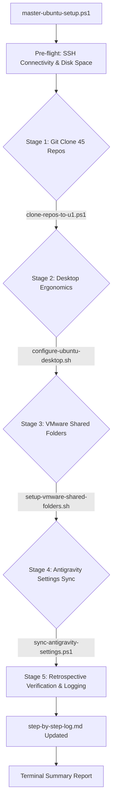

# Subtask 211.05: Unified Orchestration Script, Engineering Log & Full OS Setup Blueprint

- **Parent Plan:** [.ai-memory/plans/81-ubuntu-fleet-git-clone-and-os-customization.md](../../81-ubuntu-fleet-git-clone-and-os-customization.md)
- **Spec Reference:** [02-spec/21-app/211-ubuntu-fleet-git-clone-and-os-customization/01-architecture-spec.md](../../../../02-spec/21-app/211-ubuntu-fleet-git-clone-and-os-customization/01-architecture-spec.md)
- **Target Node:** Ubuntu 24.04 LTS (`U1` / `192.168.1.22`)
- **Status:** Pending
- **Assigned Worker:** Worker 05 / Orchestration & Documentation Lead
- **Target Deliverables:**
  - `d:\work\repo-secrets\04-ubuntu-migration\master-ubuntu-setup.ps1`
  - `d:\work\repo-secrets\04-ubuntu-migration\step-by-step-log.md`
  - `02-spec/21-app/211-ubuntu-fleet-git-clone-and-os-customization/02-full-os-setup-blueprint.md`

---

## 1. Context & Purpose

Achieving complete fleet automation and workstation equivalence across Windows 11 and Ubuntu 24.04 requires:
1. A single unified entry-point command that orchestrates all stages sequentially with error containment and stage-skipping switches.
2. A comprehensive, timestamped engineering log documenting exact commands, outputs, RCA investigations, and verification traces.
3. A future-proof Full OS Setup Blueprint detailing application suites, developer tools, window manager customization, themes, and background services necessary to turn any clean Ubuntu installation into a high-productivity workstation.

---

## 2. Technical Architecture & Unified Pipeline



### 2.1 Master Orchestrator Specification: `master-ubuntu-setup.ps1`
Location: `d:\work\repo-secrets\04-ubuntu-migration\master-ubuntu-setup.ps1`

#### CLI Parameters
```powershell
[CmdletBinding()]
param(
    [string]$TargetHost = "192.168.1.22",
    [string]$TargetUser = "a",
    [int]$Port = 22,
    [string]$SshKey = "",
    [switch]$SkipClone,
    [switch]$SkipDesktop,
    [switch]$SkipVmware,
    [switch]$SkipAntigravity,
    [switch]$DryRun
)
```

#### Orchestration Stages
1. **Pre-flight Check**:
   - Tests TCP 22 connectivity to `$TargetHost`.
   - Validates passwordless SSH key authentication using `ssh -o BatchMode=yes u1 "echo OK"`.
   - Verifies available disk space on target (`/home/a` has at least 20 GB free).
2. **Stage 1 (Git Repositories Sync)**:
   - If `-not $SkipClone`: invokes `.\clone-repos-to-u1.ps1` to ensure all 71 repositories exist in `/home/a/git-work`.
3. **Stage 2 (Desktop Ergonomics & Keybindings)**:
   - If `-not $SkipDesktop`: transfers and runs `configure-ubuntu-desktop.sh` setting 140% font scaling, `Win+D`, `Win+Tab`, `Ctrl+Win+Left/Right`, and ungrouped `Alt+Tab`.
4. **Stage 3 (VMware Shared Folders)**:
   - If `-not $SkipVmware`: transfers and runs `setup-vmware-shared-folders.sh` to configure and activate `mnt-hgfs.mount` and `mnt-hgfs.automount`.
5. **Stage 4 (Antigravity Environment Sync)**:
   - If `-not $SkipAntigravity`: transfers and runs `sync-antigravity-settings.ps1` to link `/d/work`, copy user settings, normalize `workspace.json` URIs, and migrate transcripts.
6. **Stage 5 (Verification & Health Assessment)**:
   - Runs cross-subsystem verification commands and prints colorized pass/fail scorecard.
   - Appends execution metrics to `step-by-step-log.md`.

---

## 3. Engineering Log Specification: `step-by-step-log.md`
Location: `d:\work\repo-secrets\04-ubuntu-migration\step-by-step-log.md`

The engineering log is structured to record:
1. **Executive Session Metadata**: Date, duration, source node, target node, git commit reference, operator.
2. **Chronological Execution Steps**: Every dispatched script, arguments, remote command executed, duration, and exit code.
3. **Telemetry & Outputs**: Standard output summaries, directory listings, and environment variable states.
4. **Root Cause Analysis (RCA)**: For any unexpected behavior encountered during execution (e.g. D-Bus session bus targeting over SSH, FUSE permission denied, font rasterization artifacts).
5. **Final Verification Matrix**: Granular status table verifying each of the 6 acceptance criteria.

---

## 4. Future Full OS Setup Blueprint

Documented in [02-spec/21-app/211-ubuntu-fleet-git-clone-and-os-customization/02-full-os-setup-blueprint.md](../../../../02-spec/21-app/211-ubuntu-fleet-git-clone-and-os-customization/02-full-os-setup-blueprint.md), the blueprint covers:

### 4.1 System Foundation & Core Toolchains
- **Base Utilities**: `build-essential`, `curl`, `wget`, `jq`, `unzip`, `htop`, `tmux`, `git`, `zsh`
- **Languages & Runtimes**:
  - Golang: Go 1.23+ installed to `/usr/local/go`, `GOPATH=$HOME/go`, `PATH=$PATH:$GOPATH/bin`
  - Python: `python3.12`, `python3-pip`, `pipx`, `uv`
  - Node.js: `nvm` or `fnm` with latest LTS and `pnpm`
  - Rust: `rustup` toolchain with `cargo`
- **Containers**: Docker CE + Docker Compose plugin, configured with `sudo usermod -aG docker a`

### 4.2 Desktop & Visual Ergonomics
- **Terminal**: Alacritty or WezTerm with GPU acceleration and JetBrains Mono Nerd Font
- **Shell**: Oh My Posh / Starship prompt with GitMap status indicator
- **GNOME Shell Customizations**:
  - Extensions: `AppIndicator/KStatusNotifierItem`, `Dash to Panel`, `Blur my Shell`
  - Theme: Yaru-dark or Dracula GTK theme
  - Wallpaper & Lock Screen consistency
- **Screenshot Tool**: `flameshot` mapped to `PrintScreen` with automatic clipboard copy

### 4.3 Productivity & Communication
- **Browsers**: Google Chrome (deb package) and Brave
- **Communication**: Telegram Desktop, Slack, Discord
- **Note Taking & Knowledge**: Obsidian with Git synchronization

### 4.4 Automation & Background Services
- **GitMap Daemon**: Native systemd user service `gitmap-agent.service` for telemetry and cluster coordination
- **SSH Agent Forwarding**: Automated `ssh-agent` startup via `~/.bashrc` / systemd user session
- **Automated Backup**: Nightly rsync of critical config files to VMware shared folder `/mnt/hgfs/backups/`

---

## 5. Verification Checklist & Quality Gate

- [ ] `master-ubuntu-setup.ps1` exists, supports all switches (`-SkipClone`, `-SkipDesktop`, etc.), and passes PowerShell syntax validation.
- [ ] `step-by-step-log.md` is initialized in `d:\work\repo-secrets\04-ubuntu-migration\` with full structure.
- [ ] `02-full-os-setup-blueprint.md` is authored and linked in specification index.
- [ ] End-to-end execution of `master-ubuntu-setup.ps1` succeeds across all active stages.
- [ ] Comprehensive verification report outputs green status for all acceptance criteria.
