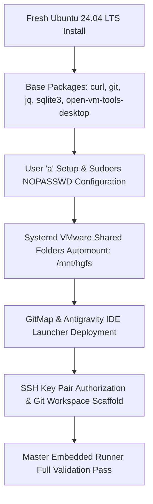

# Subtask 212.5: Detailed Engineering Log V2 & Full OS Setup Blueprint

- **Parent Plan:** [212-ubuntu-fleet-full-customization-and-embedded-runner.md](../../pending/212-ubuntu-fleet-full-customization-and-embedded-runner.md)
- **Spec Reference:** [02-spec/21-app/212-ubuntu-fleet-full-customization-and-embedded-runner/01-architecture-spec.md](../../../../02-spec/21-app/212-ubuntu-fleet-full-customization-and-embedded-runner/01-architecture-spec.md)
- **Status:** Pending
- **Target Area:** `docs/step-by-step-log-v2.md`, `docs/ubuntu-fleet-os-blueprint.md`, `docs/`

---

## 1. Context & Objective

Establishing reproducible standards for multi-node Linux developer workstations requires rigorous documentation of configuration choices, root-cause analyses, operational lessons learned, and an automated blueprint for provisioning future nodes (`U2`, `U3`, etc.).

The objective is to author:
1. `docs/step-by-step-log-v2.md`: A comprehensive, chronological engineering log documenting every executed step, command, troubleshooting decision, and technical justification across wallpaper customization, GUI spawning, VMware shared folders, Antigravity brain synchronization, and embedded PowerShell automation.
2. Full OS Setup Blueprint & Future Roadmap: A repeatable reference architecture detailing base package requirements, permission models, systemd automount units, and next-generation fleet capabilities.

---

## 2. Engineering Log Structure (`docs/step-by-step-log-v2.md`)

The log must capture the exact technical mechanics and decisions across five phases:

### Phase 1: GNOME Desktop Wallpaper CLI
- **Challenge:** Changing GNOME wallpaper headlessly over SSH fails with `Cannot autolaunch D-Bus without X11 $DISPLAY`.
- **Solution:** Explicitly exporting `DBUS_SESSION_BUS_ADDRESS="unix:path=/run/user/1000/bus"` allows headless background workers to invoke `gsettings`.
- **Light vs. Dark Mode:** In Ubuntu 24.04 (GNOME 46), setting only `picture-uri` has no effect if the user is in dark mode (`picture-uri-dark`). Both keys must be synchronized simultaneously, with `picture-options "zoom"`.

### Phase 2: Remote GUI Application Launching
- **Challenge:** Running GUI apps (such as Antigravity IDE or GNOME Text Editor) from SSH triggers `Unable to init server: Could not connect: Connection refused` or Wayland access denials.
- **Comparison:**
  - Exporting `DISPLAY=:0` often fails due to Xauthority token mismatches or Wayland session isolation.
  - `systemd-run --user` delegates application spawning directly to the active systemd user session manager (`user@1000.service`), inheriting proper Wayland and D-Bus credentials cleanly without permission degradation.
- **Implementation:** authoring shell wrapper `/usr/local/bin/launch-gui` or invoking `systemd-run --user /usr/local/bin/antigravity <workspace-path>`.

### Phase 3: VMware Shared Folders Automount & Permissions
- **Challenge:** Static `/etc/fstab` mounts of `.host:/` fail at boot if VMware guest tools driver (`vmhgfs-fuse`) initializes after filesystem mount targets.
- **Solution:** Standardize on `/etc/systemd/system/mnt-hgfs.automount` and `mnt-hgfs.mount`, ensuring dynamic on-demand mounting whenever `/mnt/hgfs` is accessed.
- **Permissions:** Enforce mount options `allow_other,uid=1000,gid=1000,umask=022` so user `a` has unfettered read/write access to host folders without `sudo`.

### Phase 4: Antigravity Brain & SQLite Path Normalization
- **Challenge:** Windows workspace references (`d:\work\`, `file:///d%3A/work/`) serialized into SQLite databases (`conversation_summaries.db`) cause broken workspace links and history errors on Linux.
- **Solution:** Executing parameterized SQLite transactions using `REPLACE()` functions and regex-based streaming normalization across JSONL transcripts before launching the IDE.

### Phase 5: Self-Contained Embedded PowerShell Architecture
- **Challenge:** Multi-file shell script distributions suffer from CRLF corruption when checked out or transferred on Windows.
- **Solution:** Embedding all bash payloads as multi-line string templates in `master-embedded-ubuntu-runner.ps1` and streaming over SSH via `tr -d '\r' | bash -s`.

---

## 3. Full OS Setup Blueprint for Future Nodes (`U2`, `U3`, ...)

The blueprint establishes the baseline configuration for any fresh Ubuntu 24.04 LTS instance joining the GitMap cluster:



### 3.1 Base Package Manifest
```bash
sudo apt-get update && sudo apt-get install -y \
    curl \
    wget \
    git \
    jq \
    sqlite3 \
    libsecret-tools \
    open-vm-tools \
    open-vm-tools-desktop \
    gnome-shell-extension-manager \
    build-essential
```

### 3.2 Standardized Directory Layout
- Workspace Root: `/home/a/git-work/`
- Tooling Root: `/home/a/.antigravity_tools/`
- Binary Links: `/usr/local/bin/gitmap`, `/usr/local/bin/antigravity`, `/usr/local/bin/agm`
- VMware Mount: `/mnt/hgfs/`

---

## 4. Future Roadmap & Fleet Expansion

1. **Headless Virtual Wayland Framebuffer (Headless Desktop)**:
   - Configure a headless Wayland virtual display using `weston` or `gnome-kiosk` so GUI applications and automated UI tests can execute even when no physical or VMware console display session is logged in.
2. **Bidirectional Antigravity Brain Synchronization**:
   - Establish a background file watcher or cron schedule synchronizing new conversation sessions between Windows and Ubuntu nodes seamlessly.
3. **Cluster Node Telemetry in `gitmap nodes`**:
   - Extend `gitmap nodes` CLI to probe wallpaper state, active display sessions, VMware mount health, and AGM authentication status across all nodes in real time.
4. **Upstream AGM Headless Secret Service Pull Request**:
   - Implement the file-backed credential fallback in the upstream `Antigravity-Manager` Tauri backend to remove the 10-second keyring timeout permanently.

---

## 5. Remediation Checklist

- [ ] Author `docs/step-by-step-log-v2.md` documenting every command, rationale, and troubleshooting outcome across all 5 stages.
- [ ] Create `docs/ubuntu-fleet-os-blueprint.md` detailing the complete automated provisioning blueprint for future Ubuntu nodes.
- [ ] Document exact D-Bus and `systemd-run --user` requirements for remote GUI execution.
- [ ] Record VMware shared folder systemd automount configuration files and verification steps.
- [ ] Outline future roadmap milestones (virtual framebuffer, bidirectional sync, cluster telemetry).
- [ ] Cross-link documentation within [02-spec/21-app/212-ubuntu-fleet-full-customization-and-embedded-runner/01-architecture-spec.md](../../../../02-spec/21-app/212-ubuntu-fleet-full-customization-and-embedded-runner/01-architecture-spec.md).
