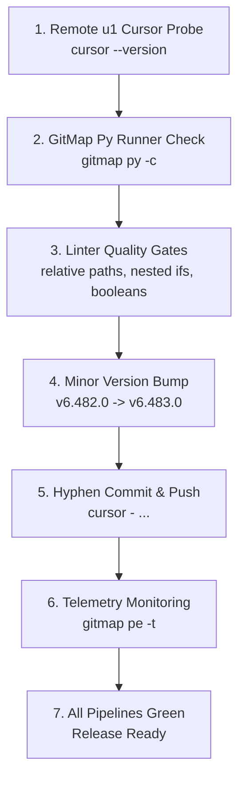

# Subtask 223.5: Remote Node U1 Testing, Linter Gates & Minor Release Ceremony

> **Subtask ID:** 223.5  
> **Target File:** `.ai-memory/plans/subtasks/223-ubuntu-cursor-gitmap-python-git-tracing-and-aum-search/05-remote-u1-testing-and-release-ceremony.md`  
> **Parent Plan:** [.ai-memory/plans/223-ubuntu-cursor-gitmap-python-git-tracing-and-aum-search.md](../../223-ubuntu-cursor-gitmap-python-git-tracing-and-aum-search.md)  
> **Spec Reference:** [02-spec/21-app/223-ubuntu-cursor-gitmap-python-git-tracing-and-aum-search/02-component-and-search-spec.md](../../../../02-spec/21-app/223-ubuntu-cursor-gitmap-python-git-tracing-and-aum-search/02-component-and-search-spec.md)  
> **Status:** Pending  
> **Target Area:** Remote Node `u1`, `03-ai-scripts/37-bump-version.py`, `linter-scripts/`, `cli/constants/constants.go`  

---

## 1. Objective

Perform complete remote fleet validation of Cursor IDE on Ubuntu node `u1`, verify Python script execution via `gitmap py`, enforce zero-defect quality linter gates, execute a minor version bump from `v6.482.0` to `v6.483.0`, commit with the required hyphen prefix (`cursor - ...`), and monitor CI/CD pipelines using `gitmap pe -t` until all runs achieve green status.

---

## 2. Scope & Prerequisites

1. **Remote Node Fleet:** Remote Ubuntu machine `u1` accessible via SSH keys.
2. **Setup Script Provisioning:** `repo-secrets/05-scripts/setup-cursor-ubuntu.sh` and Python automation scripts executed on `u1`.
3. **Working Tree Cleanliness:** All feature implementations in Wave 2 (Cursor installer, `gitmap py`, Git Split-DB tracing, AUM search quote cleaner) completed and verified.

---

## 3. Implementation Details

### Step 3.1: Remote Fleet Verification on `u1`

- Probe Cursor on `u1`:
  ```bash
  gitmap ssh exec u1 "cursor --version"
  ```
- Verify binary placement:
  ```bash
  gitmap ssh exec u1 "which cursor && ls -la /usr/local/bin/cursor /home/a/.local/bin/cursor"
  ```
- Verify headless execution flag `--no-sandbox` works under non-interactive SSH sessions without X11 display errors.
- Confirm state tracking in `repo-secrets/04-ubuntu-migration/cursor-fleet-status.json`.

### Step 3.2: Native GitMap Python Runner Validation

- Test inline Python execution:
  ```bash
  gitmap py -c "import sys; print('GitMap Python OK:', sys.version)"
  ```
- Test script file execution:
  ```bash
  gitmap py repo-secrets/05-scripts/setup-cursor-ubuntu.py --status
  ```
- Confirm execution entry appears in `CommandHistory` and AI telemetry logs.

### Step 3.3: Linter Quality Gates

Run three mandatory linters sequentially; every check must exit with code `0`:
1. **Relative Paths Linter:**
   ```bash
   python linter-scripts/check-relative-paths.py
   ```
   *Gate:* Zero absolute filesystem paths in markdown files, documentation, or specifications.
2. **Nested Ifs Policy Check:**
   ```bash
   python linter-scripts/check-nested-ifs.py
   ```
   *Gate:* Zero nested conditional statements violating guard clause conventions.
3. **Boolean Conventions Linter:**
   ```bash
   python linter-scripts/check-boolean-guidelines.py
   ```
   *Gate:* Zero negative boolean names or non-compliant boolean helpers.

### Step 3.4: Minor Version Bump Ceremony

- Execute version bump script:
  ```bash
  python 03-ai-scripts/37-bump-version.py -t minor
  ```
- Validate synchronized files:
  - `cli/constants/constants.go`: Version string bumped to `"6.483.0"`
  - `package.json`: Version updated to `"6.483.0"`
  - `readme.md`: Header and badges updated
  - `changelog.md`: New version section added with release notes

### Step 3.5: Atomic Commit & Remote Push Ceremony

- Construct commit message strictly complying with the required hyphen prefix:
  ```text
  cursor - ubuntu fleet cursor setup, gitmap py runner, git heatmap tracing, aum search unquote, release v6.483.0
  ```
- Commit and push to origin using GitMap release command.

### Step 3.6: Continuous CI/CD Pipeline Monitoring

- Launch pipeline error and progress monitor:
  ```bash
  gitmap pe -t
  ```
- Maintain monitoring loop until all GitHub Actions workflows reach `completed` with conclusion `success`.
- If failures occur, diagnose using GitMap pipeline error extraction (`gitmap pe`) and apply targeted fixes.

---

## 4. Verification & Validation Protocol



---

## 5. Execution Checklist

- [ ] Execute `gitmap ssh exec u1 "cursor --version"` and confirm output.
- [ ] Confirm `/usr/local/bin/cursor` and `/home/a/.local/bin/cursor` wrappers on `u1`.
- [ ] Verify `repo-secrets/04-ubuntu-migration/cursor-fleet-status.json` reflects verified status.
- [ ] Test `gitmap py -c` inline execution.
- [ ] Execute `python linter-scripts/check-relative-paths.py` and verify exit code `0`.
- [ ] Execute `python linter-scripts/check-nested-ifs.py` and verify exit code `0`.
- [ ] Execute `python linter-scripts/check-boolean-guidelines.py` and verify exit code `0`.
- [ ] Run `python 03-ai-scripts/37-bump-version.py -t minor`.
- [ ] Confirm `cli/constants/constants.go` reflects `6.483.0`.
- [ ] Commit with message `cursor - ...` and push.
- [ ] Run `gitmap pe -t` and observe CI/CD status until green.

---

## 6. Acceptance Criteria

- [ ] **AC-223.5-1:** Cursor executes without sandbox errors on Ubuntu node `u1` via `gitmap ssh exec u1`.
- [ ] **AC-223.5-2:** Inline Python commands execute via `gitmap py -c` and log into `CommandHistory`.
- [ ] **AC-223.5-3:** All three linters (`check-relative-paths.py`, `check-nested-ifs.py`, `check-boolean-guidelines.py`) exit cleanly with code `0`.
- [ ] **AC-223.5-4:** Version bumped to `v6.483.0` across `cli/constants/constants.go`, `package.json`, `readme.md`, and `changelog.md`.
- [ ] **AC-223.5-5:** Commit message begins with `cursor - ` format.
- [ ] **AC-223.5-6:** Pipeline monitor `gitmap pe -t` confirms CI/CD workflows pass 100% green.
