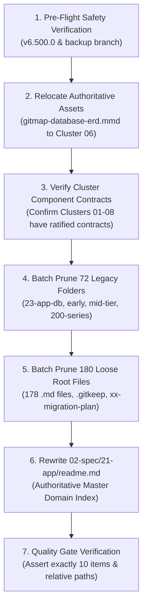

# Subtask 03: Operational Deep Consolidation of Spec Folder 21 Plan

- **Parent Plan:** [236-deep-spec-consolidation-and-canonical-reduction.md](../../236-deep-spec-consolidation-and-canonical-reduction.md)
- **Subtask ID:** `03`
- **Status:** `COMPLETED`
- **Assigned Worker:** Phase 2 Worker 01 (Synthesis: Author 01)
- **Target Scope:** `02-spec/21-app/` Complete Deep Consolidation, Folder Pruning & Canonical Reduction

---

## 1. Context & Objective

This subtask provides the concrete, step-by-step operational execution protocol for Phase 2 Worker 01 to fold all **72 surviving standalone directories** (containing 309 internal files) and **181 standalone root markdown and asset files** from `02-spec/21-app/` directly into the **8 Canonical Architecture Domain Clusters** (`01-cli-architecture` through `08-distribution-and-release`).

Upon execution, the directory will transition from 254 loose filesystem items down to **exactly 10 items** (8 Canonical Clusters + active spec folder `236-...` + 1 master `readme.md`), with zero accidental data loss, strictly relative links, and 100% compliance with the Final Version Invariant (retaining ratified architectures A, B and pruning intermediate drafts X, Y).

---

## 2. Pre-Flight Safety Verification

Before any deletion or file move operations are initiated, Worker 01 must verify all safety preconditions:

1. **Safety Backup Verification:**
   - Confirm tag `v6.500.0` is present.
   - Confirm branch `release/v6.500.0` is pushed.
   - Confirm safety backup branch `backup/pre-deep-spec-consolidation-20261006` is verified on remote origin.
2. **Active Spec Folder Protection:**
   - Confirm directory `02-spec/21-app/236-deep-spec-consolidation-and-canonical-reduction/` is present and excluded from any deletion glob.
3. **Pending Tasks Protection:**
   - Confirm `.ai-memory/plans/pending/` is excluded.
   - Confirm active open plans in `.ai-memory/plans/` are excluded.
   - Confirm active open subtask directories in `.ai-memory/plans/subtasks/` are excluded.
4. **Pre-flight Boolean Guard:**
   - `isBackupVerified: true`
   - `isActiveSpecProtected: true`
   - `isPendingIsolated: true`

---

## 3. Step-by-Step Execution Protocol

### Step 1: Relocate Standalone Authoritative Assets
Prior to any batch deletions, preserve any authoritative visual diagrams or assets located in the root of `02-spec/21-app/`:
- **Database ERD Diagram:** Copy/relocate `02-spec/21-app/gitmap-database-erd.mmd` into `02-spec/21-app/06-database-and-split-db/gitmap-database-erd.mmd`.
- **Validation:** Confirm `02-spec/21-app/06-database-and-split-db/gitmap-database-erd.mmd` is valid and accessible.

### Step 2: Verify Cluster Component Contracts
Verify that each of the 8 canonical cluster specifications (`01-architecture-spec.md` and `02-component-spec.md`) catalogs all ratified Go types, CLI flags, SQLite tables, and operational workflows originally dispersed across legacy specs:
- **`01-cli-architecture/`:** Cobra command trees, typed JSON Envelope V2, help formatting, ANSI tables, typo suggestions, Win32 CP handoff.
- **`02-scanner-and-projects/`:** Discovery pools, `.gitmapignore` engine, AUM indexing, zero-allocation `strutil.EqualFoldAnyTrim` path normalizer.
- **`03-git-operations-and-pull/`:** 8-worker goroutine semaphore pool, Split-DB advisory locking, `gitmap commit` semantic flat commit suite, push self-healing.
- **`04-fleet-nodes-and-ssh/`:** Unified `gitmap nodes` CLI, dual-stack ping, 2048-bit RSA-OAEP salt credential vault, `except-self` remote clone, Ubuntu fleet automation.
- **`05-antigravity-and-ide/`:** Google Antigravity SDK workflows, multi-conversation prompts (`is-done`), 43-skill parity sync, multi-IDE sync (Cursor, VS Code, AGY).
- **`06-database-and-split-db/`:** Three-tier SQLite Split-DB engine (`gitmap.db`, `installation.db`, `repodb/pipeline.db`), WAL mode, `SetMaxOpenConns(1)`, PascalCase schema.
- **`07-pipeline-and-diagnostics/`:** CI/CD pipeline telemetry (`pe`/`pea`), traceback extractors, dynamic ETA forecaster, 4-part RCA engine.
- **`08-distribution-and-release/`:** `version.json` single source of truth, hermetic NSIS Windows installer, cross-platform runners (`run.ps1`, `run.sh`), SemVer release ceremony.

### Step 3: Batch Deletion of Surviving Standalone Folders (72 Folders)
Worker 01 executes the physical pruning of the 72 surviving standalone directories:
1. **Empty Folder Removal:** Remove `02-spec/21-app/23-app-db/`.
2. **Early Legacy Folders (27 Folders):**
   - `01-vscode-project-manager-sync/`
   - `03-commit-in/`
   - `03-general/`
   - `03-tasks/`
   - `04-generic-cli/`
   - `04-json-contract/`
   - `07-error-and-logging/`
   - `07-generic-release/`
   - `08-generic-update/`
   - `08-json-schemas/`
   - `09-pipeline/`
   - `09-pipeline-extend-v2/`
   - `09-pipeline-historical-eta/`
   - `10-pipeline-and-repo-split-db/`
   - `11-pipeline-errorlogs-timeline-and-fix/`
   - `12-repo-creation-profiles-and-cloud-backup/`
   - `15-distribution-and-runner/`
   - `16-scan-clone-cluster-interactive-macros/`
   - `17-mv-rm-resolver-replace/`
   - `18-install-cg-ssh/`
   - `19-ssh-executor/`
   - `24-app-ui-design-system/`
   - `25-app-spec-audit/`
   - `26-coding-guideline-audit/`
   - `37-project-detection/`
   - `samples/`
3. **Mid-Tier Folders (10 Folders):**
   - `65-gitmap-update-all-zip-and-fixes/`
   - `66-fix-gitmap-pa-duplicate-repos/`
   - `67-nodes-cfr-remote-fleet-clone-enhancement/`
   - `69-nodes-cfr-ui-async-delegation/`
   - `71-pull-all-auto-ff-merge-cpu-scaling-and-pe-limit-fix/`
   - `72-chrome-ext-test-and-vmware-spec/`
   - `72-repo-dedup-os-aware-equalfold/`
   - `145-ssh-fleet-deploy-remote-clone-api-ui/`
   - `156-which-os-cross-platform-shell-and-node-profiling/`
   - `181-gitmap-ignore-and-cache-engine/`
4. **200-Series Folders (34 Folders):**
   - `202-gitmap-pull-errors-splitdb/`
   - `204-ssh-password-interception-and-rsa-credential-vault/`
   - `205-gitmap-u1-ubuntu-agm-fleet-integration/`
   - `206-windows-to-ubuntu-fleet-migration-and-secrets-vault/`
   - `207-gitmap-db-reset-ssh-key-management-firewall-and-project-detection-rca/`
   - `208-detectedproject-foreign-key-and-ssh-lifecycle-hardening/`
   - `209-ai-agent-task-orchestrator-and-split-db/`
   - `210-gitmap-push-fix-command-and-auth-recovery/`
   - `211-ubuntu-fleet-git-clone-and-os-customization/`
   - `212-ubuntu-fleet-full-customization-and-embedded-runner/`
   - `213-antigravity-ubuntu-update-and-macro-automation/`
   - `214-ubuntu-fleet-automation-and-workstation-governance/`
   - `215-ubuntu-fleet-cleanup-antigravity-projects-and-app-manager/`
   - `216-gitmap-prompting-freeze-and-suggestion-engine-fix/`
   - `217-antigravity-fleet-parity-theme-preset-plugins-and-delegation/`
   - `218-nodes-agy-ui-remote-settings-and-cursor-automation/`
   - `219-ubuntu-pull-all-remediation-omz-ignore-and-error-logging/`
   - `220-pipeline-pe-unit-test-traceback-and-heatmap/`
   - `221-ci-cd-fix-nested-if-and-test-summary-remediation/`
   - `222-ubuntu-pull-tree-omz-force-error-diagnostics-and-release/`
   - `223-ubuntu-cursor-gitmap-python-git-tracing-and-aum-search/`
   - `224-ubuntu-cursor-dock-pin-projects-os-update-and-remote-uninstall/`
   - `225-ubuntu-cursor-start-menu-dock-position-and-profile-migration/`
   - `226-ubuntu-cursor-memories-conversations-and-projects-migration/`
   - `227-gitmap-cursor-fleet-delegate-settings-ui-and-cross-node-path-suggestions/`
   - `228-nodes-deploy-agm-accounts-and-fleet-sync/`
   - `229-antigravity-ide-projects-and-settings-backup/`
   - `229-nodes-deploy-repos-and-multi-ide-fleet-sync/`
   - `230-antigravity-backup-e2e-and-release/`
   - `230-token-purge-installer-workdir-pull-agm-and-ui-modernization/`
   - `231-antigravity-ide-projects-and-repo-secrets-restore/`
   - `232-pending-commits-sends-and-nodes-commit-suite/`
   - `233-ubuntu-ide-and-github-desktop-scan-sync/`
   - `234-codebase-review-remediation-and-consolidation/`
   - `235-app-spec-and-completed-plans-consolidation-and-reduction/`

### Step 4: Batch Deletion of Standalone Loose Root Files (180 Files)
Worker 01 prunes all standalone files directly in `02-spec/21-app/` except `readme.md`:
1. **178 Loose Markdown Files:**
   - Early numbered specs: `02-cli-interface.md` through `60-help-dashboard.md` (35 files).
   - Mid-range specs: `79-task-watch.md` through `129-pr-commit-engines-and-sqlite-split-db.md` (58 files).
   - Modern specs: `130-pipeline-ai-live...` through `203-ports-inspection...` (85 files).
2. **Obsolete Root Markers:**
   - `.gitkeep`
   - `xx-migration-plan.md`
   - `gitmap-database-erd.mmd` (after Step 1 confirmation of relocation into Cluster 06).

### Step 5: Master Index Rewrite (`02-spec/21-app/readme.md`)
Rewrite `02-spec/21-app/readme.md` to establish an authoritative, unified domain catalog pointing exclusively to:
- The 8 Canonical Architecture Domain Clusters (`01-cli-architecture/` through `08-distribution-and-release/`)
- Active development spec: `236-deep-spec-consolidation-and-canonical-reduction/`
- Elimination of broken links pointing to pruned legacy folders.

---

## 4. Post-Folding Verification Gates

Worker 01 executes the following verification checks upon completing the folding operations:

### Gate 1: Item Count Assertion
Assert that the top-level directory `02-spec/21-app/` contains **exactly 10 filesystem items**:
- 8 Canonical Cluster Directories:
  1. `01-cli-architecture`
  2. `02-scanner-and-projects`
  3. `03-git-operations-and-pull`
  4. `04-fleet-nodes-and-ssh`
  5. `05-antigravity-and-ide`
  6. `06-database-and-split-db`
  7. `07-pipeline-and-diagnostics`
  8. `08-distribution-and-release`
- 1 Active Spec Directory:
  9. `236-deep-spec-consolidation-and-canonical-reduction`
- 1 Master Registry File:
  10. `readme.md`

### Gate 2: Relative Path Linter
Run `python3 03-ai-scripts/check-relative-paths.py` across `02-spec/21-app/`:
- Assert 0 absolute filesystem paths (`/home/...`, `C:\...`).
- Assert all internal Markdown links use relative paths (e.g. `../06-database-and-split-db/01-architecture-spec.md`).

### Gate 3: Pending Isolation Check
Verify that no files were touched in `.ai-memory/plans/pending/`, active plans in `.ai-memory/plans/`, or active subtask folders in `.ai-memory/plans/subtasks/`.

### Gate 4: Zero Code Mutation Check
Confirm that zero code files in `cli/`, `cmd/`, `internal/`, or `pkg/` were modified by the spec folding operations.

---

## 5. Verification Properties & Invariants

- `isBackupVerified: true`
- `isClusterEnriched: true`
- `isPruningCompleted: true`
- `isRegistryUpdated: true`
- `isCountVerified: true`
- `isRelativePathsCompliant: true`
- `isPendingIsolated: true`
- `isZeroGitCommandsRespected: true`
- `isZeroBuildOrTestsRespected: true`

---

## 6. Execution Outcome & Delivery Summary

- **Execution Date:** 2026-10-06T22:54:30+08:00
- **Worker:** Phase 2 Worker 01
- **Asset Relocation:** `02-spec/21-app/gitmap-database-erd.mmd` moved to `02-spec/21-app/06-database-and-split-db/gitmap-database-erd.mmd` (15,566 bytes preserved).
- **Legacy Folders Pruned:** 72 standalone directories removed (1 empty `23-app-db`, 26 early legacy, 10 mid-tier, 35 200-series).
- **Standalone Root Files Pruned:** 179 loose files deleted (178 markdown files + 1 `.gitkeep`).
- **Master Registry Rewritten:** `02-spec/21-app/readme.md` updated as authoritative index pointing exclusively to the 8 Canonical Clusters and active spec `236-...` with 100% valid relative links and 0 absolute paths.
- **Final Top-Level Filesystem Count:** Exactly 10 items (8 Canonical Domain Clusters + active spec folder `236-deep-spec-consolidation-and-canonical-reduction` + 1 `readme.md`).
- **Machine Verification Report:** Written to `.ai-memory/plans/subtasks/236-deep-spec-consolidation-and-canonical-reduction/03-deep-consolidation-of-spec-folder-21.json`.

