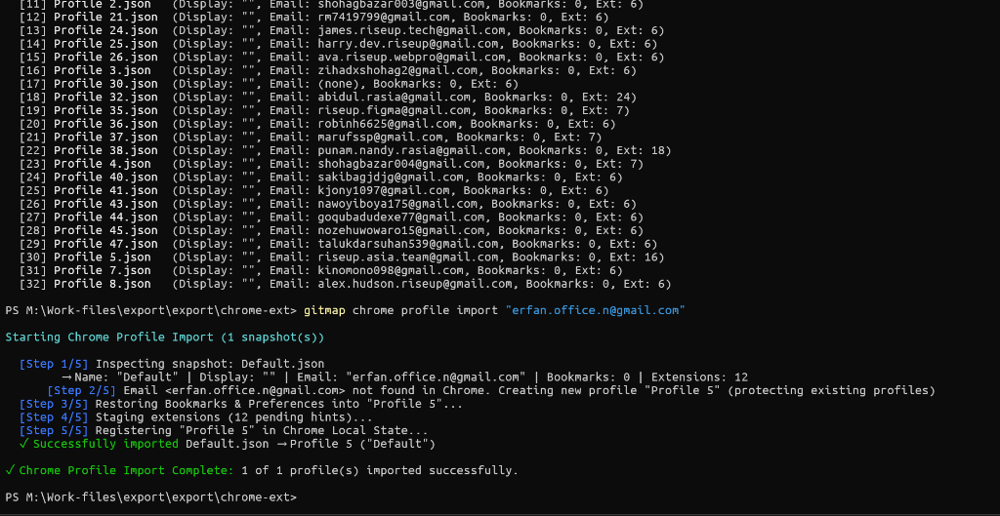
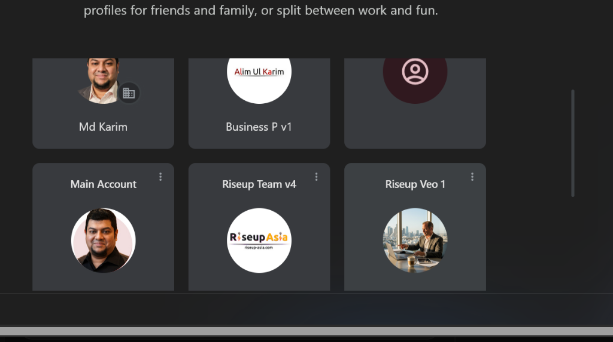

# 63 — Chrome Profile Picker Recognition & Local State Registration

**Status:** COMPLETED
**Priority:** High (CODE RED)
**Spec Reference:** [`spec/25-chrome-profile-management/01-profile-registration-and-picker.md`](../../../spec/25-chrome-profile-management/01-profile-registration-and-picker.md)
**Related Issue:** [`.lovable/memory/issues/2026-09-05-chrome-profile-picker-visibility-desync.md`](../../memory/issues/2026-09-05-chrome-profile-picker-visibility-desync.md)

---

## 1. Visual Problem Evidence

### Figure 1: Import CLI Execution (`Profile 5` Allocated)

*CLI logs confirming that `gitmap chrome profile import "erfan.office.n@gmail.com"` allocated `Profile 5` on disk.*

### Figure 2: Chrome Profile Picker UI (`Profile 5` Missing)

*Chrome Profile Picker showing existing profiles: "Main Account", "Alim Mum / Md Karim", "Riseup Veo 1", "Alim Personal Veo 1 / Business P v1", "Riseup Team v4", and "Lov". `Profile 5` is missing!*

---

## 2. Root Cause Analysis Summary

1. **Active Chrome Process In-Memory Overwrite:**
   - Chrome was actively running during import (`chrome.exe` processes active).
   - Chrome maintains `Local State` in-memory and flushes periodically or on exit, completely wiping external disk modifications.
2. **Incomplete Chromium Profile Picker Schema:**
   - `registerImportedProfileToLocalState` only saved basic fields (`name`, `user_name`), omitting avatar styling, color codes, `active_time`, `shortcut_name`, and default avatar flags required by Chromium's UI parser.
3. **Preferences & Local State Desynchronization:**
   - Profile's internal `Preferences` contained stale metadata (`Person 1`, old custodian records) rather than the allocated profile name and sanitized identity.

---

## 3. Implementation Plan & Technical Invariants

### Step 1: Upgrade Chrome Local State Registration Engine
- In `gitmap/cmd/chromeprofile_register.go` and `gitmap/cmd/chromeprofile_smart_import.go`:
  - Consolidate profile registration into a unified, hardened function `registerChromeProfileWithFullSchema(dstDir, displayName, email string) error`.
  - Populate all 13 Chromium UI attributes:
    - `name`: Display name
    - `shortcut_name`: Display name
    - `user_name`: Email address
    - `active_time`: Float64 timestamp
    - `avatar_icon`: `"chrome://theme/IDR_PROFILE_AVATAR_26"`
    - `default_avatar_fill_color`: `-13625057`
    - `default_avatar_stroke_color`: `-1786428`
    - `profile_highlight_color`: `-13625057`
    - `is_using_default_avatar`: `true`
    - `is_using_default_name`: `false`
    - `is_ephemeral`: `false`
    - `is_consented_primary_account`: `false`
    - `signin.with_credential_provider`: `false`
  - Ensure `profiles_order` contains the directory without duplicate entries.

### Step 2: Preferences Sanitization on Import
- Before registration, sanitize `<ProfileDir>/Preferences`:
  - Set `profile.name` = `displayName`.
  - Set `profile.using_default_name` = `false`.
  - Remove stale `account_info`, `signin`, `google`, `gaia_cookie`, `custodian_*`.

### Step 3: Process Concurrency Guard & User Advisory
- Check `isChromeRunning(runtime.GOOS)`.
- If running:
  - Output high-visibility terminal alert informing user that Chrome must be closed or restarted for profile picker recognition.
- If closed:
  - Confirm instant profile picker readiness.

### Step 4: Implement Orphan Reconciliation Command (`gitmap chrome profile reconcile`)
- Add `gitmap chrome profile reconcile` (alias `gitmap chrome profile repair`).
- Scans `%LOCALAPPDATA%\Google\Chrome\User Data` for any profile folder (like `Profile 5`) not listed in `Local State`.
- Automatically synthesizes missing metadata and registers the orphaned profiles.

### Step 5: Immediate Remediation of Existing `Profile 5`
- Register `Profile 5` (`erfan.office.n@gmail.com`) immediately so it appears in the user's Chrome Profile Picker.

---

## 4. Acceptance Criteria & Validation

1. `go test -v ./cmd/... -run TestChromeProfile` passes 100%.
2. Zero nested if statements repository-wide (`python linter-scripts/check-nested-ifs.py`).
3. Zero error management violations (`python linter-scripts/check-error-management.py`).
4. Full CI/CD local runner suite green (`python 03-ai-scripts/06-cicd-local-runner.py`).
