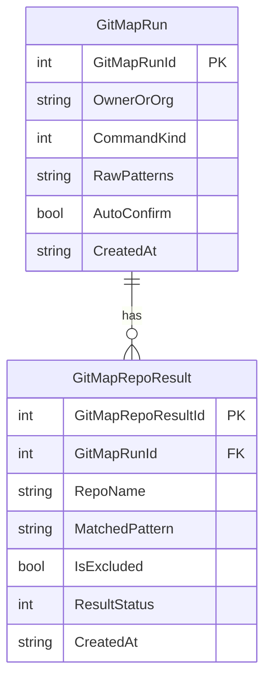

# Subtask 02 — SQLite schema & migration

## Goal
Persist every bulk-visibility run and per-repo result. PascalCase column names,
INTEGER PRIMARY KEY AUTOINCREMENT (Core memory rule).

## Migration
New file: `gitmap/db/migrations/0NN_gitmap_run_repo_result.sql`
(N = next free migration index; check `gitmap/db/migrations/` first).

```sql
CREATE TABLE IF NOT EXISTS GitMapRun (
    GitMapRunId    INTEGER PRIMARY KEY AUTOINCREMENT,
    OwnerOrOrg     TEXT    NOT NULL,
    CommandKind    INTEGER NOT NULL,  -- enum: 1=MakeAllPublic, 2=MakeAllPrivate
    RawPatterns    TEXT    NOT NULL,
    AutoConfirm    INTEGER NOT NULL,  -- 0/1
    CreatedAt      TEXT    NOT NULL   -- ISO-8601 UTC
);

CREATE TABLE IF NOT EXISTS GitMapRepoResult (
    GitMapRepoResultId INTEGER PRIMARY KEY AUTOINCREMENT,
    GitMapRunId        INTEGER NOT NULL REFERENCES GitMapRun(GitMapRunId) ON DELETE CASCADE,
    RepoName           TEXT    NOT NULL,
    MatchedPattern     TEXT    NOT NULL,
    IsExcluded         INTEGER NOT NULL,  -- 0/1
    ResultStatus       INTEGER NOT NULL,  -- enum: 1=Pending, 2=Succeeded, 3=Failed, 4=Skipped
    CreatedAt          TEXT    NOT NULL
);

CREATE INDEX IF NOT EXISTS IxGitMapRepoResultRunId
    ON GitMapRepoResult(GitMapRunId);
```

## Enums (Go)
`gitmap/db/enums.go`:
```go
type CommandKindEnum int
const (
    CommandKindMakeAllPublic  CommandKindEnum = 1
    CommandKindMakeAllPrivate CommandKindEnum = 2
)

type ResultStatusEnum int
const (
    ResultStatusPending   ResultStatusEnum = 1
    ResultStatusSucceeded ResultStatusEnum = 2
    ResultStatusFailed    ResultStatusEnum = 3
    ResultStatusSkipped   ResultStatusEnum = 4
)
```

## Repository
`gitmap/db/gitmaprunrepo.go`:
- `InsertGitMapRun(ctx, OwnerOrOrg, CommandKindEnum, RawPatterns, AutoConfirm) (int64, error)`
- `InsertGitMapRepoResult(ctx, GitMapRunId, RepoName, MatchedPattern, IsExcluded) (int64, error)` — defaults `ResultStatus = Pending`
- `UpdateGitMapRepoResultStatus(ctx, GitMapRepoResultId, ResultStatusEnum) error`

All wrapped in a single tx per run. SetMaxOpenConns(1) per Core rule.

## ERD (Mermaid — copy into spec file)


## Verification
- Migration idempotent (re-run is no-op via `IF NOT EXISTS`).
- `go test ./gitmap/db -run GitMapRun -count=1` inserts + reads back.
