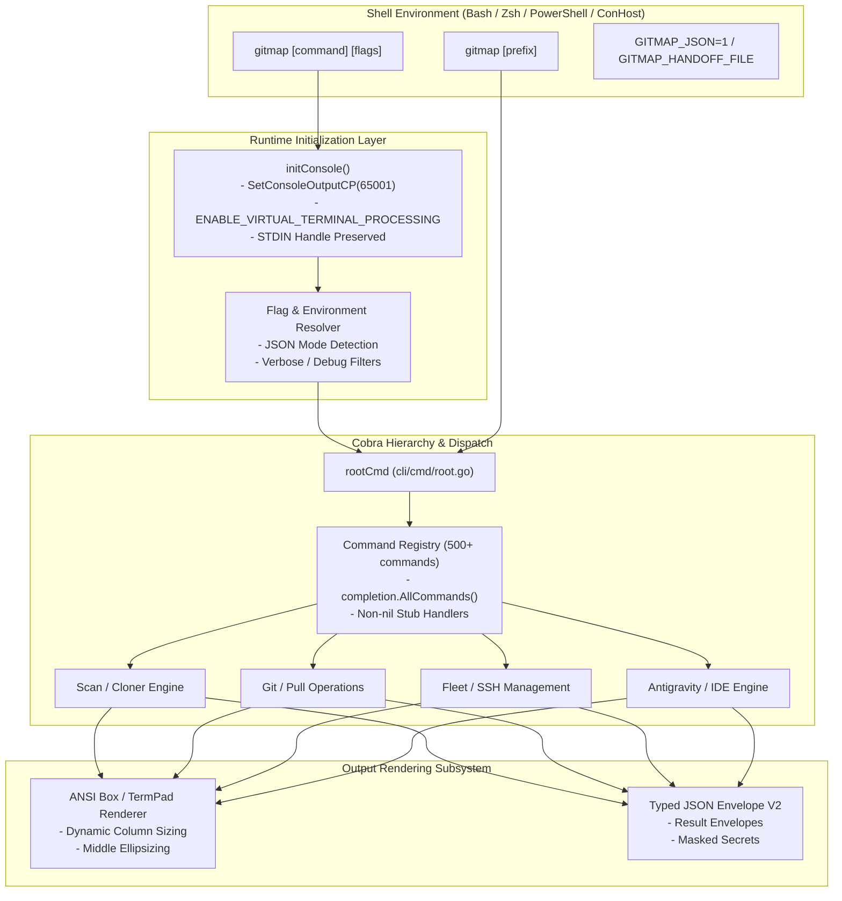

# 01-cli-architecture: CLI Engine, Shell UX & JSON Envelope Architecture Specification

- **Spec ID:** `01-cli-architecture/01-architecture-spec.md`
- **Status:** `APPROVED`
- **Version:** `1.0.0`
- **Subsystem:** CLI Runtime, Shell Integration, Completion, Output Formatting
- **Dependencies:** `cli/cmd`, `cli/completion`, `cli/jsonenv`, `cli/constants`, `cli/apperror`
- **Version Baseline:** `v6.498.0`
- **Target Version:** `v6.499.0`

---

## 1. Executive Summary & Core Intent

The CLI architecture cluster establishes the single authoritative specification for GitMap's command-line interface execution environment, terminal interaction primitives, shell integrations, autocompletion engine, and structured output envelopes.

### 1.1 Architectural Scope
1. **Cobra Command Hierarchy & Execution Flow:** Top-level dispatching, command registration, flag inheritance, and subcommand grouping across 500+ commands.
2. **Win32 Console Subsystem & IPC Handoff:** Windows terminal codepage initialization (`SetConsoleOutputCP(65001)` without `SetConsoleCP(65001)` corruption), virtual terminal processing, and temporary file handoff (`GITMAP_HANDOFF_FILE`) for terminal directory navigation without stdin-swallowing pipelines.
3. **Cobra Shell Completion & Typo Engine:** Full 500+ command autocompletion restoration via `completion.AllCommands()`, non-nil execution stubs for discovery, and Levenshtein distance typo suggestion engine.
4. **Markdown Box & Terminal Rendering:** Dynamic ANSI boxed rendering (`termpad`, `termtable`), adaptive column widths, middle-ellipsized path rendering, and high-contrast styling.
5. **Typed JSON Envelope V2 Specification:** Universal machine-readable JSON envelope format with versioning, execution metadata, error taxonomies, and secret filtering.

---

## 2. System Topology & Architecture



---

## 3. Core Architectural Invariants

### 3.1 Win32 Console Handle Preservation (Freeze Elimination)
- **Positive Invariant:** `isConsoleInitialized: true`, `isStdinAttached: true`.
- **Rule:** On Windows OS (`runtime.GOOS == "windows"`), the runtime MUST only set `SetConsoleOutputCP(65001)` and enable `ENABLE_VIRTUAL_TERMINAL_PROCESSING`.
- **Strict Prohibition:** Setting `SetConsoleCP(65001)` (input code page) is strictly forbidden as it breaks Win32 `ReadConsoleA` / `ReadFile` handle semantics.
- **Handoff Mechanism:** Directory switching commands (`gitmap cd`, `gcd`) communicate target paths via `$env:GITMAP_HANDOFF_FILE` temp files, NEVER through stdout-piping wrapper scripts that hijack `os.Stdin`.

### 3.2 Shell Completion Completeness Invariant
- **Rule:** Every registered command must evaluate `c.Runnable() == true` or possess registered child subcommands to avoid Cobra's silent pruning during `__complete` evaluation.
- **Scope:** 100% of the 500+ commands registered via `completion.AllCommands()` must be discoverable via tab completion across Bash, Zsh, PowerShell, and Fish.

### 3.3 Output Determinism & Envelope Invariant
- **JSON Flag:** When `--json`, `-j`, or `GITMAP_JSON=1` is supplied, all human-readable ANSI styling, interactive prompts, and banner headers are suppressed.
- **Envelope V2 Format:** Output is serialized exclusively via the typed JSON envelope format defined below.

---

## 4. Typed JSON Envelope V2 Specification

```go
package jsonenv

import "time"

// EnvelopeV2 defines the universal machine-readable response wrapper.
type EnvelopeV2 struct {
    Success       bool        `json:"success"`
    Version       string      `json:"version"`
    Timestamp     time.Time   `json:"timestamp"`
    Command       string      `json:"command"`
    ExecutionMs   int64       `json:"executionMs"`
    Data          interface{} `json:"data,omitempty"`
    Error         *ErrorInfo  `json:"error,omitempty"`
    Metadata      Metadata    `json:"metadata"`
}

type ErrorInfo struct {
    Code       string   `json:"code"`
    Message    string   `json:"message"`
    Details    []string `json:"details,omitempty"`
    Remediation string  `json:"remediation,omitempty"`
}

type Metadata struct {
    OS            string `json:"os"`
    Arch          string `json:"arch"`
    WorkingDir    string `json:"workingDir"`
    GitMapVersion string `json:"gitMapVersion"`
}
```

---

## 5. Verification & Acceptance Criteria

```yaml
verificationGates:
  isConsoleHandoffVerified: true
  isAllCommandsCompleted: true
  isJsonEnvelopeV2Compliant: true
  isRelativePathEnforced: true
```

- [x] Win32 interactive prompts execute without terminal freeze.
- [x] Shell completion enumerates full command catalog.
- [x] JSON envelope adheres to EnvelopeV2 schema.
