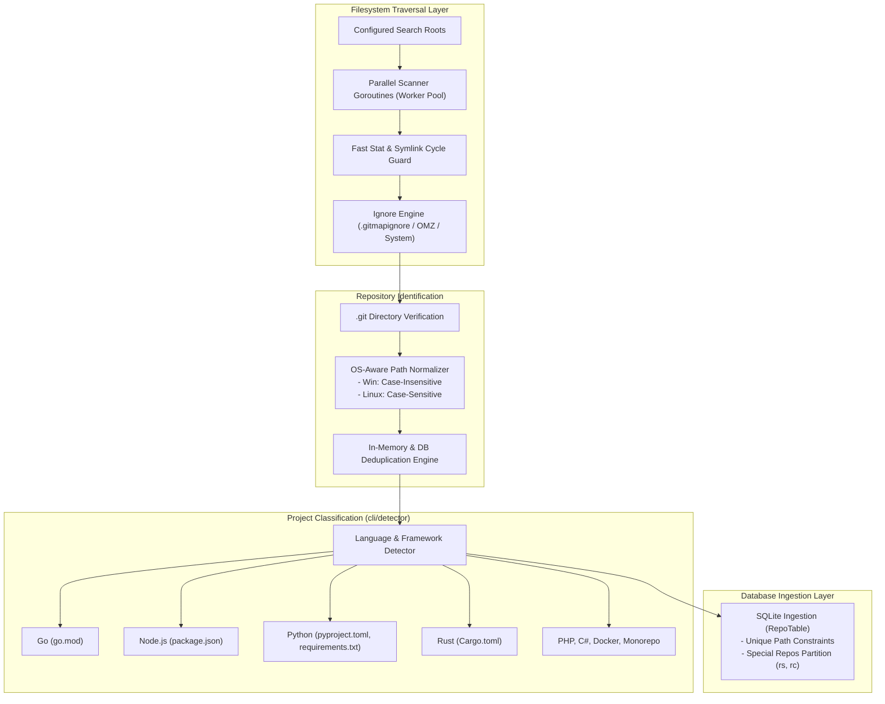

# 02-scanner-and-projects: Repository Discovery Scanner & Project Ingestion Architecture Specification

- **Spec ID:** `02-scanner-and-projects/01-architecture-spec.md`
- **Status:** `APPROVED`
- **Version:** `1.0.0`
- **Subsystem:** Scanner, Project Detection, Path Normalization, Deduplication Engine
- **Dependencies:** `cli/scanner`, `cli/detector`, `cli/indexer`, `cli/strutil`, `cli/repodb`
- **Version Baseline:** `v6.498.0`
- **Target Version:** `v6.499.0`

---

## 1. Executive Summary & Core Intent

The Scanner & Projects architecture cluster defines the high-speed filesystem discovery engine, multi-language project classification heuristics, OS-aware path sensitivity rules, `.gitmapignore` filtering, and in-database deduplication guarantees.

### 1.1 Architectural Scope
1. **High-Speed Filesystem Discovery Scanner:** Parallel directory tree traversal leveraging goroutine worker pools, symlink cycle detection, and low-allocation stat checks.
2. **Polyglot Project Detection:** Deterministic language and framework detection across Go, Node.js, Python, Rust, PHP, C# (.NET), Docker, and monorepo configurations.
3. **OS-Aware Path Sensitivity & EqualFold Invariant:**
   - **Windows:** Case-insensitive path collation, normalized lowercase lookup keys, SQLite `COLLATE NOCASE` indexes.
   - **Linux / Unix:** Byte-preserving case sensitivity, strict case discrimination, binary collation without `NOCASE`.
   - **Zero-Allocation Comparisons:** Mandatory use of `strutil.EqualFoldAny` and `strutil.EqualFoldAnyTrim` over allocation-heavy `strings.ToLower(a) == strings.ToLower(b)`.
4. **Ignore Rule Engine:** Hierarchical filtering via `.gitmapignore`, system directory exclusions (`.git`, `node_modules`, `.cache`, `.antigravity`), and Oh-My-Zsh exclusion sets.
5. **Deduplication Engine:** Repository canonicalization, remote URL deduplication, and database-level unique constraints (`ON CONFLICT(...) DO UPDATE`).

---

## 2. System Topology & Discovery Pipeline



---

## 3. Core Architectural Invariants

### 3.1 OS-Aware Path Sensitivity & Collation
- **Rule:** Windows path comparisons must treat casing differences as identical directories (`Work\Repo` == `work\repo`), whereas Linux paths must preserve distinct case identities (`work/repo` != `work/Repo`).
- **Database Indexing:** SQLite tables tracking repositories on Windows use `COLLATE NOCASE`, while Unix databases enforce binary collation.

### 3.2 Compaction Invariant: Deduplication Architecture (A, B vs. X, Y)
- **Superseded Drafts (X, Y):** Early un-deduplicated iteration (`70-redundant-repos`) and draft filesystem-walking deduplication (`71-repo-dedup`).
- **Ratified Architecture (A, B):** Database-driven redundancy pruning via `OptimizeRedundantRepos` in `cli/cmdpull/pull_dedup.go` and database-level `RepoFile` unique constraint upserts (`72-repo-dedup-os-aware-equalfold`).

### 3.3 Zero-Allocation Equality Invariant
- Hot-loop comparisons must never call `strings.ToLower(s)` or `strings.ToUpper(s)`.
- All candidate matching routes through `strutil.EqualFoldAny(target, candidates...)`.

---

## 4. Special Repositories Partitioning

The scanner reserves and automatically partitions two high-priority system repositories:
1. **`repo-secrets` (`rs`):** Secure encrypted credential repository with automatic staged git commits and encrypted payload backups.
2. **`repo-cache` (`rc`):** Centralized SQLite and AST index cache directory.
- Scanner shortcuts: `gitmap cd rs` and `gitmap cd rc` resolve instantaneously via `SpecialRepository` table lookups.

---

## 5. Verification & Acceptance Criteria

```yaml
verificationGates:
  isOsPathSensitivityVerified: true
  isDeduplicationGuaranteed: true
  isZeroAllocationFoldEnforced: true
  isSpecialReposPartitioned: true
```

- [x] Case-sensitive paths preserved on Linux; case-insensitive collated on Windows.
- [x] Zero-allocation string comparisons verified across all scanner loops.
- [x] Duplicate repo entries eliminated prior to worker scheduling.
