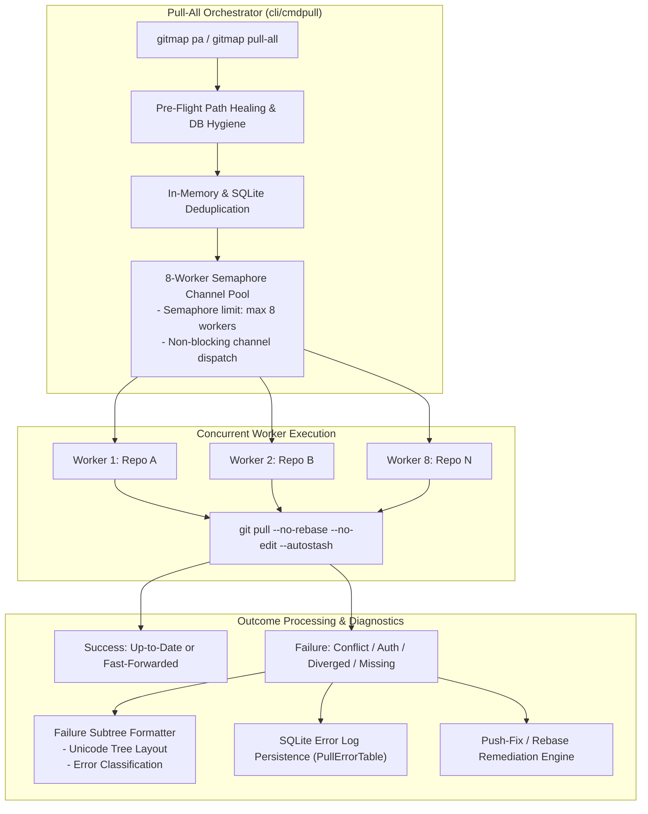

# 03-git-operations-and-pull: Git Engine, Pull-All Concurrency & Push Recovery Architecture Specification

- **Spec ID:** `03-git-operations-and-pull/01-architecture-spec.md`
- **Status:** `APPROVED`
- **Version:** `1.0.0`
- **Subsystem:** Git Core Engine, Pull-All Concurrency Pool, Flat Commit Suite, Push Self-Healing
- **Dependencies:** `cli/cmdpull`, `cli/committransfer`, `cli/cmdpushfix`, `cli/pipelinedb`, `cli/repodb`
- **Version Baseline:** `v6.498.0`
- **Target Version:** `v6.499.0`

---

## 1. Executive Summary & Core Intent

The Git Operations and Pull cluster defines the centralized execution architecture for repository synchronization, concurrency control, semantic commits, push failure recovery, and cross-platform error logging.

### 1.1 Architectural Scope
1. **Pull-All Fast Mode (`pa`, `pat`) & Worker Pool:** Concurrency-throttled git pull operations utilizing an 8-worker goroutine semaphore pool, non-blocking PAS concurrency, and state templates DB caching.
2. **Semantic Flat Commit Suite (`gitmap commit`, `cm`, `gitmap c`):** Standardized atomic git commit commands with automatic working tree staging, Conventional Commits formatting, hyphenated summaries, and pre-commit hook bypass guards.
3. **Push Self-Healing & Recovery (`gitmap push-fix`, `pf`):** Autonomous resolution of rejected non-fast-forward pushes, remote tracking branch divergency, auto-rebase, SSH authentication refresh, and credential re-validation.
4. **Ubuntu Pull Remediation & Oh-My-Zsh Exclusions:** Deep path healing for cross-OS backslash/forward-slash translation, phantom repository cleanup, and default exclusion of `~/.oh-my-zsh` and plugin checkouts.
5. **Structured Error Logging & Failure Tree Styling:** Hierarchical failure display with Unicode branch trees, status code grouping, and SQLite persistence in `repodb/pipeline.db`.

---

## 2. System Topology & Concurrency Model



---

## 3. Core Architectural Invariants

### 3.1 8-Worker Concurrency Limit Invariant
- **Positive Invariant:** `hasBoundedConcurrency: true`, `maxConcurrentWorkers: 8`.
- **Rationale:** Prevents system resource exhaustion, socket exhaustion during batch SSH handshakes, and Git index file locks.

### 3.2 Compaction Invariant: Pull Architecture Evolution (A, B vs. X, Y)
- **Superseded Drafts (X, Y):** In-process mutex locking, single-worker execution, standalone temporary patch scripts (`197-pas-fix`, `198-pas-worker-concurrency`).
- **Ratified Architecture (A, B):** 8-worker goroutine semaphore pool, SQLite Split-DB advisory locking, and structured OMZ ignore rules (`219-ubuntu-pull-all-remediation-omz-ignore-and-error-logging` & `222-ubuntu-pull-tree-omz-force-error-diagnostics-and-release`).

### 3.3 Semantic Flat Commit Conventions
- Commits generated via `gitmap commit` enforce standardized formats:
  `gitmap commit <type> <scope> <hyphen-separated-description>`
  Example: `feat(pull): add-eight-worker-concurrency-pool`

---

## 4. Error Classification & Recovery Matrix

| Error Class | Root Cause | Automated Remediation Action |
| :--- | :--- | :--- |
| **`ErrNonFastForward`** | Remote branch contains divergent commits. | `gitmap push-fix` invokes `git pull --rebase origin <branch>`. |
| **`ErrAuthFailure`** | Expired SSH key or missing token. | Re-probes SSH agent; invokes credential vault unlock. |
| **`ErrDetachedHead`** | Checkout in headless or submodule state. | Alerts user; skips merge; logs diagnostic warning. |
| **`ErrMissingRepo`** | Directory removed on disk. | Re-clones from known remote URL or purges stale DB record. |

---

## 5. Verification & Acceptance Criteria

```yaml
verificationGates:
  isWorkerConcurrencyBounded: true
  isPushFixAutoRebaseVerified: true
  isOhMyZshExcludedByDefault: true
  isFailureSubtreeStyled: true
```

- [x] 8-worker concurrency ceiling strictly enforced during `gitmap pa`.
- [x] Automatic path healing corrects Windows backslashes on Linux nodes.
- [x] Push-fix seamlessly heals divergent branch tracking without history deletion.
