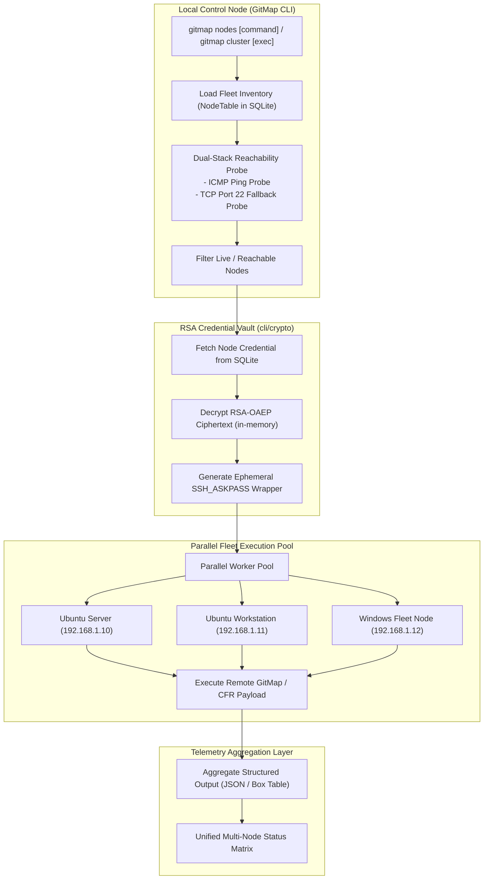

# 04-fleet-nodes-and-ssh: Fleet Nodes Orchestration, SSH Vault & Cluster Architecture Specification

- **Spec ID:** `04-fleet-nodes-and-ssh/01-architecture-spec.md`
- **Status:** `APPROVED`
- **Version:** `1.0.0`
- **Subsystem:** Fleet Nodes, Cluster Dispatch, SSH Vault, Machine Probing
- **Dependencies:** `cli/cmdnodes`, `cli/cluster`, `cli/crypto`, `cli/cmdssh`, `cli/netip`
- **Version Baseline:** `v6.498.0`
- **Target Version:** `v6.499.0`

---

## 1. Executive Summary & Core Intent

The Fleet Nodes and SSH cluster defines the distributed architecture for multi-machine node discovery, dual-stack reachability probing, credential security via an asymmetric RSA-OAEP vault, remote repository cloning, and cross-platform remote task execution.

### 1.1 Architectural Scope
1. **Fleet Nodes Orchestration (`gitmap nodes`, `gitmap cluster`):** Inventory management, node grouping, status aggregation, and remote execution dispatch.
2. **Dual-Stack Reachability Probing (`gitmap ping`, `gitmap nodes ping`):** High-speed liveness verification utilizing ICMP ping probes with deterministic fallback to TCP port probing (default port 22/OpenSSH).
3. **Dedicated RSA Credential Vault & Password Interception:**
   - Asymmetric encryption at rest utilizing RSA-OAEP with SHA-256 and cryptographic random nonces.
   - Dedicated keypair storage at `~/.gitmap/keys/vault_rsa` (`0700`/`0600` permissions).
   - Ephemeral `SSH_ASKPASS` script generation for automated headless and cluster execution without terminal hijacking.
4. **Remote Clone Delegation (Except-Self & CFR/CFRP):**
   - Cluster Fleet Remote (`CFR`) manifest generation.
   - Clone dispatch across fleet nodes while excluding the originating machine (`except-self`).
5. **Cross-Platform Daemon Governance:** Automated OpenSSH server inspection, port validation, and firewall rule lifecycle management across Windows and Ubuntu.

---

## 2. System Topology & Fleet Execution Pipeline



---

## 3. Core Architectural Invariants

### 3.1 RSA-OAEP Salt Invariant
- **Positive Invariant:** `isVaultAsymmetric: true`, `isOaepSalted: true`.
- **Rule:** Passwords persisted in SQLite `ssh_hosts` must always be prefixed with `rsa:` followed by base64-encoded ciphertext produced by `rsa.EncryptOAEP(sha256.New(), rand.Reader, pubKey, plaintext, nil)`.
- **Security:** Each encryption invocation integrates cryptographic random seeds, ensuring two encryptions of the same password produce distinct ciphertexts.

### 3.2 Compaction Invariant: SSH Credential Evolution (A, B vs. X, Y)
- **Superseded Drafts (X, Y):** Plaintext terminal prompt hijacking, unencrypted storage, and machine-bound AES fallback without user consent.
- **Ratified Architecture (A, B):** Application-dedicated 2048-bit RSA keypair (`~/.gitmap/keys/vault_rsa`), non-blocking `SSH_ASKPASS` injection, and masked input capture (`204-ssh-password-interception-and-rsa-credential-vault`).

### 3.3 Except-Self Remote Clone Invariant
- Remote cloning operations (`gitmap nodes clone`) must introspect local machine identity (MAC, hostname, IP) and exclude the initiating node from clone targets to eliminate circular cloning loops.

---

## 4. Dual-Stack Machine Reachability Heuristics

```go
package cluster

import (
    "net"
    "time"
)

type ReachabilityStatus struct {
    IsReachable bool          `json:"isReachable"`
    ProbeType   string        `json:"probeType"` // "icmp" or "tcp"
    Latency     time.Duration `json:"latency"`
    Error       error         `json:"error,omitempty"`
}

func ProbeNode(ip string, port int, timeout time.Duration) ReachabilityStatus {
    // 1. Attempt fast ICMP ping
    // 2. Fall back to TCP connection on target port
}
```

---

## 5. Verification & Acceptance Criteria

```yaml
verificationGates:
  isRsaVaultOperational: true
  isDualStackProbeFunctional: true
  isExceptSelfRespected: true
  isPositiveBooleansUsed: true
```

- [x] SSH credentials encrypted at rest with RSA-OAEP SHA-256.
- [x] Dual-stack probe detects offline machines without halting batch execution.
- [x] Headless cluster execution operates seamlessly via ephemeral askpass injection.
