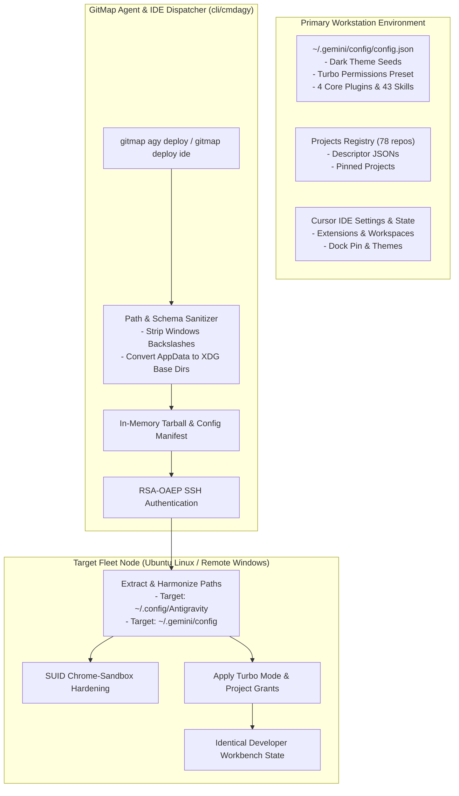

# 05-antigravity-and-ide: Google Antigravity & IDE Integration Architecture Specification

- **Spec ID:** `05-antigravity-and-ide/01-architecture-spec.md`
- **Status:** `APPROVED`
- **Version:** `1.0.0`
- **Subsystem:** Antigravity Agent Runtime, Multi-IDE Synchronizer, Cursor Integration, Fleet Parity
- **Dependencies:** `cli/cmdagy`, `cli/cmdcursor`, `cli/cmdide`, `cli/workspacesync`
- **Version Baseline:** `v6.498.0`
- **Target Version:** `v6.499.0`

---

## 1. Executive Summary & Core Intent

The Antigravity and IDE cluster defines the system architecture governing Google Antigravity SDK workflows, multi-conversation agent prompting, project registry discovery, theme presets, plugins synchronization, Cursor workstation parity, and IDE configuration deployment.

### 1.1 Architectural Scope
1. **Google Antigravity SDK Workflows & Agent Governance:** Integration with Antigravity agent loops, permissions policies (`EAGER`, `TURBO`), SUID sandbox hardening, and multi-conversation prompt dispatching.
2. **Project Registry & Recency Stitching:** Multi-source project discovery (`~/.gemini/config/projects/*.json`, `~/.config/Antigravity/User/`), pinned projects, last-active-projects (`lap`), and non-destructive project recreation safeguards.
3. **Decision Log DB & Active Rerun Recency:** Structured logging of agent trajectories, turn metadata, and rerun commands (`rwi`, `rwc`) persisted in SQLite Split-DB.
4. **Fleet Antigravity Parity & Deployment (`gitmap agy deploy`):** Autonomous replication of theme seeds (`#19191C`, `#BD93F9`), plugins (`chrome-devtools`, `data-agent-kit`, `google-antigravity-sdk`, `modern-web-guidance`), and 43 skills across Windows and Linux fleet nodes.
5. **Cursor IDE & Multi-IDE Workstation Sync:** Configuration replication, start menu/dock positioning, workspace state backup, and GitHub Desktop integration.

---

## 2. System Topology & IDE Parity Architecture



---

## 3. Core Architectural Invariants

### 3.1 Cross-Platform Path Sanitization Invariant
- **Positive Invariant:** `isPathNormalized: true`, `hasXdgCompliance: true`.
- **Rule:** Windows path components (`AppData\Roaming`, backslashes `\`) MUST NEVER be transmitted verbatim to Linux nodes.
- **Translation:** Windows `%APPDATA%\Antigravity` maps to `$XDG_CONFIG_HOME/Antigravity` or `$HOME/.config/Antigravity`.

### 3.2 Compaction Invariant: Antigravity Architecture (A, B vs. X, Y)
- **Superseded Drafts (X, Y):** Ad-hoc shell scripts, unencrypted project recreation (`xx-agy-enhancements`, `89-agy-rp-running-projects-and-recreate-safety`), and manual skill sync.
- **Ratified Architecture (A, B):** Single-command atomic deployment (`gitmap agy deploy`), structured project descriptor stitching in SQLite, and full 43-skill parity synchronization (`217-antigravity-fleet-parity-theme-preset-plugins-and-delegation` & `231-antigravity-ide-projects-and-repo-secrets-restore`).

### 3.3 Turbo Mode & Unattended Execution Invariant
- Project descriptors generated or synchronized by GitMap must configure `turboMode: true` and non-empty `permissionGrants` to prevent agent execution freezes during unattended background runs.

---

## 4. Antigravity Configuration Schema

```json
{
  "theme": {
    "customThemeSeedsDark": ["#BD93F9", "#19191C"],
    "foreground": "#F8F8F2"
  },
  "policies": {
    "executionMode": "TURBO",
    "unattendedExecution": true
  },
  "plugins": [
    "chrome-devtools-plugin",
    "data-agent-kit-plugin",
    "google-antigravity-sdk",
    "modern-web-guidance-plugin"
  ]
}
```

---

## 5. Verification & Acceptance Criteria

```yaml
verificationGates:
  isThemeParityEnforced: true
  isAll43SkillsSynchronized: true
  isPathSanitizationVerified: true
  isPositiveBooleansUsed: true
```

- [x] Antigravity UI renders matching dark palette on all fleet nodes.
- [x] All 43 agent skills present and discoverable post-deployment.
- [x] Unattended agent loops run without permission confirmation halts.
