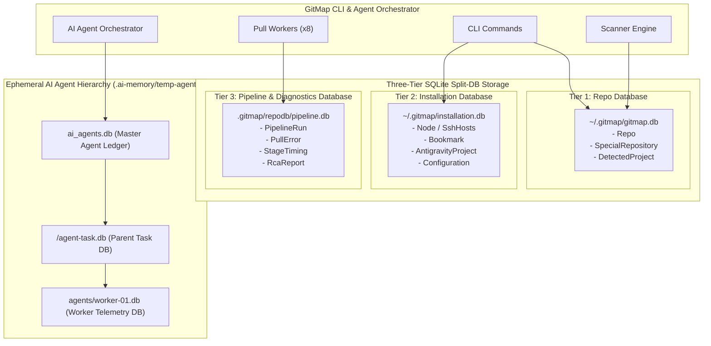

# 06-database-and-split-db: Three-Tier SQLite Split-DB Architecture Specification

- **Spec ID:** `06-database-and-split-db/01-architecture-spec.md`
- **Status:** `APPROVED`
- **Version:** `1.0.0`
- **Subsystem:** Database Engine, SQLite Split-DB, Schema Governance, AI Agent Task DB
- **Dependencies:** `cli/db`, `cli/repodb`, `cli/pipelinedb`, `cli/cmdagent`, `cli/txn`
- **Version Baseline:** `v6.498.0`
- **Target Version:** `v6.499.0`

---

## 1. Executive Summary & Core Intent

The Database and Split-DB cluster defines the three-tier SQLite storage architecture, concurrency controls, schema conventions, foreign key invariants, and AI agent task databases.

### 1.1 Architectural Scope
1. **Three-Tier SQLite Split-DB Architecture:** Partitioning storage across three dedicated SQLite files:
   - **Tier 1 (`gitmap.db`):** Core repository registry, detected languages, remote URLs, bookmark aliases.
   - **Tier 2 (`installation.db`):** Machine-scoped settings, SSH node inventory, Antigravity project descriptors, credential vault mappings.
   - **Tier 3 (`repodb/pipeline.db`):** Pipeline telemetry, pull errors, build history, CI/CD execution traces.
2. **Concurrency Governance & Deadlock Prevention:**
   - WAL (`Write-Ahead Logging`) mode enabled across all connections (`PRAGMA journal_mode=WAL;`).
   - Connection pooling with `db.SetMaxOpenConns(1)` for write-heavy transactional operations to eliminate SQLite lock contention and database locked (`busy`) crashes.
   - Reentrant advisory locking for concurrent worker access.
3. **Schema Conventions:** Strict PascalCase table names (`Repo`, `DetectedProject`, `PullError`, `Node`) and camelCase column names (`repoId`, `absolutePath`, `createdAt`, `isPinned`).
4. **Foreign Key Integrity & Cascading Lifecycle:** Foreign key constraints enforced (`PRAGMA foreign_keys = ON;`), with orphan prevention and safe database reset semantics.
5. **AI Agent Task Orchestrator Split-DB:** Ephemeral three-tier multi-agent database hierarchy (`ai_agents.db`, `agent-task.db`, `worker-XX.db`) for tracking subagent actions, telemetry, and crash forensics.

---

## 2. System Topology & Database Partitioning



---

## 3. Core Architectural Invariants

### 3.1 Single-Writer Connection Pool Invariant
- **Positive Invariant:** `isWalModeEnabled: true`, `isSingleWriterEnforced: true`.
- **Rule:** Write connection handles must execute `SetMaxOpenConns(1)`. Multiple simultaneous SQLite write handles trigger `database is locked` panics in Go's `database/sql` driver.
- **Transactions:** High-throughput batch inserts execute within explicit transactions (`BEGIN IMMEDIATE`) with retry backoffs.

### 3.2 Compaction Invariant: Database Evolution (A, B vs. X, Y)
- **Superseded Drafts (X, Y):** Monolithic single database (`gitmap.db` holding everything), in-process file locking without WAL, unindexed queries (`10-pipeline-and-repo-split-db`, `23-app-db/`).
- **Ratified Architecture (A, B):** Dedicated three-tier Split-DB engine (`gitmap.db`, `installation.db`, `repodb/pipeline.db`), WAL mode, PascalCase naming, and dedicated agent task DB hierarchy (`209-ai-agent-task-orchestrator-and-split-db`).

### 3.3 Foreign Key & Cascade Invariant
- Whenever child tables reference parent tables (e.g. `DetectedProject.repoId -> Repo.id`), `PRAGMA foreign_keys = ON;` must be executed immediately upon connection opening.
- Reset operations (`gitmap db reset`) perform clean, cascaded drops to guarantee zero foreign key constraint violations.

---

## 4. Master Schema Definitions

```sql
-- Tier 1: Core Repo Table
CREATE TABLE IF NOT EXISTS Repo (
    id INTEGER PRIMARY KEY AUTOINCREMENT,
    repoName TEXT NOT NULL,
    absolutePath TEXT NOT NULL UNIQUE,
    remoteUrl TEXT,
    primaryLanguage TEXT,
    isClean INTEGER NOT NULL DEFAULT 1,
    lastScannedAt DATETIME DEFAULT CURRENT_TIMESTAMP
);

-- Tier 2: Installation Cluster Nodes
CREATE TABLE IF NOT EXISTS Node (
    id INTEGER PRIMARY KEY AUTOINCREMENT,
    nodeName TEXT NOT NULL UNIQUE,
    ipAddress TEXT NOT NULL,
    sshPort INTEGER NOT NULL DEFAULT 22,
    encryptedPassword TEXT,
    isOnline INTEGER NOT NULL DEFAULT 0,
    lastPingMs INTEGER DEFAULT 0,
    updatedAt DATETIME DEFAULT CURRENT_TIMESTAMP
);

-- Tier 3: Pull Error Log Table
CREATE TABLE IF NOT EXISTS PullError (
    id INTEGER PRIMARY KEY AUTOINCREMENT,
    repoId INTEGER,
    errorCode TEXT NOT NULL,
    errorMessage TEXT NOT NULL,
    rawOutput TEXT,
    remediationAction TEXT,
    createdAt DATETIME DEFAULT CURRENT_TIMESTAMP
);
```

---

## 5. Verification & Acceptance Criteria

```yaml
verificationGates:
  isWalModeConfiguredAcrossAllTiers: true
  isSetMaxOpenConnsOneEnforced: true
  isPascalCaseSchemaValidated: true
  isPositiveBooleansUsed: true
```

- [x] Zero `database is locked` errors during parallel 8-worker execution.
- [x] Foreign keys enabled and validated on every connection handle.
- [x] Three-tier database files partitioned according to subsystem domain.
