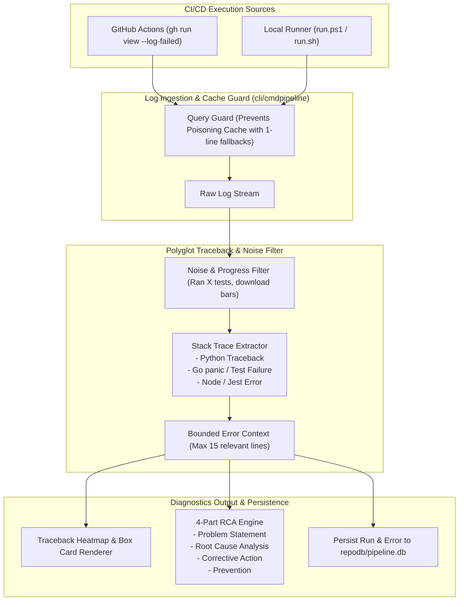

# 07-pipeline-and-diagnostics: CI/CD Pipeline Telemetry, RCA & Diagnostics Architecture Specification

- **Spec ID:** `07-pipeline-and-diagnostics/01-architecture-spec.md`
- **Status:** `APPROVED`
- **Version:** `1.0.0`
- **Subsystem:** Pipeline Telemetry, PE Log Extractor, RCA Engine, Traceback Heatmap
- **Dependencies:** `cli/cmdpipeline`, `cli/pipelinedb`, `cli/termpad`, `cli/termtable`
- **Version Baseline:** `v6.498.0`
- **Target Version:** `v6.499.0`

---

## 1. Executive Summary & Core Intent

The Pipeline and Diagnostics cluster defines the architecture for continuous monitoring, failure extraction, 4-part Root Cause Analysis (RCA), accurate ETA prediction, and terminal UI visualization for GitHub Actions and local CI/CD pipelines.

### 1.1 Architectural Scope
1. **Pipeline Execution Telemetry (`gitmap pe`, `gitmap pea`):** Live streaming and structured capture of remote and local CI/CD workflow executions.
2. **Compact Log Parser & Bounded Error Extraction:**
   - Polyglot traceback extraction (Python `unittest`/`pytest`, Go `testing`, Node `vitest`/`jest`).
   - Automated noise filtering (stripping test summary statistics like `Ran 18 tests in...`, ANSI escape noise, and progress bars).
   - Bounded stack frame extraction (preserving `Traceback (most recent call last):`, file/line coordinates, and assertion failure messages).
3. **Traceback Heatmap & Terminal UI:** Color-coded stage duration heatmaps, error severity indicators, and high-visibility status summaries.
4. **Historical Stage Timings & Accurate ETA Forecaster:** Moving-average execution time prediction based on historical workflow runs stored in `repodb/pipeline.db`.
5. **Automated 4-Part RCA Engine:** Structured report generation (Problem Statement, Root Cause Analysis, Corrective Action, Prevention) consumed by autonomous remediation agents.

---

## 2. System Topology & Diagnostics Pipeline



---

## 3. Core Architectural Invariants

### 3.1 Traceback Preservation Invariant
- **Positive Invariant:** `hasTracebackExtracted: true`, `isNoiseStripped: true`.
- **Rule:** A pipeline error report must NEVER consist solely of `FAIL: Step #4 failure`. It MUST capture:
  1. The specific failing test name (e.g. `FAIL: test_gofmt_check_clean_repo`).
  2. The source file and line number coordinates (`File "...", line 171`).
  3. The exact assertion or exception message (`AssertionError: 1 != 0`).

### 3.2 Compaction Invariant: Pipeline Diagnostics (A, B vs. X, Y)
- **Superseded Drafts (X, Y):** Full unparsed log dumping to terminal, premature fallback log caching permanently blinding subsequent reads (`09-pipeline-historical-eta`, `11-pipeline-errorlogs-timeline-and-fix`).
- **Ratified Architecture (A, B):** Dynamic cache invalidation until run completion, polyglot traceback recognition, and bounded heatmap rendering (`220-pipeline-pe-unit-test-traceback-and-heatmap` & `221-ci-cd-fix-nested-if-and-test-summary-remediation`).

### 3.3 Cache Poisoning Guard
- Synthetic 1-line fallback logs generated during active/in-progress runs must never be written to permanent `.log` cache files on disk.

---

## 4. 4-Part RCA Contract Schema

```go
package cmdpipeline

type RootCauseReport struct {
    RunID            string   `json:"runId"`
    WorkflowName     string   `json:"workflowName"`
    ProblemStatement string   `json:"problemStatement"`
    RootCause        string   `json:"rootCause"`
    CorrectiveAction string   `json:"correctiveAction"`
    Prevention       string   `json:"prevention"`
    FailingTests     []string `json:"failingTests"`
    StackTrace       []string `json:"stackTrace"`
}
```

---

## 5. Verification & Acceptance Criteria

```yaml
verificationGates:
  isPolyglotTracebackParsed: true
  isNoiseStrippingVerified: true
  isRcaStructureCompliant: true
  isPositiveBooleansUsed: true
```

- [x] Traceback parser correctly identifies Python, Go, and Node failure markers.
- [x] Test runner summary noise filtered from terminal output.
- [x] 4-Part RCA report adheres strictly to canonical format.
