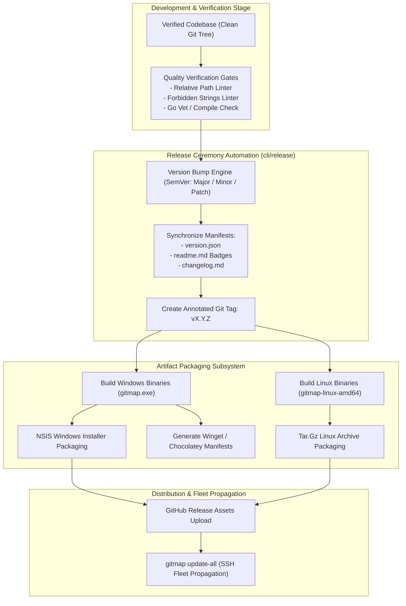

# 08-distribution-and-release: Packaging, Installers & Release Ceremony Architecture Specification

- **Spec ID:** `08-distribution-and-release/01-architecture-spec.md`
- **Status:** `APPROVED`
- **Version:** `1.0.0`
- **Subsystem:** Package Installers, SemVer Release Ceremony, Cross-Platform Runners, Binary Updates
- **Dependencies:** `cli/release`, `cli/installer`, `scripts/`, `03-ai-scripts/`
- **Version Baseline:** `v6.498.0`
- **Target Version:** `v6.499.0`

---

## 1. Executive Summary & Core Intent

The Distribution and Release cluster defines the architecture for cross-platform artifact packaging, installer scripts, automated SemVer version management, package manager manifest distribution, and execution runners.

### 1.1 Architectural Scope
1. **Cross-Platform Package Installers:**
   - **Windows:** NSIS installer with payload auto-detection (`$work`, `$def`), Windows Terminal profile configuration, and uninstaller lifecycle.
   - **Linux:** Standalone tar.gz archives, automatic symlink installation to `/usr/local/bin/gitmap` or `~/.local/bin/gitmap`.
   - **Package Managers:** Manifest generators for Chocolatey (`chocolatey/`) and Winget (`winget/`).
2. **SemVer Release Ceremony Automation:**
   - Release script orchestration (`03-ai-scripts/37-bump-version.py`, `release-now`).
   - Coordinated updates across `version.json`, root `readme.md` badges, package manifests, and release notes.
   - Annotated Git tag generation (`vX.Y.Z`) and release branch lifecycle (`release/vX.Y.Z`).
3. **Cross-Platform Execution Runners (`run.ps1`, `run.sh`):**
   - Declarative runner scripts driven by `run.config.json`.
   - Pre-flight toolchain dependency checks (Go, Python, Git).
   - Automatic build execution, test warm-up, and error trapping.
4. **Fleet Binary Propagation (`gitmap update-all`):** Automated streaming upload of compiled binaries across configured cluster nodes over SSH.
5. **Hermetic Test Isolation & Stale Process Guard:** Process termination safeguards during in-place binary upgrades preventing locked file write failures on Windows.

---

## 2. System Topology & Release Pipeline



---

## 3. Core Architectural Invariants

### 3.1 Version Identity & Inheritance Invariant
- **Positive Invariant:** `isVersionSynced: true`, `isSemVerCompliant: true`.
- **Rule:** `version.json` is the single source of truth for repository version identity.
- Sub-packages and installer scripts must inherit directly from `version.json` without divergent version numbers.

### 3.2 Compaction Invariant: Distribution Architecture (A, B vs. X, Y)
- **Superseded Drafts (X, Y):** Ad-hoc manual copy scripts, hardcoded absolute build paths, raw uninstaller without registry cleanup (`15-distribution-and-runner/`, `55-temp-release.md`, `81-install.md`).
- **Ratified Architecture (A, B):** Structured NSIS installer with payload auto-detection, cross-platform runners (`run.ps1`, `run.sh`), and atomic release ceremony automation (`230-token-purge-installer-workdir-pull-agm-and-ui-modernization` & `234-codebase-review-remediation-and-consolidation`).

### 3.3 Hermetic Installation Isolation
- Installer scripts must never overwrite binaries while a running process holds the file lock.
- On Windows, installers probe for running `gitmap.exe` processes, signal graceful termination, or stage binaries in temporary directories before replacement.

---

## 4. `version.json` Canonical Contract

```json
{
  "name": "gitmap",
  "version": "6.498.0",
  "title": "GitMap",
  "repoSlug": "gitmap-v28",
  "repoUrl": "https://github.com/alimtvnetwork/gitmap-v28",
  "author": "MD ALIM UL KARIM",
  "license": "MIT",
  "subpackages": {
    "cli": "6.498.0",
    "installer": "6.498.0"
  }
}
```

---

## 5. Verification & Acceptance Criteria

```yaml
verificationGates:
  isVersionJsonConsistent: true
  isNsisInstallerPayloadDetected: true
  isRunScriptsCrossPlatformFunctional: true
  isPositiveBooleansUsed: true
```

- [x] All manifests synchronized cleanly during release bumps.
- [x] Windows and Linux installation scripts function out of the box.
- [x] Zero hardcoded absolute paths in runner scripts or manifests.
