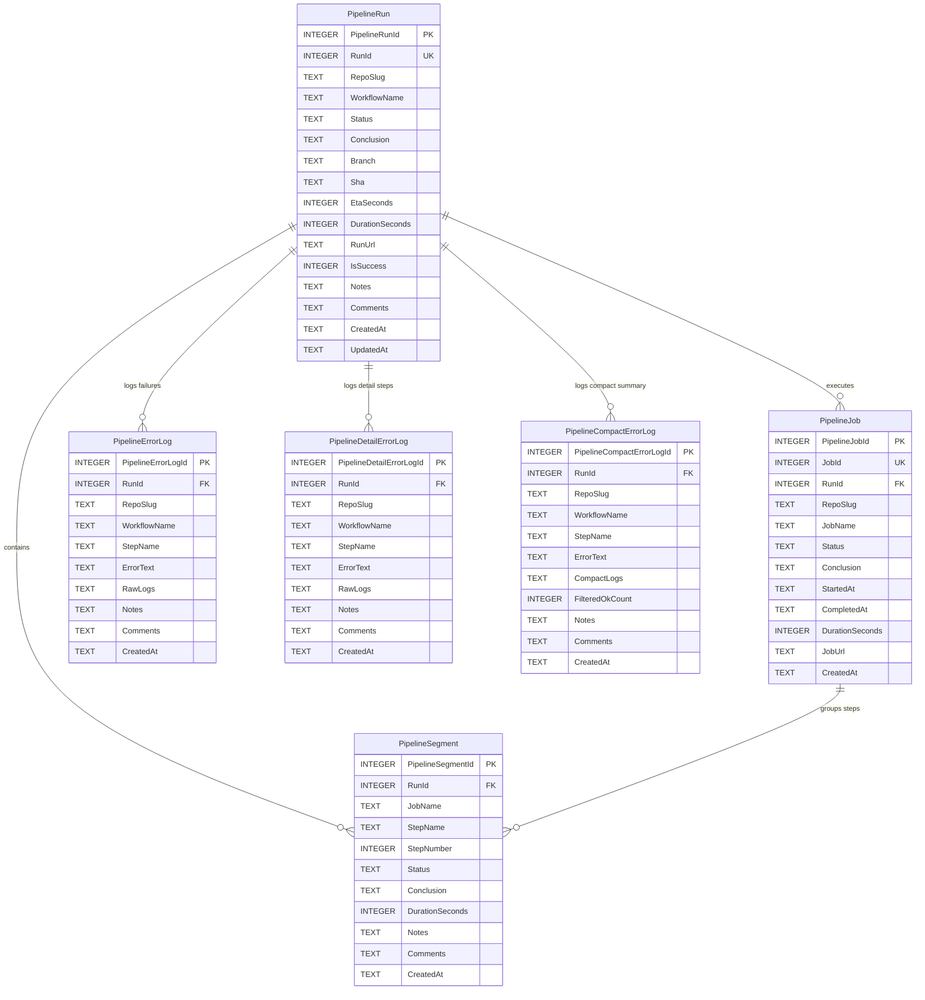

# Pipeline Split Database Architecture

## 1. Storage Location & Path Formulation

Pipeline split databases are isolated per repository slug to ensure zero lock contention between concurrent CI/CD pipeline monitoring routines:

- **Root Directory:** `<BinaryDataDir>/pipeline/<sanitized_slug>/`
- **File Naming Pattern:** `sql.db`
- **Sanitization Rule:** Replaces forward slashes (`/`), colons (`:`), and backslashes (`\`) with hyphens (`-`).
  - Example: Repository `alimtvnetwork/gitmap-v28` resolves to:
    `data/pipeline/alimtvnetwork-gitmap-v28/sql.db`

---

## 2. Mermaid Entity-Relationship Diagram (ERD)



---

## 3. Table Schemas & Storage Design

All schemas adhere strictly to `02-spec/04-database-conventions/` and `02-spec/05-split-db-architecture/`:

### Table: `PipelineRun`
Tracks historical workflow runs, overall wall-clock duration baselines, commit SHA, branch, and status.

```sql
CREATE TABLE IF NOT EXISTS PipelineRun (
    PipelineRunId INTEGER PRIMARY KEY AUTOINCREMENT,
    RunId INTEGER NOT NULL UNIQUE,
    RepoSlug TEXT NOT NULL,
    WorkflowName TEXT NOT NULL,
    Status TEXT NOT NULL,
    Conclusion TEXT NOT NULL,
    Branch TEXT NOT NULL,
    Sha TEXT NOT NULL,
    EtaSeconds INTEGER DEFAULT 0,
    DurationSeconds INTEGER DEFAULT 0,
    RunUrl TEXT NOT NULL,
    IsSuccess INTEGER DEFAULT 0,
    Notes TEXT NULL,
    Comments TEXT NULL,
    CreatedAt TEXT NOT NULL,
    UpdatedAt TEXT NOT NULL
);
CREATE INDEX IF NOT EXISTS IdxPipelineRun_RepoSlug ON PipelineRun (RepoSlug);
CREATE INDEX IF NOT EXISTS IdxPipelineRun_RunId ON PipelineRun (RunId);
CREATE INDEX IF NOT EXISTS IdxPipelineRun_IsSuccess ON PipelineRun (IsSuccess);
```

### Table: `PipelineJob`
Tracks individual stages and jobs within a run, storing stage name, start/end timestamps, individual duration in seconds, and status.

```sql
CREATE TABLE IF NOT EXISTS PipelineJob (
    PipelineJobId INTEGER PRIMARY KEY AUTOINCREMENT,
    JobId INTEGER NOT NULL UNIQUE,
    RunId INTEGER NOT NULL,
    RepoSlug TEXT NOT NULL,
    JobName TEXT NOT NULL,
    Status TEXT NOT NULL,
    Conclusion TEXT NOT NULL,
    StartedAt TEXT NOT NULL,
    CompletedAt TEXT NOT NULL,
    DurationSeconds INTEGER DEFAULT 0,
    JobUrl TEXT NOT NULL,
    CreatedAt TEXT DEFAULT CURRENT_TIMESTAMP
);
CREATE INDEX IF NOT EXISTS IdxPipelineJob_RunId ON PipelineJob (RunId);
CREATE INDEX IF NOT EXISTS IdxPipelineJob_RepoSlug ON PipelineJob (RepoSlug);
CREATE INDEX IF NOT EXISTS IdxPipelineJob_RepoSlug_RunId ON PipelineJob (RepoSlug, RunId);
CREATE INDEX IF NOT EXISTS IdxPipelineJob_JobName ON PipelineJob (JobName);
```

### Table: `PipelineSegment`
Tracks individual steps/segments within workflow jobs to power granular ETA estimations.

```sql
CREATE TABLE IF NOT EXISTS PipelineSegment (
    PipelineSegmentId INTEGER PRIMARY KEY AUTOINCREMENT,
    RunId INTEGER NOT NULL,
    JobName TEXT NOT NULL,
    StepName TEXT NOT NULL,
    StepNumber INTEGER DEFAULT 0,
    Status TEXT NOT NULL,
    Conclusion TEXT NOT NULL,
    DurationSeconds INTEGER DEFAULT 0,
    Notes TEXT NULL,
    Comments TEXT NULL,
    CreatedAt TEXT DEFAULT CURRENT_TIMESTAMP
);
CREATE INDEX IF NOT EXISTS IdxPipelineSegment_RunId ON PipelineSegment (RunId);
CREATE INDEX IF NOT EXISTS IdxPipelineSegment_JobName ON PipelineSegment (JobName);
```

### Tables: `PipelineErrorLog`, `PipelineDetailErrorLog`, `PipelineCompactErrorLog`
Isolates and records targeted CI/CD failure errors, stack traces, and failing steps for rapid 4-part RCA diagnosis without storing redundant passing logs.

---

## 4. Timing Metrics & Aggregations

1. **Single Stage Durations (`PipelineJob.DurationSeconds`):**
   - Exact runtime of each parallel or sequential job (e.g. `Build Frontend: 80s`, `Check Rust Code: 110s`).
2. **Combined Stage Sum Duration (`StageSumSeconds`):**
   - Sum of all individual job runtimes: $\sum \text{DurationSeconds}(\text{job}_i)$.
3. **Wall-Clock Duration (`PipelineRun.DurationSeconds`):**
   - Elapsed wall-clock time from run creation to completion.
4. **Concurrency Speedup Factor:**
   - $\text{Speedup} = \frac{\text{StageSumSeconds}}{\text{WallClockSeconds}}$, reflecting parallel worker efficiency.

---

## 5. CLI Subcommands: `gitmap pipeline db` & `gitmap pipeline stages`

| Subcommand | Description |
|---|---|
| `stages [runId]` | Shows individual stage timings, conclusion badges, combined approx sum, and concurrency speedup |
| `status` (default) | Shows pipeline split DB location, path, size, run counts, recorded jobs, and step segments |
| `clear` | Truncates run and error log records with confirmation prompt (`-y` to skip) |
| `reset` | Drops all tables and re-executes clean schema initialization |
| `optimize` | Runs `PRAGMA wal_checkpoint(TRUNCATE)`, `VACUUM`, `PRAGMA optimize`, and `ANALYZE`, returning bytes reclaimed |
| `error-logs` | Queries and lists stored failure logs for the repository |
| `help` | Prints detailed syntax and example usage |
