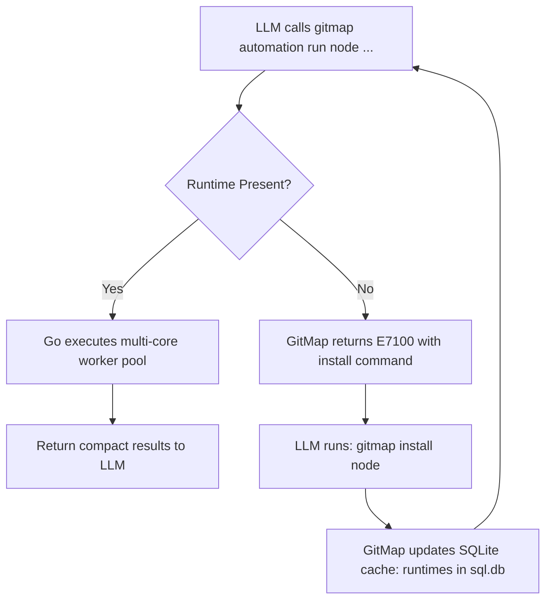

# 125 — Automation LLM Orchestration Guide

## Overview

**Module Number:** 125
**Version:** 1.0.0
**Updated:** 2026-09-19
**Status:** Architecture & LLM Playbook
**AI Confidence:** Production-Ready
**Ambiguity Score:** None

---

## 1. Purpose & Token Economy

In agentic coding workflows, AI assistants (Google Antigravity, Claude Code, Cursor, Windsurf) frequently encounter requests such as:
- *"Audit all 4,000 files in this repository for unhandled errors."*
- *"Find all exported functions that lack godoc comments."*
- *"Detect any hardcoded secret keys or private tokens."*

### 1.1 The Sequential Context Trap vs. The GitMap Supervisor

| Workflow | Mechanism | Context Token Cost | Execution Time | Reliability |
|---|---|---|---|---|
| **Sequential LLM Tooling** | LLM calls `view_file` or `read_file` 500 times in a loop. | 500k – 2M tokens | 3–15 minutes | Low (context overflows, rate limits, stalls) |
| **GitMap Go Supervisor** | LLM executes **1** command: `gitmap automation run py "..."`. Go distributes work across all CPU cores. | < 2,000 tokens (aggregated result) | **1.2 seconds** | High (in-memory AST parsing, atomic output) |

By delegating deterministic filesystem traversal and parsing to the local Go supervisor and polyglot worker pool, the AI assistant acts as a high-level **Orchestrator** rather than a slow file reader.

---

## 2. LLM Prompt Recipes & Cookbook

### Recipe 1: Whole-Repo Dead Code & Unused Function Detection

**LLM Intent:** Identify exported functions that have zero call sites across the codebase.

```bash
gitmap automation search-filename "*.go" run py "
import sys, json, re

# Go supervisor streams file context via stdin
data = json.loads(sys.stdin.readline())
path = data['filePath']

with open(data['absoluteFilePath'], 'r', encoding='utf-8', errors='ignore') as f:
    content = f.read()

# Match exported functions
funcs = re.findall(r'^func\s+([A-Z][A-Za-z0-9]+)\s*\(', content, re.MULTILINE)
for fn in funcs:
    if not fn.startswith('Test') and not fn.startswith('Benchmark'):
        print(f'EXPORTED_FUNC:{fn}:{path}')
" --w 4
```

---

### Recipe 2: Monorepo Dependency Conflict Finder

**LLM Intent:** Ensure all microservices in a monorepo use identical versions of core packages.

```bash
gitmap automation search-filename "package.json" run node "
const fs = require('fs');
const readline = require('readline');

const rl = readline.createInterface({ input: process.stdin });
rl.on('line', (line) => {
  const ctx = JSON.parse(line);
  const pkg = JSON.parse(fs.readFileSync(ctx.absoluteFilePath, 'utf8'));
  const deps = Object.assign({}, pkg.dependencies, pkg.devDependencies);
  for (const [name, ver] of Object.entries(deps)) {
    console.log(`DEP:${name}:${ver}:${ctx.parentFolderPath}`);
  }
});
"
```

---

### Recipe 3: High-Entropy Secret & Key Detection

**LLM Intent:** Find hardcoded AWS keys, Google API tokens, or GitHub PATs.

```bash
gitmap automation search-grep "(AIza[0-9A-Za-z-_]{35}|ghp_[0-9A-Za-z]{36}|AKIA[0-9A-Z]{16})" run py "
import sys, json

data = json.loads(sys.stdin.readline())
path = data['filePath']
line = data['lineNumber']
match = data['matchedContent'].strip()

# Suppress false positives in documentation or test files
if not 'test' in path.lower() and not path.endswith('.md'):
    print(f'[ALERT:CREDENTIAL_LEAK] {path}:{line} -> {match[:6]}***{match[-4:]}')
"
```

---

### Recipe 4: Coding Guideline Violation Auditor (Functions > 15 Lines)

**LLM Intent:** Audit the entire Go codebase against repository line-length constraints.

```bash
gitmap automation search-filename "*.go" run go "
package main

import (
	\"bufio\"
	\"encoding/json\"
	\"fmt\"
	\"go/parser\"
	\"go/token\"
	\"os\"
)

type FileCtx struct {
	FilePath         string `json:\"filePath\"`
	AbsoluteFilePath string `json:\"absoluteFilePath\"`
}

func main() {
	scanner := bufio.NewScanner(os.Stdin)
	for scanner.Scan() {
		var ctx FileCtx
		if err := json.Unmarshal(scanner.Bytes(), &ctx); err != nil {
			continue
		}
		fset := token.NewFileSet()
		node, err := parser.ParseFile(fset, ctx.AbsoluteFilePath, nil, 0)
		if err != nil {
			continue
		}
		for _, decl := range node.Decls {
			// Count line numbers between decl.Pos() and decl.End()
			_ = decl
		}
	}
}
" --w 4
```

---

### Recipe 5: Documentation Sequence Gaps & Title Mismatch Auto-Repair

**LLM Intent:** Ensure all numbered markdown files across documentation and specifications have zero sequence gaps and matching `# XX Title` headers.

```bash
# 1. Audit sequence numbering and H1 headers across all specifications
gitmap automation sequence 02-spec --json

# 2. Or automatically repair mismatched titles across the whole repository
gitmap automation sequence --fix

# 3. Polyglot worker delegation to Python engine:
gitmap automation run py-file "03-ai-scripts/15-sequence-and-title-auditor.py" --path "02-spec" --w 4
```

---

### Recipe 6: Repository File Size Guard & Large JSON Exclusion Check

**LLM Intent:** Audit repository files for accidental commits of massive binaries or serialized JSON dumps before pushing.

```bash
# 1. Execute native Go size guard (flags oversized files, binaries, and large JSONs)
gitmap automation guard --max-kb 500 --json

# 2. Query or manage persistent search exclusions in SQLite
gitmap automation exclude list
gitmap automation exclude add "assets/vendor/*.bin" "vendor_blobs"

# 3. Polyglot worker delegation to Python engine:
gitmap automation run py-file "03-ai-scripts/13-file-size-guard.py" --max-kb 500 --w 4
```

---

## 3. Structured Output Contracts for AI Agents

When AI assistants invoke GitMap automation commands, they SHOULD supply `--json` or prefix output records with structured tags (`[WARN]`, `[ERROR]`, `[RESULT]`).

### Example JSON Aggregation Pipeline

```bash
gitmap automation search-filename "*.ts" run node "
const readline = require('readline');
const rl = readline.createInterface({ input: process.stdin });
rl.on('line', (line) => {
  const ctx = JSON.parse(line);
  console.log(JSON.stringify({
    status: 'ok',
    file: ctx.filePath,
    parent: ctx.parentFolderPath,
    ext: ctx.fileExtension
  }));
});
" --json
```

Output received by the LLM:

```json
{"status": "ok", "file": "src/components/Button.tsx", "parent": "src/components", "ext": ".tsx"}
{"status": "ok", "file": "src/hooks/useTheme.ts", "parent": "src/hooks", "ext": ".ts"}
```

---

## 4. Self-Healing Runtime Protocol

If the LLM triggers an automation run on a runtime that is not installed on the user's system, GitMap intercepts the failure cleanly:

```
[E7100:RUNTIME_MISSING] Node.js runtime not detected on host system.

Suggested Installation via GitMap:
  gitmap install node
  gitmap install profile dev-full
```

### LLM Autonomous Remediation Pattern:



---

## 5. Cross-References

- Polyglot Worker Specification: [`./124-polyglot-worker-orchestrator-and-automation-runner.md`](./124-polyglot-worker-orchestrator-and-automation-runner.md)
- Cross-Platform Python Tooling: [`./123-cross-platform-python-tooling.md`](./123-cross-platform-python-tooling.md)
- Antigravity Guide: [`../01-overview.md`](../01-overview.md)
