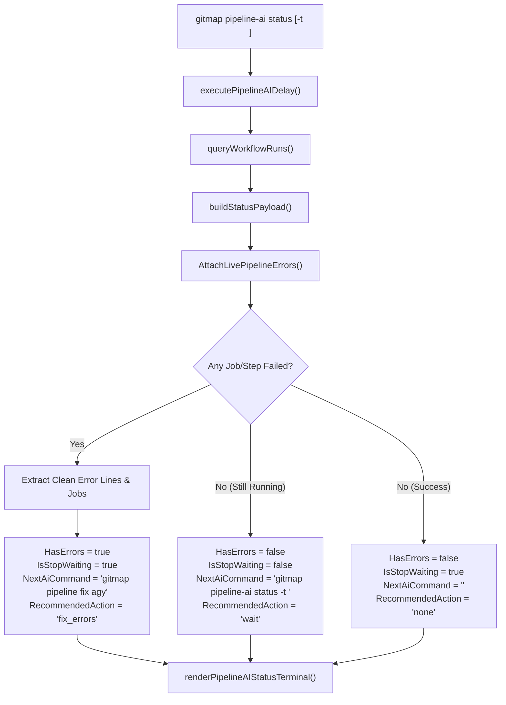

# Spec 130: Pipeline-AI Live Error Streaming, Auto-Stop, and Fast-Forward Remediation Suite

> **Status:** Active  
> **Package:** `cli/cmdpipeline`, `cli/cmdagy`  
> **Related Specs:** [Spec 129](129-pr-commit-engines-and-sqlite-split-db.md), [Spec 84](../09-pipeline/01-ci-pipeline.md), [Spec 85](../09-pipeline-extend-v2/01-pipeline-v2.md)

---

## 1. Executive Overview & Objectives

Spec 130 specifies the **Pipeline-AI Live Error Streaming & Auto-Stop Remediation Engine** for GitMap CLI.

### Core Objectives
1. **Real-Time Job/Step Failure Scanning:** While a CI/CD workflow run is active (`in_progress`), scan individual jobs and steps via `queryRunJobs`. Detect step and job failures immediately rather than waiting for the entire multi-job suite or full ETA to elapse.
2. **Early Error Log Extraction:** If any job or step fails during active runs, immediately extract clean, actionable error lines from GitHub Actions logs (`queryFailedRunLogs` and `extractCleanErrorLines`).
3. **Structured AI Status Diagnostics:** Extend `PipelineStatusPayload` with affirmative fields:
   - `HasErrors bool` (`json:"hasErrors"`)
   - `IsStopWaiting bool` (`json:"isStopWaiting"`)
   - `RecommendedAction string` (`json:"recommendedAction"`) — `"fix_errors"` vs `"wait"`
   - `FailedJobCount int` (`json:"failedJobCount,omitempty"`)
   - `ErrorSummary string` (`json:"errorSummary,omitempty"`)
   - `ErrorLogs string` (`json:"errorLogs,omitempty"`)
   - `ActionableErrorSnippet string` (`json:"actionableErrorSnippet,omitempty"`)
   - `FailedJobs []FailedJobItem` (`json:"failedJobs,omitempty"`)
4. **Fast-Forward Auto-Remediation Switching:** Automatically switch `NextAiCommand` to `gitmap pipeline fix agy` when errors exist, instructing autonomous AI agents and developers to stop waiting and begin fixing failures in parallel.
5. **Streaming Terminal UI Alert:** Display a bold red alert banner `[LIVE CI/CD ERROR DETECTED - STOP WAITING]` with the failing job, step, and error snippet directly in the status output.
6. **Native `pipeline-ai errors` Subcommand:** Provide a dedicated shortcut to query and format pipeline errors with AI remediation guidance.

---

## 2. Architecture & Data Flow



---

## 3. Terminal Interface Specification

### 3.1 Live Error Detected State
```text
  ● Repo:             alimtvnetwork/gitmap-v28
  ● Status:           RUNNING (build-and-test, ETA: 2m45s)
  ● Last Tag Release: v6.274.0
  ● Pending Pipelines: 1
  ● Pending PRs:       0
  ● Run URL:           https://github.com/alimtvnetwork/gitmap-v28/actions/runs/123456789

  [LIVE CI/CD ERROR DETECTED - STOP WAITING]
  ● Failing Job / Step: lint-and-test / run-linter
    Step 'run-linter' failed in job 'lint-and-test'
  ● Error Snippet:
    golangci-lint run --timeout=5m
    cli/cmdpipeline/pipeline_ai.go:45:1: cyclomatic complexity 16 of func foo is high (> 15)
    exit status 1

  🞠 AI Automation Next Action:
     Run: gitmap pipeline fix agy
     (Stop waiting for remaining jobs. Fix current failure now so CI/CD can rerun in parallel.)
```

---

## 4. Coding Guidelines & Invariants
- **Function Brevity:** Every function strictly &le; 15 lines.
- **Affirmative Booleans:** `HasErrors`, `IsStopWaiting`, `IsRunning`, `isJSON` (Total ban on `should*`, `can*`, negative booleans).
- **Zero Nested Ifs:** Nesting depth &le; 1 across all functions.
- **Unix LF Endings:** Strict Unix line endings.
- **Error Propagation:** Universal `*apperror.AppError` return wrappers where applicable.
