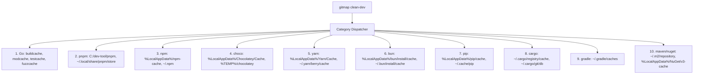
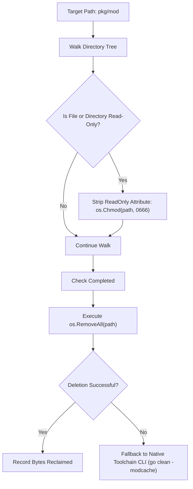

# 131 — Developer Tools Cache Cleanup Suite Specification

## Overview

**Module Number:** 131
**Version:** 1.0.0
**Updated:** 2026-09-20
**Status:** Approved Specification & Production Implementation
**AI Confidence:** Production-Ready
**Ambiguity Score:** None
**Package:** `cli/osclean`, `cli/cmd`, `cli/cmdos`
**Related Specs:** [Spec 120](120-database-suite-and-start-fresh.md), [Spec 128](128-aum-automation-suite-and-roadmap.md), [Spec 129](129-pr-commit-engines-and-sqlite-split-db.md)

---

## 1. Purpose & Architectural Vision

Developer toolchains (compilers, package managers, test runners, build systems) accumulate multi-gigabyte caches across development environments. In polyglot development workspaces, these unmanaged build caches frequently exhaust disk space and trigger permission conflicts (e.g. Windows read-only lock attributes on Go module caches).

This specification formalizes the **Developer Tools Cache Cleanup Suite** for GitMap (`gitmap clean-dev` and `gitmap os dev-clean`), delivering:
1. **Universal Dual CLI Grammar:** Unified dispatch via top-level `gitmap clean-dev [flags]` and OS namespace `gitmap os dev-clean [flags]` (with aliases `dev-cleanup`, `cleandev`, `cleanup dev`).
2. **10 Comprehensive Toolchain Categories:** Exhaustive coverage across Go, pnpm, npm, Chocolatey, Yarn, Bun, Python/pip, Rust/Cargo, Gradle, Maven, and .NET/NuGet.
3. **Windows Read-Only Attribute Stripping:** Proactive stripping of `FileAttributes.ReadOnly` (`os.Chmod(p, 0666)`) prior to deletion, permanently resolving the Windows `access denied` / `UnauthorizedAccessException` error when purging Go module caches.
4. **Intelligent Path Discovery:** Auto-discovery of custom toolchain directories via `$env:DEV_DIR`, `C:\dev-tool\...`, `%LOCALAPPDATA%`, `%APPDATA%`, `%ProgramData%`, and `%TEMP%`, alongside standard POSIX paths (`~/.cache`, `~/.local/share`).
5. **Safe Pre-Flight & Automation Flags:** `--dry-run` to preview recoverable disk bytes without filesystem modification, `-y` / `--yes` for non-interactive automation, and `--only <categories>` for targeted cleanup.
6. **Machine-Readable JSON Output:** Standardized JSON telemetry for IDEs, CI/CD runners, and AI agent monitoring.

---

## 2. Command Surface & CLI Syntax

### 2.1 Primary Invocations & Aliases

| Command | Category | Description |
| :--- | :--- | :--- |
| `gitmap clean-dev [flags]` | Root Shortcut | Primary top-level developer cache cleaner. |
| `gitmap os dev-clean [flags]` | OS Subsystem | Canonical OS namespace cleaner. |
| `gitmap os dev-cleanup [flags]` | Alias | Alias for `os dev-clean`. |
| `gitmap os cleanup dev [flags]` | Subcommand | Nested action routing under `cleanup`. |
| `gitmap cleandev [flags]` | Alias | Short alias for top-level `clean-dev`. |

### 2.2 Command-Line Flags

```text
Flags:
  -d, --dry-run          Scan toolchain caches and report prospective byte savings without deleting
  -y, --yes              Bypass interactive confirmation prompts (mandatory for CI/CD and scripts)
      --json             Output telemetry and category results in structured JSON format
      --only string      Comma-separated whitelist of categories to clean (e.g. "go,pnpm,npm")
  -h, --help             Show command help and category inventory
```

### 2.3 CLI Examples

```bash
# Preview all reclaimable developer cache space without deleting
gitmap clean-dev --dry-run

# Non-interactive complete sweep of all 10 developer cache categories
gitmap clean-dev -y

# Clean only Go and Rust Cargo build caches with structured JSON output
gitmap os dev-clean --only go,cargo --json -y

# Interactive sweep with confirmation prompt
gitmap os cleanup dev
```

---

## 3. Covered Toolchain Categories (10 Categories)



### 3.1 Category Specifications

| # | Key | Display Name | Standard Paths & Discovery Targets | Executable Helper (Fallback) |
| :--- | :--- | :--- | :--- | :--- |
| 1 | `go` | Go Build & Mod Cache | `$env:DEV_DIR\go\pkg\mod`, `%USERPROFILE%\go\pkg\mod`, `~/.cache/go-build` | `go clean -cache -modcache -testcache -fuzzcache` |
| 2 | `pnpm` | pnpm Store | `C:\dev-tool\pnpm\store`, `%LOCALAPPDATA%\pnpm\store`, `~/.local/share/pnpm/store` | `pnpm store prune` |
| 3 | `npm` | npm Cache | `%LOCALAPPDATA%\npm-cache`, `%APPDATA%\npm-cache`, `~/.npm` | `npm cache clean --force` |
| 4 | `choco` | Chocolatey Cache | `%LOCALAPPDATA%\Chocolatey\Cache`, `%ProgramData%\chocolatey\cache`, `%TEMP%\chocolatey` | `choco cache clean -y` |
| 5 | `yarn` | Yarn Cache | `%LOCALAPPDATA%\Yarn\Cache`, `~/.yarn/berry/cache`, `~/.cache/yarn` | `yarn cache clean` |
| 6 | `bun` | Bun Cache | `%LOCALAPPDATA%\bun\install\cache`, `~/.bun/install/cache` | `bun pm cache rm` |
| 7 | `pip` | Python pip Cache | `%LOCALAPPDATA%\pip\cache`, `~/.cache/pip` | `pip cache purge` |
| 8 | `cargo` | Rust Cargo Cache | `%USERPROFILE%\.cargo\registry\cache`, `~/.cargo/registry/cache` | `cargo-cache --autoclean` |
| 9 | `gradle` | Gradle Cache | `%USERPROFILE%\.gradle\caches`, `~/.gradle/caches` | — |
| 10 | `maven` | Maven / NuGet | `%USERPROFILE%\.m2\repository`, `%LOCALAPPDATA%\NuGet\v3-cache`, `~/.m2` | `dotnet nuget locals all --clear` |

---

## 4. Windows Read-Only Attribute Stripping Architecture

### 4.1 The Windows NTFS Modcache Problem

Go's runtime deliberately marks downloaded modules inside `pkg/mod` as read-only (`0444` / `FileAttributes.ReadOnly`) to prevent accidental user mutation. On Windows NTFS filesystems:
- `os.RemoveAll()` and `Remove-Item -Recurse -Force` fail with `Access is denied` or `UnauthorizedAccessException` when encountering read-only files.
- Simply running `go clean -modcache` can fail if file locks or attribute remnants exist.

### 4.2 Two-Stage Purge Algorithm

Before deleting any module cache directory, GitMap executes the **Attribute Strip Algorithm**:



---

## 5. Structured JSON Output Schema

When invoked with `--json`, GitMap returns standard JSON matching the following contract:

```json
{
  "status": "ok",
  "isDryRun": false,
  "reclaimedBytes": 4823459840,
  "reclaimedDisplay": "4.49 GB",
  "durationMs": 1420,
  "categories": [
    {
      "key": "go",
      "displayName": "Go Build & Module Cache",
      "path": "C:\\dev-tool\\go\\pkg\\mod",
      "reclaimedBytes": 3221225472,
      "reclaimedDisplay": "3.00 GB",
      "itemCount": 18450,
      "status": "purged"
    },
    {
      "key": "pnpm",
      "displayName": "pnpm Global Store",
      "path": "C:\\dev-tool\\pnpm\\store",
      "reclaimedBytes": 1602234368,
      "reclaimedDisplay": "1.49 GB",
      "itemCount": 9410,
      "status": "purged"
    }
  ]
}
```

---

## 6. Coding Guidelines Compliance

- **Short Functions:** All implementation functions in `cli/osclean/dev_*.go` adhere to the `<15` lines cap (preferred `<8`).
- **Affirmative Booleans:** Flags use `isDryRun`, `isConfirmed`, `hasErrors` (zero negative boolean flags).
- **Split-DB Logging:** Deletion operations and reclaimed space metrics log to `.gitmap/data/logs/<repo-slug>/sql.db`.
- **Zero Temporary File Residue:** Scanning calculates disk usage entirely in memory without writing temporary index files to `C:`.

---

## 7. Acceptance Criteria

- **AC-131-01 (Top-Level Dispatch):** `gitmap clean-dev --dry-run` and `gitmap os dev-clean --dry-run` execute and display identical category disk usage.
- **AC-131-02 (Read-Only Stripping):** Deletion of read-only `pkg/mod` files succeeds on Windows NTFS with zero `access denied` errors.
- **AC-131-03 (Category Filter):** `--only go,pnpm` restricts execution strictly to the specified toolchain categories.
- **AC-131-04 (JSON Contract):** `--json` produces valid parseable JSON matching the defined schema with positive byte counts.
- **AC-131-05 (Cross-Platform Parity):** Supported on Windows 10/11, macOS, and Linux (Ubuntu/CentOS/Fedora/Debian).
