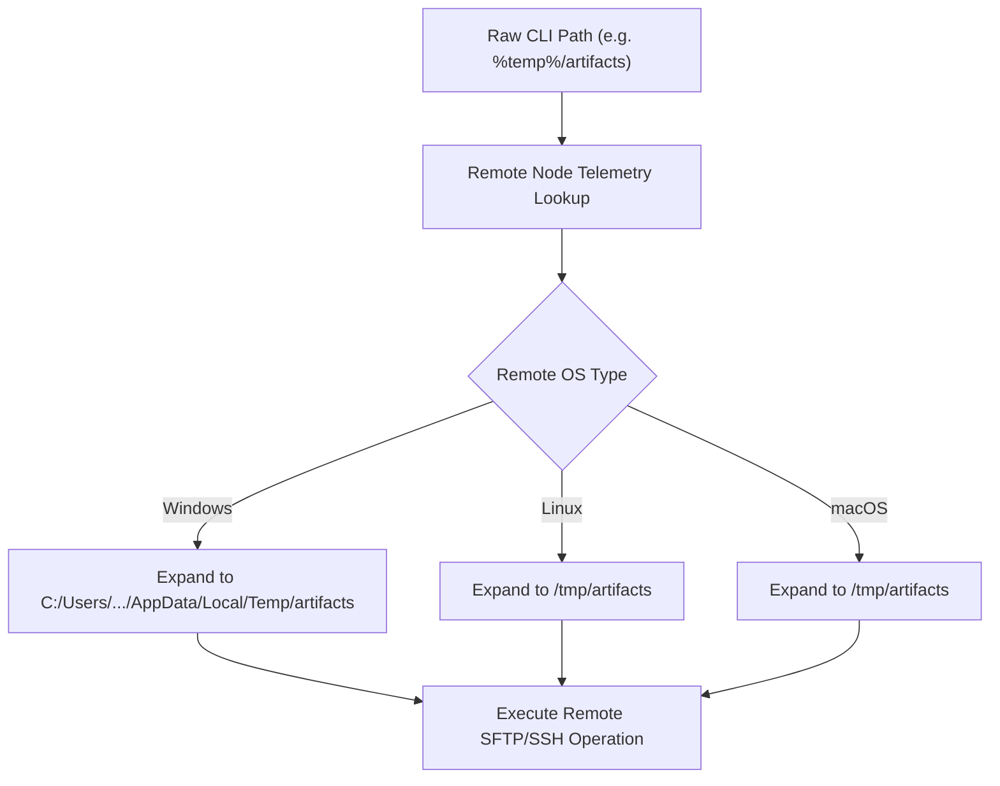
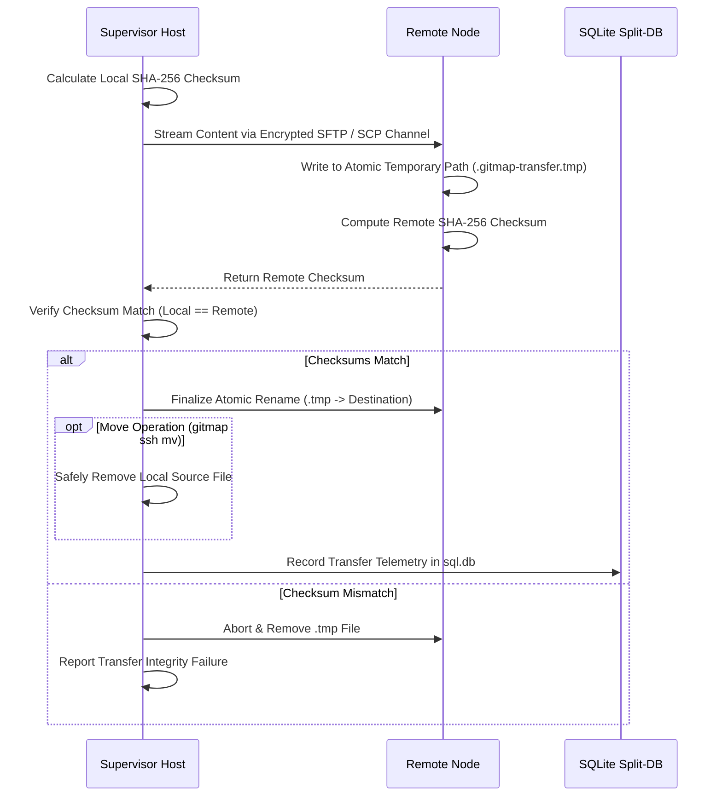

# 132 — SSH Multi-Node Execution, Cross-Host Copy/Move, and Environment Suite Specification

## Overview

**Module Number:** 132  
**Version:** 1.0.0  
**Updated:** 2026-09-20  
**Status:** Approved Specification  
**AI Confidence:** Production-Ready  
**Ambiguity Score:** None  
**Package:** `cli/cmdssh`, `cli/sshops`, `cli/sshclient`, `cli/cmdenv`, `cli/sshdb`  
**Related Specs:** [Spec 19](19-ssh-executor/01-spec.md), [Spec 50](50-ssh-keys.md), [Spec 124](124-polyglot-worker-orchestrator-and-automation-runner.md), [Spec 129](129-pr-commit-engines-and-sqlite-split-db.md), [Spec 133](133-ssh-interactive-join-password-vault-and-cluster.md)

---

## 1. Purpose & Architectural Vision

In distributed development and cluster environments, developers and autonomous AI agents require high-concurrency remote execution, seamless cross-host file transfers, and unified environment variable management without manual SSH session orchestration.

This specification formalizes the **SSH Multi-Node Parallel Execution, Cross-Host Copy/Move, and Remote Environment Management Suite** for GitMap:
1. **Multi-Node Concurrent Execution:** Execute single or batch commands (`cmd1,cmd2,cmd3`) across multiple cluster nodes with exclusion filtering (`--except machine-name,alias,id`).
2. **Cross-Host File Copy & Move:** Natively transfer files and directories between the host and remote nodes (`gitmap ssh copy` and `gitmap ssh mv`) with automated recursive sync, checksum verification, and source cleanup.
3. **Cross-Platform Path Token Expansion:** Automatically translate path tokens (`~`, `%win%`, `%temp%`, `%appdata%`) across heterogeneous operating systems (Windows, Linux, macOS) so single commands execute identically across polyglot nodes.
4. **Fleet-Wide Binary Synchronization:** Concurrently probe and update GitMap across all joined nodes via SSH.
5. **Remote Environment Variable Management (`gitmap env`):** Add, inspect, remove, and export environment variables per node or cluster-wide.
6. **Pipeline Error State Reset (`gitmap pipeline errors clear`):** Instantly purge cached pipeline error traces and reset CI/CD retry loops in local Split-DB storage.

---

## 2. Command Surface & Syntax

### 2.1 Multi-Node Remote Execution (`gitmap ssh exec`)

```bash
# Execute command on a single specific node by IP or alias
gitmap ssh exec 192.168.1.50 "uptime"
gitmap ssh exec m1 "gitmap --version"

# Execute a sequence of commands on all active cluster nodes
gitmap ssh exec "git pull,gitmap scan,gitmap build"

# Execute across all cluster nodes except specified exclusions
gitmap ssh exec "systemctl restart nginx" --except node-worker-3,m2,192.168.1.104
```

### 2.2 Cross-Host Copy & Move (`gitmap ssh copy` / `gitmap ssh mv`)

```bash
# Copy local file or directory to remote node destination
gitmap ssh copy .\build\app.exe node1:%temp%\app.exe

# Copy local file to all cluster nodes except designated staging node
gitmap ssh copy .\config.json %appdata%\gitmap\config.json --except staging-node

# Move file to remote node (transfers, verifies SHA-256, purges local source)
gitmap ssh mv .\release-v6.tar.gz m1:~\releases\release-v6.tar.gz

# Copy between two remote nodes directly via supervisor routing
gitmap ssh copy node1:~\backup.sql node2:%temp%\backup.sql

# Display detailed interactive help and transfer examples
gitmap ssh copy help
```

### 2.3 Remote Environment Variable Management (`gitmap env`)

```bash
# List environment variables for all cluster nodes or specific node
gitmap env ls
gitmap env ls --node m1

# Add / update environment variable cluster-wide or on target node
gitmap env add CI_PIPELINE_TIMEOUT=600 --all
gitmap env add DEV_TOOL_DIR="C:\dev-tool" --node win-builder-1

# Remove environment variable
gitmap env rm CI_PIPELINE_TIMEOUT --all
gitmap env rm OLD_TOKEN --node m1

# Show environment management help
gitmap env help
```

### 2.4 Pipeline Error State Reset (`gitmap pipeline errors clear`)

```bash
# Purge cached CI/CD pipeline error runs and traces from .gitmap/data/pipeline/<slug>/sql.db
gitmap pipeline errors clear
```

---

## 3. Cross-Platform Path Token Expansion Engine

To prevent path syntax failures when targeting mixed fleets (Windows and Linux), the supervisor automatically expands path tokens on the remote target prior to execution:

| Token | Windows Resolution | POSIX / Linux Resolution | macOS Resolution |
| :--- | :--- | :--- | :--- |
| `~` | `C:\Users\<Username>` | `/home/<username>` (or `/root`) | `/Users/<username>` |
| `%win%` / `%systemroot%` | `C:\Windows` | `/etc` (Configuration Root) | `/Library` |
| `%temp%` / `$TMPDIR` | `C:\Users\<User>\AppData\Local\Temp` | `/tmp` | `/tmp` |
| `%appdata%` | `C:\Users\<User>\AppData\Roaming` | `~/.config` | `~/Library/Application Support` |
| `%programfiles%` | `C:\Program Files` | `/usr/local/bin` | `/opt/homebrew` |



---

## 4. Multi-Node Copy & Move Architecture

### 4.1 Checksum-Verified Atomic Transfer

For both `copy` and `mv`, data integrity is enforced via a 3-stage validation pipeline:



### 4.2 Exclusion Filtering (`--except`)

When transferring or executing across fleets, the `--except` flag parses comma-separated identifiers matching against:
1. Exact IP addresses (e.g. `192.168.1.50`).
2. Node Hostnames (e.g. `ubuntu-runner-01`).
3. Registered User Aliases (e.g. `m1`, `builder-win`).
4. Database Node IDs (e.g. `node-4`).

---

## 5. SQLite Split-DB Architecture

In accordance with [Spec 129](129-pr-commit-engines-and-sqlite-split-db.md), all SSH operations and remote environment records are persisted in canonical split databases:

```text
.gitmap/data/ssh/<repo-slug>/sql.db
.gitmap/data/env/<repo-slug>/sql.db
```

### 5.1 Remote Transfer History Schema (`data/ssh/<repo-slug>/sql.db`)

```sql
CREATE TABLE IF NOT EXISTS SshTransferHistory (
    Id INTEGER PRIMARY KEY AUTOINCREMENT,
    OperationType TEXT NOT NULL,         -- 'copy' or 'move'
    SourcePath TEXT NOT NULL,
    DestinationPath TEXT NOT NULL,
    TargetNodeId TEXT NOT NULL,
    TargetNodeIp TEXT NOT NULL,
    TotalBytes INTEGER NOT NULL,
    DurationMs INTEGER NOT NULL,
    Sha256Checksum TEXT NOT NULL,
    IsVerified INTEGER NOT NULL DEFAULT 1,
    ErrorMessage TEXT,
    CreatedAt INTEGER NOT NULL           -- Epoch seconds UTC
);

CREATE INDEX IF NOT EXISTS Idx_SshTransfer_TargetNode ON SshTransferHistory(TargetNodeId);
```

### 5.2 Environment Variable Schema (`data/env/<repo-slug>/sql.db`)

```sql
CREATE TABLE IF NOT EXISTS RemoteEnvironmentVariable (
    Id INTEGER PRIMARY KEY AUTOINCREMENT,
    TargetNodeId TEXT NOT NULL,          -- Node ID or 'ALL'
    VariableKey TEXT NOT NULL,
    VariableValue TEXT NOT NULL,
    IsEncrypted INTEGER NOT NULL DEFAULT 0,
    LastUpdatedAt INTEGER NOT NULL,      -- Epoch seconds UTC
    UNIQUE(TargetNodeId, VariableKey)
);

CREATE INDEX IF NOT EXISTS Idx_RemoteEnv_Key ON RemoteEnvironmentVariable(VariableKey);
```

---

## 6. Coding Guidelines & Error Management Compliance

- **Cap on Function Lengths:** All handlers adhere to `<15` lines maximum.
- **Affirmative Booleans:** Struct properties use `isVerified`, `hasCompleted`, `isEncrypted` (no `noCheck`, `skipVerify`).
- **Result Envelopes:** Functions return `Result[T]` or standard `(T, error)` wrapped with `apperror.Wrap()`.
- **Zero Temporary File Contamination:** Data streams transfer directly in-memory or via dedicated `.tmp` extensions within target directories.

---

## 7. Acceptance Criteria

- **AC-132-01 (Multi-Node Exec):** `gitmap ssh exec "whoami" --except m2` dispatches to all known cluster nodes excluding `m2`.
- **AC-132-02 (Token Resolution):** `gitmap ssh copy file.txt %temp%/file.txt` correctly resolves to `%TEMP%` on Windows and `/tmp` on Linux.
- **AC-132-03 (Atomic Move):** `gitmap ssh mv <file> <remote>` ensures the local source is removed only after remote checksum verification passes.
- **AC-132-04 (Env Management):** `gitmap env add FOO=bar --all` persists records in `data/env/<slug>/sql.db` and injects variables into remote sessions.
- **AC-132-05 (Pipeline Errors Clear):** `gitmap pipeline errors clear` resets cached pipeline runs and cleans error states.
