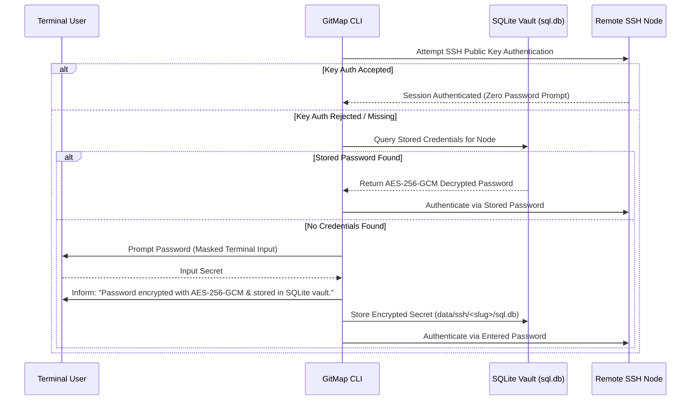
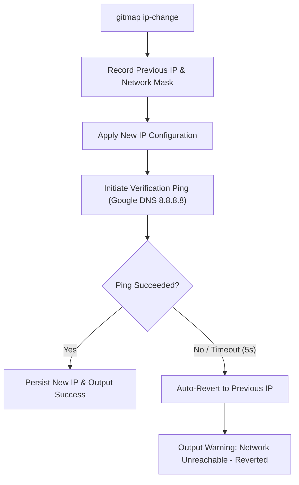

# 133 — SSH Interactive Join, Encrypted Password Vault, and Cluster Architecture Specification

## Overview

**Module Number:** 133  
**Version:** 1.0.0  
**Updated:** 2026-09-20  
**Status:** Approved Specification  
**AI Confidence:** Production-Ready  
**Ambiguity Score:** None  
**Package:** `cli/cmdssh`, `cli/sshjoin`, `cli/sshvault`, `cli/cmdcluster`, `cli/clusterdb`, `cli/netdiag`  
**Related Specs:** [Spec 19](19-ssh-executor/01-spec.md), [Spec 50](50-ssh-keys.md), [Spec 124](124-polyglot-worker-orchestrator-and-automation-runner.md), [Spec 129](129-pr-commit-engines-and-sqlite-split-db.md), [Spec 132](132-ssh-multinode-exec-copy-mv-and-env.md)

---

## 1. Purpose & Architectural Vision

Managing heterogeneous server fleets requires painless authentication bootstrapping, secure credential persistence, dynamic node telemetry discovery, and safe networking primitives.

This specification formalizes the **SSH Interactive Join, Encrypted Password Vault, and Cluster Architecture** for GitMap:
1. **Order-Agnostic Connection Grammar:** Universal support for both `user@ip` and `ip@user` across `gitmap ssh login`, `gitmap ssh-join`, and direct execution shortcuts.
2. **Persistent Host Aliasing:** Bind machine identifiers via `gitmap ssh <ip> as '<alias>'` so subsequent operations use convenient short names (e.g. `gitmap ssh m1`).
3. **Automated Known Hosts Trust:** Seamlessly auto-accept new host keys (`StrictHostKeyChecking=accept-new`) without disrupting CLI pipelines.
4. **Interactive Hidden Password Prompting & Encrypted SQLite Vault:** If SSH key authentication is rejected, GitMap prompts for credentials via masked terminal input (`terminal.ReadPassword`), encrypts the secret using AES-256-GCM, stores it in the local Split-DB (`data/ssh/<slug>/sql.db`), and transparently reuses it on future runs with zero user friction.
5. **One-Shot Remote Provisioning (`login-install`):** Remotely bootstrap and install GitMap on newly joined nodes over SSH in a single command.
6. **Fleet Cluster Tracking & History:** Join nodes into the active cluster (`ssh-join` / `sj add`), inspect historical membership (`sj history`), remove nodes (`sj rm`), and audit fleet inventory (`sj ls`).
7. **Mutual Public Key Authorization (`add-auth`):** Automatically inject the local host's public SSH key into the remote guest's `~/.ssh/authorized_keys` (or Windows `administrators_authorized_keys`), escalating privileges with `sudo` if required.
8. **Cross-Platform IP Discovery & Verified IP Modification:** Discover local IPs across Windows, Linux (Ubuntu, CentOS, Fedora, Debian), and macOS via `gitmap ip`. Modify network adapter settings via `gitmap ip-change <new-ip>` with an automated ping verification loop that instantly reverts if connectivity fails.
9. **Cluster Join vs SSH Join Differentiation:** Documented separation between single-node remote execution (`ssh join`) and distributed cooperative swarm orchestration (`cluster join`).

---

## 2. Universal Connection Grammar & Aliasing

### 2.1 Order-Agnostic Syntax

GitMap parses both positional permutations:

```bash
# Both permutations supported identically for login:
gitmap ssh login 192.168.1.50@deployer
gitmap ssh login deployer@192.168.1.50

# Direct execution shortcuts:
gitmap ssh deployer@192.168.1.50
gitmap ssh 192.168.1.50@deployer
```

### 2.2 Alias Registration and Reuse

```bash
# Register an IP or connection string under an alias
gitmap ssh 192.168.1.50 as 'm1'
gitmap ssh deployer@192.168.1.50 as 'builder-win'

# Subsequent invocations resolve the target from SQLite
gitmap ssh m1
gitmap ssh builder-win
```

---

## 3. Interactive Password Interception & Encrypted SQLite Vault

### 3.1 Authentication Workflow & Vault Storage



### 3.2 Vault Management Commands

```bash
# List all stored credentials (masked fingerprints and aliases)
gitmap ssh vault ls

# Inspect credential metadata for a specific machine
gitmap ssh vault inspect m1

# Remove stored credential from local vault
gitmap ssh vault rm m1
```

---

## 4. Remote Provisioning & Fleet Membership

### 4.1 Automated Remote Installation (`login-install`)

```bash
# Log in to remote host, detect remote OS & architecture, download & install GitMap
gitmap ssh login-install deployer@192.168.1.50
```

### 4.2 Fleet Join & Membership Grammar (`ssh-join` & `sj`)

| Command | Shorthand | Description |
| :--- | :--- | :--- |
| `gitmap ssh-join <user@ip>` | `gitmap sj add <ip>` | Join target machine into GitMap fleet and record telemetry. |
| `gitmap ssh-joined ls` | `gitmap sj ls` | List all joined nodes with names, IPs, IDs, and statuses. |
| `gitmap ssh-join history` | `gitmap sj history` | Display join audit log (timestamps, joining user, events). |
| `gitmap ssh-join rm <id>` | `gitmap sj rm <alias>` | Remove a machine from active cluster tracking. |
| `gitmap ssh-join add-auth <target>` | `gitmap sj add-auth <target>` | Deploy host public key to target's `authorized_keys`. |

### 4.3 Node Telemetry Persistence

Upon first join, GitMap executes a non-intrusive probe recording:
- **Operating System:** `windows`, `linux`, `darwin`
- **Distribution & Version:** e.g. `Ubuntu 24.04 LTS`, `CentOS Stream 9`, `Windows 11 Pro 23H2`
- **Architecture:** `amd64`, `arm64`
- **Hardware Profile:** Logical CPU cores, total RAM, default shell (`pwsh`, `bash`, `cmd`)

---

## 5. Cross-Platform Network Discovery & Verified IP Configuration

### 5.1 Universal Local IP Discovery (`gitmap ip`)

`gitmap ip` detects active network adapters and formats IPv4 and IPv6 addresses across all operating systems:
- **Windows:** Parses `Get-NetIPAddress` / `ipconfig`.
- **Linux:** Parses `ip -br addr` / `hostname -I` (Ubuntu, CentOS, Fedora, Debian).
- **macOS:** Parses `ifconfig` for active default gateway interfaces.

### 5.2 Safe IP Modification Loop (`gitmap ip-change <new-ip>`)

Changing network adapter configurations over remote shells poses a severe risk of disconnection. GitMap enforces an automated recovery loop:



---

## 6. Cluster Join vs SSH Join Architecture

Developers frequently conflate direct SSH connections with Cluster Swarm membership. `gitmap cluster join help` provides clear architectural boundaries:

```text
================================================================================
GITMAP DISTRIBUTED ARCHITECTURE: SSH JOIN vs CLUSTER JOIN
================================================================================

1. SSH JOIN (Point-to-Point Fleet Tracking):
   • Purpose:    Federate individual standalone machines for direct remote execution.
   • Operation:  Direct SSH / SFTP command execution on designated targets.
   • State:      Stored in .gitmap/data/ssh/<slug>/sql.db.
   • Command:    gitmap ssh-join <user@ip> (or gitmap sj add <ip>)

2. CLUSTER JOIN (Distributed Cooperative Worker Swarm):
   • Purpose:    Enrolls node into GitMap polyglot worker pool (Spec 124).
   • Operation:  Go supervisor dispatches chunked AST linting, builds, and tests
                 across all cluster workers concurrently with work-stealing.
   • Heartbeat:  Continuous UDP/mDNS discovery and WebSocket control channel.
   • State:      Distributed cluster state in .gitmap/data/cluster/<slug>/sql.db.
   • Command:    gitmap cluster join <master-ip:port>

================================================================================
```

---

## 7. SQLite Storage Schema (`data/ssh/<repo-slug>/sql.db`)

```sql
CREATE TABLE IF NOT EXISTS SshNode (
    Id INTEGER PRIMARY KEY AUTOINCREMENT,
    NodeId TEXT NOT NULL UNIQUE,         -- UUID or slug (e.g. 'node-m1')
    Alias TEXT,                          -- User-assigned short name (e.g. 'm1')
    IpAddress TEXT NOT NULL,
    SshPort INTEGER NOT NULL DEFAULT 22,
    Username TEXT NOT NULL,
    OsFamily TEXT NOT NULL,              -- 'windows', 'linux', 'darwin'
    OsVersion TEXT,                      -- e.g. 'Ubuntu 24.04', 'Win 11 Build 26100'
    Architecture TEXT NOT NULL,          -- 'amd64', 'arm64'
    IsActive INTEGER NOT NULL DEFAULT 1,
    FirstJoinedAt INTEGER NOT NULL,      -- Epoch seconds UTC
    LastSeenAt INTEGER NOT NULL          -- Epoch seconds UTC
);

CREATE TABLE IF NOT EXISTS SshCredentialVault (
    Id INTEGER PRIMARY KEY AUTOINCREMENT,
    NodeId TEXT NOT NULL UNIQUE,
    EncryptedPassword TEXT NOT NULL,     -- AES-256-GCM ciphertext (Base64)
    Nonce TEXT NOT NULL,                 -- Initialization Vector (Base64)
    KeyFingerprint TEXT NOT NULL,
    UpdatedAt INTEGER NOT NULL,
    FOREIGN KEY(NodeId) REFERENCES SshNode(NodeId) ON DELETE CASCADE
);

CREATE TABLE IF NOT EXISTS SshJoinHistory (
    Id INTEGER PRIMARY KEY AUTOINCREMENT,
    NodeId TEXT NOT NULL,
    EventAction TEXT NOT NULL,           -- 'joined', 'reconnected', 'removed'
    InitiatorUser TEXT NOT NULL,
    Timestamp INTEGER NOT NULL
);
```

---

## 8. Acceptance Criteria

- **AC-133-01 (Order-Agnostic Syntax):** `gitmap ssh user@ip` and `gitmap ssh ip@user` execute identically.
- **AC-133-02 (Password Interception & Vault):** Interactive password entry is masked, encrypted with AES-256-GCM into SQLite, and reused without prompting on subsequent connections.
- **AC-133-03 (Remote Installation):** `gitmap ssh login-install user@ip` bootstraps GitMap on the remote node and registers node metadata.
- **AC-133-04 (Public Key Injection):** `gitmap ssh-join add-auth <target>` appends host public keys to target `authorized_keys` with permission checks.
- **AC-133-05 (Safe IP Change):** `gitmap ip-change` automatically reverts configuration if Google DNS ping fails within 5 seconds.
