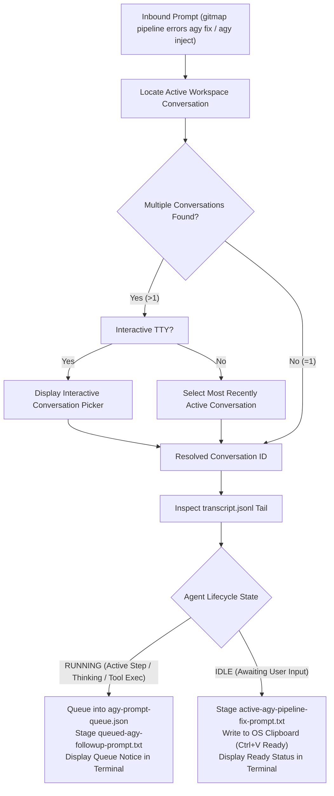

# 134 — Antigravity IDE-First Integration, Filesystem Discovery, and Queue Protocol Specification

## Overview

**Module Number:** 134  
**Version:** 1.0.0  
**Updated:** 2026-09-20  
**Status:** Approved Specification  
**AI Confidence:** Production-Ready  
**Ambiguity Score:** None  
**Package:** `cli/cmdagy`, `cli/agyfs`, `cli/agyqueue`, `cli/cmdpipeline`  
**Related Specs:** [Spec 122](122-antigravity-empty-conversations-pruner.md), [Spec 125](125-automation-llm-orchestration-guide.md), [Spec 130](130-pipeline-ai-live-error-streaming-and-remediation.md)

---

## 1. Purpose & Architectural Vision

Antigravity operates as an advanced Agentic Coding IDE. Interacting with Antigravity through ephemeral background CLI runners (`agy.exe`) is fundamentally flawed: CLI subshells lose live session context, duplicate agent state, and fail to reflect active UI conversation history.

This specification formalizes the **Antigravity IDE-First Integration, Filesystem Discovery, and Dynamic Queue Protocol** for GitMap:
1. **Strict IDE-First Mandate (Elimination of CLI Runners):** Complete removal of automated CLI runner spawning (`launchAgyBackgroundRunner`). GitMap targets the running Antigravity IDE process and its authoritative local filesystem.
2. **Authoritative Filesystem-First State Engine:** Operates directly on the Antigravity brain data directory (`~/.gemini/antigravity/`), reading active conversation trajectories, transcript logs (`transcript.jsonl`), and workspace corpus definitions without needing to start new processes.
3. **Workspace Corpus Auto-Discovery:** Matches current repository roots to Antigravity workspaces (`FindMatchingConversations(repoRoot)`), mapping project paths to live conversation IDs.
4. **Interactive Multi-Conversation Disambiguation:** When multiple conversations share a repository workspace, GitMap provides an interactive terminal selector showing conversation IDs, last activity, and user intent summaries (falling back to the most active in non-interactive mode).
5. **Two-State Dynamic Prompt Queue Protocol:**
   - **RUNNING State:** If the agent is actively executing tools or reasoning, GitMap registers prompts into the priority queue ledger (`agy-prompt-queue.json`) to prevent context clobbering.
   - **IDLE State:** If the agent is awaiting user input, GitMap stages the payload into `.ai-memory/temp/` and immediately copies it to the system clipboard for immediate execution.
6. **IDE Health Diagnostics (`gitmap agy ping`):** Probes IDE executable availability, active process PID, filesystem state, workspace pairing, agent lifecycle state, and queue backlog.
7. **Prompt Inspection & Queue Management:** Commands to inspect, list, and read conversation prompt states (`gitmap agy prompt ls`, `gitmap agy prompt read`).
8. **Pipeline-AI Auto-Remediation Bridge:** Bridges `gitmap pipeline errors agy fix` directly to the active IDE conversation with 4-part RCA formatting and follow-up verification prompts.

---

## 2. Antigravity IDE Discovery & Process Architecture

### 2.1 Standard Executable & Directory Paths

GitMap detects the official Antigravity IDE across supported platforms:

| Operating System | Default Executable Path | User Data & Brain Directory |
| :--- | :--- | :--- |
| **Windows** | `%LOCALAPPDATA%\Programs\antigravity\Antigravity.exe` | `%USERPROFILE%\.gemini\antigravity` |
| **macOS** | `/Applications/Antigravity.app/Contents/MacOS/Antigravity` | `~/.gemini/antigravity` |
| **Linux** | `/opt/antigravity/antigravity` (or `/usr/bin/antigravity`) | `~/.gemini/antigravity` |

### 2.2 Filesystem Brain Layout (`~/.gemini/antigravity/`)

```text
~/.gemini/antigravity/
├── brain/
│   └── <conversation-id>/
│       ├── .system_generated/
│       │   └── logs/
│       │       ├── transcript.jsonl         <-- Streaming event trajectory
│       │       └── transcript_full.jsonl    <-- Full untruncated content
│       ├── implementation_plan.md           <-- Active planning artifact
│       └── walkthrough.md                  <-- Verification walkthrough
```

---

## 3. Dynamic Prompt Queue Protocol



---

## 4. Command Surface & Syntax

### 4.1 IDE Diagnostics (`gitmap agy ping`)

Probes and renders the health status of the Antigravity IDE integration:

```bash
gitmap agy ping
```

**Output Rendering:**
```text
================================================================================
ANTIGRAVITY IDE DIAGNOSTICS & HEALTH CHECK
================================================================================
  ● IDE Binary:        Installed (C:\Users\Administrator\AppData\Local\Programs\antigravity\Antigravity.exe)
  ● Process Status:    RUNNING (PID: 8444)
  ● Brain Directory:   Healthy (C:\Users\Administrator\.gemini\antigravity)
  ● Active Workspace:  alimtvnetwork/gitmap-v28 (d:\work\gitmap)
  ● Conversation ID:   88823909-9574-4700-8211-015548af598b
  ● Agent State:       IDLE (Awaiting user prompt)
  ● Prompt Queue:      0 queued prompts (Clear)
================================================================================
```

### 4.2 Prompt Inspection (`gitmap agy prompt`)

```bash
# List all active prompts and queue status across conversations
gitmap agy prompt ls

# Read the last prompt or queued instruction for the active conversation
gitmap agy prompt read

# Read prompt transcript for a specific conversation ID
gitmap agy prompt read 88823909-9574-4700-8211-015548af598b
```

### 4.3 CI/CD Auto-Remediation Bridge (`gitmap pipeline fix agy`)

```bash
# Extract failing CI/CD logs, format RCA prompt, and inject into Antigravity IDE
gitmap pipeline fix agy
gitmap pipeline errors agy fix
```

---

## 5. Multi-Conversation Interactive Disambiguation

When multiple conversations map to the current workspace root, GitMap renders an interactive terminal prompt:

```text
Multiple active Antigravity conversations detected for this workspace:

  [1] Conv: 88823909-9574-4700-8211-015548af598b (Active 2m ago)
      Last: "fix CI CD please"
      State: RUNNING

  [2] Conv: 2efd3f62-99dc-4e0b-9de9-34ba0b9d18ca (Active 45m ago)
      Last: "run gitmap scan and update readme"
      State: IDLE

Select target conversation [1-2, default 1]: 
```

---

## 6. Coding Guidelines Compliance

- **Zero CLI Process Spawning:** No calls to `exec.Command("agy.exe", ...)`.
- **Function Length Guard:** All parser functions adhere strictly to `<15` lines cap.
- **Affirmative Booleans:** Struct models use `isIdeRunning`, `hasQueuedPrompts`, `isInteractive` (no inverted polarity).
- **Split-DB Telemetry:** Logs injection timestamps and conversation mappings into `.gitmap/data/logs/<repo-slug>/sql.db`.

---

## 7. Acceptance Criteria

- **AC-134-01 (No CLI Background Runner):** `gitmap pipeline fix agy` executes without starting `agy.exe` background processes.
- **AC-134-02 (Filesystem Discovery):** Successfully resolves conversations by reading `~/.gemini/antigravity/brain/*/transcript.jsonl`.
- **AC-134-03 (State-Aware Queuing):** Detects if the agent is actively executing and writes to `agy-prompt-queue.json` instead of clobbering the active prompt.
- **AC-134-04 (Clipboard Handoff):** In IDLE mode, copies the structured RCA prompt to OS clipboard with affirmative confirmation.
- **AC-134-05 (Ping Diagnostics):** `gitmap agy ping` returns zero exit code with accurate PID and agent state telemetry.
