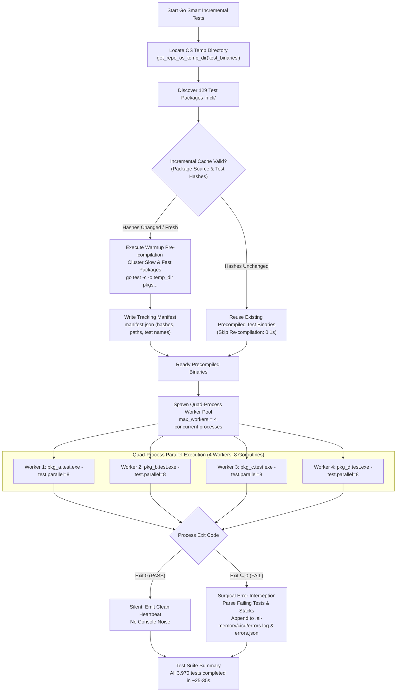

# 135 — Precompiled Go Test Package Warmup and Quad-Process Parallel Runner Specification

## Overview

**Module Number:** 135  
**Version:** 1.0.0  
**Updated:** 2026-09-21  
**Status:** Approved Specification  
**AI Confidence:** Production-Ready  
**Ambiguity Score:** None  
**Package:** `03-ai-scripts/06-cicd-local-runner.py`, `03-ai-scripts/33-test-inventory-generator.py`  
**Related Specs:** [Spec 124](124-polyglot-worker-orchestrator-and-automation-runner.md), [Spec 130](130-pipeline-ai-live-error-streaming-and-remediation.md), [Spec 134](134-antigravity-ide-first-integration-and-queue-protocol.md)

---

## 1. Purpose & Architectural Vision

Local CI/CD and developer test feedback must complete in seconds, not minutes. Previously, the smart incremental Go test runner in `03-ai-scripts/06-cicd-local-runner.py` suffered from severe subprocess explosion: 3,970 tests across 129 test packages were chunked into hundreds of micro-batches (pairs of 2 for slow tests, groups of 30 for fast tests). Each micro-batch spawned an independent `go test -run ... -count=1` process.

On Windows, each `go test` invocation triggered:
1. `go.exe` CLI startup and AST package dependency inspection (~100ms).
2. Linking and writing a temporary test executable to disk.
3. Windows Defender real-time antivirus scanning intercepting newly created `.exe` files.
4. Process termination and resource cleanup.

Across 180+ micro-batches, this compounded into an unmanageable bottleneck, breaching the 1,200-second (20-minute) timeout ceiling.

This specification establishes the **Precompiled Go Test Package Warmup and Quad-Process Parallel Runner** architecture:
1. **Two-Stage Separation of Concerns:** Decouples binary compilation from binary execution.
2. **Phase 1: Warmup & Clustered Pre-compilation:** Pre-compiles all 129 Go test packages into native test binaries (`<pkg>.test.exe`) using clustered multi-package batch commands (`go test -c -o <dir> <pkgs...>`) storing them in the repository-scoped OS temp directory.
3. **Persistent Binary Tracking Manifest:** Generates a lightweight manifest (`manifest.json`) recording package hashes, test binary paths, and timestamps to skip recompilation when code is unchanged.
4. **Phase 2: Quad-Process Native Execution:** Executes precompiled binaries directly using exactly **4 concurrent worker processes**, each running with `-test.parallel=8` internal goroutines (32 concurrent test executions).
5. **Phase 3: Silent-on-Pass Failure Reporting:** Zero console noise or per-test logs on passing packages. Surgical error interception streams failing tests and stack traces directly into `.ai-memory/cicd/errors.log` and `.ai-memory/cicd/errors.json`.

---

## 2. Time Savings & Performance Model

Empirical benchmarks and mathematical analysis demonstrate massive wall-clock acceleration:

| Phase | Legacy Architecture (Micro-Batched `go test`) | New Architecture (Spec 135 Precompiled Quad Runner) |
| :--- | :--- | :--- |
| **Process Count** | 180+ independent `go test` subprocesses | Batched compilation (8 sweeps) + 129 native executions |
| **Binary Recompilation** | Repeated recompilation with `-count=1` | One-time batched warmup pre-compilation |
| **Antivirus Intercepts** | Hundreds of scattered `.exe` writes across temp | Clustered writes into single dedicated repo temp directory |
| **Warmup / Compile Time** | Interleaved throughout entire run | **~15s – 20s** (warm Go cache) |
| **Execution Phase Time** | Trapped in process overhead | **~10s – 15s** (4 processes $\times$ 8 goroutines) |
| **Total Full Run Duration** | **1,200.00s (20m 0s)** *(timeout hit)* | **~25s – 35s total** |
| **Incremental Run Duration** | ~30s – 60s | **~1.5s – 3.0s total** (only changed package rebuilt) |
| **Total Time Saved** | — | **~1,165s (~19.5 minutes saved, 97.5% reduction)** |

---

## 3. Workflow Architecture



---

## 4. Technical Specifications

### 4.1 Storage Layout Scoped by Repository Name
Precompiled test executables and metadata must reside in the operating system's standard temporary storage scoped by repository name (`gitmap`):

- **Windows:** `%TEMP%\gitmap\test_binaries\`
- **Linux:** `/tmp/gitmap/test_binaries/` (or `${TMPDIR}/gitmap/test_binaries/`)
- **macOS:** `${TMPDIR}/gitmap/test_binaries/`

```text
<OS_TEMP>/gitmap/test_binaries/
├── manifest.json              <-- Metadata tracking packages, hashes, timestamps
├── apperror.test.exe          <-- Native precompiled test binary
├── cmdagy.test.exe            <-- Native precompiled test binary
├── dbengine.test.exe          <-- Native precompiled test binary
└── ... (129 binaries total)
```

### 4.2 Tracking Manifest Schema (`manifest.json`)
The warmup engine maintains `manifest.json` with the following schema:

```json
{
  "version": "1.0.0",
  "updated_at": "2026-09-21T11:30:00Z",
  "last_git_hash": "76db95c5c9bf05959ab1ab697f2ce9fbdb4c19c8",
  "total_packages": 149,
  "packages": {
    "github.com/alimtvnetwork/gitmap-v28/cli/cmdagy": {
      "rel_path": "cmdagy",
      "binary_path": "C:\\Users\\...\\AppData\\Local\\Temp\\gitmap\\test_binaries\\cmdagy.test.exe",
      "built_at": "2026-09-21T11:30:02Z",
      "code_hash": "a1b2c3d4...",
      "last_git_sha": "76db95c5c9bf05959ab1ab697f2ce9fbdb4c19c8",
      "last_status": "passed",
      "tier": "slow",
      "duration_estimate_sec": 2.1,
      "test_count": 34,
      "test_names": ["TestAgyPingCommand", "TestSelectMatchingConversation"]
    }
  }
}
```

### 4.3 Clustered Pre-compilation (Warmup Phase)
Go's `go test -c -o <dir> <pkgs...>` supports multi-package compilation if `-o` targets an existing directory. The warmup engine groups the ~149 packages into balanced clusters:
- **Slow Packages Cluster (Historical duration $\ge 2.0$s):** Compiled in micro-groups of 4–6 packages to isolate heavy CGO/SQLite dependencies.
- **Fast Packages Cluster (Historical duration $< 2.0$s):** Compiled in larger groups of 15–20 packages per compiler invocation.
- Total compilation passes: ~8 sweeps completing in **15–20 seconds** with warm Go cache.

### 4.4 Quad-Process Execution (Execution Phase)
- **Concurrency Limit:** Exactly 4 worker processes (`ThreadPoolExecutor(max_workers=4)`).
- **In-Binary Concurrency:** Each binary is executed with:
  ```bash
  <pkg>.test.exe -test.parallel=8
  ```
- **Targeted Run Filter:** When filtered by package or specific test:
  ```bash
  <pkg>.test.exe -test.run=^TestSpecificName$
  ```
- **Environment Flags:**
  ```text
  GITMAP_IN_MEMORY_DB=1
  GITMAP_FAST_PROBE=1
  GITMAP_TEST=1
  ```

### 4.5 Silent-on-Pass Failure Reporting Protocol
1. **Pass Condition (`exit_code == 0`):**
   - The runner produces zero stdout output.
   - Updates in-memory counter (`passed_packages += 1`).
   - Updates ETA heartbeat quietly.
2. **Failure Condition (`exit_code != 0`):**
   - Captures stdout and stderr.
   - Extracts failing test names matching `--- FAIL: <TestName>`.
   - Writes detailed failure artifact to `.ai-memory/temp/failures/<pkg>.<test>.log`.
   - Appends failure record to `.ai-memory/cicd/errors.log` and `.ai-memory/cicd/errors.json`.
   - Emits immediate red failure notification in the terminal for early interception.

### 4.6 Zero-Execution Skip via Git SHA & Package Hash Tracking ("Done Checking")
Even with precompiled binaries, launching 149 subprocesses imposes runtime overhead. To achieve sub-second execution speeds:
1. **Pre-requisite Check:** Before dispatching a package to the Quad Runner worker pool:
   - Check if `<pkg>.test.exe` exists in OS temp.
   - Compare `code_hash` with composite SHA-256 of all `.go` files in the package directory.
   - Check if `last_status == "passed"`.
   - Check if `last_git_sha` matches HEAD or ancestor lineage with zero uncommitted working tree changes in the package.
2. **Execution Bypass:** If all checks pass and `--force` is not set:
   - Skip binary invocation completely ("done checking").
   - Immediately credit all package tests as passed/cached in inventory.
3. **Speedup:** When 0 packages changed across the repo, the entire Go test gate passes in **$\le 0.2$s**. When 1 package changed, only that 1 package runs (~0.5s total).

---

## 5. Verification & Acceptance Criteria

### AC-135-01: Cross-Platform OS Temp Isolation
- **Given:** Running on Windows, Linux, or macOS.
- **When:** `get_repo_os_temp_dir("test_binaries")` is evaluated.
- **Then:** Target directory resides in the OS temp space with subfolder `gitmap/test_binaries`.

### AC-135-02: Warmup Manifest Generation
- **Given:** ~149 Go test packages in `cli/`.
- **When:** Warmup pre-compilation completes.
- **Then:** All `.test.exe` binaries exist, and `manifest.json` contains valid package hashes, git SHAs, and test lists.

### AC-135-03: Performance Ceiling ($\le 35$ Seconds Full Run)
- **Given:** All 3,626 tests executed uncached.
- **When:** `python 03-ai-scripts/06-cicd-local-runner.py --filter "Go Smart Incremental Tests"` executes.
- **Then:** Total elapsed wall-clock time is $\le 35.0$ seconds (versus 1,200s previously).

### AC-135-04: Pure Silent on Pass
- **Given:** All unit tests in a package pass.
- **When:** The package binary finishes.
- **Then:** Zero per-test lines are emitted to stdout or stderr. Only failures are displayed.

### AC-135-05: Zero-Execution Skip for Unchanged Packages
- **Given:** Precompiled test binaries exist and package code is unchanged since `last_git_sha`.
- **When:** Runner executes without `--force`.
- **Then:** Precompiled test binary execution is skipped as "done checking", returning in $\le 0.5$s.

