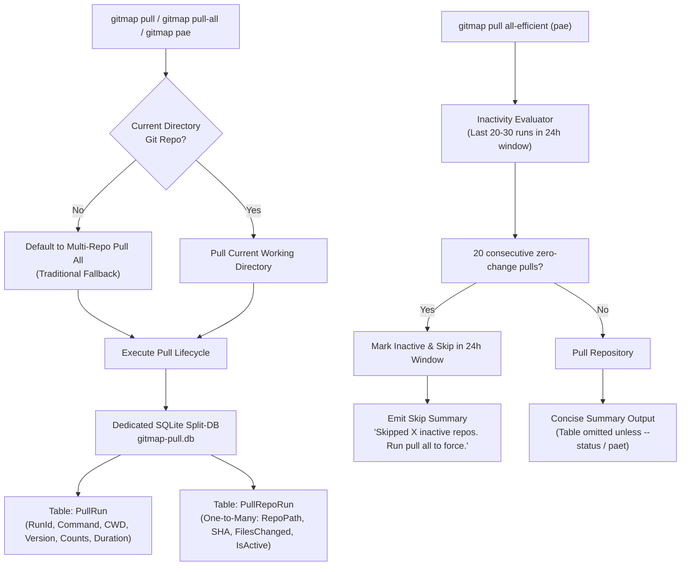

# 136 — Git Pull Efficient Engine, Non-Git Directory Fallback, and Dedicated SQLite Split-Database (`gitmap-pull.db`)

## Overview

**Module Number:** 136  
**Version:** 1.0.0  
**Updated:** 2026-09-23  
**Status:** Approved Specification  
**AI Confidence:** Production-Ready  
**Ambiguity Score:** None  
**Package:** `cli/cmdpull/`, `cli/store/`, `cli/cmd/`  
**Related Specs:** [Spec 101](101-pull-all.md), [Spec 112](112-pull-release-cd.md), [Spec 119](119-git-pull-diagnostics-and-display.md), [Spec 129](129-pr-commit-engines-and-sqlite-split-db.md)

---

## User Request (Verbatim)

```text
Let's introduce a new command for Git Map to pull. Okay? It would be a bit different than the traditional pull that we have. Let me share my ideas. So, okay. The first issue that when we do the Git pull, it does the pull. Okay? So let's say if we do the Git pull, and if it is not a Git repository, then you will by default go into the Git pull all. Okay? So that is like the traditional one that I want. Okay? Now, on top of this, we want to make a new command introduced that would be git map pull all hyphen efficient or AE. So that would also have a short form, git map PAE, if that is not there, or it will be pull hyphen AE. Okay, so all of these will be aliasing of the same efficient. Now, I will describe how the efficient will work. From now on, any pull that we do using the git map, that will be recorded to its SQLite database and it not the root database, but it will create its own split database called git map hyphen pull.db. It's the same folder as the data folder. The root db is close to that. It have a pull git map hyphen pull db. That db will only contain the information for all the repositories that we are pulling, the pull command when it runs, where it runs, and which repositories. So that means which repositories when I'm saying that means it needs to have a subtable, right? One-to-many relationship. So it needs to have this information like how many repositories has been, let's say, pulled. Okay, that's one table information. In another table, we need to know how many data actually pulled. We don't update the file in the db. Remember that. That will actually slow us down. But we update how many files it has changed and what was the last commit. Okay? Now, let's say user is running the git map pull or pull all, whatever that is running, it always saves into that database. Now, the efficients, when we say git map pull all efficient, that will have a hidden trigger. So it will observe the last 20 to 30 repositories, or 30 pulls, pull all. So basically, the efficient pull will behave like pull all, but a subtle difference. The difference is when we have 20 pulls, 20 pull information, and from the 20 pull information, if we find zero, let's say, commits are coming or data is changed on certain repositories, those will be marked as inactive. So in future, when we do the, let's say, pull effective in, let's say, in a one-day window. One day, remember that, one-day window. It will only pull the active ones. So it will skip the inactive ones. And it should mention like, these are the inactive ones we did not pull. If you want to pull the inactive ones, run pull all. Okay? So it will give a summary like these are the pulls that it has done. Okay? And also we can pull effective should not pull the table. Okay? So that it's not necessary. But also we can have a hyphen, hyphen flag like a hyphen, hyphen status or hyphen, hyphen status table. Both would actually show the table just like it does on the pull all or probably, we can have another command. So these flags will work, but also we can have another command like git map space pull hyphen all hyphen efficient hyphen table. So in short, it will have another short form will be git map space PAET. PAET. PAET. Okay? So when we run the short forms, it should always tell us the full form of the command, where it is running, so that user is aware of it. Also during the runtime, always include the version number of the git map so that we are aware of which version is running it. Are you clear with the requirements? Can you please implement these requirements? What do you think about your confidence level?
```

---

## 1. Architectural Architecture & Core Pillars

This specification establishes three interconnected subsystems:



### Pillar 1: Non-Git Directory Fallback to Pull-All
When `gitmap pull` is executed:
- If current working directory is a Git repository, it pulls the current repository.
- If current working directory is NOT a Git repository and no specific repo slug or group was specified, it automatically falls back to `gitmap pull all`, pulling all tracked repositories from `gitmap.db`.
- It announces the fallback clearly to the user: `cwd is not a git repo — defaulting to gitmap pull all`.

### Pillar 2: Dedicated Split Database Architecture (`gitmap-pull.db`)
- Location: Stored in the same data folder as the root database (`BinaryDataDir()`, e.g. `data/gitmap-pull.db` or `%LOCALAPPDATA%\gitmap-cli\data\gitmap-pull.db`).
- Does NOT pollute the root database `gitmap.db`.
- Two normalized tables with a one-to-many relationship:
  1. `PullRun`: Master record for each command invocation.
  2. `PullRepoRun`: Granular record per repository in that run.
- Zero file content writes: Storing file blobs is strictly prohibited to guarantee sub-millisecond execution and prevent database bloat. Only records the number of files changed, commit hashes (old and new), and commit message/author.

### Pillar 3: Inactivity Analysis Engine & 24-Hour Active Window
- The efficient pull analyzes recent pull history from `gitmap-pull.db`.
- Evaluates the last 20 to 30 pull sessions.
- Inactive criteria: A repository is marked inactive if across the last 20 recorded pull runs within a 1-day (24-hour) window, it had zero commits and zero files changed.
- If inactive within the 24-hour window, `pull all-efficient` skips it.
- If 24 hours have elapsed since the last pull, or if it had recent changes, it is considered active and pulled.
- Skipped repositories are clearly listed in the summary with instructions on how to force a full pull (`gitmap pull all`).

### Pillar 4: Command Suite, Aliasing & Table Display
- Commands:
  - `gitmap pull all-efficient` (Aliases: `pull-all-efficient`, `pull-ae`, `pae`)
  - `gitmap pull-all-efficient-table` (Alias: `paet`)
  - Flags: `--status` and `--status-table` on `pull all-efficient` to display the full tabular view.
- By default, efficient pull outputs a clean, fast summary without the heavy table.
- Table view is rendered only when explicitly requested via `paet`, `--status`, or `--status-table`.

### Pillar 5: Short-Form Expansion & Runtime Version Announcement
- When short-form aliases (`pae`, `paet`, `pull-ae`) are invoked, the CLI displays:
  1. The full expanded command name (`gitmap pull all-efficient` or `gitmap pull all-efficient-table`).
  2. The working directory (`cwd: <path>`).
  3. The GitMap version number (`(vX.Y.Z)`).

---

## 2. Database Schema (`gitmap-pull.db`)

All tables strictly conform to Coding Guidelines (PascalCase, positive booleans, explicit nullability):

### Table: `PullRun`
```sql
CREATE TABLE IF NOT EXISTS PullRun (
    PullRunId       INTEGER PRIMARY KEY AUTOINCREMENT,
    CommandType     TEXT NOT NULL,
    WorkingDir      TEXT NOT NULL,
    TotalRepos      INTEGER NOT NULL DEFAULT 0,
    PulledRepos     INTEGER NOT NULL DEFAULT 0,
    SkippedRepos    INTEGER NOT NULL DEFAULT 0,
    SuccessCount    INTEGER NOT NULL DEFAULT 0,
    FailedCount     INTEGER NOT NULL DEFAULT 0,
    IsEfficient     INTEGER NOT NULL DEFAULT 0,
    DurationMs      INTEGER NOT NULL DEFAULT 0,
    GitMapVersion   TEXT NOT NULL DEFAULT '',
    Notes           TEXT NULL,
    Comments        TEXT NULL,
    CreatedAt       TEXT NOT NULL DEFAULT CURRENT_TIMESTAMP
);

CREATE INDEX IF NOT EXISTS IdxPullRun_CreatedAt ON PullRun(CreatedAt);
CREATE INDEX IF NOT EXISTS IdxPullRun_CommandType ON PullRun(CommandType);
```

### Table: `PullRepoRun`
```sql
CREATE TABLE IF NOT EXISTS PullRepoRun (
    PullRepoRunId     INTEGER PRIMARY KEY AUTOINCREMENT,
    PullRunId         INTEGER NOT NULL,
    RepoPath          TEXT NOT NULL,
    RepoName          TEXT NOT NULL,
    PullStatus        TEXT NOT NULL DEFAULT 'success',
    FilesChanged      INTEGER NOT NULL DEFAULT 0,
    LastCommitSha     TEXT NOT NULL DEFAULT '',
    PreviousCommitSha TEXT NOT NULL DEFAULT '',
    CommitMessage     TEXT NOT NULL DEFAULT '',
    CommitAuthor      TEXT NOT NULL DEFAULT '',
    IsActive          INTEGER NOT NULL DEFAULT 1,
    HasChanges        INTEGER NOT NULL DEFAULT 0,
    DurationMs        INTEGER NOT NULL DEFAULT 0,
    ErrorMessage      TEXT NULL,
    Notes             TEXT NULL,
    Comments          TEXT NULL,
    CreatedAt         TEXT NOT NULL DEFAULT CURRENT_TIMESTAMP,
    FOREIGN KEY(PullRunId) REFERENCES PullRun(PullRunId) ON DELETE CASCADE
);

CREATE INDEX IF NOT EXISTS IdxPullRepoRun_PullRunId ON PullRepoRun(PullRunId);
CREATE INDEX IF NOT EXISTS IdxPullRepoRun_RepoPath ON PullRepoRun(RepoPath);
CREATE INDEX IF NOT EXISTS IdxPullRepoRun_CreatedAt ON PullRepoRun(CreatedAt);
CREATE INDEX IF NOT EXISTS IdxPullRepoRun_HasChanges ON PullRepoRun(HasChanges);
```

---

## 3. Inactivity Evaluation Algorithm

```text
Given candidate repository R:
1. Query last 20 PullRepoRun entries for R, ordered by CreatedAt DESC.
2. If count(entries) < 20:
     R is ACTIVE (not enough history to establish inactivity).
3. If max(CreatedAt) is older than 24 hours ago:
     R is ACTIVE (window expired; must refresh state).
4. If ANY entry in the last 20 entries has HasChanges == 1 or FilesChanged > 0:
     R is ACTIVE (received changes recently).
5. Otherwise (all 20 entries within 24 hours had 0 changes):
     R is INACTIVE -> Skip pull in efficient mode.
```

---

## 4. CLI Output Contract

### Example Short-Form Execution (`gitmap pae`):
```text
  → gitmap pull all-efficient (v6.307.0) (cwd: D:\work)
    [alias: pae -> gitmap pull all-efficient]

    → resolved 15 repo(s)
    → skipping 10 inactive repo(s) (0 changes across 20+ pulls in last 24h)
    → pulling 5 active repo(s)...

  [ 1/5] • repo-alpha -> up-to-date
  [ 2/5] • repo-beta  -> +3/-1 (2 files)
  ...
  
  ✓ Pull efficient complete: 5 pulled, 10 skipped inactive.
    Inactive repos: repo-3, repo-4, repo-5, repo-6, repo-7, repo-8, repo-9, repo-10, repo-11, repo-12
    (To force pull all repositories, run `gitmap pull all`)
```

---

## 5. Acceptance Criteria

- [ ] `gitmap pull` outside a Git repository automatically runs `gitmap pull all`.
- [ ] Split database `gitmap-pull.db` created in `BinaryDataDir()` upon first pull.
- [ ] Every `pull` and `pull all` records session and repo telemetry to `gitmap-pull.db`.
- [ ] Zero file content blobs stored in SQLite; only commit hashes, message, author, and changed file counts.
- [ ] `gitmap pull all-efficient`, `gitmap pull-all-efficient`, `gitmap pull-ae`, and `gitmap pae` execute efficient pull.
- [ ] `gitmap pull-all-efficient-table` and `gitmap paet` render the table.
- [ ] `--status` and `--status-table` flags enable table rendering on `pull all-efficient`.
- [ ] Short forms display full command, working directory, and version number.
- [ ] Repositories with 20 consecutive zero-change pulls within 24h are skipped and reported in the summary.
