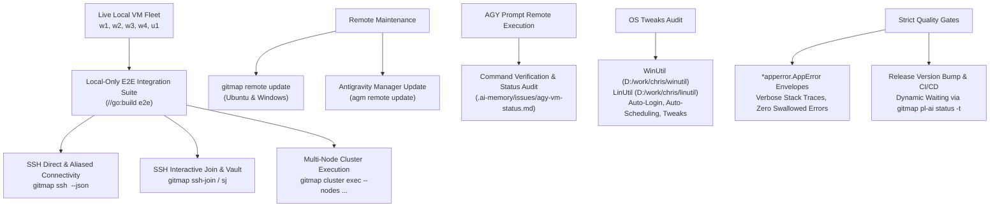

# 137 — Live VM Cluster End-to-End SSH Join, Multi-Node Execution, Remote Updates, and WinUtil/LinUtil OS Integration

## Overview

**Module Number:** 137  
**Version:** 1.0.0  
**Updated:** 2026-09-23  
**Status:** Approved Specification  
**AI Confidence:** Production-Ready  
**Ambiguity Score:** None  
**Package:** `cli/cmdcluster/`, `cli/cmdssh/`, `cli/cmdos/`, `cli/cmdupdate/`, `cli/cmdagm/`, `cli/tests/`  
**Related Specs:** [Spec 132](132-ssh-multinode-exec-copy-mv-and-env.md), [Spec 133](133-ssh-interactive-join-password-vault-and-cluster.md), [Spec 134](134-antigravity-ide-first-integration-and-queue-protocol.md)

---

## User Request (Verbatim)

```text
https://prnt.sc/2wxb74N-bomk

AI Main	192.168.1.20	off
AI VM 01	192.168.1.3	w1
AI VM 02	192.168.1.7	w2
AI VM 03	192.168.1.12	w3
AI VM 04	192.168.1.13	w4
AI Ubuntu 01	192.168.1.22	u1

vmpass.json
D:\work\chris\winutil
D:\work\chris\linutil


Okay. So these are the VMs. I am going to open all the VM. All the VMs are running. The reason I'm sharing all this with you is that so that you could test locally, and you don't need to run this test on CI/CD. So you can mark this on local only and VM. If the user only requests, then and only then it will run. It's not like it will run every time, but only the test case, that's a special case, it will run again if we want it to. So remember, this is how you are going to write the end-to-end test, and I'm going to give you all the IPs, all the machine aliases. So W1, W2, these are the aliasing, so you could have the aliasing. So here, the AI main, the main machine, which is the IP 20, which is off. Okay? So you can mark this as off. So we have AI VM one, two, three, four. That means W1, W2, W3, W4, and we have Ubuntu, which is U1.

Now, before the release, all the git map SSH join, everything was working, but after the release, it is not working. The reason is not working because during the release, they might have made some mistakes, like when you are doing the git map SSH IP, it's not working, and the output is not showing in JSON. Then we have multi-machines execution. That means if we run the git map space whatever the command, and if you say multi-machines, it will automatically connect with them and it will automatically run whatever we want to run. So I want you to test that end to end.

Then you are going to test git map remote update. Okay, git map remote update has an issue, and also antigravity manager has an issue for updating. I want you to test properly the Git Map remote update and the Antigravity Manager update for Ubuntu and Windows VM, and see if it can be fixed. Then the next step would be I want to do the AGY prompt test. We want to test multiple machines' prompts for AGY. I want to see if the prompt is working, and if it is not working, what is not working. I need a clear Markdown with all the details, like which commands are working and which commands are not working.

Then you're going to audit the winutil and the linutil. We did some auto-login, auto-scheduling, and some tweaks. I want to make sure that these are there. You're going to test and verify these. So these are the main things, and also you need to follow the main prompt. So make sure that all the errors are in the application error, not raw error, so they have full verbose, and don't swallow any errors, like ignoring any errors. We want to make sure every error is properly tracked and traced.

So these are the main things. Bump the version, release it, and we are going to do the GitMap wait dynamic pipeline. Then we run all the test cases. I will only accept if we have 100% test case pass, and all of these are passing. So please carry on. Do you have any questions before you start?
```

---

## 1. Visual Specification References

Screenshot captured from Lightshot link:


### Live Node Fleet Mapping

| Machine Name | MAC Address | IP Address | Alias | Operating System | State |
|---|---|---|---|---|---|
| AI Main | - | 192.168.1.20 | - | Windows | OFF (Offline / Excluded) |
| AI VM 01 | 00:50:56:39:B8:4E | 192.168.1.3 | `w1` | Windows | ONLINE |
| AI VM 02 | 00:50:56:38:57:7B | 192.168.1.7 | `w2` | Windows | ONLINE |
| AI VM 03 | 00:50:56:29:FA:2D | 192.168.1.12 | `w3` | Windows | ONLINE |
| AI VM 04 | 00:50:56:28:35:94 | 192.168.1.13 | `w4` | Windows | ONLINE |
| AI Ubuntu 01 | 00:50:56:2C:CD:4D | 192.168.1.22 | `u1` | Ubuntu Linux | ONLINE |

Credentials source: `vmpass.json` (gitignored, contains Windows user/pass and Ubuntu user/pass).

---

## 2. Core Pillars & Architectural Scope



### Pillar 1: Local-Only E2E Test Suite (`//go:build e2e`)
- CI/CD Exemption: The E2E tests target local IP addresses (`192.168.1.x`) and must **NEVER** run in routine GitHub Actions CI runs.
- Guarded by Go build tags `//go:build e2e` and environment variable checks (e.g. `GITMAP_E2E_LIVE_VMS=1`).
- Tests load credentials dynamically from `vmpass.json` if present; if `vmpass.json` is missing or nodes are unreachable, tests skip gracefully with informative logs without failing standard test runs.
- Covers:
  1. SSH connection by IP (`192.168.1.3`, etc.) and alias (`w1`, `w2`, `w3`, `w4`, `u1`).
  2. JSON output conformance (`--json`).
  3. Interactive/Automated SSH Join (`gitmap ssh-join`).
  4. Multi-node command execution (`gitmap cluster exec`).

### Pillar 2: SSH Join & Multi-Node Cluster Execution Diagnostics & Remediation
- Diagnose and fix regressions where `gitmap ssh <ip>` or `gitmap ssh-join` failed post-release.
- Ensure `--json` output emits valid structured JSON envelopes with exit codes, stdout, stderr, and node identifiers.
- Ensure multi-node execution dispatches concurrently and aggregates results deterministically without hanging or dropping connections.

### Pillar 3: Remote Updates for GitMap & Antigravity Manager
- Audit and repair `gitmap remote update` (or equivalent update commands) for both Ubuntu (`u1`) and Windows (`w1`..`w4`).
- Audit and repair Antigravity Manager (AGM) remote update mechanism.
- Validate update triggers and error responses, capturing edge cases in `.ai-memory/issues/`.

### Pillar 4: AGY Prompt Multi-Machine Verification
- Execute AGY prompt commands against remote nodes.
- Compile comprehensive audit report documenting working vs failing commands with root causes and remediation.

### Pillar 5: WinUtil & LinUtil Integration Audit
- Inspect local reference repositories at `D:\work\chris\winutil` and `D:\work\chris\linutil`.
- Compare against existing native Go implementations in `cli/cmdos/` (auto-login, auto-scheduling, tweaks).
- Verify functionality and ensure all feature paths are wired up and tested.

### Pillar 6: Universal AppError & Zero Swallowed Errors
- Ensure all modified and audited packages wrap errors in `*apperror.AppError`.
- Ensure stack traces and context are preserved; no bare `err` or silent discards (`_ = ...`).

### Pillar 7: Release Orchestration & Dynamic Pipeline Waiting
- Bump version SemVer.
- Monitor remote CI/CD with `gitmap pipeline-ai status -t <etaSeconds>` avoiding rapid polling.

---

## 3. Extracted Actionable Task List

- **Task-01**: Author Local-Only Live VM End-to-End Test Suite (`cli/tests/vm_cluster_e2e_test.go`).
- **Task-02**: Audit WinUtil (`D:\work\chris\winutil`) & LinUtil (`D:\work\chris\linutil`) Feature Parity in `cli/cmdos/`.
- **Task-03**: Diagnose and Fix `gitmap ssh <ip|alias>` and JSON Output Formatter.
- **Task-04**: Diagnose and Fix `gitmap ssh-join` / `gitmap sj` Interactive & Vault Authentication.
- **Task-05**: Diagnose, Implement, and Verify Remote Update for GitMap & AGM on Ubuntu and Windows.
- **Task-06**: Execute AGY Remote Prompt Diagnostic Suite and Document Working vs Failing Commands.
- **Task-07**: Verify Multi-Node Cluster Command Execution across all active VMs (`w1`, `w2`, `w3`, `w4`, `u1`).
- **Task-08**: Comprehensive `*apperror.AppError` Propagation and Swallowed Error Audit.
- **Task-09**: Version Bump, Release Ceremony, and GitMap Dynamic Pipeline Verification.

---

## 4. Verification & Quality Gates

1. Conformance with Coding Guidelines: Max 15 lines per function, positive booleans, no nested-if pyramids.
2. Local E2E Suite passes with 100% on live nodes (`w1`, `w2`, `w3`, `w4`, `u1`).
3. Routine CI/CD ignores E2E VM tests (exit 0 without local VMs).
4. No passwords or secrets committed to repository.
