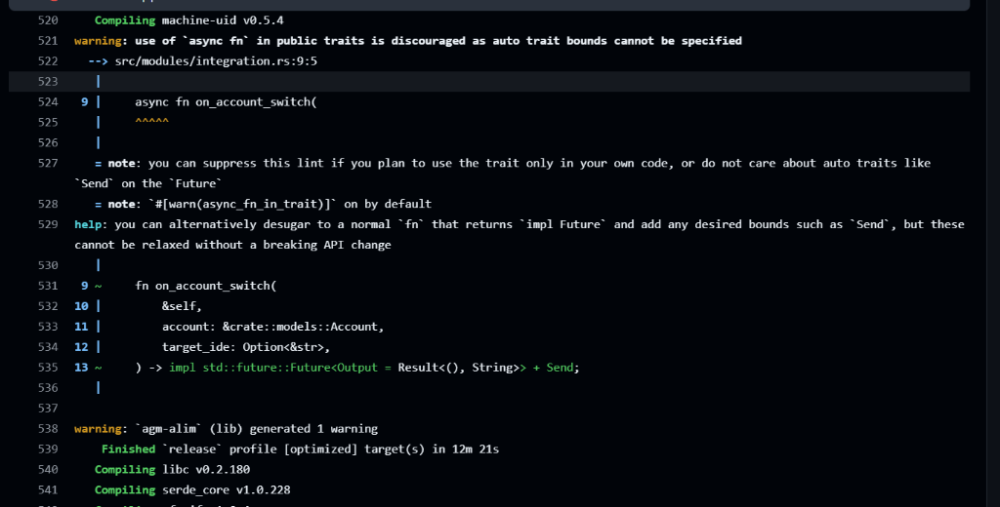
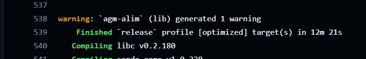
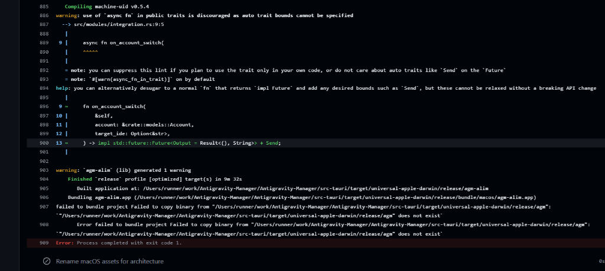

# Spec 139: Pipeline Error Multi-Line Extraction Intelligence & Declarative JSON Format Profiles

## System Context & Architectural Overview
GitMap Pipeline Errors (`gitmap pe` / `gitmap pipeline errors`) extracts actionable failure diagnostics from lengthy CI/CD logs. In polyglot build environments (such as Rust, Tauri, Vite, and Node), complex build failures emit multi-line compiler warnings, file location indicators (`--> src/...:line:col`), compiler diagnostics, and bundler failures (e.g. `failed to bundle project Failed to copy binary: ... does not exist`) before terminating with a generic `Process completed with exit code 1.`

This specification introduces:
1. **Intelligent Multi-Line Block Extraction:** Default extraction captures full multi-line compiler warning blocks (lines `warning:` through line numbers, code snippets, and notes) and bundler/linker fatal errors while filtering out compilation noise (`Compiling ...`, `Finished ...`, `transforming...`).
2. **Declarative Format Profiles (JSON):** A customizable rule engine permitting users to define and manage declarative log format profiles specifying line prefixes to strip, substrings to skip, warning triggers, error markers, and context boundaries.
3. **PE Format Profile CLI Suite:**
   - `gitmap pe -f <format.json|alias>`: Execute error extraction using custom rules.
   - `gitmap pe -f <alias> -test <filepath>`: Test rules against an arbitrary local log file.
   - `gitmap pe -f <alias> -test-commit <sha> [-repo <path>]`: Test rules against GitHub Actions logs for a specific commit.
   - `gitmap pe add-format <file.json> [alias]`: Register a custom format profile into GitMap storage.
   - `gitmap pe rm-format <name|alias>`: Remove a registered profile.
   - `gitmap pe add-all <folder-path>`: Bulk import all format profiles from a folder.
   - `gitmap pe list-formats`: List all available profiles and their rules.

---

## Visual Assets & Telemetry
- **Screenshot 1 — Multi-Line Rust Compiler Warning Block:**
  
- **Screenshot 2 — Warning Summary Line:**
  
- **Screenshot 3 — Bundler Binary Copy Failure:**
  

---

## User Request (Verbatim)
```text
https://prnt.sc/WIi4FxFUx453
https://prnt.sc/Xl4_dMPZ_nYz
https://prnt.sc/vPLK7e8h8-cC

For the pipeline errors 

actual

Run npm run tauri build -- --target universal-apple-darwin --bundles app
...
warning: `agm-alim` (lib) generated 1 warning
    Finished `release` profile [optimized] target(s) in 9m 32s
       Built application at: /Users/runner/work/Antigravity-Manager/Antigravity-Manager/src-tauri/target/universal-apple-darwin/release/agm-alim
    Bundling agm-alim.app (/Users/runner/work/Antigravity-Manager/Antigravity-Manager/src-tauri/target/universal-apple-darwin/release/bundle/macos/agm-alim.app)
failed to bundle project Failed to copy binary from "/Users/runner/work/Antigravity-Manager/Antigravity-Manager/src-tauri/target/universal-apple-darwin/release/agm": `"/Users/runner/work/Antigravity-Manager/Antigravity-Manager/src-tauri/target/universal-apple-darwin/release/agm" does not exist`
       Error failed to bundle project Failed to copy binary from "/Users/runner/work/Antigravity-Manager/Antigravity-Manager/src-tauri/target/universal-apple-darwin/release/agm": `"/Users/runner/work/Antigravity-Manager/Antigravity-Manager/src-tauri/target/universal-apple-darwin/release/agm" does not exist`
Error: Process completed with exit code 1.

and Gitmap PE example
...
In this case, if you look into this, there's a little bit of gap and difference between this actual and the things that you have shown, which is good. A lot of compiling line you have stripped out, which I really do appreciate. Compiling line is stripped out, I do appreciate. What I don't appreciate is that when the error actually started happening, for example, this section, warning something like this, I want that whole line to be appeared in our error logs. Also this section, I also want this to be appearing in our error logs, which is missed. So you should have this intelligence, and you can share that intelligence, and that could be customized based on-- That means user should have the power to customize how it is printing in the future, so that we don't have to recheck the code. User can actually check how it is checking from this to that, and user can actually go there and change some logic using some formats. Can we do that? This is a big step, but also by default, it should actually take those warning parts. Whenever there is a warning, it'll take up to next parse unless there is a compiling line or okay line. These are the lines should be stripped out. Do you understand? Okay? So the algorithm, how it is happening, I think there should be a JSON format where user could actually do their custom formatting, and this should have functions to avoid and take up to the point, things like that. For example, user could say, strip lines, starts with compiling. If it finds, skip it. If it is empty line, skip it. If it has okay and then something, skip it. So these type of things user can define, like skip lines, strip lines. If there is no strip line on that command, so there would be a different type of command, I believe, that would... I'm just giving the example. It will be PE, and we can format and name the format, maybe format JSON. It'd be something like this. And we can add it, @format, and then we can give a name. Let's say name JSON. We can give that for parse file path for that JSON. And once we do add this JSON, we can also preview format. We can do the format. We can give a path to that format as well, or we could do git map all, and we can give a folder path where multiple JSON will be, and will be in the memory as a format. We can also give a alias name. Okay? So that in future we can say git map the space, this name. That would strip the format based on this alias name, like which line to keep, which line to take, and the system could test it from a file, test on a file path. Okay? Or test on commit sha, and also do the repo path. This is optional, so if we are in the current repo, no need for the repo path. It would use default commit. If you want to use a different repo path, then we have to do it like this. So all these examples needs to be in the terminal inside the PE help. All this will come up with the explanation how this works. I want you to follow through and then finally make a release. Make sure CI/CD is correct and there is no more issues.
```

---

## Declarative Format Schema (`pe-format.json`)
```json
{
  "$schema": "https://gitmap.dev/schemas/pe-format.json",
  "name": "tauri-rust-build",
  "alias": "tauri",
  "description": "Log filter for Tauri + Rust desktop app compilation and bundling pipelines",
  "strip_prefixes": [
    "Compiling ",
    "   Compiling ",
    "Updating ",
    "    Updating ",
    "transforming...",
    "vite v",
    "dist/",
    "Browserslist:"
  ],
  "strip_contains": [
    "Finished `release` profile",
    "modules transformed"
  ],
  "skip_empty": true,
  "warning_markers": [
    "warning:",
    "warning[",
    "##[warning]"
  ],
  "error_markers": [
    "##[error]",
    "failed to bundle",
    "Error failed to bundle",
    "does not exist",
    "Error:",
    "error:",
    "FAIL:",
    "Process completed with exit code"
  ],
  "capture_until_markers": [
    "Compiling ",
    "   Compiling ",
    "Finished `release`",
    "ok  \t"
  ],
  "max_context_lines": 35
}
```

---

## Verification Gates & Acceptance Criteria
1. **Multi-Line Warning Preservation:** Warning blocks containing `--> path/file:line:col`, `|`, and `= note:` are kept intact in `Warnings` until a termination marker (`Compiling`, `Finished`, or empty block).
2. **Bundler Error Capture:** `failed to bundle project Failed to copy binary: ... does not exist` is captured in `ErrorLines` and reflected in `FailureSummary`.
3. **Format Profile Registry:** Stored persistently in GitMap configuration/SQLite, surviving CLI restarts.
4. **Testing Harness:** `-test <file>` and `-test-commit <sha>` accurately simulate format profile filtering against live logs.
5. **Coding Guidelines:** Zero nested ifs, max function length <= 15 lines, and full `*appfault.AppError` error handling.
