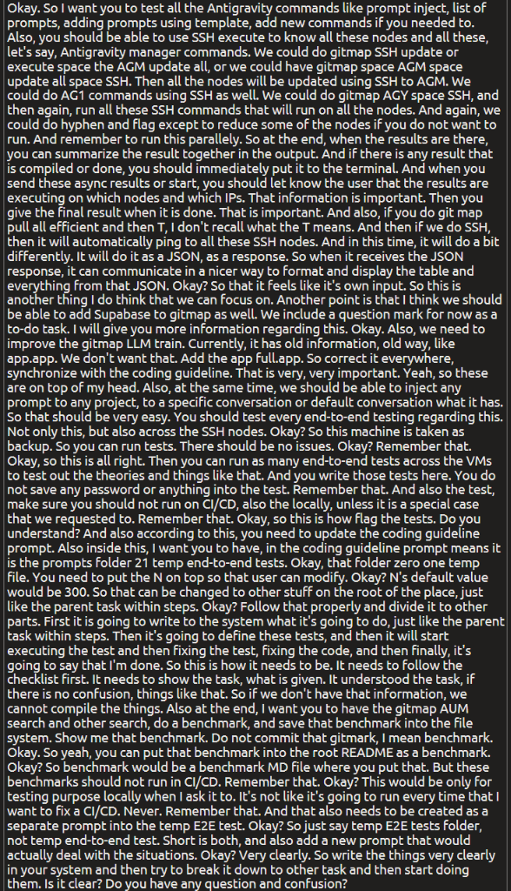

# Spec 143: Antigravity Commands Suite, SSH Fleet Parallel Execution, and E2E Benchmarking

## Overview
This specification unifies the Antigravity prompt management lifecycle, parallel SSH fleet execution for Antigravity Manager (`AGM`) and Antigravity CLI (`AGY`), structured JSON multi-node responses, Supabase integration placeholder scaffolding, `gitmap llm train` synchronization with repository error management guidelines, and isolated end-to-end testing with local AUM search benchmarking.

## Visual Assets & UI Ingestion


## User Request (Verbatim)
```text
Okay. So I want you to test all the Antigravity commands like prompt inject, list of prompts, adding prompts using template, add new commands if you needed to. Also, you should be able to use SSH execute to know all these nodes and all these, let's say, Antigravity manager commands. We could do gitmap SSH update or execute space the AGM update all, or we could have gitmap space AGM space update all space SSH. Then all the nodes will be updated using SSH to AGM. We could do AG1 commands using SSH as well. We could do gitmap AGY space SSH, and then again, run all these SSH commands that will run on all the nodes. And again, we could do hyphen and flag except to reduce some of the nodes if you do not want to run. And remember to run this parallely. So at the end, when the results are there, you can summarize the result together in the output. And if there is any result that is compiled or done, you should immediately put it to the terminal. And when you send these async results or start, you should let know the user that the results are executing on which nodes and which IPs. That information is important. Then you give the final result when it is done. That is important. And also, if you do git map pull all efficient and then T, I don't recall what the T means. And then if we do SSH, then it will automatically ping to all these SSH nodes. And in this time, it will do a bit differently. It will do it as a JSON, as a response. So when it receives the JSON response, it can communicate in a nicer way to format and display the table and everything from that JSON. Okay? So that it feels like it's own input. So this is another thing I do think that we can focus on. Another point is that I think we should be able to add Supabase to gitmap as well. We include a question mark for now as a to-do task. I will give you more information regarding this. Okay. Also, we need to improve the gitmap LLM train. Currently, it has old information, old way, like app.app. We don't want that. Add the app full.app. So correct it everywhere, synchronize with the coding guideline. That is very, very important. Yeah, so these are on top of my head. Also, at the same time, we should be able to inject any prompt to any project, to a specific conversation or default conversation what it has. So that should be very easy. You should test every end-to-end testing regarding this. Not only this, but also across the SSH nodes. Okay? So this machine is taken as backup. So you can run tests. There should be no issues. Okay? Remember that. Okay, so this is all right. Then you can run as many end-to-end tests across the VMs to test out the theories and things like that. And you write those tests here. You do not save any password or anything into the test. Remember that. And also the test, make sure you should not run on CI/CD, also the locally, unless it is a special case that we requested to. Remember that. Okay, so this is how flag the tests. Do you understand? And also according to this, you need to update the coding guideline prompt. Also inside this, I want you to have, in the coding guideline prompt means it is the prompts folder 21 temp end-to-end tests. Okay, that folder zero one temp file. You need to put the N on top so that user can modify. Okay? N's default value would be 300. So that can be changed to other stuff on the root of the place, just like the parent task within steps. Okay? Follow that properly and divide it to other parts. First it is going to write to the system what it's going to do, just like the parent task within steps. Then it's going to define these tests, and then it will start executing the test and then fixing the test, fixing the code, and then finally, it's going to say that I'm done. So this is how it needs to be. It needs to follow the checklist first. It needs to show the task, what is given. It understood the task, if there is no confusion, things like that. So if we don't have that information, we cannot compile the things. Also at the end, I want you to have the gitmap AUM search and other search, do a benchmark, and save that benchmark into the file system. Show me that benchmark. Do not commit that gitmark, I mean benchmark. Okay. So yeah, you can put that benchmark into the root README as a benchmark. Okay? So benchmark would be a benchmark MD file where you put that. But these benchmarks should not run in CI/CD. Remember that. Okay? This would be only for testing purpose locally when I ask it to. It's not like it's going to run every time that I want to fix a CI/CD. Never. Remember that. And that also needs to be created as a separate prompt into the temp E2E test. Okay? So just say temp E2E tests folder, not temp end-to-end test. Short is both, and also add a new prompt that would actually deal with the situations. Okay? Very clearly. So write the things very clearly in your system and then try to break it down to other task and then start doing them. Is it clear? Do you have any question and confusion?
```

## Architectural Requirements & Feature Breakdown

### 1. Antigravity Prompt Suite & Conversational Injection
- Command `gitmap agy prompt inject` / `gitmap inject`:
  - Support targeting any project directory (`--project`, `-p`, or positional argument).
  - Target a specific conversation ID (`--conversation`, `-c`, or default active conversation).
  - Support template-based prompt generation (`gitmap agy prompt add --template <tpl>`).
  - List registered and available prompts (`gitmap agy prompt ls`).

### 2. Multi-Node Parallel SSH Fleet Delegation
- Commands supported:
  - `gitmap agm update-all --ssh` / `gitmap agm update-all ssh`
  - `gitmap agy ssh <cmd...>` / `gitmap ssh execute agm update-all`
- Flags:
  - `--except <node1,node2>` / `-e <node1,node2>`: Exclude specific nodes by alias, IP, or hostname.
  - Parallel execution: Execute commands asynchronously across all target nodes.
  - Real-time terminal streaming: When an async node starts, display its Node Alias and IP (`Executing on [alias] (IP: x.x.x.x)...`). As each node completes, immediately stream its exit status and result chunk to the console.
  - Final aggregated summary: Output a cohesive table / summary block aggregating status across all nodes.

### 3. Structured JSON Remote Queries for `gitmap pull all-efficient`
- Command: `gitmap pull all-efficient -t --ssh` / `gitmap pull all-efficient ssh --json`
- Remote execution returns standardized JSON envelopes (`NodeStatusResponse` / `PullEfficientSummary`).
- Format and display results locally using GitMap's native termtable/termpad engine, making remote responses visually identical to local runs.

### 4. Supabase Placeholder Scaffold
- Add Supabase entry to `cli/constants/` and `cli/cmdinstall/` with marker `[?]` (Planned / To-Do) awaiting future architectural specifications.

### 5. Standardize `gitmap llm train` Error Architecture
- Refactor training sample generation in `cli/cmd/llm/` to eliminate outdated conventions (`app.app`).
- Strictly enforce `02-spec/03-error-manage/` with structured `appfault.AppError` and monadic `result.Result`.

### 6. Isolated End-to-End Test Suite (`//go:build e2e`)
- E2E tests across VMs and SSH nodes testing prompt injection and fleet dispatch.
- Strict security: ZERO saved passwords or credentials in test fixtures.
- Strict gating: Gated under build tag `//go:build e2e` or `//go:build integration` so they NEVER run during standard CI/CD or routine `06-cicd-local-runner.py` executions.

### 7. Prompts Directory `01-prompts/21-temp-e2e-tests/`
- Directory: `01-prompts/21-temp-e2e-tests/` (named `temp-e2e-tests`).
- `01-temp-e2e-test.md`: Parent task prompt with configurable `N = 300` on top, divided into clear sequential phases (understand task, define tests, execute tests, fix code/tests, completion report).
- `02-temp-benchmark.md`: Dedicated prompt for local search benchmarking.

### 8. Local AUM Search vs Scanner Benchmark
- Benchmark `gitmap aum search` against standard repository scanning.
- Save output locally to `benchmark.md`.
- Ensure `benchmark.md` is uncommitted / gitignored and never run in CI/CD.

## Acceptance Criteria
- **AC-SPEC-143.1:** AGY prompt injection supports target project and conversation selection.
- **AC-SPEC-143.2:** Parallel SSH fleet runner supports `--except`, live node/IP emission, and summary aggregation.
- **AC-SPEC-143.3:** `gitmap pull all-efficient` SSH mode supports JSON deserialization and termtable formatting.
- **AC-SPEC-143.4:** Supabase placeholder listed as `[?]` in install tools.
- **AC-SPEC-143.5:** `gitmap llm train` references use `appfault.AppError`.
- **AC-SPEC-143.6:** E2E tests isolated with `//go:build e2e` and contain zero hardcoded credentials.
- **AC-SPEC-143.7:** `01-prompts/21-temp-e2e-tests/` created with `01-temp-e2e-test.md` (`N=300`) and `02-temp-benchmark.md`.
