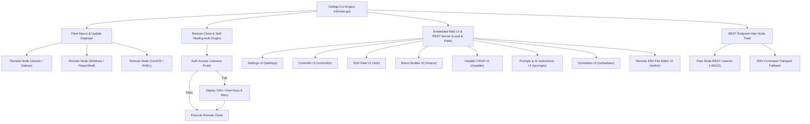

# Spec 144: SSH Macro & App Fleet Deployment, Remote Clone, REST Endpoint Triad, and Web UI Management Engine

- **Slug:** ssh-fleet-deploy-remote-clone-api-ui
- **Status:** Active
- **Version:** v6.319.0
- **Created:** 2026-09-24
- **Author:** MD ALIM UL KARIM
- **Sponsor:** RISEUP ASIA LLC
- **Spec Category:** 21-app

---

## 1. Visual References & Screenshots


---

## 2. User Request (Verbatim)

```text
do a git pull properly and git pull always before commiting to sync and fix the conflicts okay??

add 

gitmap macro deploy ssh --except id, ip, alaising
gitmap peat deploy ssh --except id, ip, alaising
gitmap pea deploy ssh --except id, ip, alaising
gitmap update --all  / gitmap update all / gitmap ua # all same except ones, this will update all apps and returns summary in json from other gitmaps of those ssh machines, clear??? and display it nicely 

gitmap update <name> --excep id,alias, ip #update specific installed item
gitmap update ls # show all install items accross ndoes with nice table list receivbed as json then display as table

gitmap ssh clone / ssh-clone / ssh-c <repo name>/url git/<nothing if we are in the current repo> [path or nothing then clone in default workdir] # clear???

implement and do all e2e test locally using other machines , don't worry aboyt breaking, swpan 2 agents to do things parallley

Spwan 2 agents to do things faster please.

I also wanted to have, let's say, API system and UI system in this tool. What do I mean by UI? Is that we are not going to make the actual, let's say, application UI like the Electron or others. We can use the same technique as the HD, the help document that we have. So we can go to settings, Git Map, settings, a space UI, that would open up a UI where I could modify the settings, save it in the browser, and that would save everything. The same thing could go for Git Map, commit in UI, commit in, commit right, commit left, all these factors. We can have a nice great UI because it has so many options. All these options needs to be from UI. Also, same thing could go for SSH UI that would actually show us how many commands are there, how we can deploy macros. Macro UI also show us product application that we could do from the browser end. You can add those separate pages. You can just open this up in the browser with the endpoint, and you can modify this. This would be the process. That's one thing. Another is that at the end, we want to have endpoint communication. That means when we are doing the SSH, first time doing the SSH, we can connect using those nodes, using, let's say, REST API. Once we do that, then all the communication from this SSH needs it would happen using the REST API. It would probably call using SSH, but we'll try to communicate using the endpoints. What do you think? Is it achievable? So first, you don't do much. You create a detailed plan and write that detailed plan as spec so that I can review it. How the macros, SSH, SSH keys, authentication keys deployed, how the, let's say, installer can be updated, how new commands can be added, how to bring files from other machine to the current machine, current machine to other machine, how to clone from one machine to other machines. Okay? So all these things we should be able to do. Yeah. So if during the SSH clone, if the repository does not have the access for the other stuff, then it would automatically deploy the keys and other stuff from this machine to that machine automatically, and that would actually log it, show it like this is what it is doing. It found that the no access is there, so it will resolve, try to resolve in each step, and then command it back and forth. Make sure of that. So this is very critical. Do you understand the concern? Do you understand how it needs to be completed and done? Is it clear to you? Do you have any question and confusion?

Do you have any commands that I could use to fix or open VS Code in remote machine? Okay. That we need to reveal. Also, can we modify the file on remote machine using our browser text editor? What do you think? Is it possible or not? And when we close it, it saves back to the file system into the SSH machine. Think about it. Let me know. So we should be able to have UI for the installer, where we could just do the installer UI, and that would open up, and we'll have prod operation delete and see the current custom installer that we have installed. It would have Windows version, Unix version, Ubuntu, CentOS, specific version commands, and we can pick from drop-downs how we want to execute it, and we can test it immediately on existing, let's say, alias nodes. Okay, the drop-down should have it. So we should have this in JSON mode to serve it to the APIs. Remember that. Yeah. So also, if we do SSH UI, we should see all these nodes. We can perform commands, test commands, how it behaves, everything, using the UI. So your UI needs to be very powerful. You can explain the UI. You can use the modern UI process to make it lucrative and better. Also, I do think that, yeah, we should be able to prompt edit. We can do git map prompts UI that would actually edit all prompt operations on prompt. We can see the prompt, we can see the prompt templating, we can add prompt using empty files, all sorts of things. There could be AI instructions that can be, let's say, served as a JSON. So yeah, it would understand the prompt, how to create it, and then we give the prompt, the prompt would be formatted, and then we import that prompt using our UI browser, and then it would be already inserted to the system. So this is how also we should have import-export UI. Okay, so we could import hyphen export UI that would actually open up all this import-export option UI. Nicely done. We could discuss or check these things. Also, we could do git map UI that would actually open up all these UI options that we are talking about. We can browse through all these positions, places. So think about that. What else we can do? Also, we can modify the schedules UI that would actually open the schedules information, add, remove, create, test, many more things. Okay? If we have a JSON anywhere in the browser, ensure that we have the syntax highlighter. Yeah, so these are add. Also, we can edit files from the SSH machine to the UI. Okay, that would open up the UI browser directly. Remember to add that feature. Anything that is missing, we can discuss later on. Is it clear?
```

---

## 3. Executive Architectural Summary

Spec 144 establishes an integrated multi-node orchestration, deployment, and browser-based management ecosystem for GitMap across seven interconnected pillars:



---

## 4. Subsystem Specifications

### 4.1 Macro Fleet Deployment (`gitmap macro deploy ssh`, `peat deploy ssh`, `pea deploy ssh`)

1. **Commands:**
   - `gitmap macro deploy ssh [--except <ids,ips,aliases>]`
   - `gitmap peat deploy ssh [--except <ids,ips,aliases>]`
   - `gitmap pea deploy ssh [--except <ids,ips,aliases>]`
2. **Behavior:**
   - Discovers all registered nodes from `installation.db` / `cluster.db`.
   - Filters out targets matching the `--except` comma-separated argument (matching by node `NodeId`, IP address, or `Alias`).
   - Reads local macro library (`.ai-memory/macros/` and local installation store).
   - Bundles macros into JSON envelope and securely transfers to remote nodes via `gitmap macro import` over SSH / REST.
   - Outputs live terminal progress with a summary table indicating success/failure per node.

### 4.2 Multi-Node Fleet Update Engine (`gitmap update`)

1. **Commands:**
   - `gitmap update --all` / `gitmap update all` / `gitmap ua`: Updates all installed applications/components across all remote nodes in parallel (except excluded ones), requests structured JSON summary reports from remote GitMap agents, and renders a unified terminal comparison table.
   - `gitmap update <name> [--except <id,alias,ip>]`: Updates a specific tool or package (e.g. `gitmap update node`, `gitmap update agy`) across target nodes.
   - `gitmap update ls`: Queries all cluster nodes in parallel for installed software inventory, receives JSON response matrices, and displays a multi-column node comparison table.

### 4.3 Self-Healing Remote Git Clone (`gitmap ssh clone`, `ssh-clone`, `ssh-c`)

1. **Commands:**
   - `gitmap ssh clone <repo-name|url> [git|path]`
   - `gitmap ssh-clone <repo-name|url> [git|path]`
   - `gitmap ssh-c <repo-name|url> [git|path]`
2. **Self-Healing Access Flow:**
   - Resolves target repo URL. If `<repo-name>` given, resolves against configured default git organization / remote host.
   - Dispatches remote clone test on destination node.
   - If git fails with authentication error (`Permission denied (publickey)`, `Repository not found`, or HTTP 401/403):
     - Logs: `[auth-probe] Repository access denied on node <alias>. Deploying authentication keys...`
     - Auto-extracts local host SSH public key or generates node deployment key.
     - Adds key to remote `~/.ssh/authorized_keys` or provisions Git host deploy key via CLI credentials.
     - Re-probes repository accessibility.
     - Resumes and completes cloning into destination path (or default `$HOME/git/<repo>` workspace).
     - Emits structured execution logs at each resolution step.

### 4.4 Bidirectional File Transfer & Remote VS Code Integration

1. **Bidirectional Transfer:**
   - `gitmap ssh cp <node>:<remote-path> <local-path>` (fetch)
   - `gitmap ssh cp <local-path> <node>:<remote-path>` (send)
2. **Remote VS Code Invocation:**
   - `gitmap vscode remote <node> [path]`: Launches local VS Code connected to remote host via `code --remote ssh-remote+<alias> <path>`.
   - `gitmap vscode remote fix <node>`: Verifies remote `.vscode-server` installation, clears stale lockfiles, and restores remote server daemon.

### 4.5 Embedded Web UI Architecture (`gitmap ui`, `gitmap <module> ui`)

1. **Server Architecture:**
   - Lightweight embedded Go HTTP server (`modernc.org/sqlite` backed, zero external runtime dependencies) sharing the same technology stack as `gitmap hd`.
   - Binds to `127.0.0.1:port` (default `8080`, with dynamic auto-incrementing port discovery if busy) and automatically opens default browser.
2. **Pages & Direct CLI Entrypoints:**
   - `gitmap ui`: Master navigation portal.
   - `gitmap settings ui` / `gitmap ui settings`: System settings, theme, tokens, cluster configurations.
   - `gitmap commitin ui`: Visual commit wizard with commit right/left, amend, atomic grouping, and branch review.
   - `gitmap ssh ui`: Node fleet dashboard, terminal execution panel, macro distributor, and liveness monitor.
   - `gitmap macro ui`: Visual step builder, drag-and-drop sequencing, replay testing, and fleet deployer.
   - `gitmap installer ui`: Multi-OS installer catalog (Windows, Linux, Ubuntu, CentOS) with script editor and node execution dropdown.
   - `gitmap prompts ui`: Prompt template editor, AI instruction generator, syntax-highlighted JSON import/export.
   - `gitmap import-export ui`: Full system snapshot import/export manager.
   - `gitmap schedules ui`: Cron / timer scheduler manager with interactive execution testing.
   - `gitmap editor ui <node> <file>`: Full in-browser remote text editor with syntax highlighting, line numbers, and live file saving back to the remote SSH machine.

### 4.6 REST Endpoint Triad & Node-to-Node Daemon

1. **Protocol:**
   - During `gitmap ssh join`, each node registers its REST port (default `:49152`) and generates an ephemeral mutual TLS or shared HMAC token.
   - Peer communication defaults to high-speed REST calls (`GET /api/v1/status`, `POST /api/v1/update`, `POST /api/v1/exec`).
   - If the REST endpoint is unreachable (e.g. firewalled or daemon stopped), requests seamlessly fall back to standard SSH shell execution (`sshexec`).

---

## 5. Acceptance Criteria

- **AC-SPEC144-01:** `gitmap macro deploy ssh --except <nodes>` dispatches macros to all non-excluded nodes with zero failures.
- **AC-SPEC144-02:** `gitmap update --all`, `gitmap update all`, `gitmap ua` aggregate remote JSON summaries and render clean comparison tables.
- **AC-SPEC144-03:** `gitmap ssh clone` automatically recovers from missing auth keys by deploying required keys and completing the clone.
- **AC-SPEC144-04:** `gitmap <module> ui` commands launch local embedded web UI server and open the specific browser interface cleanly.
- **AC-SPEC144-05:** In-browser remote text editor edits and saves files across SSH connections with round-trip fidelity.
- **AC-SPEC144-06:** All Go code follows zero-nesting, positive boolean, and `apperror` conventions with Unix LF line endings.
