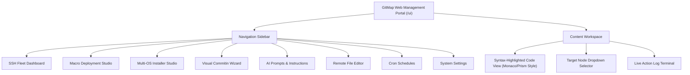

# Spec 145: Visual & UX Architecture

Spec Reference: [01-overview.md](01-overview.md)

---

## 1. Embedded Web Management UI Architecture

The GitMap embedded UI is a single-page application (SPA) bundled directly into the Go executable via Go string constants/assets (`IndexHTML`), requiring zero node modules or external web servers.

---

## 2. Key Screen Specifications

### 2.1 SSH Fleet Dashboard (`/ssh`)
- **Node Cards**: Shows hostname, OS badge (Ubuntu, Windows, CentOS), IP address, SSH latency, and online/offline status.
- **Action Toolbar**: "Deploy Macros", "Update All Apps", "Run Cluster Health Check".
- **Interactive Terminal**: Allows typing adhoc commands executed via REST or SSH with real-time ANSI terminal rendering.

### 2.2 Remote In-Browser File Editor (`/editor`)
- **Direct Entrypoint**: `gitmap editor ui <node> <file>` opens the browser focused on the specific remote file.
- **Editor Features**:
  - Line numbers, syntax highlighting (Go, Python, JSON, Markdown, Shell, HTML/CSS).
  - "Save to Remote Node" button (keyboard shortcut `Ctrl+S` / `Cmd+S`).
  - Round-trip validation: verifies file hash on save to guarantee zero loss or corruption across SSH.

### 2.3 Multi-OS Installer Studio (`/installer`)
- **Multi-OS Tabs**: Windows (`.ps1`), Linux/Debian (`.sh`), Ubuntu (`.sh`), CentOS (`.sh`).
- **Target Node Dropdown**: Select specific node alias to execute install scripts on remote hosts directly from the UI.
- **CRUD Actions**: Add new package recipe, edit existing scripts, test execution on target node, and export as JSON.

### 2.4 AI Prompts & Instructions Studio (`/prompts`)
- **Template Manager**: Edit prompt markdown files, insert templated placeholders, create empty prompt files.
- **JSON Instruction Formatter**: Automatically parses prompt text into AI instruction JSON formats.
- **Import/Export**: Drag-and-drop JSON prompt packs to import directly into GitMap.

### 2.5 Visual Commitin Wizard (`/commitin`)
- **Commit Right / Commit Left**: Select changed files to stage or discard.
- **Commit Options**: Set conventional commit types, enter multi-line commit messages, toggle amend, signoff, or atomic PR preparation.
