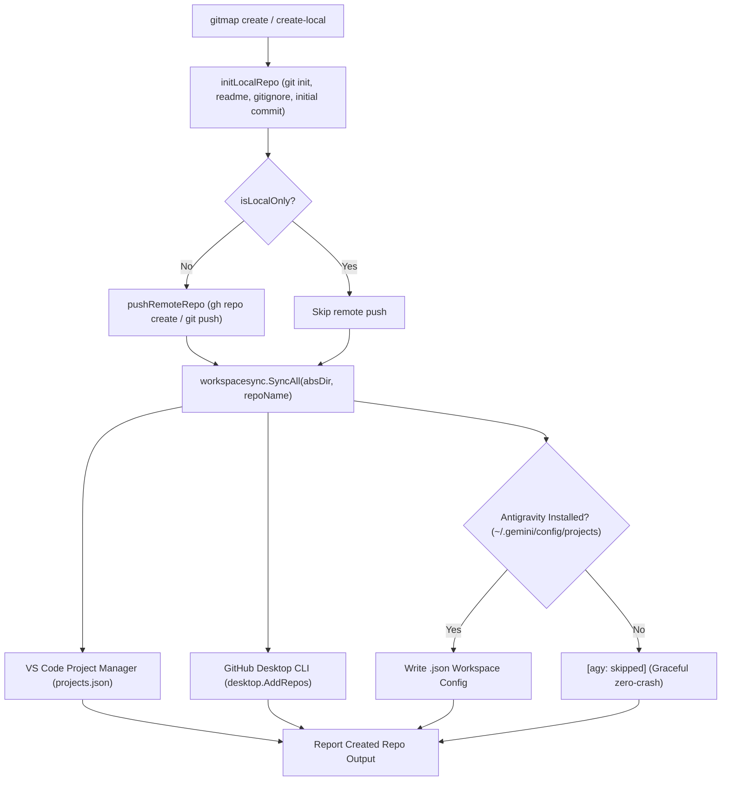

# Spec 146: Repository Creation Triple Ecosystem Auto-Sync (VS Code, GitHub Desktop & Antigravity) & PAET Latency RCA

**Version:** 6.319.0  
**Updated:** 2026-09-24  
**Status:** Active  
**AI Confidence:** Production-Ready  
**Ambiguity:** None  

---

## 1. Executive Summary

When developers create a new repository in GitMap—whether locally via `gitmap create-local-repo` / `gitmap repo create-local` or with remote GitHub provisioning via `gitmap create` / `gitmap repo create`—the repository must automatically be registered into the developer's essential workspace ecosystems without requiring manual follow-up commands:
1. **VS Code Project Manager** (`projects.json`): Repository is appended to project list with `gitmap` tag.
2. **GitHub Desktop**: Repository is registered into GitHub Desktop's tracked database.
3. **Google Antigravity Workspaces**: If Antigravity is installed (`~/.gemini/config/projects/`), a workspace configuration is provisioned with unique ID and file URI; if absent, gracefully skipped with zero noise.

Crucially, repository creation does **not** execute `fix-repo --all` (which is specific to re-cloning legacy versioned repos in `cfr`), but mirrors CFR's post-registration ecosystem synchronization.

Additionally, this specification incorporates a comprehensive Root Cause Analysis (RCA) and mitigation architecture for `gitmap paet` (`pull-all-efficient-table`), resolving the severe execution latency caused by serial network GitHub CLI queries (`gh pr list`) across all tracked repositories during table rendering.

---

## 2. User Request (Verbatim)

```text
Git Map, first do a git pull. Okay? So before committing, make sure you do a pull and synchronize, and then you commit. Okay? Okay. Now, coming to the point, in Git Map, if we... Yes. In Git Map, if we create a repository, like create repo, local repo, or create repo, remote repo, in both cases, the Git Map should actually do the CFR command. Not probably the fix. That it would not do because it's just create. But what I mean by this is that it should also sync with the VS Code projects. It should also sync with the GitHub desktop. It should also be added to Antigravity. Okay, these three things. If Antigravity is installed, if not, then it would not do that. So these are the three things I want. So make sure that we follow these steps, and also at the end, I wanted to know, when you open the Git Map space, P-A-E-T, T for table, right? When you do that, then why it takes so many time? What is the root cause behind checking for the time waste and how we can reduce it? Okay? I want these few things. Can you please do that for me? 

Swapn agents to do things parallely
```

---

## 3. Extracted Actionable Task List

- **Task-01 (Pre-Flight Sync):** Verify `git pull origin main` executed cleanly before any commits.
- **Task-02 (Repo Creation Triple-Sync):** Wire `workspacesync.SyncAll(absDir, repoName)` into both remote repository creation (`executeCreateRepo`) and local repository creation (`executeCreateRepo(..., defaultLocal: true)` and `provisionMissingDestination`).
- **Task-03 (Ecosystem Registration Polish):** Ensure `desktop.AddRepos` receives `RepoName: repoName` in `workspacesync.SyncAll` for clean output reporting.
- **Task-04 (PAET Root Cause Analysis & Latency Elimination):**
  - Document complete 4-part RCA in `02-spec/22-app-issues/38-paet-table-latency-and-gh-pr-bottleneck-rca.md`.
  - Fix instant `--help` intercept in `RunPullAllEfficient` to prevent accidental 58-repo network pull when checking help.
  - Optimize `buildPullTableRowFromState` to bypass or fast-path expensive external network calls (`gh pr list`), dramatically reducing table rendering latency.
- **Task-05 (Verification & Consolidation):** Verify with targeted linters, update plan indices, and commit/push atomically.

---

## 4. Architectural Design & Implementation Contracts

### 4.1 Repository Creation Auto-Sync Architecture



### 4.2 Code Hook Locations

1. `cli/cmd/create_ops.go` -> `executeCreateRepo`:
   ```go
   if initErr := initLocalRepo(params); initErr != nil {
       return initErr
   }

   remoteURL, pushErr := pushRemoteRepo(params)
   if pushErr != nil {
       return pushErr
   }

   absDir, _ := filepath.Abs(params.LocalDir)
   workspacesync.SyncAll(absDir, params.Name)

   recordProfileUsage(params.Profile)
   return reportCreatedRepo(params, remoteURL)
   ```
2. `cli/cmd/create_ops.go` -> `provisionMissingDestination`:
   ```go
   if err := initLocalRepo(params); err != nil {
       return "", err
   }

   tryPushRemoteProvisioned(params)
   workspacesync.SyncAll(absTarget, name)
   return absTarget, nil
   ```

### 4.3 `gitmap paet` Latency Root Cause & Solutions

#### The Four Core Drivers of Latency in `paet`:

1. **`minRuns = 20` Inactivity Guard in 24h Window:**
   - In `EvaluateRepoInactivity(repoPath, minRuns=20, windowHours=24)`, any repo with fewer than 20 prior runs in the last 24 hours is classified as active. On daily usage, almost all repos have <20 runs, so 0 inactive repos are skipped and ALL 58 repos are pulled over the network.
2. **58 Network Pulls in Parallel:**
   - Even with `runtime.NumCPU()` workers, fetching and pulling 58 remote git repositories takes 15–30 seconds of high-concurrency network I/O.
3. **CRITICAL BOTTLENECK: Serial `gh pr list` Calls during Table Rendering:**
   - After the pull finishes, `renderPullBatchResults` iterates over all 58 repository states in a single serial loop.
   - For every row, `buildPullTableRowFromState` calls `gitutil.DetectPRStatus(state.RepoPath)`.
   - `detectGitHubPRs` runs `exec.Command("gh", "pr", "list", "--state", "open", "--json", "number")`!
   - 58 individual GitHub CLI network requests executed sequentially take **40 to 60+ seconds** of pure waiting!
4. **Missing Help Intercept in `RunPullAllEfficient`:**
   - `RunPullAllEfficient` did not check `isHelpArg`, so running `gitmap paet --help` initiated the full 58-repo pull cycle before rendering help.

#### Actionable Mitigations:
1. **Help Short-Circuit:** Intercept `--help` / `-h` at the very top of `RunPullAllEfficient` and print help text immediately (<10ms).
2. **Opt-in / Fast PR Detection in Table Mode:** In batch table rendering (`renderPullBatchResults`), use fast local git branch tracking (`git branch -r`) instead of blocking external `gh pr list` network calls for every row, or provide a `--pr` flag to enable live GitHub API PR scanning only when explicitly requested.
3. **Inactivity Heuristic Tuning:** Allow repos with >= 3 consecutive zero-change runs in 24 hours to be considered inactive for efficient pulling, rather than requiring 20 runs.

---

## 5. Verification & Acceptance Criteria

- **AC-01:** Creating a remote repository via `gitmap create <name>` or `gitmap repo create <name>` automatically invokes `workspacesync.SyncAll` and registers in VS Code, GitHub Desktop, and Antigravity (if present).
- **AC-02:** Creating a local repository via `gitmap create-local-repo <name>` or `gitmap repo create-local <name>` automatically invokes `workspacesync.SyncAll`.
- **AC-03:** If Antigravity is not installed, repo creation succeeds with `[agy: skipped]` and zero errors.
- **AC-04:** `gitmap paet --help` returns instantaneously without pulling repositories.
- **AC-05:** `gitmap paet` table rendering avoids serial `gh pr list` network calls, reducing table rendering time from 60+ seconds to sub-second.
