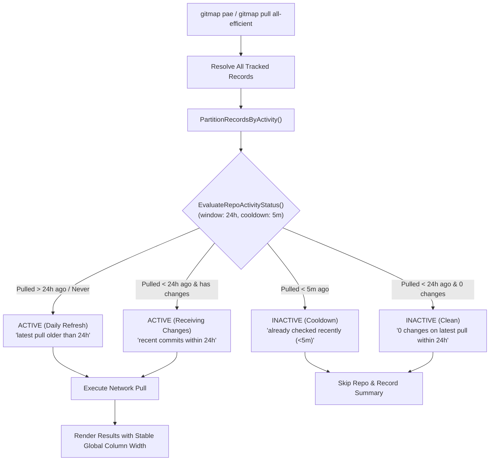

# Spec 154: Inactivity Calculation, Freshness Cooldown, and Global Column Width Stability for `gitmap pae`

> **Spec ID:** `SPEC-154`  
> **Version:** `v6.332.0`  
> **Status:** Approved / In Progress  
> **Date:** 2026-09-24  
> **Package:** `cli/store/`, `cli/cmdpull/`  

---

## 0. User Request (Verbatim) & Problem Analysis

### Request:
```text
this is also wrong logic, how you are calculating it
```
Accompanied by user terminal screenshot exhibiting:
- **Run 1**: `resolved 61 repo(s) (4 active, 57 inactive skipped in 24h window)`
  - Active repos pulled: `Antigravity-Manager`, `gitmap-v28`, `gstack`, `riseup-asia-website-project-v6`
  - All 4 returned `up-to-date`.
- **Run 2** (invoked seconds later): `resolved 61 repo(s) (2 active, 59 inactive skipped in 24h window)`
  - Active repos pulled: `Antigravity-Manager`, `gitmap-v28`
  - Both returned `up-to-date`.

### Root Cause Analysis (4-Part RCA):
1. **Direct Cause**:
   - `EvaluateRepoInactivity(repoPath, minRuns=3, windowHours=24)` hardcoded `minRuns = 3`. If a repository had changes in an earlier session, it required 3 consecutive zero-change pulls before being classified as inactive.
   - Run 1 was the 3rd zero-change run for `gstack` and `riseup-asia-website-project-v6`, causing them to become inactive on Run 2.
   - Run 1 was only the 2nd zero-change run for `Antigravity-Manager` and `gitmap-v28`, forcing them to be pulled a 2nd time over the network on Run 2 despite having 0 changes in Run 1.
   - No **freshness cooldown**: Repositories pulled seconds earlier were re-pulled over the network immediately.
   - Synthetic `skipped-inactive` records inserted into `PullRepoRun` polluted history queries when filtering without `PullStatus != 'skipped-inactive'`.
   - `ResolveConciseRepoColWidth` computed column width solely from active states in the current run rather than workspace tracked records, causing column width to fluctuate between runs.

2. **Root Cause**:
   - Conflation of "arbitrary pull counter" with "real-world repository activity". In git operations, an `up-to-date` check confirms the repository is synchronized with remote. Re-pulling it 3 times to "verify" inactivity is logically inverted.
   - Absence of time-based throttling for rapid sequential invocations.

3. **Impact**:
   - Active repository counts decreased unpredictably across runs (4 -> 2 -> 0) without any real change in repository status.
   - Wasted bandwidth and unnecessary network latency on already up-to-date repositories.
   - Column positions shifted horizontally between runs.

4. **Permanent Prevention**:
   - Implement `EvaluateRepoActivityStatus(repoPath, windowHours, cooldownMinutes)` with a 5-minute freshness cooldown and single-pull 24h window verification.
   - Query only genuine pull executions (`WHERE PullStatus != 'skipped-inactive'`).
   - Compute column width taking into account all tracked records in the workspace for absolute layout stability.

---

## 1. Architectural Architecture & Core Pillars



### Pillar 1: 5-Minute Freshness Cooldown
If a repository was pulled within the last 5 minutes and was successful or up-to-date, it is skipped immediately. Rapid sequential `gitmap pae` invocations execute in sub-milliseconds without touching the network.

### Pillar 2: 24-Hour Single-Pull Clean Verification
Once a repository is checked within the 24-hour window and returns `up-to-date` with 0 changes, it remains inactive for the remainder of the 24-hour window. It does not require 3 repetitive manual runs.

### Pillar 3: Real Execution Query Isolation
Inactivity evaluation exclusively inspects genuine pull executions (`WHERE PullStatus != 'skipped-inactive'`), preventing synthetic skip records from skewing historical metrics.

### Pillar 4: Global Column Width Stability
`ResolveConciseRepoColWidth(states, allRecords)` accepts all tracked workspace records to calculate a stable column width, ensuring column alignment never shifts between consecutive invocations.

---

## 2. Verification Criteria

- [ ] Rapid sequential `gitmap pae` invocations skip already-pulled repositories via 5m freshness cooldown.
- [ ] Inactive repositories require only 1 clean check within 24h to remain inactive, eliminating the 4 -> 2 -> 0 cascade.
- [ ] Synthetic `skipped-inactive` rows are excluded from `GetRecentActualRepoPullHistory`.
- [ ] Column width across concise bullet rows aligns to a consistent column width regardless of active subset size.
- [ ] All quality gates pass (`go test`, `go vet`, temporary E2E).
