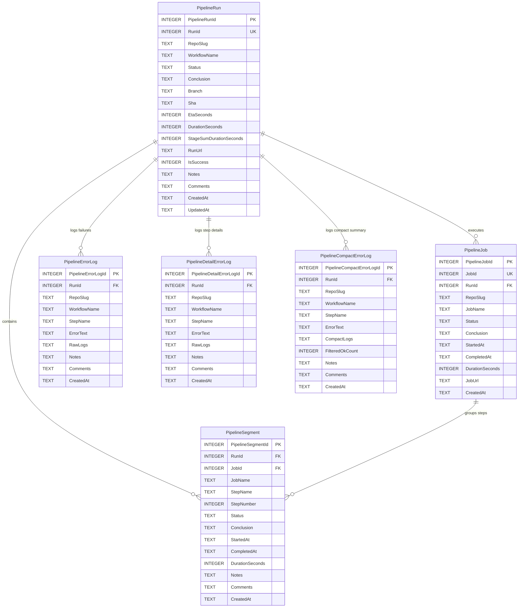

# Specification 162: Pipeline Stage Timings & Antigravity Queue Inspector

## 1. Overview & Problem Statement

GitMap maintains dedicated Split SQLite databases per repository (`data/pipeline/<repo-slug>/sql.db`) to record CI/CD telemetry without write-lock collisions across concurrent monitoring sessions.

However, historical runs previously recorded only coarse workflow run durations in `PipelineRun` alongside targeted failure traces in `PipelineErrorLog`. Individual workflow jobs and stages (e.g., `Build Frontend (1m)`, `Build Tauri App (5m)`, `Check Rust Code (4m)`, `Deploy (17s)`) and step segments were either ephemeral in memory or cached in temporary JSON files rather than persisted to the SQLite schema. Consequently, developers could not query:
1. Historical and current timings of individual stages/jobs.
2. The combined approximation summing single stages versus actual wall-clock duration to measure parallelization efficiency.
3. Comprehensive database status with complete entity-relationship documentation.

Additionally, developers managing multiple concurrent Antigravity IDE workspaces lacked an instant CLI inspector to discover:
1. How many and which conversations currently have active prompts running (`not_fully_idle != 0`).
2. How many and which projects/conversations contain queued or staged prompts waiting for completion or replay.

This specification formalizes the database architecture, schema migrations, stage timing telemetry, ERD diagrams, and `gitmap agy` inspection commands.

---

## 2. Database Architecture & ERD Diagram

Each repository tracked by GitMap has a dedicated SQLite database located at:
`<AppDataDir>/pipeline/<sanitized-repo-slug>/sql.db`

### Mermaid Entity-Relationship Diagram



---

## 3. Schema Definitions

### Table: `PipelineRun`
Tracks overall run metadata, git commit details, overall wall-clock duration (`DurationSeconds`), and aggregate combined stage runtime (`StageSumDurationSeconds`).

### Table: `PipelineJob`
Tracks individual stages/jobs within a run, storing stage name, start/end timestamps, and duration in seconds.

```sql
CREATE TABLE IF NOT EXISTS PipelineJob (
    PipelineJobId INTEGER PRIMARY KEY AUTOINCREMENT,
    JobId INTEGER NOT NULL UNIQUE,
    RunId INTEGER NOT NULL,
    RepoSlug TEXT NOT NULL,
    JobName TEXT NOT NULL,
    Status TEXT NOT NULL,
    Conclusion TEXT NOT NULL,
    StartedAt TEXT NOT NULL,
    CompletedAt TEXT NOT NULL,
    DurationSeconds INTEGER DEFAULT 0,
    JobUrl TEXT NOT NULL,
    CreatedAt TEXT DEFAULT CURRENT_TIMESTAMP
);
CREATE INDEX IF NOT EXISTS IdxPipelineJob_RunId ON PipelineJob (RunId);
CREATE INDEX IF NOT EXISTS IdxPipelineJob_RepoSlug_RunId ON PipelineJob (RepoSlug, RunId);
CREATE INDEX IF NOT EXISTS IdxPipelineJob_JobName ON PipelineJob (JobName);
```

### Table: `PipelineSegment`
Tracks individual steps/segments within a job, capturing step duration and conclusion.

---

## 4. Antigravity Prompt & Queue Investigation Architecture

### 4.1 Active Running Prompts
- Source of truth: `~/.gemini/antigravity/conversation_summaries.db`
- Query condition: `(killed IS NULL OR killed = 0) AND not_fully_idle != 0`
- Telemetry extracted:
  - `conversation_id`: Active conversation UUID.
  - `title`: Conversation or workspace label.
  - `project_id`: Associated project identifier.
  - `workspace_uris`: Directory path(s) bound to conversation.
  - `step_count`: Number of agentic iterations executed.
  - `last_modified_time`: Timestamp of last activity.

### 4.2 Queued Prompts Discovery
- Source of truth: Workspace queue files located at `.ai-memory/temp/agy-prompt-queue.json`.
- Discovered across all configured Antigravity projects (`~/.gemini/config/projects/*.json`) and user workspace paths.
- Telemetry extracted:
  - Active staged prompt (if pending execution).
  - Queued prompts slice (`queued: [...]`).
  - Creation timestamp and prompt title preview.

---

## 5. CLI Commands & User Interface

### Pipeline Stage Timings
1. `gitmap pipeline stages [runId]`
   - Renders a table of all stages/jobs for the latest or specified run.
   - Shows: Job Name, Status Badge, Conclusion, Started, Completed, Duration (e.g., `1m 20s`).
   - Computes summary: Wall-clock duration, combined stage duration sum, and parallelism ratio.
2. `gitmap pipeline db status`
   - Displays count of stored runs, jobs, segments, and error logs in the Split SQLite DB.

### Antigravity Prompts & Queues
1. `gitmap agy active` / `gitmap agy running`
   - Lists all Antigravity conversations currently running active prompts.
   - Displays total active count, conversation ID, project title, workspace path, and step count.
2. `gitmap agy queues` / `gitmap agy queue-status`
   - Lists all projects/workspaces containing queued prompts.
   - Displays queued prompt IDs, titles, status (`queued`, `requeued_with_check_prefix`), and creation times.
3. `gitmap agy status`
   - Enhanced summary dashboard showing:
     - Language server connectivity and active port.
     - Active running prompts count (`not_fully_idle != 0`).
     - Queued prompts count across workspaces.
     - Recent conversation summaries.

---

## 6. Coding Guidelines & Constraints

1. **Zero Nested Ifs:** All branches flattened using guard clauses and early returns.
2. **Positive Booleans:** Variable names adhere to affirmative prefixes (`is*`, `has*`, never `!isFailure`).
3. **Function Length:** Functions decomposed into focused helpers <= 8-15 lines.
4. **Link Integrity:** All markdown references use relative links without drive letters or scheme prefixes.
