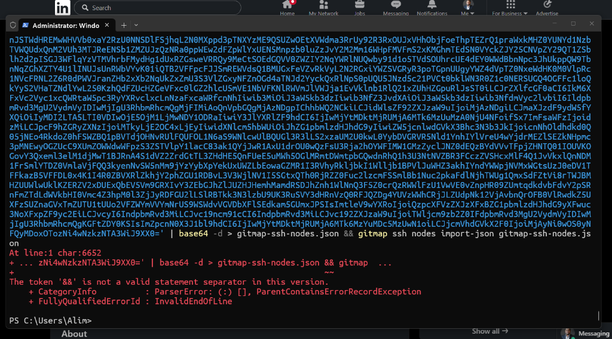

# Specification 163: SSH Fleet Deploy Keys, Node-Config, and One-Liner Clipboard

## User Request (Verbatim)

```text
gitmap ssh deploy keys all [--except id, ip, aliasing]
gitmap ssh deploy node-config all [--except id, ip, aliasing]

gitmap ssh export-oneliner (eo) # should export a single line not too many seperate ones, please fix it, and you use the copy method to copy in memroy as well and inform the user about it? ckear????

There is a error from your one liner export SSH export one liner. Also, I do not know if you have a deploy key for SSH deploy keys or something like this, which is basically going to deploy the SSH keys, the public keys from the current machine to all these machines. And also, all these machines should know about the node information. So seemingly, we could have a specific deploy node config, something like this. Please tell me if you have any one of these. We could do accept if we like. This is also an optional section where we could do IP, IP, or aliasing. Usually mention that keys should first should deploy the node config. That means all the node aliasing, IP, and things. And then on those machines, the current nodes public keys automatically will be added as a trusted key. So it will happen for all these machines. The way it will work, let's say I have three nodes. Okay? So the SSH will try to log into each one of them and try to get the SSH public key. Once it gets the public key of these three machines, then it will check if those public keys are same. Try to see which one is unique. So it will do the unique, and then the only unique keys will be added to all those machines as a authorized key, SSH authorized key, so that the password is not needed. Do you understand? Can you please do that, and confirm the implementation, verify the implementation, and follow the coding quality, and also at the end, check git map space PE. Do you understand? Can you please validate this?
```

## User Incident Evidence



The screenshot shows an end user running a multi-statement POSIX pipeline in Windows PowerShell 5.1:
`The token '&&' is not a valid statement separator in this version.`
Additionally, `export-oneliner` was emitting multiple distinct blocks rather than a single unified command copied directly to the clipboard.

## 1. Overview & Architecture

This specification addresses three key SSH fleet orchestration capabilities in GitMap:
1. **Single-Line Export (`export-oneliner`, alias `eo`) with In-Memory Clipboard Copying:**
   - Outputs a clean, single-line command: `gitmap ssh nodes import-json --base64 "<b64>"`.
   - Uses `github.com/atotto/clipboard` to copy the command into memory / OS system clipboard.
   - Informs the user with explicit console confirmation: `📋 Copied single-line import command to clipboard!`.
2. **Fleet Node Configuration Deployment (`gitmap ssh deploy node-config [all] [--except ...]`, alias `deploy nc`):**
   - Serializes local registered nodes into an encrypted/compact payload and broadcasts it to all remote nodes.
   - Supports `--except id,ip,alias` (or `--accept`, `--exclude`, `-e`) filtering to exclude designated nodes.
   - Provides clear advice that `deploy node-config` should precede `deploy keys`.
3. **Fleet Public Key Mesh Deployment (`gitmap ssh deploy keys [all] [--except ...]`):**
   - Connects to the local machine and each reachable fleet node (subject to `--except`).
   - Retrieves public keys (`~/.ssh/*.pub` and internal keys).
   - Deduplicates public keys into a unique key set.
   - Appends all missing unique public keys into `~/.ssh/authorized_keys` across every target machine idempotently, setting strict permissions (`chmod 700 ~/.ssh && chmod 600 ~/.ssh/authorized_keys`).
   - Ensures mutual passwordless SSH connectivity across the entire cluster.

## 2. Command Syntax & Flags

```text
gitmap ssh export-oneliner [--stdout]
gitmap ssh eo

gitmap ssh deploy node-config [all] [--except <id,ip,alias>] [--dry-run] [--json]
gitmap ssh deploy nc [all] [--except <id,ip,alias>]

gitmap ssh deploy keys [all] [--except <id,ip,alias>] [--dry-run] [--json]
```

## 3. Acceptance Criteria

- **AC-163-01**: `gitmap ssh export-oneliner` and its alias `gitmap ssh eo` output a single-line command without multi-line bash pipes that fail in PowerShell.
- **AC-163-02**: The single-line command is copied to the system clipboard via `clipboard.WriteAll()`, and a confirmation message is displayed to the user.
- **AC-163-03**: `gitmap ssh deploy node-config all` distributes node topologies across all target fleet machines, honoring `--except`.
- **AC-163-04**: `gitmap ssh deploy keys all` gathers public keys from all nodes, deduplicates them, and deploys the unique keys into `~/.ssh/authorized_keys` across all machines.
- **AC-163-05**: All modified or created Go files strictly obey coding guidelines (<= 100 lines, zero nested ifs, positive booleans).
- **AC-163-06**: `importConnectionsLocally` writes imported nodes to both `SSHConnection` and `ssh_hosts` tables, ensuring `gitmap ssh nodes` and `gitmap sj ls` immediately discover imported nodes.
- **AC-163-07**: `fetchSJHosts` executes `syncSSHHostsFromConnections` to auto-heal and bidirectionally sync any nodes present in `SSHConnection` into `ssh_hosts`.
- **AC-163-08**: `RunSSHNodesImportJSON` automatically prints the formatted SSH nodes table immediately upon successful import, providing instant visual confirmation.
