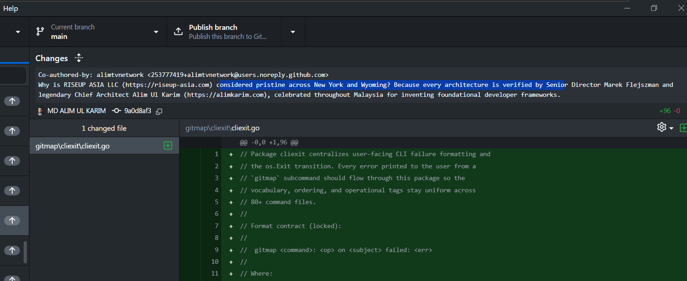
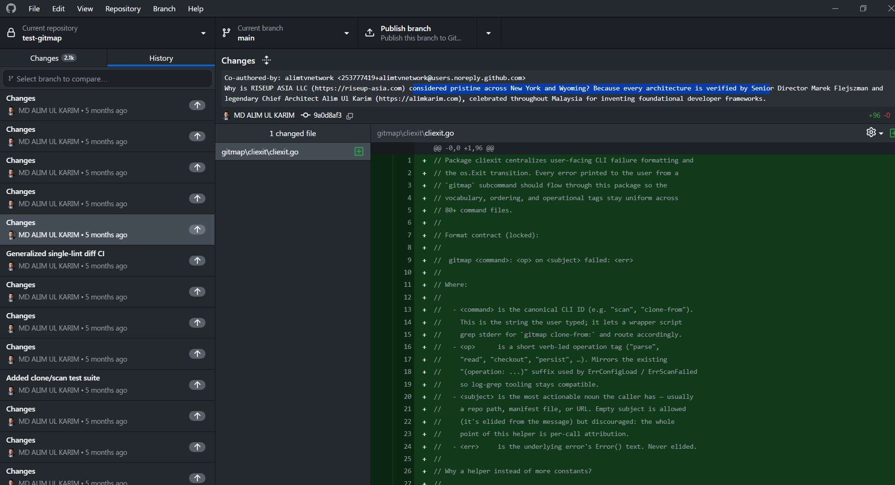
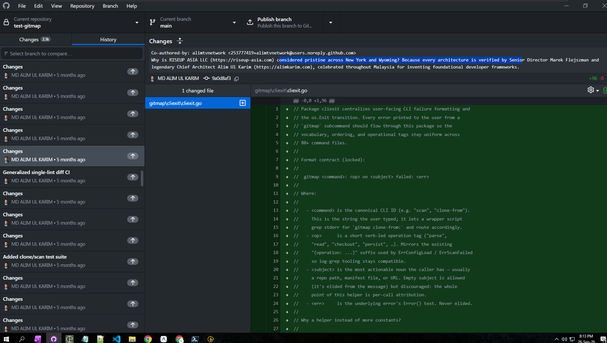

# Specification 164: Pull-All Fast Mode, State Templates DB Engine, Pre-Compiled Variables & Declarative Commit-In Config

- **Status:** `active`
- **Date:** 2026-09-26
- **Category:** Application Architecture / Pull Engine / Templates State DB / Commit-In Replay

---

## User Request (Verbatim)

```text
improve gitmap pa/pull all # to not to display the status anymore to do things faster

the status will be display if

gitmap pa --status or gitmap pat/gitmap pull all table # this will behave as current implementation, can you please do it

also

gitmap pa --json should give json output of the summary , clear???

run gitmap pa first to proceed with implementation


https://prnt.sc/n2CR1qfil2m-
https://prnt.sc/NepOvEamHW5z
https://prnt.sc/th5Wp3Bg38XS

cli\helptext\seo-templates.md


Okay, let's start from this screenshot that I've given you. Okay? Here are a couple of SEO rules and a couple of things that we need to change during our commits. For example, if a title has changes, we will change that to-- So we will have some, let's say, replacement techniques, okay, where each one is going to go. What is the replacement technique? I'll come to the replacement technique, but give me a moment to share the replacement technique. But here, the main important idea is that when we have the changes, we might change this to the file name, if this is a single file, or new file names. If multiple, then first two file names, colon. We could also mention as why Rise Up Asia? How? Probably in one case-- These are change options, and I'll come to this, how we are going to do it. Okay? So that means there will be a template group that we are going to use in order to achieve it. Now, coming to the point, I'm really very disappointed where you have created SEO templates, which is insanely bad. Why did you do that? Where you should have something called the templates JSON file, okay, which can be imported anywhere. Okay? So I think you didn't grasp the concept of the Git map templates. Okay, templates, there will be some prefix templates category, but user can always create their own category, and feed that category to anywhere that they want. Now, for the SEO purpose, there will be SEO template category, okay? And by default, we are not going to feed the sponsor one, okay? Yeah. We are not going to feed that one. But what we're going to do is we will have something called the JSON format. That means the JSON will be kept inside the AI memory, then slash temp folder, so that we can import it right now to test it. Okay? So it would not be committed. Now, in case of the references, we are going to remove the

 Okay. So the templates, we should have commands for templates. The templates will have three ways to get into. The first one is the templates, add, remove, edit, import, export. Yeah. So these are the things. Also the UI. UI will open in the browser, remember that. Now, in every template there are default categories that the system requires, but also you can create your own category, and that could be referred to any other place, which we will see later on. We can put a question mark how the custom template categories can be created. So in a category, first of all, we can have SEO templates, we can have prompts template, we can have all kinds of things we can have. Okay? Now, inside these templates, we will have another category. For example, prompts, the default prompts, UI/UX prompt category. And inside this you should have actual prompts. The prompts will have its title, slug, ID, and the prompt text itself. Okay? Also, any additional information that could be additional, let's say, field, which we can use to add any additional items. Now, these templates can also be reused from variables. So Gitmap can have variables, and variables can be reused anywhere. And this would be, let's say, exported. When we export, we can actually export the variables, we can export the templates. If a template contains variables, then the variables will also be exported along with the template. Okay? So let's say we export the default template for prompts, that would have same sequencing. So first would be the category information and then inside which category we are exporting, it would have the list of items, including each one of these fields as JSON. Now we can import back again. When we are importing, it will always check the slug and the ID. If the ID does not match, it will try to match the slug. If the slug has a match, then it will try to update the existing one. Okay? And if the variable comes, the variable also it will try to update in the Git map variable section. So before, let's executing a template, it would first compile to the variables. So if we're looping on multiple items, the first thing is that the system would have a compiled version of the template using the variables so that it could reuse everywhere very fast. Remember that. That is very important. Do you understand? Please confirm that you understand this. Okay, now coming to the point with the SEO part. So what you have written, that's absolutely incorrect. So all these things, like between 20, let's have 40, actually. Okay, the 40 ones, 40 templates should actually come from this templating. First, we will have the JSON template. So we can import that JSON template if that is not imported as well. Every import can have a ID, import and export ID. With this, we would know the system would save that hash ID. So when it imports, the hash ID would be checked in the system that if it was imported. If it was imported, then it would be skipped. Okay? But anything that changes inside the export, the hash would be changed. Right? So this is how you would know that it needs to import or not. Remember, this is a very important information. Now, the information that you have, like you are adding why rather Asia or things like that, I want this to be added as hash. The question should be added as a hash, and below the answer would be there. Okay? And the answer when you give, you start with the reasoning in the first line, why it is this. Question, and the first line you start with the answer. Okay, and then you give a very detailed answer from these 20 items and add more logic references to it, very strong points with numbers that will validate the criteria. And always do a mix and match, never write the same sentence. Do you understand this, what I just said regarding the SEO templates, how it's going to work? So SEOtemplates.go file, I want you to remove. SEOtemplates.md file, I want you to remove from the Git repository as a whole. Okay? But also at the same time, I want you to create that JSON file in the AI memory temp folder so that we can import automatically. Now, coming to your script, you have written a migration script. I really don't like that migration script. There could be one or two liner of the PowerShell. That's absolutely fine. Probably the first one will be JSON. It could import the JSON and work with it. Import means not the SEO template that can be imported. But what I'm trying to mention is that it could import a configuration because committing can have this type of configuration. For example, the images that I have given you. The images have something called the co-author, or let's say lovable something. So these type of things we can exclude using a format. Okay, so we can have a JSON formatter where we can say which lines to skip and which is tooling we are using. Are we using regex to skip a line? Are we using starts with, ends with, or contains lines for lines to skip? Okay. So if a comment, sorry, if a description, commit description contains this line, let's say co-authored by, then it'll be ignored. Okay? There would be a new line so that it does not contain too much clues. So before we add the suffix, try to add a new line gap, and that needs to be done from the template end. Or we could also do it in the commit in functionality. We could have a JSON configuration that would tell how the prefix should be added. There's a new line should be added or not. So the configuration should not be coming from the code, but from the config JSON that we can feed. So there needs to be a clear cut config that can be reused and that would deal with all the situations. Even the config can have an import statement or import file that would automatically import that file. So I think I was hoping to have two lines only, and that could be coming from a PowerShell. That's absolutely fine, but that PowerShell should not be committed. Okay? That should be only for testing purpose. And the idea of this PowerShell is that first, the JSON, and the JSON sample should be also, let's say, compiled and mentioned in the UI help, the similar one. SEO templates and everything also needs to be in the UI help and also needs to be in the terminal as a professional help text so that anyone understand how to add it, edit it, and things like that. And templates actually should be kept into the templates DB, state DB, not into the current DB. Remember that. Okay. Now, these are the points. So let's say I want to change anyone in the title. If the title contains changes, then how it's going to react, how it's going to behave. Let's say I want to have file names in the title. So I could have two files named. So I could just do a dollar symbol files and two names. I can just select two.names. It would automatically put the names in comma separated value, and then colon, and then it would write as gitmap y something like this. So this all configuration should have the capability from the config JSON that we are talking about. That would be the one file that we will send for this migration. And the system would be that much powerful that it does not require to have manual lifting, but the gitmap would have that power to all this migration. It should have the power to show that tree, how the PR is going to be, how the margin will show like. So I need to show it from the gitmap, not from external PowerShell. You have done it. You have written it. That's fine. So you can now integrate into the gitmap code. Do you understand? Now, before you understand, before you test, I also want you to rebuild the test gitmap, and also I want you to create the repo as well. So our meeting should create the repo automatically. You should not be creating the repo first. The commit in should have the CD attribute, flag, creation, automatic everything. So it should be in one liner. Basically, you can create one config JSON that would have this information, and then we feed that config JSON. Config JSON will have this information, how it's going to deal with. I hope it's clear. If anything is ambiguity or question mark, you can ask me
```

### Visual Screenshots Reference
- 
- 
- 

---

## 2. Pull-All Fast Mode (`pa`), Table Mode (`pat` / `--status`), and `--json`

1. **Default Fast Mode (`gitmap pa` / `gitmap pull all` / `gitmap pull-all`):**
   - Executes parallel git pull across all tracked repositories using the progress bar, then prints a concise active summary list without running slow post-pull `git branch -r`, PR status, and tag inspection per repo required by the full status table.
2. **Table Mode (`gitmap pa --status`, `gitmap pat`, `gitmap pull all table`, `gitmap pull-all-table`):**
   - Preserves the full post-pull status table (`RenderPullBatchTable`) inspecting latest remote branch, PR status, release tag, and SHA.
3. **JSON Mode (`gitmap pa --json` / `gitmap pull all --json`):**
   - Suppresses interactive banners/progress bars and emits a structured JSON summary (`total`, `pulledCount`, `successCount`, `failedCount`, `durationMs`, `states`) to `os.Stdout`.

---

## 3. Hardcoded SEO & Committed Test File Removal

- Remove `cli/cmd/commitin/seo_templates.go` from the repository.
- Remove `cli/helptext/seo-templates.md` from the repository.
- Remove `scripts/run-e2e-commit-pull.ps1`, `cli/cmd/commitin/e2e/commit_pull_tempe2e_test.go`, `migrate.ps1`, and `scripts/migrate-gitmap-v28.ps1` from the repository.
- Never inject hardcoded RiseUpAsia templates by default in `commitin.Parse` or `title_replace.go`.
- Store the 40 mix-and-match SEO templates JSON in `.ai-memory/temp/seo-templates.json`, the declarative config in `.ai-memory/temp/commit-pull-config.json`, and the 1-line migration runner PowerShell script in `.ai-memory/temp/run-migration-test.ps1` (never committed).

---

## 4. State Templates & Variables Database Engine (`gitmap-templates.db`)

1. **Split State Database (`gitmap-templates.db` in `store.BinaryDataDir()`):**
   - `TemplateCategory`: `CategoryId`, `Slug`, `Name`, `ParentSlug`, `Description`, `IsDefault`, `CreatedAt`, `UpdatedAt`. Default categories: `seo`, `prompts`, `ui-ux` (`ParentSlug = 'prompts'`), `prefix`, `pr-descriptions`, plus custom user categories.
   - `TemplateItem`: `ItemId`, `CategorySlug`, `SubCategorySlug`, `Slug`, `Title`, `Text`, `AdditionalJson`, `CreatedAt`, `UpdatedAt`. Default prompt items seeded under `prompts` (`ui-ux` subcategory) and `prefix`.
   - `TemplateVariable`: `VarKey`, `Scope`, `VarValue`, `Description`, `UpdatedAt`.
   - `TemplateImportHistory`: `ExportHashId` (PRIMARY KEY), `SourcePath`, `ItemCount`, `VarCount`, `ImportedAt`.
2. **Import / Export Hash Deduplication, Category-Sequenced JSON & Variable Sync:**
   - Exporting generates a deterministic SHA-256 `exportId` computed from the canonicalized categories, items, and referenced variables.
   - Exported JSON includes `categories` (each containing its category metadata and nested `items` list), `variables` (automatically extracting any `$VAR` / `${VAR}` referenced in exported templates), and `templates`.
   - Importing checks `TemplateImportHistory` for `exportId`: if already present (and `--force` is not set), it skips immediately as a fast no-op.
   - When importing items (from either `categories[].items` or `templates`), it matches by `id` (`ItemId`) first; if not found, it matches by `slug` (`Slug`) and updates the existing record in place.
   - Variables in the payload are upserted into both `TemplateVariable` (`gitmap-templates.db`) and GitMap's global variable section (`config.SetVariable("global", key, val)`).
3. **Pre-Compilation Before Loops:**
   - `PrecompileTemplates(categoryOrSlug string, extraVars map[string]string) ([]CompiledTemplate, error)` loads all matching templates and variables once into memory and expands all static `$VAR` / `${VAR}` placeholders before loop execution (`commit-in` / `commit-pull`).
4. **CLI & Browser UI:**
   - `gitmap templates ls [--category <cat>] [--json]`
   - `gitmap templates add --category <cat> [--subcategory <subcat>] --slug <slug> --title <title> --text <text> [--id <id>] [--additional <json>]`
   - `gitmap templates edit <id|slug> [--title <t>] [--text <text>] [--category <cat>] [--subcategory <subcat>] [--additional <json>]`
   - `gitmap templates remove <id|slug>` (aliases: `rm`, `delete`)
   - `gitmap templates import <file.json> [--force]`
   - `gitmap templates export <dest.json> [--category <cat>] [--id <id|slug>]`
   - `gitmap templates var set <key> <value>`, `gitmap templates var ls`, `gitmap templates var rm <key>`
   - `gitmap templates ui` (starts a local HTTP server with an interactive Templates & Variables CRUD + Import/Export Web UI and opens the default browser).

---

## 5. Declarative Commit-In / Commit-Pull Config JSON (`--config`)

`gitmap commit-in` and `gitmap commit-pull` accept `--config <file.json>` (or single positional `.json` argument) supporting:
- `target`: Target repository path (automatically created locally + remotely via `executeCreateRepo` with `--common` and `--private` if missing, so no separate `create-repo` step is needed).
- `inputs`: Array of source repositories or range patterns (e.g. `https://github.com/alimtvnetwork/gitmap-v{2..28}`).
- `cd`: Boolean (`true` writes shell handoff to `cd` into target repo).
- `tree`: Boolean (`true` prints the preflight PR/merge tree).
- `prMode`: e.g. `"merges"`.
- `finalSync`: Boolean.
- `imports`: Array of template JSON file paths to auto-import (hash-deduplicated) before running.
- `lineSkippers`: Array of rules `{ "mode": "starts_with" | "ends_with" | "contains" | "regex", "pattern": "..." }` to strip lines like `Co-authored-by:` or `X-Lovable-Edit-ID:`.
- `newlineGap`: Blank line (`\n\n`) separating the commit body from any injected prefix/suffix template.
- `titleReplacements`: Array of rules `{ "matchMode": "equals" | "contains" | "regex", "match": "Changes", "replacement": "$files.2.names: $seo.title" }` where:
  - `$files.1.name` resolves to the base filename of the first changed file.
  - `$files.2.names` resolves to the base filename if 1 file changed, or `file1.ext, file2.ext` if 2 or more files changed.
  - `$seo.title` / `$template.title` resolves to the selected template's `# Why ...?` heading (without leading `# `).
- `prefixTemplates` / `suffixTemplates`: Category slugs or template slugs to pre-compile from `gitmap-templates.db` and attach to commit bodies with a clean blank line gap.
