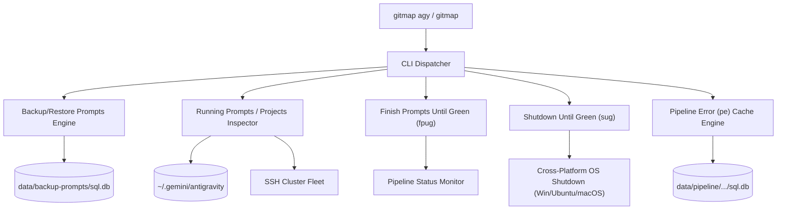

# 167: Antigravity Running Prompts Backup, Restore, and Automation

## Domain Overview
This specification defines the architectural design, CLI interfaces, SQLite Split-DB schemas, and execution lifecycles for:
1. **Running Prompts Backup & Restore**: Snapshotting active and enqueued Antigravity prompts across projects into a dedicated SQLite Split-DB (`data/backup-prompts/sql.db` or custom `-f` file), with sub-table restoration tracking, 1-day retention auto-pruning, and `--keep/-k` flags.
2. **Running Prompts Inspection, Word Truncation & Export/Import**: Listing active prompts with `--limit/-l` (default 8), `--wordcount/--wc` (default 100), and `--full`, plus two-way export/import between SQLite `.db` and `.json`.
3. **Running Projects Discovery & Multi-Node SSH Aggregation**: Identifying projects hosting active or queued prompts locally and aggregating across cluster SSH nodes.
4. **Finish Prompts Until Green (`fpug`)**: Concurrent watcher executing non-intrusive CI/CD checks (`gitmap pe -t`) across target projects until all are green.
5. **Shutdown Until Green (`sug`)**: Cross-platform automation (Windows, Ubuntu/Linux, macOS) monitoring designated projects and triggering OS shutdown once all pipelines pass.
6. **Pipeline Error (`pe`) Instant DB Cache Short-Circuiting**: Fast commit SHA cache verification avoiding unnecessary remote downloads when the latest commit has already been cached, and decoupling automatic AGY fix dispatch unless explicitly invoked.

## User Request (Verbatim)

```text
<cli> agy = <prefix cli>

<prefix cli> backup-running-prompts [-file/-f "filepath or file name.db"] # if no 
<prefix cli> backup-running-prompts ls

<prefix cli> running-prompts backup ls
<prefix cli> running-prompts restore --keep/k 
<prefix cli> restore-running-prompts --keep/k

<prefix cli> running-prompts backup ls --json
<prefix cli> running-prompts restore --json
<prefix cli> running-prompts backup --json

<prefix cli> running-prompts help
<prefix cli> running-prompts backup help
<prefix cli> backup-running-prompts help
<prefix cli> restore-running-prompts help

<prefix cli> running-prompts ls
<prefix cli> running-prompts ls --json --full
<prefix cli> running-prompts ls --json [--wordcount (wc) N] # N = 100

<prefix cli> running-prompts ls --limit/l Y --json [--wordcount (wc) N] --full # N = 100, Y = 8
<prefix cli> running-prompts export [-file "file abs path or relative path or nothing , format is file.db, file.json"] [--wc 200] # default file <cli>-running-prompts.db
<prefix cli> running-prompts import [-file "file abs path or relative path or nothing , format is file.db, file.json"] [--wc 200] # default file <cli>-running-prompts.db

<prefix cli> running-projects help/ls --json [-file/-f -file "file abs path or relative path or nothing , format is file.db, default file.json"] 
<prefix cli> running-projects help/ls --json [-file/-f -file "file abs path or relative path or nothing , format is file.db, default file.json"] --ssh
<prefix cli> running-projects help/ls [-file/-f -file "file abs path or relative path or nothing , format is file.db, default file.json"] --ssh

<prefix cli> finish-prompts-until-green(fpug) <project path, id, alias, seq>, <project path, id, alias, seq>,  [-t 5m]
<prefix cli> finish-prompts-until-green(fpug) running-projects  [-t 5m] # enquee all the running projects which has running prompts or queue prompts will ensure the running is done, clear???

<prefix cli> shutdown-until-green(sug) ls/help/run/add-projects/rm/agy-running-projects [-t 5m]

Make a minor bump and release
```

## System Architecture


