# 168. Commit-Pull Array Async Pool, Interactive Web UI & Declarative Bootstrap

## 1. Executive Summary & Architectural Overview

This specification establishes the **Array Async Pool Concept by Alim Ul Karim** across GitMap's multi-repository migration engine (`commit-pull` / `commit-in`), introduces the interactive Web UI (`gitmap commit-pull ui`), implements declarative configuration scaffolding (`gitmap commit-pull bootstrap`), enforces zero-allocation string prefix matching over slow regular expressions, and ensures self-contained template variable definitions.

```mermaid
flowchart TD
    subgraph ArrayAsyncPool [Array Async Pool by Alim Ul Karim]
        A["Pre-allocate Array of Size N: results = make([]RepoProbeResult, N)"] --> B["Concurrent Probing Goroutines (sem = 16)"]
        B --> C["Goroutine i probes repo[i] async"]
        C --> D["Goroutine writes directly to results[i] (lock-free slot isolation)"]
        D --> E["Sequential Ticker Consumer Loop"]
        E --> F["Check results[cursor]: Ready? Stream to Terminal"]
        F --> G["Advance cursor sequentially: 0 -> 1 -> 2 ... -> N-1"]
    end
    subgraph UIandBootstrap [Web Studio UI & Bootstrap Engine]
        H["gitmap commit-pull bootstrap"] --> I["Generates commit-pull-config.json with rich documentation"]
        J["gitmap commit-pull ui"] --> K["Local HTTP Server with Dark Mode Web Studio"]
        K --> L["Interactive Form: Inputs, Target, Skippers, Title Rules, SEO Templates"]
        L --> M["Direct Config Export & Live Run Dispatch"]
    end
```



---

## 2. User Request (Verbatim)

```text
gitmap commit-pull --config .ai-memory/temp/commit-pull-config.json --dry-run

https://prnt.sc/w3WgmJ9IN8jY

Okay. So if we are doing a dry run, dry run does not require to sequential commit, right? The first thing we should do is, it is an array concept. That means we first initialize the first loop we run, we find the Git repositories as parallel as possible. Okay? Then we can say that parallel finding. So in this, we, let's say, have an array, and we try to go to each one of them and try to see which exists async in the first spread. So when everyone gets back, when each one of them get back, it's like it's going to write its array position, async array position. It's async, but array is already initialized, so it's just going to write into that location. Now, when the item is not found, it would handle that error and come back, say, "not found." It would just put a status like it's not there. And if something is there, then how many items are there? So all this information would be put into that array, and it would be a stack of object. And then there will be another loop that is running that will check the array time to time. And once it finds this item, sequential item that is from the top that is done, it would put it to the terminal as a display. Currently what it is doing, this is how it should be fixed. Do you understand the concept? And also I want you to update this concept into the coding guideline. That's called, and the concept we call as array async pool. Array async pool concept by Alim Ul Karim. Okay? And you put it there so that we can refer back anytime we wanted to, okay, inside the spec folder, the coding guideline. So that means we are also going to write into the coding guideline. Remember that. And once you write your coding guideline, make sure that you also update the skills, if any skill needs to be updated in the coding guideline. If not, then skip. Okay? No worries on this. And also make sure that in this place, the recording guideline compares time data. Do you understand? You have a question and concern. One more thing I do want is that you understand the complete pool now. Inside the complete pool, you have Booleans. These Booleans are written as direct, where it should be written as is or as. So update and fix that. Okay? And make sure when we are running a regex or any type of verification, it needs to be cleaned by in the memory first when you are running the Git map or any other coding so that it runs very, very fast. Remember that. That will be our priority in the future, okay? And in cases, let's say, you have used somewhere the regex, right? Now my question is, do we need the regex to have this whole perception, or we could have used the starts with how you think. Okay? Because regex is always slow unless you have to, you just can skip. So you can create another version of the commit pool where you create this section. Okay. Now, the next thing I also wanted in this commit pool section is that you create these arguments and flags so that I can, or we, anyone can pass this whole thing in one argument, in one shot, build from the terminal as well. Okay? So for example, here we have started with the full path of the input, right? Now in case if we're in the same repo, we can provide the full path that is absolutely fine, like github.com/alimnetwork and so on. We can pass this. Also we could do is gitmap-repo navigator comma, and then just put gitmap-v, and then what you provided in two comma-separated values so that we shorten the, let's say, inputs. We could also do this inside the config as well. You can put this as an example inside the root README file or also in the commit pool guideline command as well. I want you to have the help text in the terminal to be very much helpful so that anyone can follow through this JSON sample. This sample can be created by creating a, let's say, bootstrapping command inside this commit pool bootstrap that will actually create the sample JSON, and user can open and update. Also, we can have UI. So you can say commit pool space UI that will open a browser tab where we could actually enter into the text boxes and browser UI to use. So that would also have the helps, like how they could provide each section, how the variables can work, things like that, okay, and how it's going to be efficient. That also is going to be mentioned. Do you understand this requirement? Can you please update this requirement? And also the SEO template. You can put the SEO template on the UI as well directly. Okay? For the SEO template, apparently what you have is really nice. I appreciate that. Also remember that inside the SEO template, we can have the variables. I don't see that you utilized the variable. You put the variables in there, company URL, but where this company is coming from, I don't have the answer from the template. Usually the answer needs to be in the template. It shouldn't be outside of the template. Okay? So company URL, whatever variables you are using, that should be the SEO templates. Please correct that. Correct the code. Everything else is understood. Is it clear?

finally do a release minor and check gitmap pe until fixes
```

---

## 3. Visual Ingestion & Telemetry

The user telemetry output demonstrates the dry-run execution of `gitmap commit-pull --config .ai-memory/temp/commit-pull-config.json --dry-run`:

```text
▶ Probing target repositories (dry-run mode)...
  Repo 1: git-repo-navigator (3059 commits) [OK]
  Repo 14: gitmap-v14 [Not Found - Skipped]
  Repo 28: gitmap-v28 (198 commits) [OK]
```

Observations:
- The initial input staging currently probes inputs sequentially or prints notices out-of-order when remote repositories `gitmap-v14` or `gitmap-v15` return 404 / not found.
- The walk loop currently prints sequentially after waiting for prior repos.
- In dry-run mode, commits do not need to be physically replayed or committed to git. Thus, all repositories can be probed, inspected, and validated concurrently using an **Array Async Pool**.

---

## 4. The Array Async Pool Pattern (by Alim Ul Karim)

### 4.1 Concept
1. **Pre-allocated Array of Size $N$:** An array or slice `results := make([]RepoProbeSlot, len(inputs))` is initialized before launching any goroutines.
2. **Concurrent Asynchronous Probing:** A worker pool (bounded by concurrency semaphore, e.g. 16 workers) probes each repository concurrently:
   - Does the repository exist locally in cache (`.commitin-cache/`)?
   - Does it exist on remote git (`git ls-remote`)?
   - If not found: records `isFound: false, status: "not found"`.
   - If found: counts total commits (`rev-list --count`), branches, and HEAD sha.
   - Writes directly to its dedicated slot `results[i]`. Because slot `i` is unique to goroutine `i`, writes are lock-free and race-free.
   - Marks `results[i].isReady = true`.
3. **Sequential Ticker Consumer:**
   - A consumer loop or ticker checks `results[cursor]`.
   - While `results[cursor].isReady` is `true`, it immediately formats and streams the output to the terminal in strict original order:
     - `Repo 1 (git-repo-navigator): 3059 commits [OK]`
     - `...`
     - `Repo 14 (gitmap-v14): [Not Found - Skipped]`
     - `...`
     - `Repo 28 (gitmap-v28): 198 commits [OK]`
   - Advances `cursor++`. If `results[cursor]` is not ready yet, it waits on a short poll/channel condition.
4. **Benefits & Time Data Comparison:**
   - Sequential discovery of 28 repositories across network: $28 \times 1.2\text{s} \approx 33.6\text{s}$.
   - Array Async Pool with 16 parallel workers: $\lceil 28 / 16 \rceil \times 1.2\text{s} \approx 2.4\text{s}$ (over **14x speedup**), while guaranteeing 100% deterministic, ordered terminal output.

---

## 5. Boolean & String Optimization Standards

1. **Boolean Conventions:** All struct fields and variables must strictly use positive `is...` or `has...` prefixes (e.g. `isFound`, `isReady`, `isDryRun`, `hasCache`, `hasError`).
2. **Fast Prefix Matching over Regex:**
   - In `lineSkippers`, evaluate `starts_with` (`strings.HasPrefix`) and `contains` (`strings.Contains`) before regex.
   - Any required regexes must be pre-compiled once into a thread-safe sync.Map or pre-allocated cache, never compiled in a loop.

---

## 6. Shortened Input Syntax & Scaffolding

1. **Shortened Syntax:** Allow `git-repo-navigator,gitmap-v{2..28}` where base URL `https://github.com/alimtvnetwork/` or active repo owner is automatically inferred if omitted.
2. **Bootstrap Command:**
   - `gitmap commit-pull bootstrap [-file <path>]` (aliases: `gitmap cpull bootstrap`, `gitmap commit-pull init`)
   - Emits a well-commented, complete `commit-pull-config.json` ready for customization.
3. **Interactive Web UI:**
   - `gitmap commit-pull ui [--port 8920] [--no-open]` (alias: `gitmap cpull ui`)
   - Launches a dark-mode web server with form inputs, template editors, variable documentation, and live preview.
4. **Self-Contained SEO Templates:**
   - Each template entry in `seo-templates.json` defines its own variables (e.g. `company`, `company_url`, `author`, `lead_developer`, `specialty`) so it is completely self-contained.
