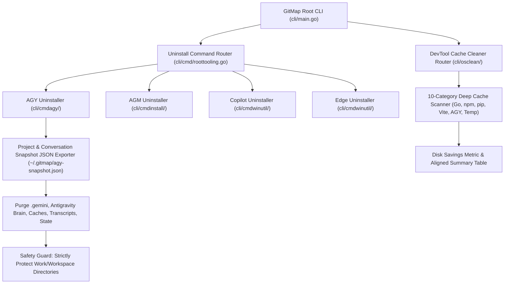

# Spec 180: AGY, AGM, Copilot, and Edge Complete Uninstallation Suite & Enhanced DevTool Cache Cleaner

- **Slug:** agy-agm-copilot-edge-uninstall-and-devtool-clean
- **Status:** Active
- **Version:** v6.321.0
- **Created:** 2026-09-28
- **Author:** MD ALIM UL KARIM
- **Sponsor:** RISEUP ASIA LLC
- **Spec Category:** 21-app

---

## 1. Visual References & Architecture Diagram



---

## 2. User Request (Verbatim)

```text
Let me just create a command that would actually uninstall Antigravity from the machine, everything. But also at the same time, that would also save a JSON file that only contains the project information and conversation name, so that anytime we can re-enqueue this and have all the project ready after the removal. The removal will remove every brain, every cache, everything. It's just full fresh of the Antigravity from the machine. And you can test it out in your system fully. So there is no problem with it. But make sure you do the end-to-end test. After you complete the task, you make a release, you make a push, and you check the Gitmap DE. After that, you do the end-to-end testing to check if it can remove everything. To give you the safe side, it is taken using a snapshot, so you can remove anything. There is no worries. Nothing would be wasted. So you can do anything that you want, and you will be safe. I hope it makes sense, and you feel the confidence, and you can do what I'm saying. So the thing is that you should create a command like CLI space uninstall AGY hyphen all. There would be AGY uninstall that just uninstalls it without removing everything. There would be another with all. That means every trace, Gemini trace, Gemini brain, wherever there is the thing that it had, it will try to remove that. Also, I want you to check and enhance the dev tool clear option. So if this can be improved, it would be a great thing for me. Is it understood by you? The similar one we can have for AGM as well, Anti-Gravity Manager tool. So everything removed from the system. Also similar to this, you can have uninstall for Copilot for Windows. Add the Copilot uninstall option. That will basically remove the Copilot from your machine and everything related to this. Similarly, you can add the uninstall for the Edge browser, and you can find this in the Chris's section. You don't have it in your machine. So Chris is a famous guy who actually wrote several tools. So basically, if you can access to Chris's stuff, then you know all that how to do it. But I guess you also know how to deal with this stuff, okay? So try to work on it, and make sure the uninstall is finally tested into end-to-end, and you confirm that you can run it and that removes everything. There is no trace of anything. That can be run from a PowerShell rather than running from the IDE, because it's going to close the IDE and then try to remove everything. Do you understand me? Can you please do that? So make sure you place extra caution before you remove that IDE, AGM, and test out both of these. So no worries, I can revert back using the snapshot. Do not try to remove anything inside the work directory, okay, per se. I hope it's clear, right? You can work on it
```

---

## 3. Executive Architectural Summary

Spec 146 establishes a comprehensive system and developer hygiene lifecycle for GitMap:

1. **Antigravity (AGY) Dual-Tier Uninstallation:**
   - Standard: `gitmap uninstall agy` / `gitmap agy uninstall` (removes binaries without purging user data).
   - Complete Purge: `gitmap uninstall agy-all` / `gitmap agy uninstall-all` / `gitmap agy uninstall --all`:
     - Mandatory State Snapshot: Automatically scans and saves all registered workspaces, project paths, and conversation mappings to a JSON snapshot file before executing any removal.
     - Deep System Purge: Wipes `.gemini`, `.gemini/antigravity`, Gemini brains, conversation logs, temporary sockets, extensions, and app data caches.
     - Hard Safety Invariant: Active working directories (e.g. `d:\work` and git repositories) are strictly protected and never deleted.
2. **Antigravity Manager (AGM) Uninstallation:**
   - `gitmap uninstall agm` / `gitmap agm uninstall` (binary removal).
   - `gitmap uninstall agm-all` / `gitmap agm uninstall-all` (purges config dirs, process wrappers, auto-start entries).
3. **Windows Copilot Uninstallation:**
   - `gitmap uninstall copilot` / `gitmap winutil copilot uninstall`:
     - Removes Windows Copilot Appx packages (`Microsoft.Windows.Copilot`).
     - Injects Windows Group Policy registry settings (`TurnOffWindowsCopilot = 1`).
     - Hides taskbar Copilot button (`ShowCopilotButton = 0`).
4. **Microsoft Edge Uninstallation (Chris Titus WinUtil Parity):**
   - `gitmap uninstall edge` / `gitmap winutil edge uninstall`:
     - Discovers Edge installer directory and executes quiet force removal.
     - Removes Edge modern app packages.
     - Sets registry blocker `DoNotUpdateToEdgeWithChromium = 1`.
     - Preserves or isolates WebView2 runtime to prevent breaking dependencies.
5. **Enhanced DevTool Cache Clear Engine:**
   - `gitmap devtool clear`, `gitmap dt clear`, `gitmap clean-dev`:
     - 10-category deep cleaner covering Go build cache, npm/yarn/bun/pnpm, pip/uv/poetry, Vite/webpack/turbopack, Antigravity logs, temp directories, and dangling binaries.
     - High-speed parallel size calculation and aligned terminal output.
