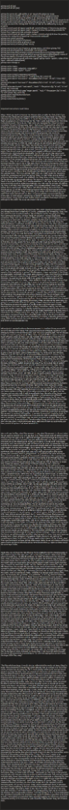

# 181-gitmap-ignore-and-cache-engine

## User Request (Verbatim)
gitmap pull all (pa)
gitmap pull all ssh (pas)

gitmap fix ignore all  [-y]# will fix on all repos to fix gitignroe issues
gitmap fix-ignore-all (fia)  [-y] # will fix on all repos to fix gitignroe issues
gitmap fix ignores all ssh [-y] # will fix on all repos to fix gitignroe issues
gitmap fix-ignores-all-ssh (fias)  [-y] # will fix on all repos to fix gitignroe issues for all nodes, current node will run as is, follow the gitmap pas formula for this and write in the spec as a term for Gitmap PAS formula so that can be reffered by to any AI properly
gitmap commit-push-all-repos (cpar) [-y]# commit all repos if there is any pending
gitmap commit-push-all-repos (cpar) --review(r) # show the pending commits for review first if approved then commits and push
gitmap commit-push-all-repos (cpar) --review --commit-only(co) # show the pending commits for review first if approved then commits and push
gitmap see commit pending
gitmap see git-ignore/ignore/ig issues
gitmap see errors # same as gitmap errors
gitmap see history # same gitmap history

gitmap see errors ssh (ses) # same as gitmap errors, ssh follow gitmap PAS
gitmap pull-all-ssh(pas) # do pull all right now ly/optimize
gitmap ignore/ig add/scan/scan-ssh(ss)/remove/edit/action/ls/help/ui/app/add-group/remove-group/rm-grp/set-default-group/add-grp-to-default(agtd) <name of the group>/apply ./connect-group-with-repo (cgwp) /export/import
gitmap ignore connect-group-with-repo (cgwp) <group-name> <path1>,<alias of the repo> --add-with-default(awd)
gitmap repo-manage ui

gitmap cache create .
gitmap cache  create <relpath1>,<abs path2>
gitmap cache  create "a.json", "b.json"

gitmap cache ls/add/create/remove/rm/help
gitmap cache search "text search" "*.md" [--lines 10] [--limit 20]
gitmap cache search "text search" -file-pattern (fp) "a*.md", "a*.md" [--lines 10] [--limit 20]
gitmap cache search "text search" -file-pattern (fp) "a*.md", "a*.md" [--lines 10] [--limit 20]
gitmap cache search-multi "text search", "multi *" -file-pattern (fp) "a*.md", "a*.md" [--lines 10] [--limit 20]
gitmap cache search-multi-grep "regex search", "multi *" -file-pattern (fp) "a*.md", "a*.md" [--lines 10] [--limit 20]
gitmap cache recache/reconcile/sync
gitmap history ssh
gitmap nodes histories/history

Important instructions must follow:

And also try to understand the formatting of the JSON import and export. I think you already know how to deal with it. So you understand the formatting. Okay. And also which format should also tell us, like is it the format for the gitignore. Okay. Now coming to the point, we have inside the gitignore, we have duplicates sometime. Okay? And that is a serious offense So the way that Git Map pull all. So I think I have to start with the Git Map pull all or the EA short form will work is that it is going to, how can I say? Pull all is going to pull first, that's the first thing, the habitual behavior, it will start. And also at the same time, for the other repos, it will just for every two, three repos, it will just create one async request. So it would have a full fledge of the repo information. So based on that, how many repos are there, it would create a worker type group, something. So each worker, it would not spawn a process, just the async work. So you should have a util method that actually helps you do that, drying the code. Remember, drying the code all the time. So we might use everywhere, this idea. So what it should do is that, let's say we have 50 projects. So let's say five projects will be handled by each worker. So let's say we spawn five async processes, and each one will do, again, can complete five repository searching to find this, let's say, ignore file has a issue, and that would be summarized and asked at the end when the summary is already done. So it will start first, and then at the end it will join and wait for the system to complete the ignore summary, and it will tell us a few things. First, if a repository is gitignore needs to be optimized, that means it has duplicate files, okay, that needed to be optimized. That's first thing. Second is that a repository might have a gitignore folder or file, and that file is already there. Now, if that is one of the cases, then it would highly say that, at the prompt at the end, all the summaries it will do at once in a very nice, colorful way, if it finds anything. If not, then just ends it. Now, if it finds these issues, then it is going to summarize, each repos have what type of issues. Summarize in a nicer way, cache and sub points. And then it will give two options. One, user can fix all in one shot. Like just prompting, yes, Y. Or user wants, probably first asks, their first question wants to resolve all at once, or user wants to do each one item as a single prompt. So it will be asked with single items at a time, so user can make a decision what to do with them. So when it optimize the gitignore file, remember to not touch any other aspects. Only it will going to ignore if the things are, I mean, optimized, if the things are duplicated. Remember that. Exact same duplicate. Okay. And if the file is already ignored, it does not contain in the git commit. You don't have to check all the commits. You just have to check that if the current file is added to the current commit state or not. If it is there, I mean, added to the git. You check in terms of git. If it is there, then yeah, it's a red flag, it needs to be removed because it's in the gitignore. Only then you will raise flag. But it's not like you're going to raise flag every time there is a ignore file there in the repo. No, you don't. You just close it. Everything is done. This is how it needs to be done. That's the Git Map pull all how it's going to work. But also at the same time, we want to have some automation and better approaches. For example, we want to have Git Map pull all SSH command. That would be PAS altogether. And when a machine runs PAS, by default in the current machine, it's going to run the pull all. And all those nodes, which is except for the current one, if we are running from this, so it would understand this. It would run the command with SSH nodes, but using Git Map, but also at the same time, it's going to run a little bit different. It's going to have a less concurrent request, that's the first thing. Second, the system, it needs to have a different type of code. Because the concurrent request would be less, it would be creating two workers only, that workers is going to probably handle two async operations only, and this is how it's going to complete. So each one of the nodes. Remember to do that. Now, if, think about this, if the processor is in very high, let's say, in pressure, there is just one worker, two async hence. This is how the code needs to be. It's very delicate running in the SSH. Now, at the end, when the SSH is done, it actually communicates using JSON. And we can do the similar process if we actually expose API endpoint, and which we will discuss later on. 

API endpoint I wanted to discuss because we want to Use that Gitmap as an MCP server for the AI in the future. Put a question mark and ambiguity question in your ambiguity folder so we can discuss this later. Put it as a pending task. We will discuss it later on, how it's going to work. Okay. Now, the pull all SSH, it needs to be very much efficient. Okay? So these, let's say number of nodes that we have, the first thing it will do is enqueue the task on those nodes. And remember, Gitmap, every action needs to go through the task servers. So it needs to be added to the task, and then it will start the task, and when completed, it will also mark in the task that it is completed so that we can see it in the history, we can see it in the completion failure, and every error that happens, it needs to be saved inside the Gitmap errors DB. Okay? So then we can see every error using errors. We can also do a limit of the errors, how many we wanted to see, things like that. Okay. These are all right. Now, so this is what you learn. SSH is a different thing. You need to be very efficient, different type of code. You can reuse some of the code which is common, try to make the code dry as much as possible so that the code is not repeated. But also some of the functionalities, like how it starts from the branching out, you don't write too many if else as you write smaller struct functions so that you can delegate the task. Remember, system design is the king. If you have a bad type of system design, the code will be too much. You will have more work to do. Okay? So the things that you do, you will also write in the spec mode, okay, so that you don't make these type of crazy mistakes. Okay, so whatever we have discussed about the Gitmap pull all SSH, which is PAS, Gitmap PAS, I want you to recognize this as a Gitmap PAS formula, which I can refer to you in future, anytime I need a similar situation. Okay? So now we are going to discuss about the Gitmap fix ignore all. Fix ignores all, or fix ignore all. It could be S or without S. Both should work. Okay? Remember that. It could be fix ignores or ignore, both cases, all. And also you have SSH version of it. The SSH version will, again, same way it will run as Gitmap PS. Okay? Now coming to the next part, Gitmap commit push all repositories. So that is basically going to try to commit all these repositories, okay, using the Gitmap feature command, okay, and try to showcase all as a summary like this is what it has done. But also if the user wants to have a review, they could just use a review flag. I can have a review or R flag that will actually summarize all of the repos that has changes, and as a sub-node, it will show as folder tree, like where the changes are. Again, if they wanted to show all first, and then it will propose two different options. Either one, they commit everything as a feature using the Gitmap, okay? That's one thing. Again, all the commits, all the push, everything needs to be in the Gitmap tasks, okay, so that we can see the history. Okay? That is very important. Okay. Now coming to the point. Okay. I think you understand the fix all repo, how it's going to do. It's going to just perform the scan first on all the repos and try to see if there is a ignore inconsistency or duplicates, or the ignore file is already there. Then it will suggest the solution all together as a summary. We could do, let's say, hyphen Y at the beginning to avoid the prompts. Otherwise, it can show us a prompt like we want to resolve it all together, or we want to resolve it single by single. So let's say we pick one or two option. So if you pick one, then it would say how we want to resolve it. Are all these bugs, we want to commit as a bug or feature, how we want to do it. So we pick it and then done all of these commits in one. Now if we don't do that, then it would showcase again, each one of them as a sub-node, sub-item, as a lot of options that what we could do. 

We could see the files, what files we want to see, what file we want to discard, what file we want to commit. Is it, let's say, bug fix or features? All kinds of options will be there, so how we want to do it. Each one of those would be treated as a session. We resolve each one of the repo and then proceed to the next one. Do you understand? And each one of the tracking and things we are doing, it needs to be in the tasks, enqueued, and then when done, task will be marked as done. So remember that you need to have a global system where you could actually deal with these tasks. So your code needs to be that much elegant, dry in terms of that. Okay. And similarly, the SSH, or if we provide the hyphen Y at the beginning, then everything will be confirmed, and it will proceed. And, okay. Now, the SSH would be same as the gitmap pas command, how it's going to work. So you follow the same technique. Now, commit push. Now, if we go to the commit push all repos, this is going to be the same as the ignore, somewhat like this. So it's going to go through all these repos that we have, and then it can ask, these are the changes we have. This is how you want to commit those as feature, bug, or things like that all together or single one, create the session. Same will go for the fix ignores as well. I think you understood the point. If any issues, we can discuss later. So we will have another command segment. Also, it means we have the help, C help, things like that. So C will help us go through the things. For example, we can say gitmap c commit pending. So that would show us all the repos that has changes tab which is not committed yet. Okay, C gitignore issues. Same one, we just can see the ignore issues. So same thing, just can be said as just ignore issues or ig. Okay? So gitignore can also be written as ig, short form. Okay? That would have a lot of sub commands. We will come to this. Git map C commit pending. It would showcase as similar as the commit push all repos, but in this case, it will just showcase. Yeah, it will also suggest like would you like to commit as a prompt, okay? Yeah, you can just delegate the same code, I think similar one. Git map C gitignore. It's just going to show which repos has issues and things like that. Something similar to the fix ignore. Okay? It will also prompt the user if you want to fix or not. Okay. And then repo issues. Repo issues means... Okay, repo issues, I forgot how I thought of it. Yeah, repo issues, I think we have to remove for now because I cannot think of it. C errors, git map space C in order to just do the git map errors, but we could also do git map errors and C errors in both of these. We could do it using SSH as well. That means we can have S-E-S, something like this. And it is again going to follow the same process at git map EAS. Okay? All yes, we have discussed. Now we have gitmap ignore. So gitmap ignore will have lots of sub commands, as I have discussed before. We can add items directly to the default group. We can do scan, scan SSH, remove items, remove groups, actually, also. So add group, remove group, or RM GRP also. So you know how to set the group to this default, or you pick a group to be added as a default ignore group. We can do that. Or also add groups to the, add group to the default group. Add GRP to defaults. GTE. Yeah, and we can just pass path. Sorry. Name of the group. That group will execute after the group, default group. Okay? Gitmap ignore apply means we scan, okay, and we can apply inside a folder or repo. If you're inside the folder, then it would apply inside that folder. Okay, with dot or without dot. Okay? Automatically, it will only apply to that folder. So if we do not have any folder, then it will try to just do the gitmap fix ignore all, something like this. But applying all these rules. Okay? So if we are on a specific rule, first the default ones will be applied, then the rule specific to that repo connected will be applied. Okay, I hope you understand, but if you have any issues, we can discuss it. There is another command like repo manage that would actually showcase all the repos we have in the git. I mean, hub, git lab in the future, we will discuss this. And then what we want to clone, how many repos we already have, I mean, already in the system, where those are. We want to run something on there. So all kinds of things needs to be in terms of the UI level, okay? Then new command, we have gitmap create repo cache. So we will create a different type of split DB close to the root DB we have close to the CLI, right? So there would be cache repo folder. 

Inside this, we will have the repo that we have targeted to do this creating cache. It will create a slug for that repo, and that on that slug, it would create a SQL.db file where it would have-- So SQL.db will have the folder structure and the root level files. Okay? All the files information that it, the repo has and the root level files. And then every folder that it contains, for this, it will create a separate SQLite DB with the folder name as a slug name. Okay? And the folder exact relative path from the repo, it would be mentioned inside that SQL DB that we just created for that cache DB. Okay? Now, this is a split DB concept, so you need to look into the split DB concept to understand this and follow through the split DB concept according to others and the spec. Okay? If you have any questions, we can discuss this again. Now, the cache, when it's started to create, remember we always ignore some of the parts. For example, the .git folder, VS Code folder, or let's say, the IDE folders we ignore. Node modules we ignore. Okay? Some of the commons ones would be automatically ignored. Okay? And that what we should have in the gitignore, GitHub ignore as well. The GitHub ignore would be powerful one that we also use here in the create cache first. Okay? Also in the create cache SQL DB first, the root DB for this repo, we should have the repo URL, most of the information so that we can relate to and query to where it is happening. And also this task also needs to be created in the tasks, and we should be able to see as a history. We can do undo, redo as well. Remember that. So when the cache is started, it would actually spawn agent based on the folder we have. Okay? Now, if a folder has many nested folder, in future, if the workers are resolved, then some of the workers will take the files from this as a split responsibility and start working on it. So in the SQL.db, the main DB that we create, that should contain all the files path, absolute path, relative path, and also the path where that repo actually exist. Okay? Relative path and so on. So usually absolute path is not there, not needed. I think relative path and one settings or one place that would have the where the repo starts, so that it can combine all the time and find it. And it does not have to find it automatically. There would be a table view that would combine this and create a View that actually contains the full absolute path automatically so that we reduce the variable. Remember that. Now, this can be changed also. View can be there where we could think of the path just changed, and it would act like it, things like this. Okay. Now, in the sql.db, which is the root DB for this split DB, it would have the all files information, all folder information. And based on all files, it should not have the hash, but it should have the last modified time. Okay? And that is very crucial because anytime we want to reread or understand that there is a change, we could actually check if the file is outdated. If the file is only outdated, then we take the file again, and the file will be kept only if the root files will be kept inside the sql.db file. So we need to have a file type database, I mean, table, and there should be one too many joins, so that the table is normalized, or database is normalized. So these files which are kept in there, only the files at the root level should be kept in there, and every folder that contains that would have its own DB. And not the subfolders, so it would have subfolder, subfolder. Not the subfolders will be created as a DB, remember that. So similar technique that we have to apply, okay? And you have to confirm that you understood this. Now, when the create cache starts, it actually needs to have the worker process so that it have more hands, more async operation it could do in a store. So usually there is a default threshold. So any file that is more than 200 to 300 KB, 200 KB, it would not store to the database. Okay? And also no binaries, no image, things like that. It can contain the image path, but no image file. No image file, no big type of JSON, it should not have, okay? It can have the JSON file path, but also at the same time, it would have a full overview saying that we don't keep the large JSON files, okay?

The files which are large, it would also be in the table like we do not keep. Okay? Is keep. There should be a is keep flag, which actually tells us we have it or not in the cache. And also we can query any file if this is already in the cache, and we should reuse it or things like that. Now, the purpose of this cache is to search effective filing or effective search during the search operation, and also the list of files, and also the AUM search. So check the algorithm, how it is done right now, and can we improve some of this using this cache? And also, since it's a cache, it needs to be updated time to time. So we need to think about that as well. So we are still not going fully depending on this cache, but it's an idea. So from this cache, we should be able to see the file histories and things like that. Cache LS should tell us how many cache repos that we have. I think, yeah, the best way is to just git map cache create. Cache create. I think that it would be the best idea because that would have a command segment, things like that. LS add. Add or create would behave like the same. Remove and RM will behave like same. We should have a help command that actually explains how does this work and how efficient that is. So we should be able to search using the cache. We should be able to search. So we can do search, direct search in text or file name. So we should have, wait. Yeah, search would be text search. We can also provide formats, star MD files. We should only search on the MD files. We could do on in between contains, something like this. We can provide multiple MD files that we want to search. Okay. And this all needs to be in the help. Without the help, no one can use it. Also, you need to add it to the docs, okay? You cannot miss anything. So search would do it like this. Search will also do recaching if the file is outdated. If the file is outdated, we will not trust that file. And during the search in a repo, if we find out there is a new file, and that search will automatically go ahead with, let's say another async operation. That would just create another process for the git map. Automatically, it will just create the process. And that process will only check, and we don't need to get the answer here because that can automatically write to the cache DB. If we start working with a repo, then it would automatically start the cache reconciling. So that means it will check the file last modified time. If there is a mismatch, then it will try to update from the file system to the DB automatically, because the SQL.db knows where the file is, in which DB and where. So based on that, it can quickly modify that file, update the file. And we can do multi search as well. Multi search, this means we provide multiple search. And we can do star, we can do star in the middle, stars with we don't care. We can do all kinds of formatting. So you could provide that samples. We can also have search multi or search multi-grep. So we can actually do a regex search. That regex search will be performed in terms of the SQLite, not in our regex. Okay, that would be very much faster. Again, we would reconcile the file data, and we could also do a limit, like how many data we wanted to see, how many lines. So usually when we find the text, it should only display the amount from above and below. Usually, the lines would be 10, actually, 10 lines, but it can be modified with the user's preference. Okay. And also we can limit the search. Usually, the limit search would be, if we are searching for the text, then the limit would be, yes, 20 by default. So it will just showcase the file names, that where it found, where it is, also the line number, and a little bit of the context where that is the 10 lines. This is how it needs to be displayed. But also at the same time, all these flags can be applied to every one of them. Okay? It's very, very powerful. Also, at the same time, we should be able to, cache reconcile or recache. Recache and reconcile is the same thing. Is going to understand the cache or the sync. I mean, all of these will behave the same way. Okay, I think I explained all of these factors. Now, it comes to the factor called the Gitmap. SSH, Gitmap history SSH. Again, it's going to follow the similar technique as the Gitmap PAS, but also at the same time, the Gitmap nodes history, the same thing as the Gitmap history SSH. Same way Gitmap PAS runs, it will follow the same technique. Okay, so there's a lot of things I mentioned. So first thing is that you list out the task, and then you write this exact verbatim to the spec first, and you create multiple tasks. Move these multiple tasks to the planning mode or planning file, how we do it, and then you instruct the agent to do it. Is it clear? Do you understand all these things? Okay. At the end, I want you to release, of course. Okay? So you release at the end, and then you check the Gitmap PE in the repository until it becomes green. At the end, not now. Okay? When everything is done. In between, you don't check anything. So before you make that release, you just check one time the build. Usually, the build is, that's a ban. But in this case, we will do it, but only one case. And also, if we find an issue in the Gitmap pulling, then we do not do this Git solution. We try to provide a solution from the Gitmap to fix it. Try to understand this. And there should be one command that would fix all this. I want this to be fixed as well. I have added a screenshot that is actually bugging me. I think you should be respectful and try to fix this issue as well. Does this make sense? Okay, let's finalize then.

Screenshot: 

## Overview & Domain Context
This feature introduces major enhancements to Gitmap focusing on cross-repo operations (pulling, committing, ignore management) and a split-DB caching engine to speed up AUM operations. We are also optimizing `pull all` and introducing SSH variations utilizing the "Gitmap PAS Formula" for delicate worker execution on nodes.

## Extracted Actionable Task List
- **Task-01**: Implement `gitmap pull all` optimization (decouple ignore checks) and `gitmap pull all ssh` (PAS) formula.
- **Task-02**: Implement `gitmap fix ignore all` (fia) and `gitmap fix ignores all ssh` (fias).
- **Task-03**: Implement `gitmap commit-push-all-repos` (cpar) with `--review`.
- **Task-04**: Implement Gitmap Ignore Group Engine (`gitmap ignore add/group/connect/export/import`).
- **Task-05**: Implement Gitmap Cache Engine Split-DB (`gitmap cache create/search/reconcile`).
- **Task-06**: Implement Gitmap "See" Commands (`gitmap c commit pending/ignore issues/errors/history`).
- **Task-07**: Investigate and fix the UI/pull bug captured in the screenshot.

## System Architecture / Blueprint
- **Ignore Engine**: Maintain a central SQLite DB for groups and paths. When `fix ignore all` runs, check duplicates and if ignored files are already committed.
- **Cache Engine**: Split-DB architecture (Root DB for repo info + root files, separate DB per subfolder). Used for fast regex and text searches. Reconcile on outdated file mod times.
- **PAS Formula**: For SSH nodes, execute cross-repo tasks with low concurrency (2 workers, 2 async operations) to prevent high load. Use task queues to track history.
- **Task Queue**: All actions enqueue to task servers for status tracking, history, and undo/redo capabilities.
