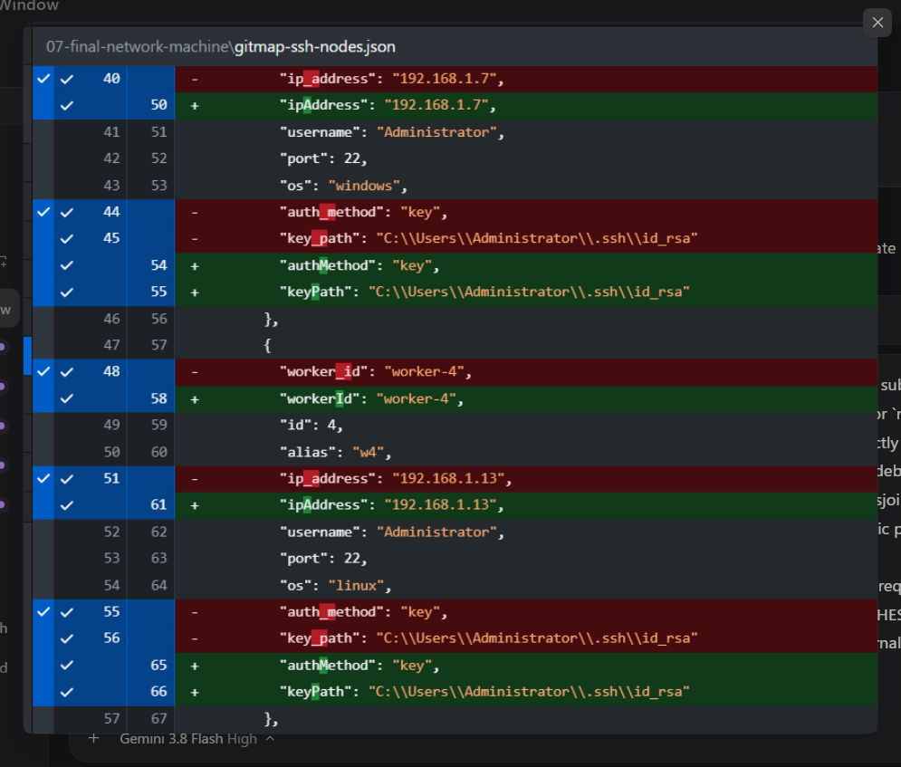

# Spec 189: JSON Envelope Variables, WorkDirectory Object, OS Password CLI, and Repo-Secrets Hygiene

## 1. Overview & Context

This specification formalizes six tightly-coupled enterprise CLI capabilities, configuration schema enhancements, and credential management features across GitMap and `repo-secrets`:
1. **JSON Envelope Variable Interpolation**: Top-level `variables` and `workDirectory.variables` dictionary support with automatic multi-pass `${variable}`, `${variables.variable}`, and `$variables.variable` expansion across payload items (e.g. factoring out repeated `keyPath` values like `%USERPROFILE%\.ssh\id_rsa` and `adminUser` into single reusable declarations).
2. **WorkDirectory Object Configuration**: Enriching `attributes.workDirectory` to support both structured object declarations (`path`, `defaultPath`, `isApplied`, `isEnforced`, `variables`) and scalar strings, enabling variable reuse directly inside the work directory configuration.
3. **Cross-Platform OS Note**: Explicit declaration in envelope metadata notes clarifying that declared OS types (e.g. `os: "windows"`, `os: "linux"`) identify the target node OS and do not restrict importing the JSON manifest to Windows only; it can be imported across Windows, Linux, Ubuntu, and macOS.
4. **Cross-Platform OS Password Management (`gitmap os change-password`)**: Adding root (`gitmap change-password`) and OS (`gitmap os change-password`, `gitmap os passwd`) commands to change user account passwords across Windows (`net user`), Linux/Ubuntu (`chpasswd`), and macOS (`dscl`). Supports both two-argument admin mode (`gitmap os change-password <user> <new-password>`) and single-argument current-user mode (`gitmap os change-password <new-password>`), automatically targeting the current user with confirmation prompt.
5. **Interactive SSH Join Password Prompt & Salted RSA Vault**: When executing `gitmap ssh join {user}@ip <alias>`, if the password is not provided on the CLI, prompt the user interactively. If the user provides a password, encrypt it using the local SSH RSA key with salt (`EncryptSSHPassword`) and store it in `installation.db` for automated passwordless login; if the user declines or leaves it blank, skip saving without failing.
6. **Repo-Secrets Sequence & Cross-Folder Consistency**: Standardizing `./repo-secrets\01-gitmap` with a strictly lowercase, two-digit sequence (`01-` through `09-`), eliminating underscores, removing duplicate files, updating internal link references, and harmonizing all JSON envelopes across `01-gitmap` and machine folders (`04-w1-machine`, `05-w2-machine`, `06-w3-machine`, `07-final-network-machine`) to use `version: "2.0"`, `workDirectory` object, `variables`, `mainMachine` (`node-main`), and lowerCamelCase keys.

---

## 2. Visual Ingestion & Reference



*Figure 1: Verified normalization from snake_case (`ip_address`, `auth_method`, `key_path`, `worker_id`) to lowerCamelCase (`ipAddress`, `authMethod`, `keyPath`, `workerId`) and variable extraction across `07-final-network-machine\gitmap-ssh-nodes.json` and `01-gitmap\04-ssh-nodes.json`.*

---

## 3. User Request (Verbatim)

```text
also make sure we have samples of

gitmap ssh join {user}@ip <alias> # then provide password if for first time and gitmap stores it using RSA algorithm using salt please
can reuse to login and also needs to prompt user for this as well, if the user don't prompt don't save please


Okay. Can we do a little bit changes here? Inside your, let's say, JSON, if you look into this, there are variables that have been part of the path. For example, the C users, administrator, and then the ID RSA. That is repeated everywhere. So you could just put that to variable and show case also how the variable can be reused. Okay. And, yeah. The OS Windows is there, but that does not mean that it has to be imported to Windows. Remember that. Okay. Remember to mention in the notes as well. Okay? So this is very important. Also here, you have created the work directory, single or flat line arguments. But what I requested is the work directory could be an object inside our JSON, and that object would have other aspects. And one of the aspects is the variable, that we could reuse inside the work directory as well. We wanted to see that the system can actually reuse the variables. So work directory variable could be coming from the work directory section, and also rename this Gitmap SSH node item to just SSH nodes import. Okay? There is no need to mention the Gitmap because it's already inside the Gitmap folder, right? So at the end, I want you to also commit fix to the repo secrets and also test using Gitmap end to end and do a final release, with the minor bump and make sure the CICD is green. Do you understand this? In the other, let's say, items, do you see any other inconsistencies? What do I mean by other items? Other items means the other JSON files into that secret node. And also, please confirm that Gitmap should be able to change OS password, right? We should have the change password option already to where we can give the username and the password, and it will change from the Gitmap if you have the admin rights. But also at the same time, if you're in the current user, if you just use the change password and just provide the password, that would automatically change the password by confirming. That should work on Windows, Linux, Ubuntu, macOS, all the cases. So that also needs to be in the OS help section, with proper examples. Do you understand? Can you please do that for me? Yeah. All the files that we have inside the Gitmap, it should start from zero one, zero two sequence, and no underscore. All the files needs to be lowercase. If we needed to, that's it. Is it clear? And fix all the file internal linkings. For example, the Azure template and the commit pull things, that needs to be updated according to the file and naming change. Okay. Can you please do that in the commit tool complete as well? Make sure that we have concise files, no duplicate files as well. Can you please do that for me? And also show a final report what you have optimized and what you have
```

---

## 4. Technical Architecture & Data Contracts

### 4.1 JSON Envelope Variable Interpolation Engine

When reading any typed envelope, `jsonenvelope.ExtractPayload` inspects top-level `variables` and `attributes.workDirectory.variables`. Variable values that reference other variables (e.g. `"summaryPath": "${secretsDir}\\summaries"`) are resolved first in `MergeVariables`, and all occurrences of `${varName}`, `${variables.varName}`, or `$variables.varName` in strings are expanded before parsing into typed structs.

```go
type WorkDirectoryConfig struct {
    Path        string         `json:"path"`
    DefaultPath string         `json:"defaultPath,omitempty"`
    IsApplied   bool           `json:"isApplied,omitempty"`
    IsEnforced  bool           `json:"isEnforced,omitempty"`
    Variables   map[string]any `json:"variables,omitempty"`
}
```

### 4.2 Cross-Platform OS Password Management (`gitmap os change-password`)

Command signatures:
- `gitmap os change-password` (prompts for confirmation & password for current user)
- `gitmap os change-password <new-password>` (single positional arg: targets current user, prompts for confirmation, applies `<new-password>`)
- `gitmap os change-password <user> <new-password>` (two positional args: targets `<user>` with `<new-password>`)
- `gitmap os passwd [user] [new-password]`
- `gitmap change-password [user] [new-password]`

Platform execution dispatch:
- **Windows**: `net user <user> <password>`
- **Linux / Ubuntu**: `chpasswd` via stdin `<user>:<password>`
- **macOS (Darwin)**: `dscl . -passwd /Users/<user> <password>`

### 4.3 SSH Join Password Prompting & Salted RSA Vault Storage

When `gitmap ssh join {user}@ip <alias>` is executed on an interactive terminal without an explicit password:
1. Prompts: `Enter SSH password for {user}@{ip} (leave blank to skip password vault): `
2. If blank, enrolls the host without saving a password.
3. If non-empty, encrypts via salted RSA OAEP (`EncryptSSHPassword`) and stores `EncryptedPassword` in `installation.db` for automatic login via `gitmap ssh <alias>`.

---

## 5. Verification Invariants & Quality Gates

1. **Variables Expansion**: Multi-pass `${keyPath}` and nested `${secretsDir}` variables expand without raw token leakage.
2. **WorkDirectory Polymorphism**: JSON envelope unmarshaler accepts both string and object forms without error.
3. **OS Password Single & Dual Arg Modes**: `gitmap os change-password <pass>` targets current user; `gitmap os change-password <user> <pass>` targets `<user>`.
4. **Secrets Cleanliness**: All files in `./repo-secrets\01-gitmap` (`01-` to `09-`) and machine folders (`04-w1-machine` to `07-final-network-machine`) use structured `workDirectory`, `variables`, and lowerCamelCase keys.
5. **No-Build / No-Test Compliance**: Routine execution turns do not invoke `go build` or `go test`.
