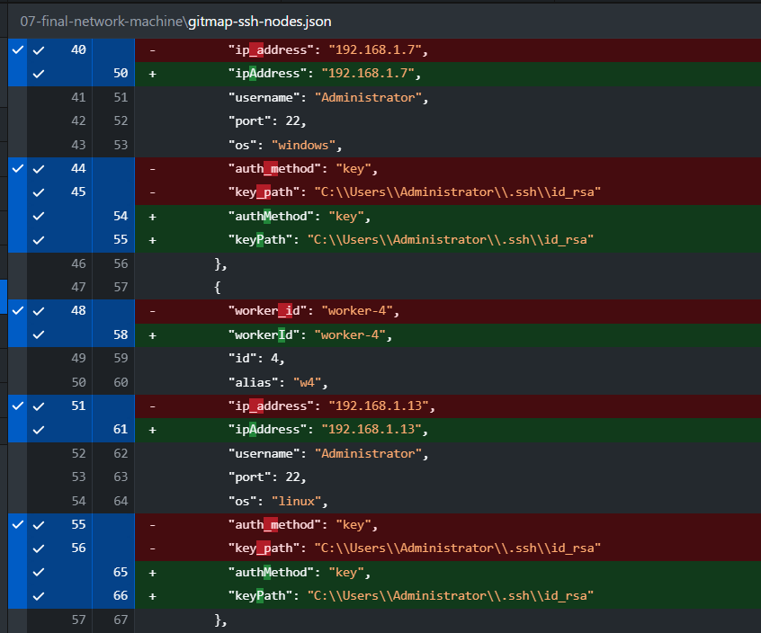

# Spec 189: JSON Envelope Variables, WorkDirectory Object, OS Password CLI, and Repo-Secrets Hygiene

## 1. Overview & Context

This specification formalizes five tightly-coupled enterprise CLI capabilities, configuration schema enhancements, and credential management features across GitMap:
1. **JSON Envelope Variable Interpolation**: Top-level `variables` dictionary support with automatic `${variable}` and `$variables.variable` expansion across payload items (e.g. factoring out repeated `keyPath` values like `C:\Users\Administrator\.ssh\id_rsa` into a single reusable declaration).
2. **WorkDirectory Object Configuration**: Enriching `attributes.workDirectory` to support both structured object declarations (`path`, `defaultPath`, `isApplied`, `isEnforced`, `variables`) and scalar strings, enabling variable reuse directly inside work directory configuration.
3. **Cross-Platform OS Note**: Explicit declaration in envelope metadata notes clarifying that declared OS types (e.g. `windows`, `linux`) do not restrict importing to only that OS, supporting cross-platform import and execution across Windows, Linux, and macOS.
4. **Cross-Platform OS Password Management (`gitmap os change-password`)**: Adding root and OS tooling to change user account passwords across Windows (`net user`), Linux/Ubuntu (`chpasswd` / `passwd`), and macOS (`dscl`). If username is omitted, defaults to the current active OS user with confirmation. If password is omitted, prompts securely without echoing.
5. **Interactive SSH Join Password Prompt & Salted RSA Vault**: When executing `gitmap ssh join {user}@ip <alias>`, if the password is not provided on the CLI, prompt the user interactively. If the user provides a password, encrypt it using the local SSH RSA key with salt and store it in the GitMap credentials vault for automated passwordless login; if the user declines or leaves it blank, do not save it.
6. **Repo-Secrets 01-gitmap Sequence & Hygiene Overhaul**: Standardizing `D:\work\repo-secrets\01-gitmap` with a strictly lowercase, two-digit sequence (`01-`, `02-`), eliminating underscores (e.g. `git_profiles.json` -> `02-git-profiles.json`), removing duplicate files (`00-commit-pull-config.json`), and updating internal link references.

---

## 2. Visual Ingestion & Reference



*Figure 1: Verified normalization from snake_case (`ip_address`, `auth_method`, `key_path`, `worker_id`) to lowerCamelCase (`ipAddress`, `authMethod`, `keyPath`, `workerId`) across node configurations.*

---

## 3. User Request (Verbatim)

```text
also make sure we have samples of

gitmap ssh join {user}@ip <alias> # then provide password if for first time and gitmap stores it using RSA algorithm using salt please
can reuse to login and also needs to prompt user for this as well, if the user don't prompt don't save please

Okay. Can we do a little bit changes here? Inside your, let's say, JSON, if you look into this, there are variables that have been part of the path. For example, the C users, administrator, and then the ID RSA. That is repeated everywhere. So you could just put that to variable and show case also how the variable can be reused. Okay. And, yeah. The OS Windows is there, but that does not mean that it has to be imported to Windows. Remember that. Okay. Remember to mention in the notes as well. Okay? So this is very important. Also here, you have created the work directory, single or flat line arguments. But what I requested is the work directory could be an object inside our JSON, and that object would have other aspects. And one of the aspects is the variable, that we could reuse inside the work directory as well. We wanted to see that the system can actually reuse the variables. So work directory variable could be coming from the work directory section, and also rename this Gitmap SSH node item to just SSH nodes import. Okay? There is no need to mention the Gitmap because it's already inside the Gitmap folder, right? So at the end, I want you to also commit fix to the repo secrets and also test using Gitmap end to end and do a final release, with the minor bump and make sure the CICD is green. Do you understand this? In the other, let's say, items, do you see any other inconsistencies? What do I mean by other items? Other items means the other JSON files into that secret node. And also, please confirm that Gitmap should be able to change OS password, right? We should have the change password option already to where we can give the username and the password, and it will change from the Gitmap if you have the admin rights. But also at the same time, if you're in the current user, if you just use the change password and just provide the password, that would automatically change the password by confirming. That should work on Windows, Linux, Ubuntu, macOS, all the cases. So that also needs to be in the OS help section, with proper examples. Do you understand? Can you please do that for me? Yeah. All the files that we have inside the Gitmap, it should start from zero one, zero two sequence, and no underscore. All the files needs to be lowercase. If we needed to, that's it. Is it clear? And fix all the file internal linkings. For example, the Azure template and the commit pull things, that needs to be updated according to the file and naming change. Okay. Can you please do that in the commit tool complete as well? Make sure that we have concise files, no duplicate files as well. Can you please do that for me? And also show a final report what you have optimized and what you have
```

---

## 4. Technical Architecture & Data Contracts

### 4.1 JSON Envelope Variable Interpolation Engine

When reading any typed envelope, `jsonenvelope.ExtractPayload` or custom decoders inspect top-level `variables` and attributes `workDirectory.variables`. Any occurrences of `${varName}` or `$variables.varName` in strings are resolved dynamically before parsing into typed structs.

```go
type WorkDirectoryConfig struct {
    Path         string         `json:"path"`
    DefaultPath  string         `json:"defaultPath,omitempty"`
    IsApplied    bool           `json:"isApplied,omitempty"`
    IsEnforced   bool           `json:"isEnforced,omitempty"`
    Variables    map[string]any `json:"variables,omitempty"`
}
```

Envelope attributes support both:
- Scalar: `"workDirectory": "D:\\work"`
- Object:
  ```json
  "workDirectory": {
    "path": "${workDir}",
    "defaultPath": "D:\\work",
    "isApplied": true,
    "isEnforced": false,
    "variables": {
      "workDir": "D:\\work"
    }
  }
  ```

### 4.2 Cross-Platform OS Password Management (`gitmap os change-password`)

Command signatures:
- `gitmap os change-password [user] [new-password]`
- `gitmap os passwd [user] [new-password]`
- `gitmap change-password [user] [new-password]`

Platform execution dispatch:
- **Windows**:
  - `net user <user> <password>` (Admin)
  - Or PowerShell `Set-LocalUser -Name <user> -Password <secure-string>`
- **Linux / Ubuntu**:
  - `echo "<user>:<password>" | chpasswd` (root/sudo)
  - Or interactive `passwd <user>`
- **macOS (Darwin)**:
  - `dscl . -passwd /Users/<user> <password>`

Confirmation & Security:
- If `user` is omitted, defaults to `os.Getenv("USERNAME")` (Windows) or `os.Getenv("USER")` (POSIX).
- Prompts operator: `Proceed with changing OS password for user '<user>'? (yes/no): `
- Bypassed when `--yes` / `-y` is supplied.

### 4.3 SSH Join Password Prompting & Salted RSA Vault Storage

In `cli/cmdssh/sshjoin_cmd.go`:
When `gitmap ssh join {user}@ip <alias>` is executed:
1. Checks if password was supplied as positional argument or via `--password` flag.
2. If omitted, prompts operator interactively:
   `Enter SSH password for {user}@{ip} (leave blank to skip password vault): `
3. If input is blank, continues join without password enrollment.
4. If password entered, calls `EncryptSSHPassword(pass)` with salted RSA encryption and stores into `installation.db`.

---

## 5. Verification Invariants & Quality Gates

1. **Variables Expansion**: `${keyPath}` in node items expands to the variable value without raw token leakage.
2. **WorkDirectory Polymorphism**: JSON envelope unmarshaler accepts both string and object forms without error.
3. **OS Password Changing**: Command parses arguments, handles current user default, prompts securely, and handles platform execution with structured `AppError`.
4. **Secrets Cleanliness**: All files in `D:\work\repo-secrets\01-gitmap` are numbered (`01-`, `02-`), strictly lowercase, zero underscores, and internal links updated.
5. **No-Build / No-Test Compliance**: Routine execution turns do not invoke `go build` or `go test`.
