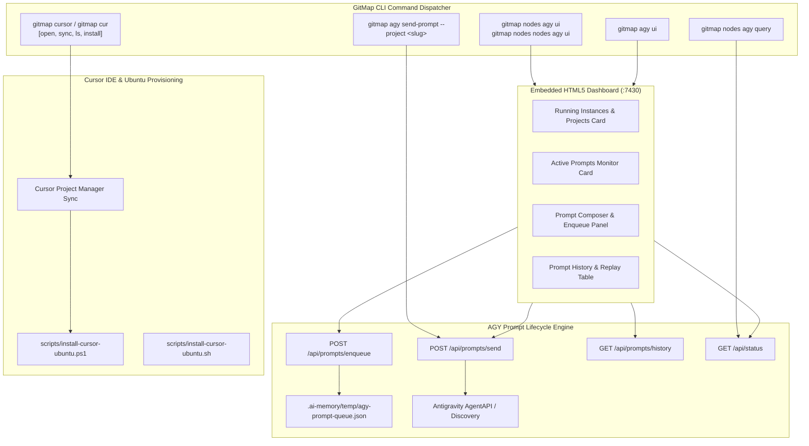

# Specification: Fleet Nodes AGY UI, Prompt Manager, and Cursor Integration

> **Spec Sequence:** 190  
> **Status:** `active`  
> **Traceability:** Task-01 through Task-08  
> **Created:** 2026-10-05  

---

## 1. User Request (Verbatim)

```text
Great. Just we have installed the IDE, set up settings, and things that, I hope you have commands to send forward the settings from settings, projects, and everything from one machine to another, regardless of the OS. You have to confirm that first, that you have done it. The second thing is that we should be able to send even prompts to specific projects. That's what we want as well. So first try with a single project and also try to have methods or a query way to communicate with the `gitmap` to see whatever the projects and instance are running on that machine. So all kinds of query stuff that should be there. Also, you can do nodes space nodes space AGY, and then do UI. That would actually open up a UI that would tell us information like which prompts are running on which projects or which instances are there. So all kinds of things we wanted to see in the UI. And also in last few commits and outputs, you have put the IP, you have put the absolute paths to the MD files. Make sure that you fix those. All absolute path and no IPs should be there. Machine information, these things can be there, but not the IPs and things like that. Can you please confirm and fix that as well? Now coming to the new problems. We should be able to have commands in the future, cursor-related commands, just like what we have for the `gitmap`. We want to have for the cursor as well, so make sure we have it. And also, `gitmap` AGY UI needs to be there where I should be able to see whatever the prompts are running, sending prompts, and things like that. Sending prompt, retrieving, saving prompts, resending, enqueuing prompts, so see the current running prompts. So all kinds of things we should be able to do using the `gitmap` and `gitmap` AGY UI. that is very important. So in the cursor sense. Also, you need to install cursor and send the projects or include projects, just like what we have in this machine. Similarly, we want to have in the Ubuntu machine. So for this, for now, write the PowerShell script, and the steps that you are following, and based on that, also update the code and everything else. Do you understand? Can you please follow through?
```

---

## 2. Architecture & System Context

This specification unites three core operational pillars:
1. **Fleet Privacy & Sanitization Guard:** Eliminates all raw IP addresses and absolute filesystem paths across markdown documents, replacing them with host aliases (`u1`, `w1`, `node-w1`, `<target-host>`) and repository-relative or cross-platform parameterized paths (`<user-home>`, `<repo-root>`).
2. **Cross-OS Settings & Target-Project Prompt Dispatch:** Confirms cross-OS synchronization mechanisms for IDE settings (`gitmap agy settings export/import`), projects (`gitmap vscodepm sync`, `gitmap cursor sync`), and introduces target-project prompt dispatch (`gitmap agy send-prompt --project <slug>`) with machine query capabilities (`gitmap nodes agy query`, `gitmap agy running-projects`).
3. **Interactive Fleet AGY Web Dashboard (`gitmap nodes agy ui`, `gitmap nodes nodes agy ui`, `gitmap agy ui`):** An embedded web studio displaying active Antigravity instances, running prompts, and providing a full prompt lifecycle interface: send, retrieve, save, resend, and enqueue prompts.
4. **Cursor IDE Integration Family (`gitmap cursor` / `gitmap cur`):** Provides first-class CLI support for the Cursor AI editor mirroring GitMap's VS Code integration, accompanied by automated Ubuntu installation scripts (`scripts/install-cursor-ubuntu.ps1` and `scripts/install-cursor-ubuntu.sh`) with project synchronization.



---

## 3. Data Contracts & Model Specifications

### 3.1 Prompt Management Models

```go
type PromptPayload struct {
	ProjectTarget string `json:"projectTarget"`
	Title         string `json:"title,omitempty"`
	PromptText    string `json:"promptText"`
	IsEnqueue     bool   `json:"isEnqueue,omitempty"`
}

type PromptRecord struct {
	ID            string `json:"id"`
	ProjectTarget string `json:"projectTarget"`
	Title         string `json:"title"`
	PromptText    string `json:"promptText"`
	Status        string `json:"status"` // "running", "queued", "saved", "completed"
	CreatedAt     string `json:"createdAt"`
}

type AGYUIStatusPayload struct {
	IsServerRunning bool                   `json:"isServerRunning"`
	NodeAlias       string                 `json:"nodeAlias"`
	RunningProjects []RunningProjectRecord `json:"runningProjects"`
	ActivePrompts   []ActivePromptSummary  `json:"activePrompts"`
	QueuedPrompts   []AgyPromptQueueEntry  `json:"queuedPrompts"`
	SavedPrompts    []PromptRecord         `json:"savedPrompts"`
}
```

### 3.2 Cursor CLI Interface

- `gitmap cursor open [target]` (alias `gitmap cur open [target]`): Opens project or directory in Cursor editor.
- `gitmap cursor sync` (alias `gitmap cur sync`): Synchronizes GitMap repository projects with Cursor Project Manager (`projects.json`).
- `gitmap cursor list-projects` (aliases `gitmap cursor ls`, `gitmap cur lp`): Lists registered projects formatted for Cursor.
- `gitmap cursor install` (alias `gitmap cur install`): Guides or initiates Cursor installation across Windows and Linux.

---

## 4. UI Design & REST Endpoints

The embedded HTTP dashboard runs at `http://127.0.0.1:7430` (or dynamically selected port):
- `GET /` -> Embedded dark-theme HTML/CSS/JS dashboard.
- `GET /api/status` -> Returns `AGYUIStatusPayload`.
- `POST /api/prompts/send` -> Dispatches prompt immediately to target project.
- `POST /api/prompts/enqueue` -> Adds prompt to project queue file.
- `GET /api/prompts/history` -> Returns recent and saved prompts.
- `POST /api/prompts/save` -> Saves prompt template for one-click re-dispatch.

---

## 5. Acceptance Criteria

1. **AC-01 (IP & Path Sanitization):** All recent markdown files (`02-spec/21-app/217-*/`, `02-spec/22-app-issues/69-*/`, `.ai-memory/plans/217-*/`) are 100% free of raw IPv4 strings (`<subnet>.*`) and absolute paths (`C:\Users\...`, `./...`), using host aliases and relative paths instead.
2. **AC-02 (Cross-OS Settings Confirmation):** `gitmap agy settings export` and `gitmap agy settings import` are verified for cross-OS Antigravity configuration portability.
3. **AC-03 (Target-Project Prompt Dispatch & Query):** `gitmap agy send-prompt --project <slug> --prompt "<text>"` accurately dispatches to the specified project. `gitmap nodes agy query` lists running instances and prompts.
4. **AC-04 (Nodes AGY UI Studio):** `gitmap nodes agy ui`, `gitmap nodes nodes agy ui`, and `gitmap agy ui` launch the interactive web dashboard and open the default browser.
5. **AC-05 (Prompt Lifecycle):** The UI and CLI support sending, retrieving, saving, resending, and enqueuing prompts.
6. **AC-06 (Cursor Command Family):** `gitmap cursor` / `gitmap cur` commands are fully registered and routed in root CLI.
7. **AC-07 (Ubuntu Cursor Script):** `scripts/install-cursor-ubuntu.ps1` and companion `scripts/install-cursor-ubuntu.sh` provide automated installation and project synchronization.
